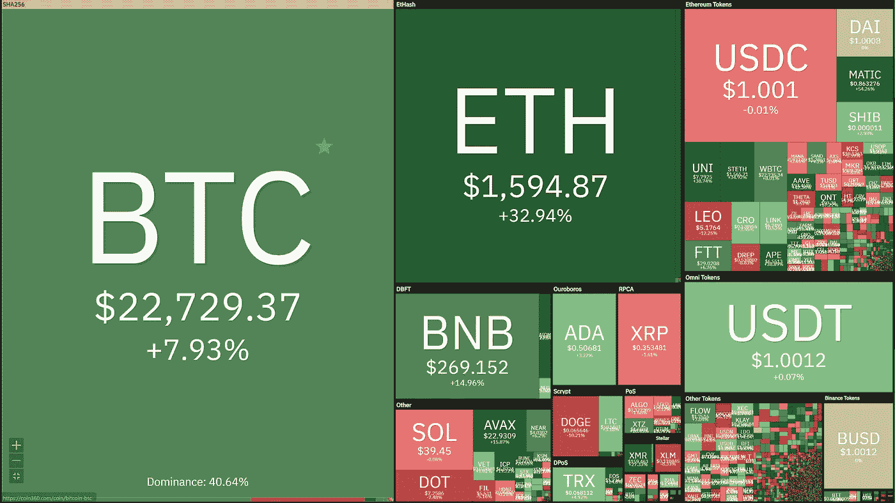
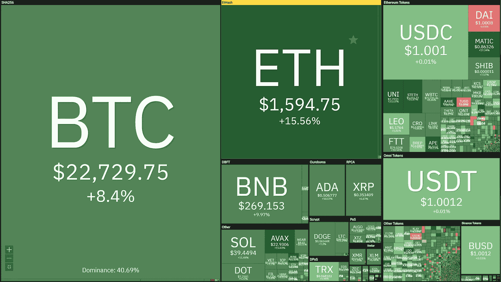
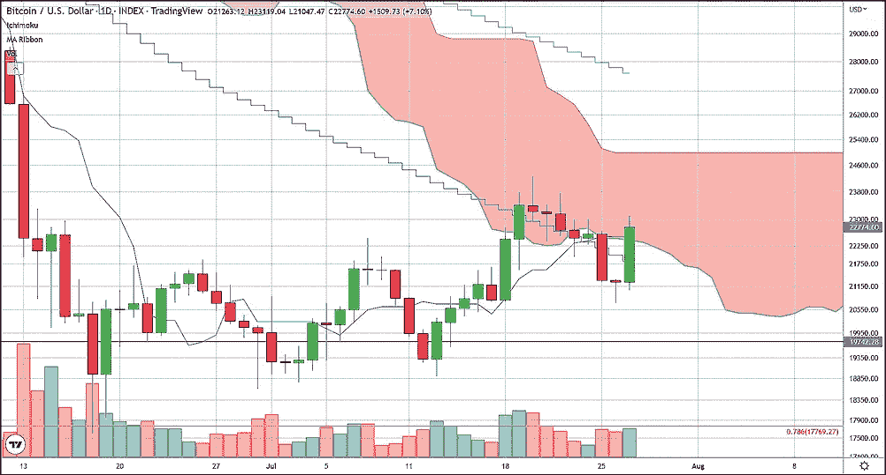
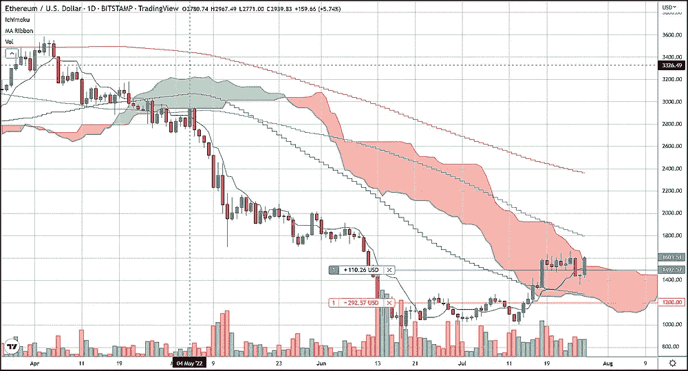

# 本周充满了各种可能性

> 原文：<https://medium.com/coinmonks/this-week-is-packed-with-possibilities-1a85b851745c?source=collection_archive---------59----------------------->

比特币和瑞士联邦理工学院在美联储 FOMC 会议的第一天取得了进展。会议将于周三结束，届时预计将宣布连续第二次加息 75 个基点。这可能会拉低包括加密货币在内的许多东西的价格。然而，尽管我们预计周中会出现暴跌，因为几乎肯定会连续第四次加息，但到本周末，当我们确定我们确实处于解除状态时，焦点可能会发生变化。我认为 GDP 再次收缩的可能性很高，这肯定会转移投资者的注意力，对 crypto 是一个净利好。因此，我预计明天会下跌，但周五可能会飙升。

**比特币和以太坊价格保持了上周的涨幅**

BTC 和 ETH 在周一和周二下跌的同时，在过去一个月中出现了可观的上涨，BTC 和 ETH 在过去 30 天中分别上涨了 7.93%和 32.94%。

Monthly heatmap

Daily heatmap

总体而言，比特币的下跌是轻微的，因为目前，截至美国东部时间 4:20，比特币的价格已经在 50 天 SMA(简单移动平均线)上方重新站稳脚跟，交易价格为 22，720 美元。像比特币一样，以太坊正在从本周早些时候的小幅下跌中反弹，并在 ETH 正在形成的 1500 美元左右的基础之上交易。以太坊仍远高于其 50 天均线，并在 1500 美元上方盘整，这可以被视为对世界第二大加密货币的看涨，特别是因为现在 50 天均线可能位于 1300 美元左右。

上周在以太坊接受我们的电话并在大约 1，492 美元买入的交易者应该继续持有他们的多头头寸，并在 1，200 美元处设置保护性止损。对于比特币，我们建议持观望态度，直到明天即将到来的加息之后。如果明天 BTC 股市下跌，我们将很乐意做多，因为我们相信周五的 GDP 报告将推动 BTC 股市上涨，并确认美国正在发生衰退，我们认为这将把投资者的注意力转移到失控的通胀水平上。

**隐语中的云情？**

另一个可能看涨的技术特征是，两大加密公司都在日市云指标上进入了“云”。虽然 BTC 刚刚重新进入云的领域，但 ETH 在日线图上仍停留在自己的云中超过 10 天，实际上在今天的交易中已经开始移动到云的上方。一个市场在它自己的 Ichimoku cloud 内部发出信号，表明支点可能正在发生，而定价低于或高于表明更低或更高的定价是最有可能的前进道路。

> 交易新手？试试[密码交易机器人](/coinmonks/crypto-trading-bot-c2ffce8acb2a)或[复制交易](/coinmonks/top-10-crypto-copy-trading-platforms-for-beginners-d0c37c7d698c)