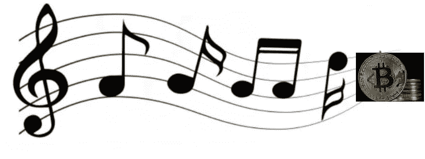

# 尽管我们不得不在这个夏天说再见…

> 原文：<https://medium.com/coinmonks/tho-we-gotta-say-goodbye-for-the-summer-d700ea6d9e56?source=collection_archive---------32----------------------->

Click on Title to Listen to Song

加利福尼亚的许多人已经在本周火人节上进行最后一次狂欢。其他人在劳动节和夏季最后一个假期前享受轻松的一周。然后，像时钟一样，9 月 5 日之后，孩子们回到了学校，每个人都开始工作，可悲的是，比特币的夏季销售结束了。

整个夏天，我一直很高兴地用我目前的[美元平均成本](https://intelligent.schwab.com/article/dollar-cost-averaging#:~:text=Dollar%20cost%20averaging%20is%20the,as%20well%20as%20your%20costs.)策略积累了比平时多 40%的比特币。虽然我们可能仍然会在 9 月 5 日之后看到随机的“闪电出售”，如果矿商继续被迫出售以支付[资本支出](https://futurism.com/the-byte/bitcoin-miners-forced-to-sell-mining-rigs-to-pay-debts)，使 BTC 低于 19，000 美元，好消息是有许多基本面因素将推动价格上涨，并支持其长期持续上涨。

前导指数

以下是一些让我非常看好比特币的技术和商业案例，以及为什么我认为今年秋天我们会看到强劲的上涨势头:

1.  [黑岩入党](https://www.cnbc.com/2022/08/11/blackrock-launches-a-private-trust-to-give-clients-exposure-to-spot-bitcoin.html)。这在新闻中被大量报道，但我只想指出，世界上最大的资产管理公司(10 万亿美元监管)并没有进入比特币市场做空。美国第二大银行美洲银行发布了一份新的[报告](https://links.coinbase.com/u/click?_t=3aca56371967418192255878e9689713&_m=f0fd19dc370f46518923b0795c2eee0a&_e=EW4iSCpkUDzutvkEXJGEsYbwtuAyqvbgauFLauYi3JIWrWnXkRcCwu63klV_dDq7rvYqVoa4FdMBuGFjk8oykG5UGtTQhlRNPNJsCAKgeC_TK96FQe3H5LuD3NfQQ99UrRQ4qB-jYvS3WjOghwmSw-RZrpQ2ysgMEl2vBNsIXPVsZ7Rx8Fgniclgc_FzL9vqi89Z0-qBbwOtd78SYJS6MqL2S8EkZq_m2yWTsFhyadNaxyMkIEYtnYSxRlK1O7JIsa7g93Bg5fopw8M-zZacZrLhOaRng7sjjEBGFXg1d6jPFuQhOfh3ZIyMKBfxshbLdwuz4fqvHSYodxT4Zbkx7Q9OK97cFgcXzGjo53JWxXI2h9If76f3CiClGGrVH9B01eVx8lNlBCJ52YF2wAp0QZUIrCG4fe2EQIKvba3J3lFjZroedE9_nbZ9GJwmuCciiFAgskjZ6Amn1GiRhiyzIrcd0dKgrsCIY0BKInAD3ebzIPklEI7OoaD1mkYWKbMEUjtCj0UZ5mk6dqUDIQ1vH5ahr78xDW6zjI1fzTlno15oQAjgqIEaiZREDnann-N0-l6gda6xgAMknYB8ejVNZtr1zHOAtJoFCB9jmtx8TEY%3D)，声称区块链具有“内在价值”，并驳斥了最近[与此相反的说法](https://links.coinbase.com/u/click?_t=3aca56371967418192255878e9689713&_m=f0fd19dc370f46518923b0795c2eee0a&_e=EW4iSCpkUDzutvkEXJGEsYbwtuAyqvbgauFLauYi3JIWrWnXkRcCwu63klV_dDq7lMDA1Xg_mSI-GstmlwU-eY_lvld9slT6BxiEm0GKFVHH5vVBVnTNyP2CAlCvWqo6jESOS27mlxEgE5hXLxjUIfqvozGaCVRI3W9jeaIpLdWzZEWsywYbGf3n7oFI1zVW5vXSXcJXbVhhEt2QsVGTwCSUi8QzLkB6JkFb3XfpXORdxA6NSECpVtirV3l6zJ_tq-z8AIP9YRRFbW9O_DTxGpVxy8oToc8d3kmdJcxNvm1mXS3uJYP7Gx5hOZx_82LlssS2WN0YWgxaDCtKyP5O_nMEzVw4LmAVy8l8A2lZWjCzbXs0opCn1DxsafIGboyGRj4pHIpKrj_X9tCzo2ZucqHG2Eyo46p2No8kWui_YCzb6LQEkXSUebhv96na_h4MbsFK-LdyQl1xosl43lcmvohdWNWhnorYyCr83s5Bd6M%3D)。“数字资产是与互联网、汽车和电力齐名的变革性创新，”这是富国银行投资研究所题为“数字资产——一个充满可能性的世界”的新报告[的结论](https://links.coinbase.com/u/click?_t=3aca56371967418192255878e9689713&_m=f0fd19dc370f46518923b0795c2eee0a&_e=EW4iSCpkUDzutvkEXJGEsZA8Fm4USWPuhtis7lT7_M_I41iXZ1sx4etG_nSxqnuzDE-tJK4nD9n3bXAgr3Ey1m5O_h38pRYd5KXJ-ZBqU7nC-Nwy4iezrgIHeAhUdecTXbymIMTKRH1ftY3DGr9BJAb_hY9Du3cFdmClwzgUf0rCbPjCOHhro2sjCIfccod2_z-6ih109tD6aJJUcgoJuiqfqbIwEhiIjAg1pmb_F8qsp7mxkHa1pc999y5-4U67FfiJdFSZbJyvCD8ZiBw7PUDV0TUk4FBjViPj6_zBIU8rd6qoTOpSSa15TC3yv7xlTdpmhXnU-9dQjiPKVqaK08jUoM1hK4J_PHJiF4ZU-tvUpHHjIjes4iUSuox8wU09dXa4LXlGmRi7_UqB6oraYnWmjycysuqK7zC8IsSRjgA4FTA-laU0E8PU0btvIa4rMuE2SdPxvwY3xw4_sGQnQg%3D%3D)
2.  担心比特币采矿的环境影响的 ESG(环境、社会和治理)投资者可以问心无愧地开始购买 BTC 了。我认为，在不久的将来，我们将会看到更多关于如何更可持续、更负责任地开采比特币的信息，这些信息将由黑石的好心人带给你。我当然希望我的比特币来自清洁能源，甚至推动清洁能源项目的需求。我认为贝莱德的集体智囊团和他们的合作伙伴明白这一点，这就是他们进入比特币的原因。今年秋天，当所有人都回到自己的办公桌前时，关于 ESG 项目的声明应该对 BTC 是个好兆头，并预示着上升趋势。
3.  闪电网络通过促进比特币小额支付继续获得牵引力。林恩·奥尔登在这里对闪电网络[进行了深刻的剖析。目前，我们看到支付量同比增长 410%。尽管我们仍然只是在谈论高峰时 3500 万美元的交易，但对于小企业经营者来说，这已经足够好的用例来接受和处理 BTC 交易了。(想想 Square 推出的时候，以及它对小企业和街头小贩的巨大影响。)](https://www.lynalden.com/lightning-network/)
4.  以太坊失去工作身份证明。无论合并成功与否，区块链[的面貌变化都不会被夸大。](https://www.kitco.com/news/2022-08-23/The-Ethereum-Merge-will-be-the-biggest-crypto-event-since-the-first-Bitcoin-was-mined-Ran-Neuner-and-Steven-Sidley.html)老练保守的投资者还是会在工作证明比特币和股权证明以太坊之间分散风险。不管怎样，俗话说，水涨船高。这样一来，无论以太坊的价格如何，都会有更多的美元流入比特币。更重要的是，对于长期看好比特币的人来说，它也在智能合约方面取得进展(尽管很慢)，甚至是长期以来一直是购买以太坊的理由的非功能性交易。你可能已经错过了本月初发生的龙卷风现金和美国政府的严厉制裁，这在 DeFi 和开源开发者社区中产生了涟漪。你可以在这里阅读。这将推动更多创新项目转向比特币区块链，而不是以太坊。

我希望每个人都喜欢夏天的最后几天。我打算继续利用比特币夏季大甩卖的机会，直到最后的日落，储备一些干粉，以备下一次闪购。我还会继续寻找和购买我的另一项夏季嗜好:美味的软冰淇淋。

干杯，

吉姆(人名)

> 交易新手？试试[加密交易机器人](/coinmonks/crypto-trading-bot-c2ffce8acb2a)或者[复制交易](/coinmonks/top-10-crypto-copy-trading-platforms-for-beginners-d0c37c7d698c)