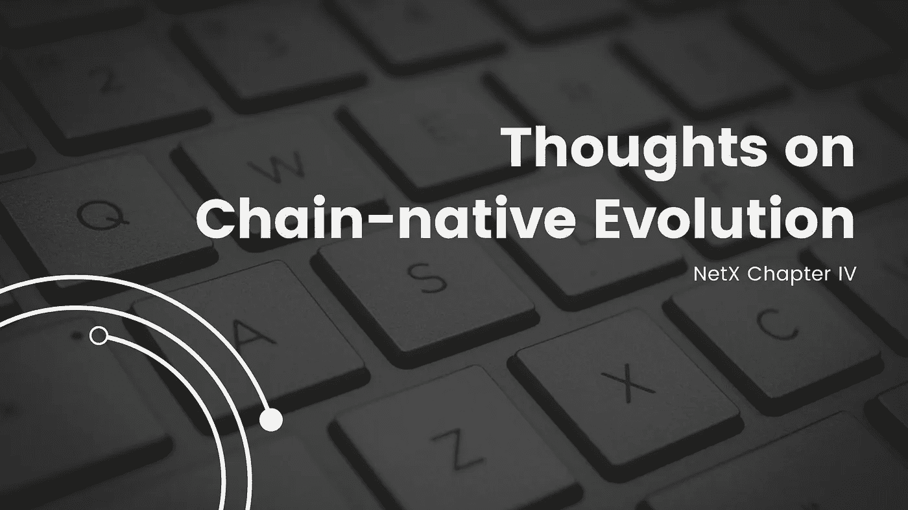

# 关于链式自然进化的思考

> 原文：<https://medium.com/coinmonks/thoughts-on-chain-native-evolution-beea4b701e9a?source=collection_archive---------16----------------------->

TL；速度三角形定位法(dead reckoning)

Cloud-native 揭示了 IT 改革的趋势，但受到其互联网覆盖范围的限制。去中心化可以让云原生互联网规模化，自我进化。

cloud-native 是一个概念和架构，旨在以一种针对云环境优化的方式组装所有基于云的组件。它也是渴望建立现代基础设施和流程，甚至现代企业文化的企业的目的地。Modern cloud native 帮助企业简化管理和维护、更有效地测试应用程序、更快地发布新版本、更轻松地扩展应用程序、削减成本、增加收入等。

上述细节预示了云原生作为一种主要 IT 趋势的漫长而丰富的未来。

然而，现有的原生云无法承载整个 IT 行业的未来，传统的安全问题仍然没有解决:

病毒、勒索软件、DDoS 攻击、网络入侵挥之不去。此外，随着组件直接调用的增加，云的复杂架构也增加了一些麻烦。

那么，这片树林有出路吗？

历史揭示了自然界生物不断自我进化、升级和适应新挑战的过程。在非洲，有一种神奇的肺鱼，也被称为“不死之鱼”，除了鳃以外，它用类似肺的器官呼吸。

在长达半年的旱季，大多数动物和植物遭受死亡。那时，这条肺鱼将自己埋在干燥的土地上，随着雨季的到来而苏醒。这是肺鱼在极端条件下获得的生存技能。

在美国企业家雷伊·达里奥写的《T2 原则:生活与工作》一书中写道，**“不进化，就灭亡。进化是宇宙中最强大的力量；它是唯一永恒的东西，它驱动着一切”。**

与广阔的大自然相比，人类栖息地面临着更多的复杂性。一旦远远落后于其栖息地难以想象的快速变化的速度，人类可能很容易失去工作。短暂的悲痛可能会发现，只有自我革命的心态才能挽救被轻易淘汰的风险。《失控的 T6》一书将世界上的事物描绘成以群体形式存在的生命体。生物从进化中迭代出来。那么，cloud native 这种 IT 生物会不会按照自己的方式进化呢？

这听起来可能令人生畏，但这正是 NetX 计划要做的，帮助云原生自我进化。只有具有多样化天性的生物才能按照环境的要求自我进化。在 IT 行业，云原生架构首先需要实现全面的异构。它采用几个不同类型或功能的处理器的多处理器结构。这种复杂的结构意味着丰富的多样性和高抗风险能力。云节点采用独特的配置，安装独特的软件，以防一百万个同质代码很容易被同一个 bug 攻击。那将是一场噩梦。这就是为什么我们非常强调异质性。

与此同时，整体异构性需要在整个网络上全面覆盖原生云，达到互联网规模。这个想法让人们兴奋不已。非洲是世界上最具活力和潜力的地区之一。云服务有助于释放其巨大的发展潜力；云计算和人工智能等基于云的创新技术可能会使这片土地发生跨越式发展，飙升至云和智能时代。但是现实很残酷。非洲很多地方都没有云服务(全世界都在说太阳永远照耀着非洲的土地)。大型商业机构拒绝在那里设立分支机构。那就是集权组织造成的浩劫。互联网规模化只有在去中心化下才能成为现实。想象一下，在未来的某一天，非洲某个地方的一些人只需在电脑上点击一下，就能进入一个广阔而开放的互联网。当地的基本服务马上就能提供。这是一件逆转潮流的事情。

权力下放的好处远不止于此。单点故障(SPOF)也得到有效消除。虽然分布式存储在当前的云服务提供商中很受欢迎，但整体数据和服务器仍然掌握在相对集中的组织手中。俄乌战争给世界敲响了严重的警钟:集权不仅影响全球国家，也影响世界公民。基于区块链的比特币打破了这一障碍。权力下放确保了世界的稳定和安全运行。在此推动下，cloud native 能够实现真正的互联网规模，地球上的所有公民都有权享受与技术创新并行的文明创新。我们对我们前进的方向有坚定的信念。

# 📚必读

[NetX 系列 1.1](/triaslab/rethinking-the-it-industry-d101384e801) | [NetX 系列 1.2](/coinmonks/a-letter-from-satoshi-nakamoto-345a45d012bb) | [NetX 系列 1.3](/coinmonks/out-of-control-the-post-it-evolution-dd64e05ff5bc) | [NetX 系列 2.1](/coinmonks/life-emerges-9ebf26304cd4) | [NetX 系列 2.2](/coinmonks/life-is-out-of-control-9f8e5b7b4b99) | [NetX 系列 2.3](/coinmonks/the-kite-flies-up-and-i-become-the-kite-40678b9dabda) | [NetX 系列 3.1](/coinmonks/the-container-in-the-it-field-21250e3e8b5) | [NetX 系列 3.2](/coinmonks/microservice-architecture-for-new-technologies-d0e37cfccdfa) | [NetX 系列 3.3](/coinmonks/from-service-mesh-to-serverless-570ebd69c884)

***NetX，面向可信可靠的智能自治系统的数字生活的链原生互联网(***[***Trias***](https://www.trias.one/)***)***

[***铁人三项***](https://www.triathon.space/#/)***|***[***Ethanim***](https://www.ethanim.network/)***|***[***tu Sima***](https://www.tusima.network/#/)***| behemotius | leviam | Divina***

> 交易新手？尝试[加密交易机器人](/coinmonks/crypto-trading-bot-c2ffce8acb2a)或[复制交易](/coinmonks/top-10-crypto-copy-trading-platforms-for-beginners-d0c37c7d698c)