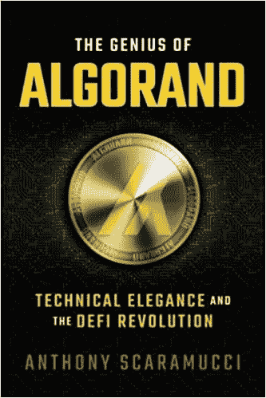
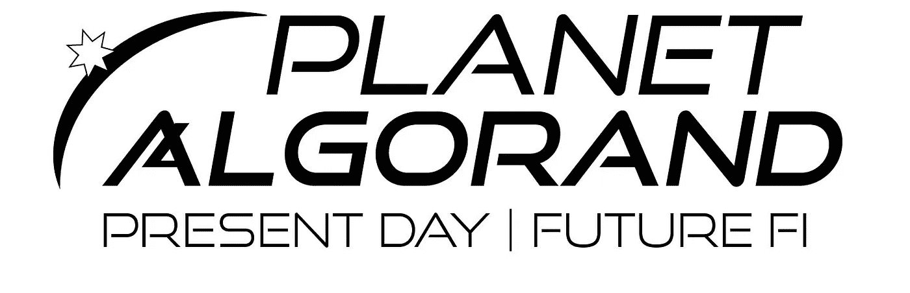

# 安东尼·斯卡拉穆奇《阿尔格兰德的天才》读后感

> 原文：<https://medium.com/coinmonks/thoughts-on-the-genius-of-algorand-by-anthony-scaramucci-1f33e060c16d?source=collection_archive---------11----------------------->

Amazon.com

当我听到特朗普的前白宫新闻秘书“the Mooch”写了一本关于阿尔格兰德的书时，我不可否认地持怀疑态度。这又是一次名人秘密现金抢劫吗？如果是这样的话，这样一个自我推销者在一个抵制胡说八道的链条上做了什么？

我错了。 Anthony Scaramucci 的《阿尔格兰德的天才》完美地总结了希尔维奥·米卡利的创作，并阐述了为什么阿尔格兰德是超越所有连锁店的连锁店，从希尔维奥·米卡利来到美国，到阿尔格兰德的创立，以及未来。令人惊讶的是，这个故事令人振奋，略带情绪，但对于一本短篇小说来说，它信息量极大。

> "合作总是能战胜竞争——而且也更有趣."
> 
> 希尔维奥·米卡利

对于那些没有意识到的人来说，没有希尔维奥·米卡利，加密货币本身就不存在，加密老手也会这么告诉你。根据图灵奖网站:

> “米卡里和戈德瓦瑟(他的图灵奖共同获得者和长期合作者)的工作帮助密码学成为一门精确的科学。他们创建的数学结构，包括隐私、对手、伪随机性、交互证明、零知识证明的正式概念，以及许多其他通常非常微妙的基本概念，将密码学建立在最高标准的严格基础上，并在计算机科学中开辟了全新的研究领域。” [**来源**](https://amturing.acm.org/award_winners/micali_9954407.cfm)

Micali 的工作，具体来说是零知识证明，是所有加密货币的基础。在第二章中，斯卡拉穆奇讲述了希尔维奥·米卡利从他在西西里的童年到几乎从加州大学伯克利分校辍学的故事。他没有辍学，而是通过讲座爱上了密码学，最终发展出一种将不可能变为可能的热情。他和沙菲·戈德瓦瑟一起完成了这项工作，他们在加州大学伯克利分校相遇，并担任阿尔格兰德公司的科学顾问。随之而来的是区块链三难困境的解除，在一个生态系统中提供了去中心化、可伸缩性和安全性，而大多数区块链充其量解决了其中的两个问题。

在向读者介绍阿尔格兰德的巨大成就时，斯卡拉穆奇为建造生态系统的阿尔格兰德人搭建了完美的舞台。其中包括前首席执行官史蒂夫·科金诺斯，这位波士顿的企业家与西尔维奥有过交往，并对阿尔格兰德的最初发展起到了重要作用。西恩·福特接替了科金诺斯，带领区块链进入下一个篇章。最重要的是，Algonauts 由许多区块链的狂热粉丝和开发 dApps、游戏、NFT 合集等的人组成。

安东尼还介绍了生态系统中的主要参与者，如 algo grand 区块链上的 DeFi 平台 AlgoFi，以及无人机赛车联盟，该联盟正在 algo grand 区块链上推出一款游戏资产不可变的视频游戏。这可以说是本书最重要的部分，因为它展示了 Algorand 吸引的项目的多样性。从小型游戏到马绍尔群岛在阿尔格兰德区块链创造新的法定货币。阿尔格兰德也吸引了传统金融领域的玩家，这很重要，因为安东尼·斯卡拉穆奇的背景是传统的机构投资。迄今为止，这些类型的信任是 Algorand 成功的关键。与此同时，阿尔格兰德在新的领域处于领先地位，如创造者驱动的网络 3 经济和区块链游戏。

书中最后一章描述的“阿尔格兰德星球”是什么样子的？在这一章中，Scaramucci 将注意力从 Algorand Inc .转移到 algrand 基金会，该基金会负责提供资助和维持 algrand 生态系统。该基金会的首席执行官 Staci Warden 设想了一个合作而非竞争的世界。她希望通过 Algorand 以及围绕它创建的强大生态系统来实现她的社会和环境正义愿景。

事实是——根据 Scaramucci 的说法——每个链条都有自己的位置。Algorand 可能会因其优势而超越其他公司，但这不是一场零和游戏。阿尔格兰德将会占有一席之地。索拉纳和以太坊也会。就连阿尔格兰德的团队成员也这么认为。在阿尔格兰德星球上，不同的区块链相互影响，可能会使用阿尔格兰德的基础设施来到十字路口。再次强调，合作胜过竞争。

总的来说，《阿尔格兰德的天才》是一本好书，不管你是阿尔格兰德迷还是昨天才了解 ALGO。我喜欢这本书，因为它简明扼要，内容丰富，在不到 100 页的篇幅内就触及了所有的基础。这本书将会给你一本关于阿尔格兰德的历史，为什么它是革命性的，以及它的未来的初级读本。听到机构投资者冒险进入这个新世界并试图更好地理解它的观点是很有趣的。这是阿尔格朗知识的终极目标吗？绝对不行。但是，如果你在进入 Algoverse 的旅程中想要一本最基本的知识手册，这是给你的。

如果你喜欢这篇文章，考虑支持每日算法，看看更多类似的内容。只有 ALGO 和阿萨

HJ 3 gqzkfst 7 R3 l 7 oan 74 ithfe 2 xn 4 WSN 2 gxus 7 ubghhsc 5 suyom 4 rch 5 q

> 交易新手？试试[密码交易机器人](/coinmonks/crypto-trading-bot-c2ffce8acb2a)或者[复制交易](/coinmonks/top-10-crypto-copy-trading-platforms-for-beginners-d0c37c7d698c)