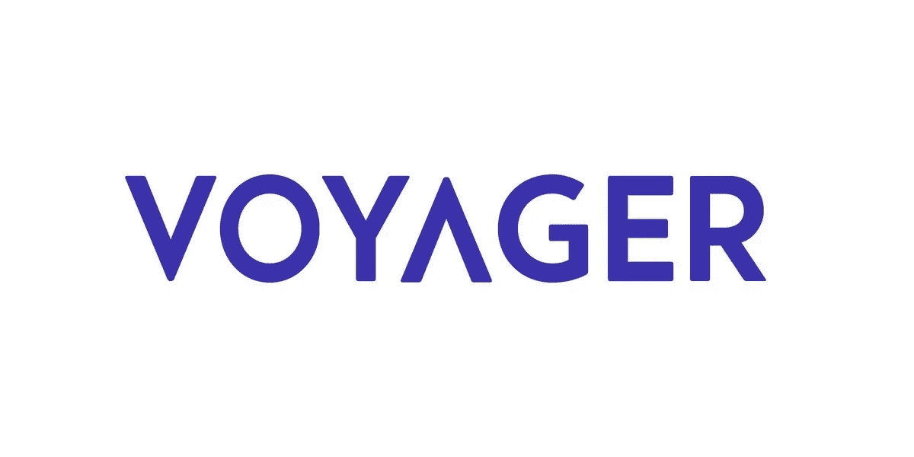
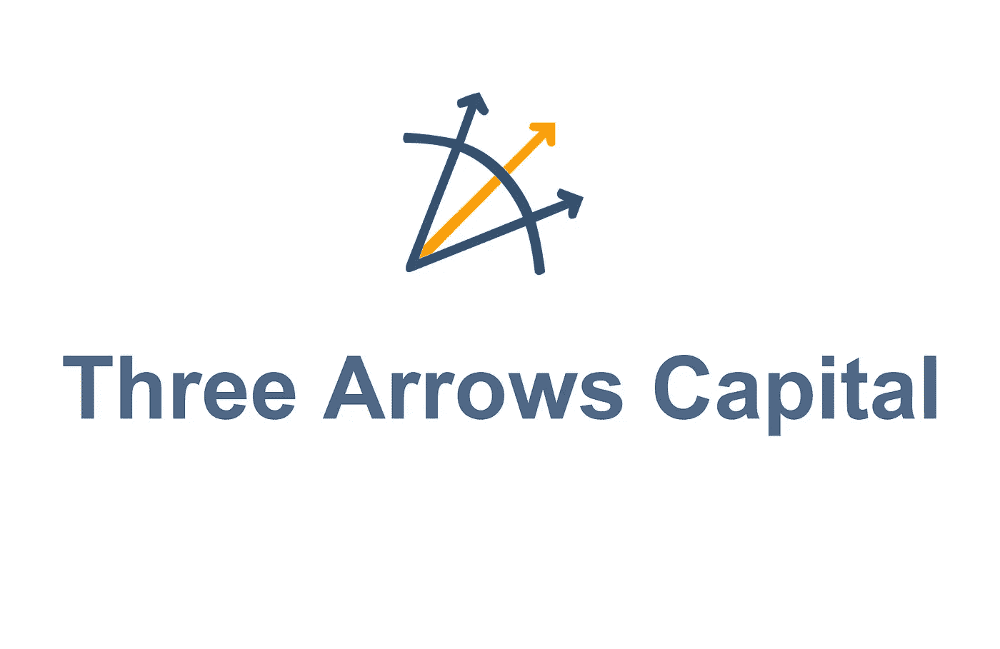
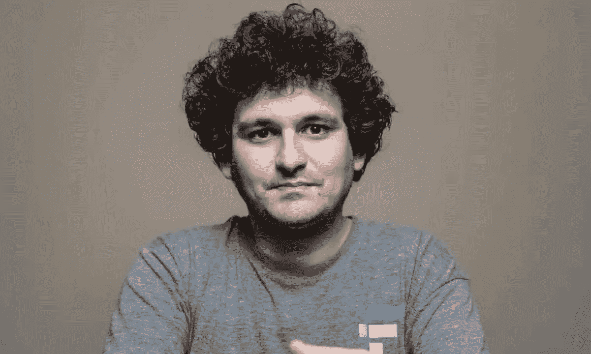
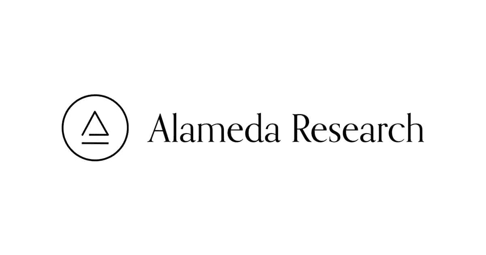

# 三箭资本第 3 部分:航海家传染病

> 原文：<https://medium.com/coinmonks/three-arrows-capital-part-3-the-voyager-contagion-23d535c91c1a?source=collection_archive---------19----------------------->

著名的加密经纪人 Voyager Digital 昨天申请破产，成为 2022 年加密冬天和三箭资本传染的最新受害者。三箭资本——3AC 最近拖欠了航海家公司高达 6 . 5 亿美元的巨额贷款。Voyager 当天不得不停止在其平台上的提现，因为其暴露于 3AC 和潜在破产的传言得到了证实。在 3AC 宣布破产并被英属维尔京群岛的一家法院下令清算后几天，航海家自愿申请了第 11 章破产。随着多米诺骨牌继续在 Web 3 行业倒下，还不清楚事情会变得多糟糕，因为 3AC 蔓延的范围仍有待确定。

航海家昨日在一份新闻稿中宣布，它将进行财务重组，以“为所有利益相关者实现价值最大化”。尽管标题含糊不清，但新闻稿中的细节描绘了一幅相当惊人的画面。Voyager 陷入了严重的财务困境，现有客户不知道他们何时才能收回资产。

“Voyager 的平台旨在通过提供简单、快速、流动和透明的加密资产交易来增强投资者的能力。虽然我对这一未来充满信心，但过去几个月加密市场的长期波动和蔓延，以及三箭资本(Three Arrows Capital，简称“3AC”)拖欠其子公司 Voyager Digital，LLC 的一笔贷款，要求我们现在就采取深思熟虑的果断行动。第 11 章程序提供了一个有效和公平的机制，以最大限度地恢复。”-斯蒂芬·埃利希，航海家数码公司首席执行官

值得注意的是，第 11 章破产将允许旅行者号在重组过程中继续运营。航海家有可能通过有效重组债务和让客户完整来摆脱这个困境。虽然旅行者号有足够的资金维持运营，但在现阶段恢复的途径还很不明朗。

“Voyager 在平台上拥有大约 13 亿美元的加密资产，在大都会商业银行的 FBO 账户中持有超过 3.5 亿美元的现金，并对三箭资本提出超过 6.5 亿美元的索赔”——Voyager Digital 新闻稿

看来航海家的生存希望取决于 3AC 可能偿还其债务，这似乎是一个长镜头。尽管如此，航海家已经制定了一个恢复计划，让他们能够向其愤愤不平的用户群返还一些价值。这项仍需法院批准的计划将允许旅行者号的现有客户通过一个神秘的数字货币和金融资产包获得完整。

帐户中有 crypto 的客户将收到帐户中的 crypto、3AC 恢复的收益、新重组公司的普通股和 Voyager 令牌的组合 *—航海家号数字新闻稿*

随着资不抵债和现在破产的消息，对航海家品牌的信心可能会动摇到无法修复的地步。目前还不清楚新重组公司的普通股或航海家代币的价值，因为它们可能会在分发后立即被抛售。资产回收时的组合出售压力可能会抵消这些金融资产可能产生的任何价值。

> 交易新手？试试[密码交易机器人](/coinmonks/crypto-trading-bot-c2ffce8acb2a)或者[复制交易](/coinmonks/top-10-crypto-copy-trading-platforms-for-beginners-d0c37c7d698c)

尽管陷入了坏消息的泥潭，航海家号仍有希望，因为它最大的借款人之一恰好是 FTX 亿万富翁首席执行官萨姆·班克曼-弗里德-SBF 创立的阿拉米达研究公司。根据破产法第 11 章提交的破产申请显示，Alameda 欠破产的 Voyager 377M 亿英镑，可能有能力帮助这家陷入困境的加密贷款公司摆脱困境。Alameda Research 去年也向 Voyager 投资了 7500 万美元，是该公司最大的无担保债权。对于加密市场来说，具有讽刺意味的是，借款人或许能够帮助其贷款人度过破产。

刚刚收购了加密贷款公司 Block-Fi 的萨姆·班克曼-弗里德(Sam Bankman-Fried)在这个全面消费的加密寒冬中处于令人惊讶的良好财务状况。今年 6 月，SBF 向航海家号提供了 5 亿美元的信贷额度，以帮助它应对未来不确定的市场。值得注意的是，SBF 在看到航海家走出困境方面有既得利益，因为阿拉米达风险投资公司是航海家最大的股东之一，拥有所有流通股的 11.6%。

尽管有 SBF 和阿拉米达的支持，但尚不清楚这位曾经受人尊敬的加密经纪人将如何收场。看来航海家的命运将在很大程度上取决于 3AC 能否偿还债务，而这不太可能。此外，法院将需要批准航海家号的恢复计划，现在这个恢复计划看起来对航海家号的客户没有特别的吸引力。

“这种全面的重组是保护平台上的资产并为包括客户在内的所有利益相关者实现价值最大化的最佳方式，”Voyager Digital 首席执行官 Stephen Ehrlich 说

我们将不得不看看航海家号残骸中的股权和代币是否对股东和客户都有价值。

感谢您的阅读。

看看我在推特上未经过滤的想法:

[https://twitter.com/wasifmrahman](https://twitter.com/wasifmrahman)

在 LinkedIn 上关注我的 Web 3 职业生涯:

 [## Wasif Rahman -美国纽约布鲁克林|职业简介| LinkedIn

### 查看 Wasif Rahman 在全球最大的职业社区 LinkedIn 上的个人资料。Wasif 有 4 个工作列在他们的…

www.linkedin.com](https://www.linkedin.com/in/wasifmrahman/) 

我对媒体的另一个 Web 3 淋浴想法:

 [## 瓦西夫·拉赫曼-中号

### 阅读瓦西夫·拉赫曼在媒介上的作品。Web 3 德根 Ex Populus 营销伙伴关系总监。每天…

medium.com](/@wasifmrahman) 

阅读第 1 部分:Web 3 多米诺效应

 [## 三支箭资本第 1 部分:Web 3 多米诺效应

### 加密对冲基金 Three Arrows Capital-3AC 的倒闭或许是关于相互依赖的最好警示…

medium.com](/coinmonks/three-arrows-capital-part-1-the-web-3-domino-effect-c12d8274f8f2) 

阅读第二部分:贪婪和恐惧

 [## 三支箭资本第二部分:贪婪与恐惧

### 昨日有消息称，三箭资本被法院下令清算，成为……的最新受害者

medium.com](/coinmonks/three-arrows-capital-part-2-greed-and-fear-6bf7e42e2999) 

来源:

 [## 航海家数码开始财务重组过程，以实现所有利益相关者的价值最大化

### 根据第 11 章保护提出自愿申请，以实施重组；提议的重组计划创造了…

www.prnewswire.com](https://www.prnewswire.com/news-releases/voyager-digital-commences-financial-restructuring-process-to-maximize-value-for-all-stakeholders-301581177.html)  [## 萨姆·班克曼-弗里德的阿拉米达研究公司欠破产的航海家公司 3 . 77 亿美元

### 借款人救助贷款人的情况并不常见，尤其是在涉及数亿美元的时候…

decrypt.co](https://decrypt.co/104570/sam-bankman-fried-alameda-research-bankrupt-voyager-377m)  [## 加密经纪人航海家数字文件破产后崩溃的三支箭

### 加密货币经纪商航海家数码公司(Voyager Digital)周二申请破产，此前该公司主要的加密货币交易商

www.theverge.com](https://www.theverge.com/2022/7/6/23196500/cryptocurrency-broker-voyager-digital-bankruptcy)  [## Voyager Digital 的存款账户营销受到联邦存款保险公司的审查

### 联邦存款保险公司(FDIC)正在调查航海家数码公司(OTCQX:VYGVF)在…

seekingalpha.com](https://seekingalpha.com/news/3855120-voyager-digitals-marketing-of-safe-customer-deposit-accounts-comes-under-fdic-scrutiny-wsj?source=content_type%3Areact%7Cfirst_level_url%3Amarket-news%7Csection_asset%3Amain)  [## 航海家数码公司的客户感受到了痛苦

### 航海家数码公司的客户醒来时，发现一封电子邮件透露了该公司申请破产的消息:这将是一个非常漫长的…

www.axios.com](https://www.axios.com/2022/07/07/voyager-digital-customers-feeling-the-pain)  [## 航海家数码公司独一无二的破产

### 航海家数码公司周二申请了第 11 章破产保护，附上了包含许多启示的文件…

www.axios.com](https://www.axios.com/2022/07/07/voyager-digitals-one-of-a-kind-bankruptcy) 

https://www . CNBC . com/2022/07/01/voyager-digital-suspends-all-trading-deposit-and-取款-。html