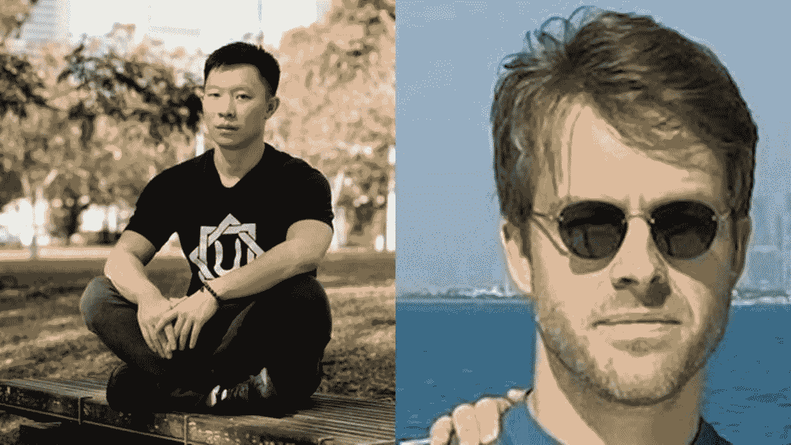

# 三箭资本第 4 部分:死亡威胁和迪拜

> 原文：<https://medium.com/coinmonks/three-arrows-capital-part-4-death-threats-and-dubai-fcb5c49c50f3?source=collection_archive---------1----------------------->

经过漫长的五周，蒙羞的三箭资本-3AC 创始人终于出柜了。在接受《彭博》采访时，苏柱和凯尔·戴维斯列举了无数死亡威胁作为他们转入地下的原因。

“对于凯尔和我来说，crypto 里有太多疯狂的人发出死亡威胁或诸如此类的噪音，”朱说。“我们认为，如果我们能确保人身安全并保持低调，这对每个人都有好处。”

我们已经广泛讨论了 3AC 内爆的一些原因。创始人现在已经出来证实，他们对卢娜、斯特斯和 GBTC 的大量曝光是 3AC 棺材上的最后一颗钉子。

露娜是算法上的稳定点，在四月下旬引人注目地进入了死亡螺旋，导致了这个隐秘的冬天的开始。3AC 与 Luna 有大量接触，创始人声称他们与 Do Kwon 的私人友谊导致两人错过了关于项目稳定性的危险信号。

“当他搬到新加坡时，我们开始在个人基础上了解道权…如果我们能看到这一点，你知道，这(露娜)在某些方面是…可攻击的，而且它变得…太大，太快。”

3AC 还对 stETH 有敞口，stETH 是 staked Ethereum 的令牌化版本，应该通过 Lido Finance 以 1:1 的平价与 ETH 交易。3AC 损失了很大一部分投资，因为 stETH 在市场低迷期间与 ETH 脱钩。

“因为 Luna 事件刚刚发生，它在很大程度上是一种传染病，人们喜欢，好吧，有没有人也是杠杆化的长期持有乙醚对乙醚，他们将在市场下跌时被清算？…所以整个行业实际上都在争夺这些职位，”

一段时间以来，灰度比特币信托——GBTC 是美国监管的少数几个允许机构投资比特币的加密产品之一。这使得 GBTC 可以溢价交易，3AC 利用这一套利机会大赚了一笔。在市场低迷期间，GBTC 最终从溢价下滑到折价，让 3AC 如此富有的套利机会不再有效。

“当利润非常高的时候，我们设法在正确的窗口进行交易……然后像其他人一样，后来把我们复制到那个交易中，然后不仅损失了钱，还变成了负数。因为每个人都这么做了，于是信托基金开始打折，然后打折幅度远远超出了任何人的想象。”

在一个未公开的地点，创始人现在计划将他们的业务转移到迪拜，希望挽回他们的声誉。

“鉴于我们已经计划将业务转移到迪拜，我们必须尽快去那里评估我们是否按原计划转移到那里，或者未来是否会有所不同，”

考虑到苏柱和凯尔·戴维斯由于他们鲁莽的投资对密码行业造成了多么严重的伤害，这对搭档是否会再次得到 Web 3 社区的信任还有待观察。

感谢您的阅读。

看看我在推特上未经过滤的想法:

[https://twitter.com/wasifmrahman](https://twitter.com/wasifmrahman)

在 LinkedIn 上关注我的职业生涯:

https://www.linkedin.com/in/wasifmrahman/

我对媒体的另一个想法是:

【https://medium.com/@wasifmrahman 

来源:

[https://www . Bloomberg . com/news/articles/2022-07-22/three-arrows-founders-en-route-to-Dubai-describe-ltcm-moment # XJ 4y 7 vzkg](https://www.bloomberg.com/news/articles/2022-07-22/three-arrows-founders-en-route-to-dubai-describe-ltcm-moment#xj4y7vzkg)

[https://decrypt . co/105735/three-arrows-capital-founders-cite-3-key-crypto-trades-blow-up-firm](https://decrypt.co/105735/three-arrows-capital-founders-cite-3-key-crypto-trades-blew-up-firm)

[https://fortune . com/2022/07/22/three-arrows-capital-meeting-founders-emerge-5-weeks-hiding-tell-story-crypto-fund-collapse/](https://fortune.com/2022/07/22/three-arrows-capital-disgraced-founders-emerge-5-weeks-hiding-tell-story-crypto-fund-collapse/)

 [## 三名 Arrows 创始人在因死亡威胁而躲藏了几周后站了出来| Bitcoinist.com

### 三箭资本的名誉扫地的创始人全面地讲述了他们的…

bitcoinist.com](https://bitcoinist.com/three-arrows-founders-speak-out-after-hiding/) 

> 交易新手？尝试[加密交易机器人](/coinmonks/crypto-trading-bot-c2ffce8acb2a)或[复制交易](/coinmonks/top-10-crypto-copy-trading-platforms-for-beginners-d0c37c7d698c)