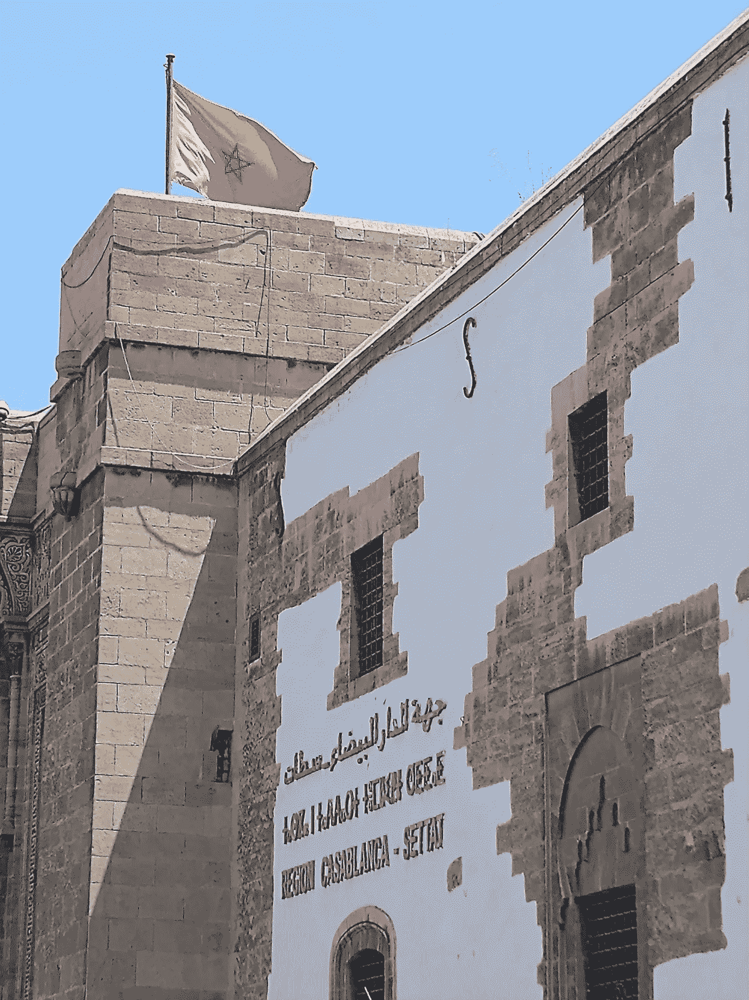

# 中东和北非三大化肥生产商:OCP、马登、卡夫

> 原文：<https://medium.com/coinmonks/three-of-menas-leading-fertilizer-players-ocp-maa-den-qafco-5dbb353d04ae?source=collection_archive---------43----------------------->

本故事的目的是分享中东和北非(MENA)三大化肥公司的最新消息和发展动态:OCP 集团，成立于摩洛哥；Maa'den，成立于沙特阿拉伯，总部设在沙特阿拉伯；和总部设在卡塔尔的 QAFCO。

这是受“膨胀世界的声音”的一个故事的启发，Sam Warain 是通过 substack 出版的时事通讯，分享专业的分析以及对全球经济和世界问题的个人观点。

 [## 🇰🇪之声#09:肯亚的能源悖论:肯亚值得可持续发展吗？

### 下面这篇文章是和一个住在肯尼亚的 23 岁年轻人合作写的，分享他的经历和…

inflatedworld.substack.com](https://inflatedworld.substack.com/p/-voice09-the-energy-paradox-in-kenya?utm_source=email) 

上面的故事着眼于长期以来能源危机对肯尼亚公民的影响。与摩洛哥相似，这个非洲国家在地理上位于海岸线上，具有丰富的风能、太阳能和氢能可再生能源潜力。

能源危机也与化肥短缺有关，因为能源价格上涨对全球化肥供应的可获得性和可负担性产生了相关影响。本文中介绍的三家中东和北非化肥生产商预计将以独特的方式为发展中国家的全球粮食安全做出贡献。

# **磷酸盐生产商，摩洛哥 OCP 集团**

 [## 摩洛哥的 OCP 集团抛出化肥生命线给非洲受困的农民-新非洲…

### 世界粮食计划署警告称，全球化肥短缺可能会导致非洲粮食产量减少 110 亿美元…

newafricanmagazine.com](https://newafricanmagazine.com/28344/)  [## Koch Ag & Energy Solutions 预计将在 2010 年 4 月 JFC III 中获得 50 %的股份

### 科赫能源解决方案公司(科赫公司)和 OCP 集团在科赫公司的一个子公司签署了一项协议…

www.ocpgroup.ma](https://www.ocpgroup.ma/fr/press-release-article/koch-ag-energy-solutions-prevoit-dacquerir-une-participation-de-50-dans-jfc)  [## OCP 集团承诺进一步开发尼日利亚的农业潜力

### 自一个多世纪前成立以来，OCP 集团一直致力于支持全球可持续农业发展

www.ocpgroup.ma](https://www.ocpgroup.ma/news-article/ocp-group-commits-further-developing-nigerias-agricultural-potential)  [## 摩洛哥重申减少温室气体排放的承诺

### 摩洛哥加强了应对气候变化的斗争，重申了该国对这一事业的承诺，并制定了一项…

www.moroccoworldnews.com](https://www.moroccoworldnews.com/2021/07/343407/morocco-renews-commitment-to-reducing-greenhouse-gas-emissions) 

# **钾盐矿商，沙特阿拉伯马登**

 [## 沙特的马阿德恩与印度最大的化肥公司签署 4 份谅解备忘录

### 沙特阿拉伯矿业公司(Ma'aden)是世界上发展最快的矿业公司之一，已经签署了四项…

www.gccbusinessnews.com](https://www.gccbusinessnews.com/saudis-maaden-signs-4-mous-with-indias-largest-fertilizer-companies/)  [## 聚焦中东:第二部分

### 美国莱森特的 Priyanka Khemka 关注中东化肥市场的主要趋势和挑战。鉴于…

www.worldfertilizer.com](https://www.worldfertilizer.com/special-reports/05102018/the-middle-east-in-focus-part-2/)  [## 细节

### Q2 销售额同比增长 95%，环比增长 33%，达到 119 亿沙特阿拉伯里亚尔* Q2 EBITDA 同比增长 149%

www.maaden.com.sa](https://www.maaden.com.sa/en/news/details/558)  [## 沙特国有矿业公司任命两年内第四任首席执行官。计算机输出缩微胶片

### 罗伯特威尔特，前美国铝业公司执行谁是最近加拿大最大的食品公司之一的首席执行官，将领导…

www.mining.com](https://www.mining.com/web/saudis-state-controlled-miner-names-fourth-ceo-in-two-years/) 

# **氨/氮生产商，卡塔尔 QA fco**

 [## Yara 将出售其在卡塔尔化肥公司| Yara International 的 25%股份

### 奥斯陆，2020 年 3 月 8 日:Yara 已与卡塔尔石油(QP)签署股份购买协议，出售其在卡塔尔的 25%股份…

www.yara.com](https://www.yara.com/corporate-releases/yara-to-sell-its-25-share-in-qatar-fertiliser-company/)  [## 卡塔尔石油公司参与卡塔尔石油公司

### 卡塔尔化肥公司(Qafco) à卡塔尔石油公司，宣布é这两家公司…

www.usinenouvelle.com](https://www.usinenouvelle.com/article/qatar-petroleum-rachete-la-participation-de-yara-dans-qafco.N1232017)  [## 卡塔尔占主导地位的化肥公司适应不断变化的市场

### 位于近年来化肥产能实现两位数增长的地区中心…

oxfordbusinessgroup.com](https://oxfordbusinessgroup.com/analysis/qatars-dominant-fertiliser-company-adapts-changing-market)  [## 卡塔尔工业公司以 10 亿美元从 QP 购买卡塔尔化肥股份

### 迪拜(路透社)-卡塔尔工业公司以 10 亿美元收购了卡塔尔石油公司在卡塔尔化肥公司 25%的股份

www.reuters.com](https://www.reuters.com/article/us-industries-qatar-m-a-idUSKBN25K0G1) 

> 交易新手？试试[密码交易机器人](/coinmonks/crypto-trading-bot-c2ffce8acb2a)或者[复制交易](/coinmonks/top-10-crypto-copy-trading-platforms-for-beginners-d0c37c7d698c)