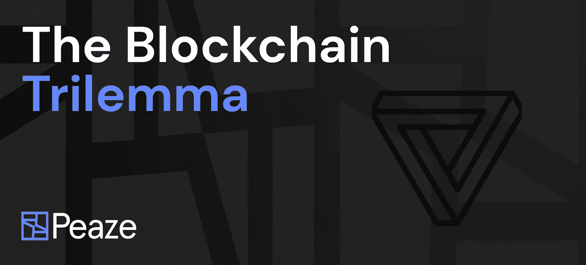
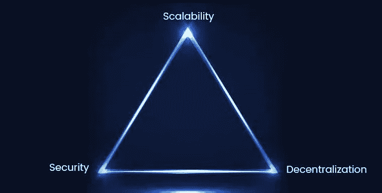
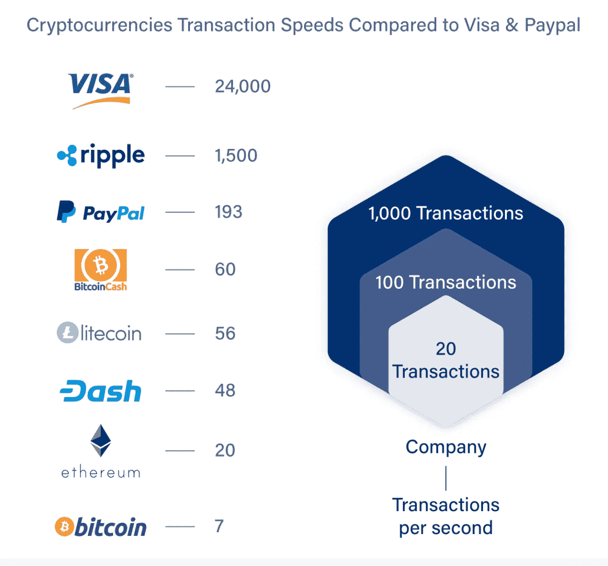
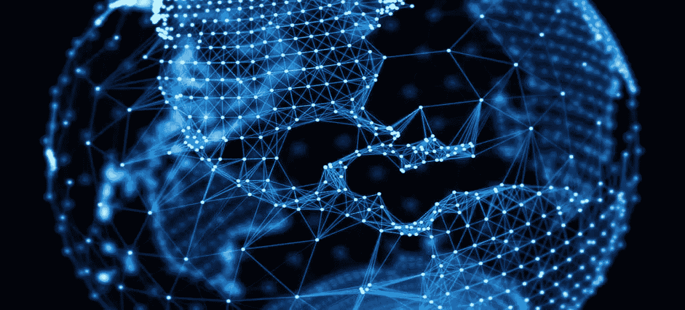
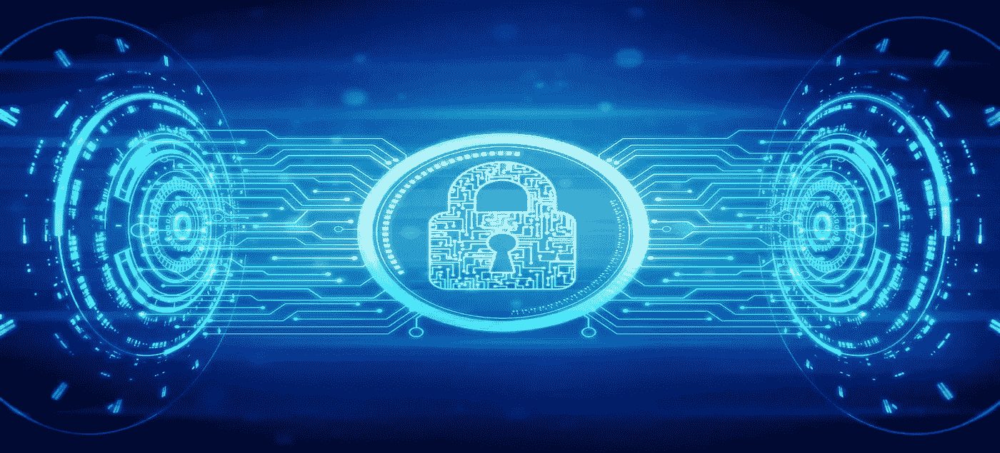
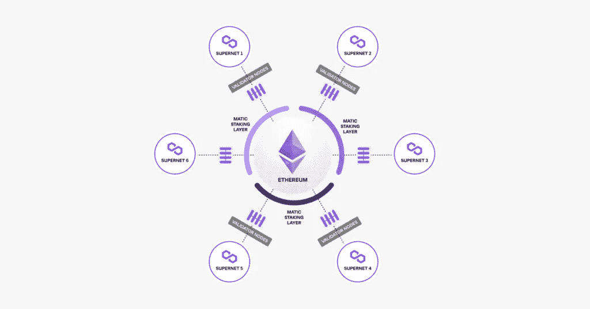

# 三个选项；两个选择——区块链三元悖论

> 原文：<https://medium.com/coinmonks/three-options-two-choices-the-blockchain-trilemma-d65870a00d5a?source=collection_archive---------19----------------------->

区块链是一种分散的分类帐技术，这意味着分布式数据库结构使其高度安全和防篡改。它还使用户能够产生可验证的和不可更改的事件记录，而不需要中间人或 web2 中的中央服务器。凭借其广泛的应用，区块链技术有可能彻底改变几乎每一个行业。从银行和金融到医疗保健和农业，区块链的潜在利益是无穷无尽的。然而，与任何新兴技术一样，在广泛采用之前，必须解决几个挑战。这些问题包括可扩展性、安全性和去中心化——区块链三难困境。

# 什么是区块链三难？

区块链三难困境指的是在创建区块链网络时经常考虑的技术权衡；最重要的问题是这三个关注点，由于技术的当前状态，只有两个可以是最优先考虑的。可伸缩性指的是随着越来越多的人使用系统，系统处理增加的需求的能力。权力下放是指没有一个中央权力机构来控制或指导系统的活动。分散式系统允许用户管理他们的数据并参与网络决策。区块链的安全性由以下因素决定

# 什么是可伸缩性？

随着区块链网络规模的增长，网络上存储的数据量也在增长。这可能会导致网络参与者的成本增加，速度变慢。可伸缩性是指随着新用户加入网络，处理这种数量或使用量增加以及每秒处理更多事务的能力。这对区块链网络来说至关重要，因为这让它们可以在不受高额交易费和漫长等待时间困扰的情况下成长。

有几种方法可以用来提高区块链网络的可扩展性。可以使用的一种方法是通过分片。分片将事务分成更小的部分，并分别处理它们。这使得处理速度更快，降低了出错或欺诈的风险，并减少了在任何给定时间需要处理的交易数量。另一种可以使用的方法是通过侧链。侧链类似于区块链，但它们运行在独立于主网络的独立网络上，可以实现比区块链更高的可扩展性，这仅仅是因为它们的尺寸更大，处理速度更快。最后，增加块的大小允许在进行事务时跨链复制更少的数据。这有助于提高可伸缩性，因为它减少了需要存储在系统上的数据量，并提高了整体性能。

区块链技术目前面临的主要挑战之一是可扩展性。例如，在[比特币网络](https://bitcoin.org/en/)中，确认一笔支付可能需要几个小时甚至几天。对于需要进行大规模支付的企业来说，这可能会有问题，而且成本高昂，导致持续依赖传统的金融轨道，直到区块链速度能够在效率上与之匹配。

# 什么是去中心化？

分散化是系统在没有中央控制器的情况下运行的能力，消除了网络中的单点故障。任何维护链的副本并保持网络运行的电子设备都可以充当区块链节点。每个节点都维护一个区块链的副本，并且每当挖掘新的块时，该链必须通过算法程序进行更新。由于区块链是开放的，每笔交易都是公开可见的，这使得它们本质上是安全的。一种系统，使用多数投票来决定哪些交易应该被允许通过网络。这种类型的共识可以通过几种不同的机制来实现，从[工作证明](https://ethereum.org/en/developers/docs/consensus-mechanisms/pow/) (PoW)到 P [桩顶](https://ethereum.org/en/developers/docs/consensus-mechanisms/pos/) (PoS)。虽然 PoS 比 power 更节能，但它也需要更多信任才能正常工作。在网络中没有足够的参与者达成共识的情况下，将使用 PoW 来代替。然而，权力下放是有代价的。创建一个完全分散的系统比创建一个集中的系统要困难得多，因为它的每个部分都需要得到各方的信任。如果任何一个节点出现故障，整个系统都会受到影响。

集中化有其优势，如更有效的管理、透明度和对资金使用的控制。但是也有缺点，比如成本增加，安全风险大。分散化允许用户以分散的方式独立持有金融资产，从而收回所有权。这提高了安全性，因为它减少了对存储金融资产的集中式第三方服务的依赖，并且由于消除了交易中的中间人而增加了隐私。

# 什么是安全？

任何分散式系统都允许多个参与者相互独立地访问和使用资源。这些参与者被称为节点，每个节点拥有自己的数据副本，这意味着没有一个节点可以控制区块链。这给区块链网络带来了巨大的安全优势，因为它们比集中式系统更能抵抗篡改和攻击。在维护系统的完整性方面，所有节点都有同等的责任，因此网络中永远不会有任何共谋或腐败的风险。黑客试图利用区块链有几种方式；路由攻击、Sybil 攻击和 51%攻击。

区块链容易受到路由攻击，大量数据在发送到互联网服务提供商时被拦截。区块链参与者通常意识不到这种威胁，直到黑客结束，表面上看起来很好。然而，在幕后，黑客已经能够窃取敏感信息或金钱。Sybil 攻击是一种网络攻击，它涉及创建和使用许多虚假的网络身份来淹没网络并使系统崩溃。这是最常见的分布式拒绝服务(DDoS)攻击之一。Sybil 攻击的主要目标是使目标的带宽过载，使其变得不稳定，对合法用户不可用。对一个区块链网络 51%的攻击是企图控制一个区块链网络一半以上的矿业力量。这种类型的攻击可以由一群拥有足够计算能力的矿工来执行，这种计算能力是使用偶数哈希能力来开采区块所必需的采矿能力，并且它需要能够在一段时间内保持这种水平的采矿能力。

# 三元悖论是可解的吗？

改进区块链功能的解决方案不太关注在三难困境的三个因素之间实现理想的平衡，而更关注取代 web2 支付轨道的处理速度。说起来容易做起来难；显然，网络不能简单地扩展到 20，000 tps 而完全忽视安全性，而是要在三者之间找到最佳平衡。Polygon 的团队正在向长城投掷大量强大的技术，看看哪种解决方案将最有效地解决这一难题。作为一个 L2，他们强大的 PoS 作为解决交易效率的领先网络之一，具有高速度和低费用，受等离子桥接框架和分散验证器的保护。他们最近还宣布了他们的 [zkEVM](https://www.alchemy.com/overviews/zkevm) ，允许公司部署他们的智能合同，而无需乐观汇总中所需的开发承诺，乐观汇总需要大量修改代码和长时间等待交易验证。最后，Polygon 发布了他们的 [Supernets](http://v) 平台，该平台可扩展他们的 Polygon Edge 产品，使开发人员能够发布针对其用例的专用区块链，同时受益于 Polygon 网络的事务处理速度和可扩展性，并且如果 Edge 用户选择使用 Matic 利害关系证明共识机制，该平台将受到 MATIC 验证器的保护。总而言之，Polygon 投入了大量资源，以最大化可扩展性和安全性的理念为开发者提供解决方案，随着更多侧链的出现，也将巩固一个更加分散的生态系统。

> 交易新手？尝试[加密交易机器人](/coinmonks/crypto-trading-bot-c2ffce8acb2a)或[复制交易](/coinmonks/top-10-crypto-copy-trading-platforms-for-beginners-d0c37c7d698c)