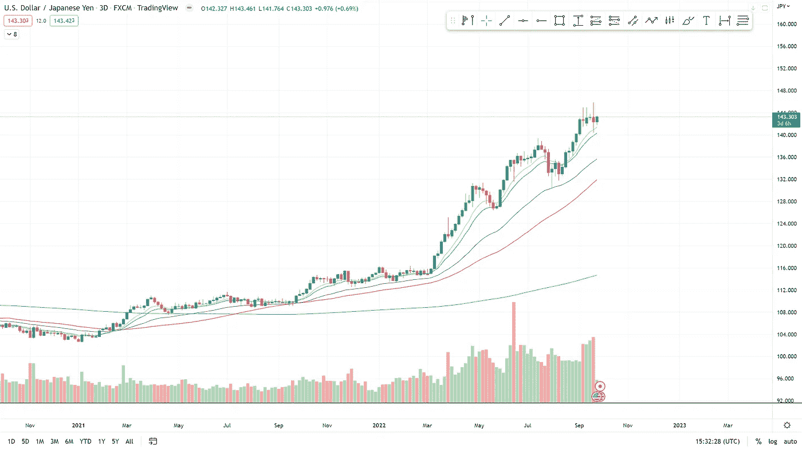
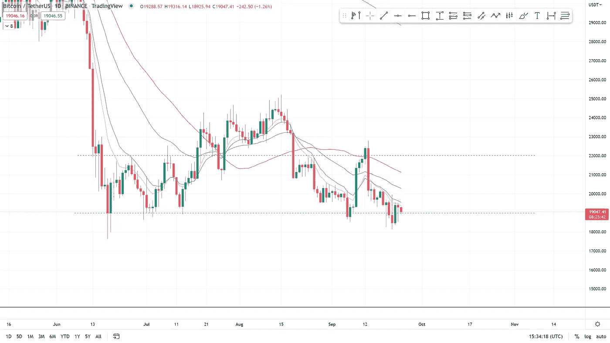
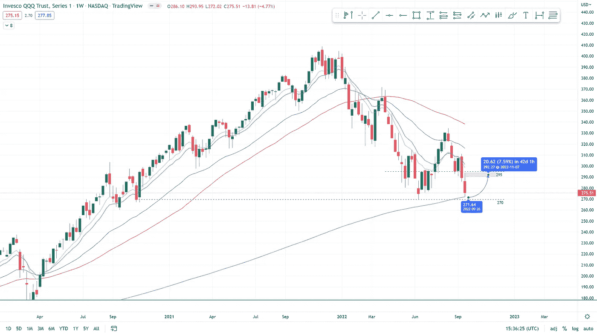

# 在一片谨慎声中，比特币出现了三个积极信号

> 原文：<https://medium.com/coinmonks/three-positive-signs-for-bitcoin-present-themselves-in-a-sea-of-caution-de667f6dd367?source=collection_archive---------22----------------------->

**在本周的报道中**

*   由于日本的经济政策，日元持续疲软。
*   美联储加息 75 个基点导致市场跌至新低。
*   纳斯达克推出了一个数字资产部门，为他们的大客户提供比特币和以太网。
*   MicroStrategy 额外购买了一大笔比特币。
*   币安获准为迪拜的散户和机构投资者提供更多加密服务
*   比特币位于其范围的底部；会在这里反弹还是跌破更低？
*   QQQ 指数重新回到 6 月份的低点，这是在长期下跌到下一个支撑之前的最后一个支撑。

This article was initially published on boomish.org on the 23rd of September

‍

‍

**日元和日本银行**

‍

BOJ(日本银行)一直在购买每一种日本债券，以保持利率低至 2.5%，这给他们的货币带来了巨大的压力。

‍

日本央行一直在购买债券，而不是持有自己的货币，这通过缺乏信心降低了日元的价值。

‍

因此，出售其债券的投资者也希望摆脱日元，导致日元面临很大的下行压力，投资者大规模涌向其他货币和投资。

‍

本质上，每个人都在抛售日元，因为日本央行试图遏制通胀。

‍

我们目前看到日本投资者正在做空日本央行正在购买的日本债券。这是因为，由于政府对日元缺乏信心，日本央行不可能持续购买这些债券而不导致日元内爆。

‍

美元/日元估值图如下所示(见图 1)。这张图表显示了美元相对于日元的强势。长期以来，美元一直相对于日元保持强势，但自 2020 年初以来，美元才开始升值。

‍

最终，日本央行将不得不停止购买债券，并开始出售债券，这将使这些债券大幅贬值，为这些债券提供了一个巨大的做空机会。

‍

通过购买债券，日本央行维持了超低利率，以对抗我们在全球看到的飙升的通胀。然而，从长期来看，这可能会对日本经济不利。

*图 12020 年 11 月—2022 年 9 月 3D 美元/日元(交易视图)*

**美联储加息 75 个基点**

‍

美联储于 9 月 21 日再次宣布加息，宣布加息 75 个基点(0.75%)，使当前的美联储利率或联邦基金利率处于 3%至 3.25%。这是连续第三次加息 0.75%，也是今年第五次加息。

‍

新央行的基准利率联邦基金利率处于 3.0%至 3.25%的新区间，这是自 2008 年以来的最高水平。

‍

不幸的是，尽管加息 75 个基点在意料之中，但达到预期并不足以扭转市场。

由于加息，比特币的当日峰值下跌了 8%。宣布加息后，纳斯达克、美国 30 指数和 S&P500 股市也以大幅走低的价格开盘。标准普尔 500 指数失去了 3850 点的关键支撑位。

‍

在他的评论中，鲍威尔再次强调了许多美联储决策者此前也强调过的问题，即“我和我的同事们坚定地致力于将通胀率降至 2%的目标。”

‍

自声明发布以来，大盘经历了缓慢的放血，现在似乎早就应该出现一轮轻松的反弹了，但目前这还不确定。我们预计，在这个周期中，我们更有可能达到更低的价格。

‍

虽然，这种金融痛苦不仅会被市场参与者感受到，而且很可能很快会被全球经济感受到，其程度要比我们目前所目睹的大得多。

‍

**纳斯达克推出数字资产部门**

‍

纳斯达克在 9 月 20 日星期二推出了数字资产业务，为机构客户提供比特币和以太坊托管服务。

‍

这将是机构对加密货币的又一次重大推动，正如 7 月份贝莱德和比特币基地宣布合作向贝莱德客户介绍加密货币一样。

‍

纳斯达克聘请前 Gemini Prime 全球负责人艾拉·奥尔巴赫(Ira Auerbach)领导新的纳斯达克数字资产部门。

‍

纳斯达克北美市场主管 Tal Cohen 指出，对数字资产的需求不断增加是采用数字资产的原因，他表示，近年来从事数字资产的人数有所增加。"

‍

即使是目前大规模的市场低迷也没有剥夺机构对比特币和其他数字资产的兴趣。

‍

**MicroStrategy 额外购买比特币**

‍

根据 9 月 20 日周二公布的一份 SEC 文件，主要且受欢迎的比特币持有者 MicroStrategy 在 8 月 2 日至 9 月 19 日期间以约 600 万美元额外购买了 301 BTC。

‍

MicroStrategy 最近收购的代币是以 19851 美元的均价收购的。

‍

MicroStrategy 现在拥有近 13 万枚比特币，这些比特币是以大约 40 亿美元的总价和大约 3.06 万美元的平均购买价格获得的

‍

**迪拜的币安**

‍

世界上最大的加密货币公司币安在 9 月 20 日的博客[帖子](https://zwobrd.clicks.mlsend.com/te/cl/eyJ2Ijoie1wiYVwiOjExMjYzMSxcImxcIjo2NzE1NjE1NzczODc4MDI2NSxcInJcIjo2NzE1NjE1Nzk2NzM2OTk2MX0iLCJzIjoiMTdkNjhmYjVmYzUzNDNmNiJ9)中表示，它已经获得监管机构的批准，可以向合格的迪拜零售和机构投资者提供更广泛的服务。

‍

币安现已获准在一家国内银行开设账户，并向消费者和机构提供加密交换服务。

‍

监管机构还批准币安提供支付、汇款和托管服务。

‍

币安一直在寻求扩大其全球足迹，最近还宣布他们将在罗马尼亚开设一个办事处。

‍

现在他们也在向阿拉伯联合酋长国扩张，这是一个吸引大量资金的地方。阿拉伯联合酋长国很可能是一个新兴的加密空间，许多与加密相关的公司都在寻求监管批准。

‍

**比特币价格分析**

‍

比特币目前位于 19000 点左右的支撑位。自 6 月份低点 17400 点以来，已经形成了一个区间，该区间尚未被重新触及。

‍

如果重新审视这些水平，很快就会发现在 9-14k 的高时间框架支撑下会更低。

‍

如果周末或下周初没有影响市场的消息传出，该区间的低点可能会成为影响市场的消息支撑，使比特币重新回到 22000 点的水平。

‍

市场看起来仍然很不稳定，在当前的市场条件下，避险是投资者的首选。

‍

*图 2 BTC 1D 2022 年 5 月—2022 年 9 月(TradingView)*

**QQQ 价格分析**

‍

在从 9 月 6 日我们视为支撑的 290 水平下跌后，QQQ 位于 6 月低点 270 美元附近(见图 3)。

‍

如果 QQQ 跌破 270 水平，我们可以预计 QQQ 指数将大幅下跌。

‍

下一个支撑位位于 2020 年 Covid 恐慌水平附近，约 200 美元。

‍

如果周末或下周没有影响市场的负面消息传出，从低点底部反弹的可能性很大。

‍

*图 31w QQQ 2021 年 4 月—2022 年 9 月(交易视图)*

订阅 BOOMISH 时事通讯，这样的文章每周都会直接发到你的邮箱里

 [## 时事通讯

### boomish.org 提供的每周市场报告仅涵盖每周最相关的市场变动新闻。一小段…

www.boomish.org](https://www.boomish.org/newsletter) 

> 交易新手？尝试[加密交易机器人](/coinmonks/crypto-trading-bot-c2ffce8acb2a)或[复制交易](/coinmonks/top-10-crypto-copy-trading-platforms-for-beginners-d0c37c7d698c)