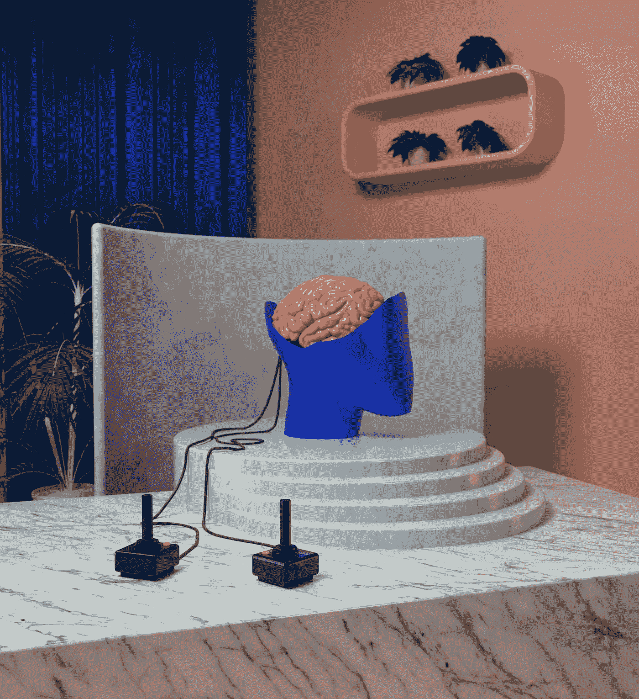

# 在科技快节奏的世界里，是时候清空自己了

> 原文：<https://medium.com/coinmonks/time-to-empty-yourself-in-a-technologically-fast-paced-world-c7e91215b7cd?source=collection_archive---------45----------------------->

图片来源:[莫](https://unsplash.com/@mo_motorious)

## 当我们睡觉时，因为恐惧而远离潜能

我们中的大部分人已经被社会新的社会规范和技术应用的方方面面变得麻木了。我们为了让人类生活更容易而创造的东西，实质上创造了一个巨大的…