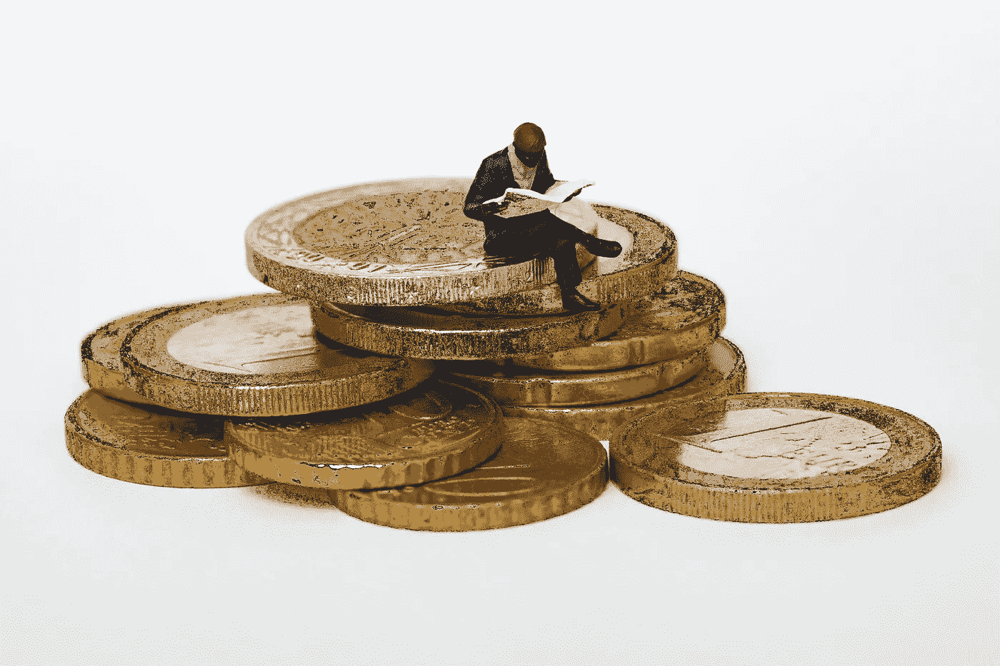

# 该触发了…

> 原文：<https://medium.com/coinmonks/time-to-trigger-ec8239bec008?source=collection_archive---------39----------------------->

## 启动你的投资——财务自由#1

好了，各位，让我们认真起来。

[在镜像上读取](https://mirror.xyz/0xAEF7C59DE837249D696289A19Dd0DC029Dee0fcD/x2HjeQUMZ9w1p3PyySasrrq8UyVueFogkJJumyCNxeY)

市场很快就会改变方向。具体什么时候？我没有发现一个分析师是正确的。所以专业的处理方式是“积累”。你猜怎么着不要相信我，试着‘把握市场时机’，‘买底’——我不会失去任何东西，所以我现在不会浪费时间说服你。我只是告诉你，过去我没有听取经验丰富的建议，即“不要试图成为第一个买家和第一个卖家”和“利润就是利润”，嗯，长话短说，我现在作为一个老兵推荐它。

所以积累意味着只是开始逐步购买，而不是一下子把所有东西都倒进去。有很多策略可以帮助你建立正确的立场，也许当我有机会的时候，我们会分享一些(你可以随时评论你的观点)，现在只是一个快速的有价值的情报——免费的！数据显示，周末价格通常较低。

那么，这次哪些项目会成功呢？

我希望在这个“加密资本”系列的后面讨论风险更高/回报更高的投资，但首先，一些基础知识(我不会告诉你 BTC 和瑞士联邦理工学院)。

敬请关注…

> 交易新手？试试[密码交易机器人](/coinmonks/crypto-trading-bot-c2ffce8acb2a)或者[复制交易](/coinmonks/top-10-crypto-copy-trading-platforms-for-beginners-d0c37c7d698c)