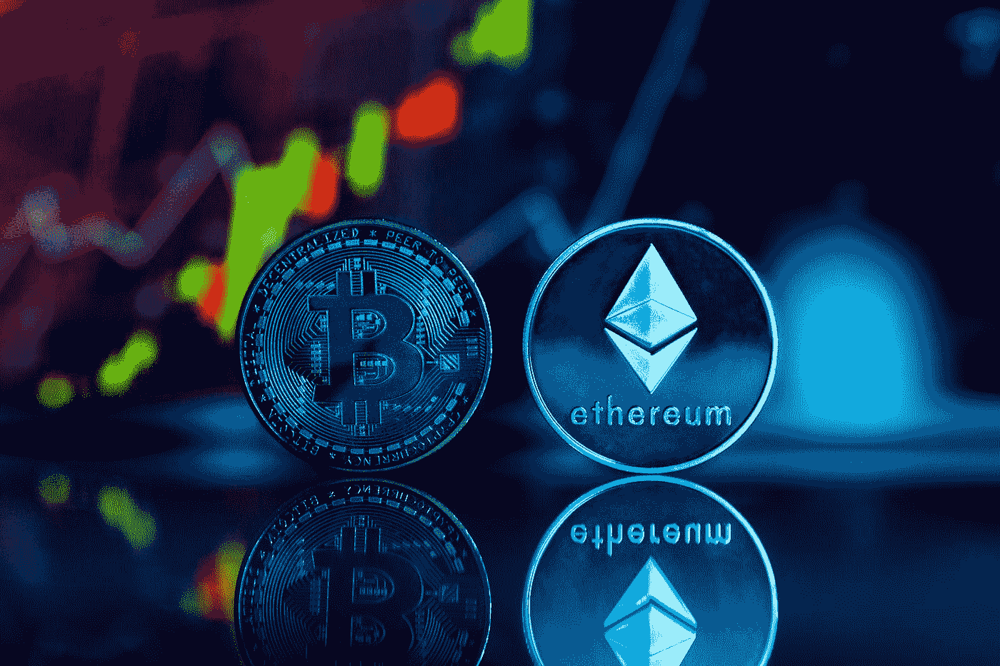

# 蒂姆的科技趣闻# 10——名叫 SBF 的男孩

> 原文：<https://medium.com/coinmonks/tims-tech-tidbits-10-the-boy-named-sbf-e58693ee9ea3?source=collection_archive---------31----------------------->

Photo by [Jonathan Borba](https://unsplash.com/@jonathanborba?utm_source=medium&utm_medium=referral) on [Unsplash](https://unsplash.com?utm_source=medium&utm_medium=referral)

嗨，朋友们，

有几十年什么都没发生，也有几周几十年都发生了。 Crypto 目前正在经历自己的“雷曼时刻”,过去一周发生的一系列不幸事件导致了全球第三大加密交易所 FTX 的破产。几天之内，密码(前)海报男孩山姆·班克曼-弗里德(Sam Bankman-Fried)看到他 160 亿美元的净资产被掏空，让投资者手忙脚乱，冲销了该公司价值数亿美元的投资。

这出戏很容易让最煽情的电影情节相形见绌。从错综复杂的骗局、乱伦和难以捉摸的内部圈子，到“白衣骑士”拯救公司的最后努力，以及几乎耗尽 FTX 剩余资金的 4 亿美元所谓黑客攻击。随着更多的真相大白，情节继续变得复杂。

随着官方调查和诉讼的进行，许多事情还不确定，一些问题仍然没有答案。不过，可以肯定的是，数字资产行业已经倒退了好几年:用户的信任已经不可挽回地被打破，需要时间来重建。今年，从 Luna、3AC、Celsius 和现在的 FTX 的秋天，加密冬天无疑已经开始了。在这篇时事通讯中，我将讨论为什么这对行业来说是一件好事，并分享我对接下来会发生什么的看法。

**今日话题**

1.  加密对你来说意味着什么？牢记大局
2.  不要相信，要核实:重新思考尽职调查的重要性
3.  Crypto 的决定性时刻:穿上大男孩的裤子

> **加密对你来说意味着什么？牢记大局**

*   在这样一个令人清醒的时期，我发现重温一下基本论点是有帮助的。区块链技术仍然是自互联网以来最重要的软件进化。像它的前身互联网一样，加密是不可避免的。在市场动荡之下，数字资产生态系统继续悄然而坚定地走向成熟。与几年前的行业相比，我们在资本、人才和监管水平方面完全不同。随着机构兴趣和参与度与日俱增，这个空间已经大到不容忽视
*   现实是，没有试验和失败就没有进步。经济学家称之为“创造性破坏”——除非你真的去尝试，否则你永远不会知道某件事是否可行。在 crypto 中，经历过多次繁荣和萧条，这次也不例外。少数人的失败并不是整个行业的失败，事实上，这是剔除烂苹果的重要机制，包括不负责任的行为者和不可持续的商业模式
*   收缩期也迫使建筑商重新审视和评估他们业务的每一个方面。当市场崩溃时，“游客”或缺乏信心的创始人逃之夭夭，而资本和用户变得如此稀缺，以至于需要新的用例、新的产品市场匹配或新的用户体验才能让他们回来。这需要时间，如果不是几年，也是几个月。很难将创始人扎实的执行力与不断增长的市场对业务增长的贡献区分开来。但当市场转向时，区分哪些企业家是普通的，哪些是真正伟大的就容易多了

> **不要相信，要核实——重新思考尽职调查的重要性**

*   FTX 的崩溃让许多人感到意外，主要是因为 SBF 没有表现出任何诚信，对任何交易所都缺乏基本的理解，更不用说如此规模的交易所了。与银行使用部分准备金并可以自由出借剩余准备金不同，交易所的目的是将客户的存款存放在单独的账户中，并在任何时候都保持 1:1 的比例。交易所和银行是两种根本不同的商业模式——前者从交易量中收取费用，而后者从存贷款利率之间收取差价(净息差)
*   在牛市中，很容易成为 FOMO 的猎物，并专注于为下一个大型初创企业提供资金，而适当的尽职调查可能只会得到粗略的审查。FTX 的投资者最初将资金投入到被认为安全且有利可图的交易所业务中，但实际上伴随而来的是高风险的自营交易业务，这种业务依赖于客户存款和 FTX 本地货币 FTT 作为抵押品。目标不是完全避免风险，而是充分理解风险并相应地权衡决策
*   这也延伸到我们在摩根大通的经营方式。在过去的一年里，我们与亚洲数十家加密公司进行了交谈，由于这样或那样的原因，我们不得不拒绝了一些机会。这些决定从来都不容易——但我们希望与符合我们理念、尊重监管准则、运营稳健并能在未来几十年内建立持久业务的创始人和管理层合作。此外，尽职调查实际上可以帮助公司进行压力测试，并使现有的系统和结构更加严格。不管你是投资者还是顾问，重要的是永远不要相信任何事物的表面价值，并保持适当的专业怀疑态度

> **Crypto 的决定性时刻:穿上大男孩裤**

*   那么下一步是什么？展望未来，投资者可能会在投资前花更多时间考察公司。尽职调查的范围也将变得更加全面，特别关注安全性、风险管理、客户钱包隔离、内部控制、公司治理等。那些提高了严谨性并能够接受这些变化的公司将最终成熟为领先的专业企业，并在新时代蓬勃发展
*   加密将需要更大的用户信心和参与，以实现主流采用，这可以通过实施明确和支持性的监管政策，允许加密公司在相关当局的监督下接受监管来实现。FTX 的崩溃凸显了此类监管的重要性和紧迫性，并将可能加速其在全球的推广。政府还需要在确保适当监管和积极拥抱创新之间取得平衡。这将扩大受管制和不受管制的加密参与者之间的差距，因为用户将选择被认为是安全的加密交换
*   最近的事件还导致了围绕该行业如何自愿采用最佳做法来提高透明度和恢复信任的富有成效的对话。例如,“准备金证明”( PoR)审计允许用户通过与链上记录进行匹配，来验证集中交易所是否有偿付能力并持有他们声称持有的资金。许多交易所已经站出来采用这种方法，包括北海巨妖、BitMex、币安、KuCoin、Huobi 和 Crypto.com。这是一个良好的开端，也是朝着正确方向迈出的一步

如果您觉得这很有用，请随时与可能觉得这很有趣和/或相关的朋友或同事分享。如果有任何你想让我覆盖或扩展的话题，请让我知道，我会看看我能做什么。

> 交易新手？试试[密码交易机器人](/coinmonks/crypto-trading-bot-c2ffce8acb2a)或者[复制交易](/coinmonks/top-10-crypto-copy-trading-platforms-for-beginners-d0c37c7d698c)