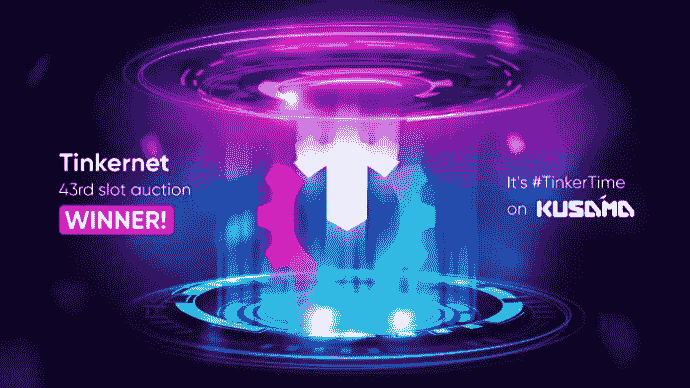
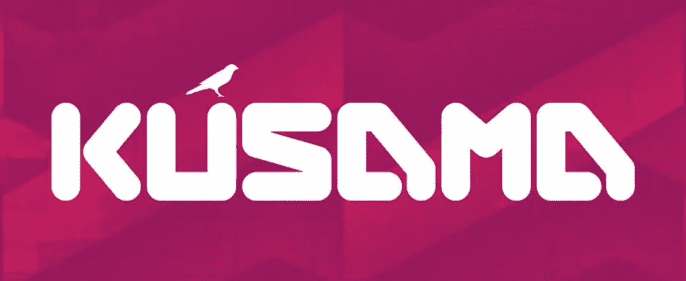
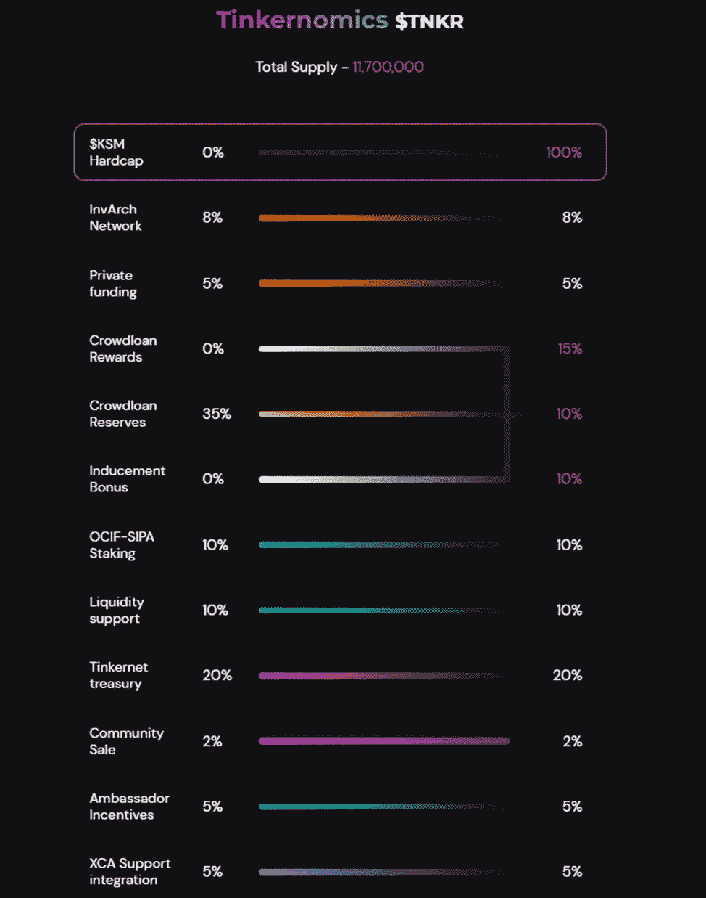
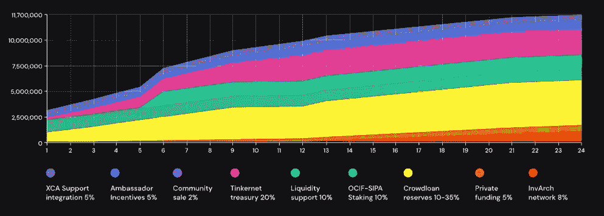

# Tinkernet 是 Web3 世界知识产权去中心化的重要一步。

> 原文：<https://medium.com/coinmonks/tinkernet-is-an-important-step-towards-decentralization-of-intellectual-property-rights-in-the-web-fbe3e8d3e561?source=collection_archive---------19----------------------->

给所有密码爱好者和 Tinkernet 和 InvArch network 的粉丝们的参考。今天，我想告诉你关于 Tinkernet 网络和它在草间弥生上第 43 个 Parachain 槽的胜利，以及它对生态系统的意义。

首先你得马上划清界限，明白 Tinkernet 和 InvArch 的区别。首先，Tinkernet 是作为 mainnet 的一个测试网络而创建的，InvArch network 是一个用户在进入 InvArch mainnet 之前可以测试他们的代码的环境。

InvArch 网络团队提出了一个别出心裁的解决方案来发展你的想法，保护你的知识产权，并将你的创新想法符号化。它可以包括音频、照片、视频、业务关系和房地产所有权，甚至许可和简化管理权。更不用说，创造更多的收入来源，从你的令牌化知识产权。

简而言之，所有的创意都成为所有者直接拥有的令牌，不需要冗长的链上专利程序。所有者还可以与拥有资源的个人共享知识产权令牌，以帮助启动他们的项目，例如，邀请感兴趣的投资者，并允许他们对 ip 集拥有一定比例的所有权。

InvArch Tinkernet 提供了三个主要用途:一个是为维护网络的开发人员提供的，另一个是为构建网络的开发人员提供的，还有一个是为 dApps &由网络产生的应用程序的最终用户提供的。

Tinkernet 的主要概念与 InvArch 的没有什么不同，这很重要。不同的是，在 Tinkernet 上，开发者、创新者等。，可以在金丝雀网络上启动他们的项目作为他们的“首次上市”项目，使用草间弥生网络提供的工具和快节奏的实验环境。

在我们深入之前，我们需要定义两个关键元素:Polkadot 和草间弥生，它的金丝雀网络。概括地说，波尔卡多特和草间弥生是区块链的网络:

*   共享相同的底层架构
*   将网络连接在一起
*   链上治理
*   允许任何人轻松创建区块链与奇偶技术的基板框架
*   无分叉、链上升级和跨共识消息传递以实现互操作性

由于大量的项目希望得到他们的位置，这是决定举行蜡烛拍卖是最好的方式，以促进副链位置的安全。一个时段的投标人有一个宣布的投标期限。拍卖的完成时间是随机选择的，在 KSM 或 DOT 中当时出价最高的项目赢得 parachain 位置。

在草间弥生网络上拥有一个副链的重要性在于，像 Tinkernet 这样的金丝雀网络能够在一个社区控制的网络中部署它们的代码，在这个网络中，某些项目可以更舒适地试验新的想法，进入一个更“早期”的开发过程，并确保它们的代码、应用程序和 dApps 能够很好地工作，以安全地在 Polkadot 上启动(如果这是项目的最终目标)。有些项目就是单纯的想留在草间弥生上！

因瓦奇团队发现，草间弥生给了 Tinkernet 一个机会，让它成为一个实验性的“社区试验场”，让项目推出他们的“首次上市”创意。真正的创新起点。
作为因瓦赫网络的金丝雀网络，它被设计为草间弥生生态系统的知识产权资产&加速发展的集结地。

草间弥生不仅在不断测试不同的项目，也在不断测试生态系统本身。草间弥生总是领先波尔卡多特一步，尝试新功能，一旦解决了问题，后者最终会部署这些新功能，让团队更具创新性，在不危及波尔卡多特生态系统的情况下承担更大的风险。

草间弥生的其他特点包括:

> 1.获取副链槽(在草间弥生上进行测试时需要，这是一个重要特性)。连锁店可以被投票选为“普通商品”副链，赢得副链拍卖，或被设置为“副链”，这实质上是为每个区块进行拍卖的现收现付访问。
> 
> 2.设置为验证程序。这是一个很好的方法，可以在切换到 Polkadot 之前浏览流程并了解期望/要求，因为对 Kusama 的投标的最低要求更低。另一方面，用户可以充当提名者，这需要一些股份，但允许“设置它，然后忘记它”的方法。提名者将他们的份额分配给验证者，并获得一定比例的奖励，或者如果他们提名的验证者表现不佳并被削减，他们的份额就会减少。
> 
> 3.这些股份还允许用户在治理中提议和投票，这将有助于网络随着时间的推移而发展和改进。

InvArch 的目标是建立一个直观的网络，将想法符号化，并形成分散的合作伙伴关系。

总的来说，该项目的整个技术是通过 3 个主要协议实现的:

1)**in v4 协议**以 IP 集&文件为特色，这是一种新的 NFT 类，就像你计算机上的文件一样可组合。像音乐、代码、艺术或任何其他文件一样，它们都可以附加版权许可协议。
in v4 协议将是草间弥生网络上测试的第一个协议。
tinker net 将在草间弥生上展示 INV4 协议(IP 集、IP 文件、IP 许可证、& IP 令牌)、& INV4-Git。IP 资产是 web2 的文件、文件夹和许可证，融合了 web3 的不可替代的&可替代令牌技术。

**INV4-Git** 是一个用于管理 IP 集版本的工具&文件编辑，然后被传输到因瓦赫区块链上的根 IP 集。INV4-GIT 是开发者对 Web3 进行 GIT 文件管理和版本控制的目的地。使用 INV4-GIT，开发人员可以对他们的代码进行令牌化，并使其包含 InvArch 特性，如分布式所有权和链上许可。

简单来说，in v4-GIT/giarch 对于开发者来说，将像是 Github 的新版本。它已经实现了所有三个 InvArch 协议的功能和工具来实现和存储知识产权文件。

2)**《OCIF 议定书》**通过实现在线、知识产权标桩、知识产权农业、&知识产权资产捐赠、dApps、&初创企业，彻底打破了目前的资助&激励状态。它们都将被整合到 Tinkernet 中，并允许用户寻求启动资金来启动他们的项目。

3)**XCA 协议**提供了第一个在整个 Web3 上验证 NFT 元数据&文件真实性&唯一性的不可信方法。InvArch 今天实现了防盗版资产，明天实现了不可能抄袭的互联网，以鼓励开源开发，同时仍然保护知识产权。据我所知，这个协议仍在开发中，但它也将在 Tinkernet 中实现和测试。

此外，Tinkernet Parachain 最新颖的焦点之一是，它将为去中心化自治组织(DAOs)提供一个新的范例。

综上所述，把 Tinkernet Parachain 当成一个孵化器(在 Kusama 和 Web3 上)，把 InvArch Parachain 当成一个加速器(在 Polkadot 和 Web3 上)。简而言之，如果你有一个新奇的想法，你希望看到它被开发和实现，首先通过 Tinkernet，一旦它达到最佳版本，它就可以在 InvArch Parachain 上发布。

现在来谈谈 Tinkernet 的令牌经济学。它与 InvArch 的 tokenomics 有一点不同，但在团队的原始文章中阅读更多。我会向你展示它的样子。

[https://invarch . medium . com/the-tinker net-crowd loan-community-driven-tinker nomics-42bf 16519 c6c](https://invarch.medium.com/the-tinkernet-crowdloan-community-driven-tinkernomics-42bf16519c6c)

在媒体上关注因瓦赫:[https://invarch.medium.com/](https://invarch.medium.com/)
在推特上关注因瓦赫:[https://twitter.com/InvArchNetwork](https://twitter.com/InvArchNetwork)加入因瓦赫不和:[https://discord.gg/invarch/](https://discord.gg/invarch/)加入官方 GitHub:[https://github.com/InvArch](https://github.com/InvArch)

> 交易新手？尝试[加密交易机器人](/coinmonks/crypto-trading-bot-c2ffce8acb2a)或[复制交易](/coinmonks/top-10-crypto-copy-trading-platforms-for-beginners-d0c37c7d698c)