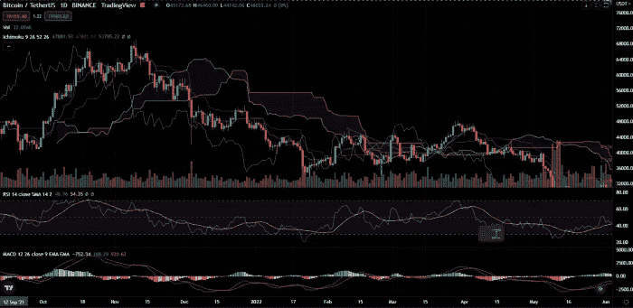
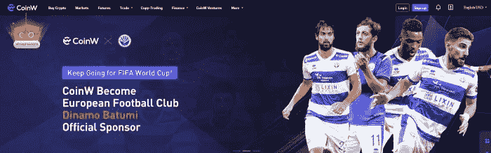

# 所有期货交易者都应该知道的提示

> 原文：<https://medium.com/coinmonks/tips-that-all-futures-traders-should-know-2696beaf5b4c?source=collection_archive---------27----------------------->

目前，几乎所有的投资者都因为金融世界的宏观影响而亏损。然而，与投资者不同的是，很多交易者在这段时间赚得非常多。然而，期货风险很大，但大量衍生品交易的诞生为他们创造了很好地限制风险的技巧。那么这些提示是什么呢？下面的内容给大家展示一下所有期货交易者都应该知道的的**小技巧。**

# 技能

要成为一名优秀的交易者，你必须具备在**期货交易**中限制风险的基本技能。比如，你得知道图表和几个指数。学习所有这些东西并不难。你只需要至少一周的时间来学习和理解它。

Illustrate

# 不要 FOMO

FOMO 是让你在**期货交易**中输掉所有钱的方法。在**期货交易**中，你要消除你的暴涨。记住，机会总是在你身边。你不需要急于交易，只有当你觉得有把握时才交易，或者百分比是你成功的猜测是上 60%。从长期来看，没有人能百分百获胜。然而，他们仍然可以以高利率获胜，并从中赚钱，所以我们仍然可以认为交易者是一份需要高技能，责任心和脑力的工作。

# 秘密提示

为了优化和限制**秘密市场**和**期货交易**中的风险，而不是**摇摆**，你应该使用**刷单**并成为交易所的会员，从你的交易费用中拿回回扣，以限制你的风险。例如，我的朋友，一个职业交易者，正在使用一个名为[CoinW.com](https://www.coinw.com/front/register?r=1634946&language=en_US)(顶级**期货交易所之一**)的交易所，他从他的交易费用中获得 70%的回扣。

CoinW

在**期货交易**中，他每天获得大约 100，000 的交易量，并从交易费中获得 42 美元。这意味着尽管他输了，他仍然可以保证他的风险。他每个月大概能收回 1200-1500 美元。为了限制他的交易风险，快速增加他的收入，他只用刷单策略交易，试图提高他的交易量。不仅他自己，他的团队也是职业交易者，他们中的一些人也这样做，他们中的一些人通过这种方式每个月至少可以赚到 40000-50000 美元。

> *注册你的账户，成为我朋友那样的加盟伙伴，你可以通过这个链接注册，获得 70%的返点*[*https://www.coinw.com/front/register?r=1634946&language = en _ US*](https://www.coinw.com/front/register?r=1634946&language=en_US)

# 结论

上面的内容是帮助你成为专业交易者的建议。只要你跟着我的步伐，你会赚到稳定的钱。

以上都是所有期货交易者应该知道的**小技巧。**如果你对我有什么问题，请在本帖下方评论；我会为你写下他们。别忘了跟随我的媒介。祝你投资之旅成功。

> 交易新手？试试[密码交易机器人](/coinmonks/crypto-trading-bot-c2ffce8acb2a)或者[复制交易](/coinmonks/top-10-crypto-copy-trading-platforms-for-beginners-d0c37c7d698c)