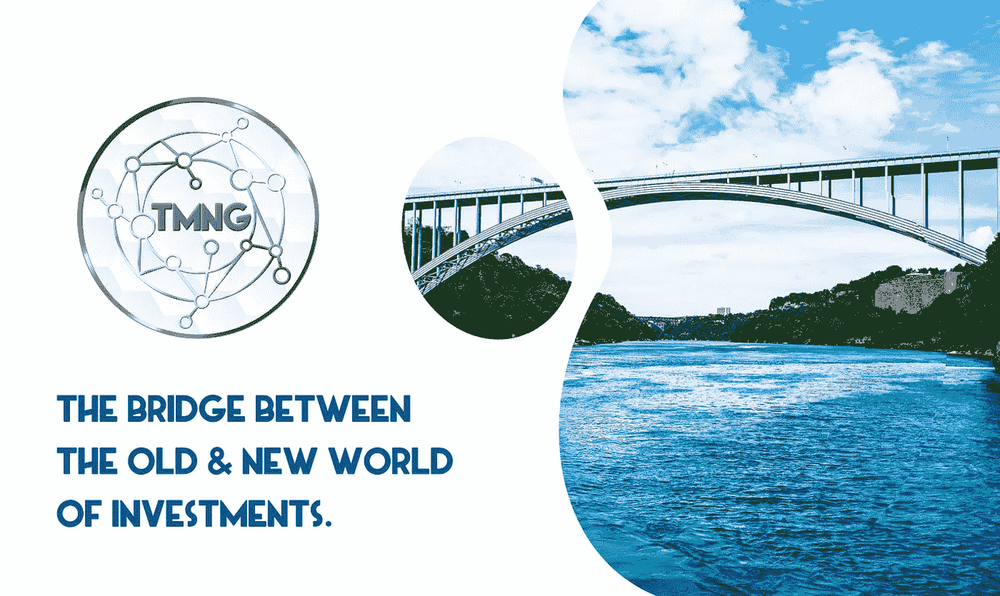
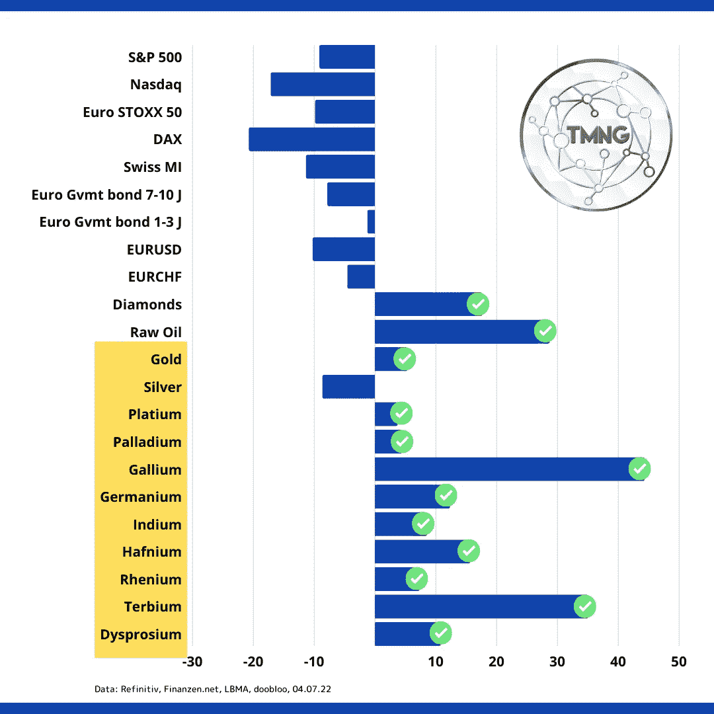

# TMN 国际在投资的旧世界和新世界之间架起了一座桥梁。

> 原文：<https://medium.com/coinmonks/tmn-global-builds-a-bridge-between-the-old-world-and-the-new-world-of-investments-8e15fb3c3983?source=collection_archive---------17----------------------->

传统上，人们投资有形资产，如黄金和白银，以保护他们的财富免受通货膨胀的影响。其他人投资了人寿保险、股票、债券或其他可以迅速转化为现金的现金等价物。这些方法帮助许多人对抗通货膨胀，为退休做准备。

尽管如此，这些传统的投资方式并不是保护一个人的现金免受通货膨胀影响的唯一方式。技术、绿色能源和数字货币方面的新发展让投资者有可能进一步分散投资组合。

EREA 世界股份公司(TMN 环球的管理公司)的合伙人 EMH 股份公司是欧洲领先的有形资产交易商和分销商之一。EMH 公司专注于各种形式的战略资产，这些资产不为投资者所熟知，但在工业和现代技术中被广泛使用和需求。

EMH 公司是世界上唯一一家可以让普通人购买技术金属和稀土金属的公司。通常情况下，只有大公司才能获得这些金属来开发汽车、手机、笔记本电脑、风力涡轮机、太阳能电池板等等。有了 EMH 股份公司，普通投资者有机会以可承受的价格购买这些大宗商品，否则他们将无法获得或没有机会。

EMH 公司同时满足大投资者和小投资者的需求，自 2012 年以来一直有一个系统在运行，几十年来创始人一直在贵金属领域使用这个系统。这个过程是，有人可以从 EMH 公司购买金属在一段时间内每月分期付款或一次性购买。从那里，客户的实物金属被储存在德国列支敦士登或瑞士的高安全性保税仓库中。客户购买时不含增值税，是实际储存金属的所有者和持有者。一年持有期后，他可以免税出售。客户还有机会每年参观仓库多达 4 次，亲自查看他或她的金属。

与其他投资机会相比，下表概述了 2022 年不同金属和战略资产的发展情况:

正如你在上面看到的，与其他传统投资选择相比，战略金属的表现非常好。有了这些信息，就有巨大的机会将这些战略资产推向未来。2021 年，EMH 公司与一家名为 EREA 世界公司的新区块链公司合作，开发一种与众不同的新加密货币。EREA 世界股份公司现在管理 TMN 全球平台，并提供 TMNG 加密货币。

EREA 世界公司是一家受 VQF/芬玛监管的区块链公司，也是第一家提供使用自己的加密货币作为支付方式购买技术金属和稀土金属的公司。TMNG 是一种 ERC-20 支付令牌，提供通过区块链购买战略资产的权限。接入点是通过 TMN 全球网上商店，这是正在开发和 2022 年建成。通过 TMN 全球平台，用户可以访问这个商店购买贵金属，稀土金属和技术金属。这家网上商店接受的唯一支付将是 TMNG 加密货币，从而给加密的第一个实用工具和用例。由于没有传统的分销佣金，投资者从 TMNG 购买的金属价格便宜 15%,因此有机会获得更多的金属。

TMN 环球与当今市场上的其他加密货币不同，因为它不仅仅是一家加密初创公司，而是由行业巨头及其在战略资产行业的经验支持。TMNG 是让资本较少的投资者获得 EMH 公司提供的战略资产的机会。使用加密作为高科技金属和稀土金属支付系统的机会，为年轻一代利用他们更熟悉的系统对抗通胀打开了大门。这也允许全球参与大趋势商品，许多人由于本国法定货币的限制或其他因素而无法获得这些商品。TMN 环球知道加密是金融和传统投资的未来，而 TMNG 正在战略资产领域铺平道路。

> 加入 Coinmonks [电报频道](https://t.me/coincodecap)和 [Youtube 频道](https://www.youtube.com/c/coinmonks/videos)了解加密交易和投资

# 另外，阅读

*   [交易信号是什么？](https://coincodecap.com/trading-signal) | [Bitstamp vs 比特币基地](https://coincodecap.com/bitstamp-coinbase) | [买索拉纳](https://coincodecap.com/buy-solana)
*   [加密交易机器人](/coinmonks/crypto-trading-bot-c2ffce8acb2a) | [维护审查](https://coincodecap.com/uphold-review)
*   [如何给 MetaMask 钱包添加 Arbitrum？](https://coincodecap.com/how-to-add-arbitrum-to-metamask-wallet)
*   [KuCoin vs 北海巨妖 vs BitYard](https://coincodecap.com/kucoin-vs-kraken-vs-bityard)
*   [加密交易的最佳 VPNs】](https://coincodecap.com/best-vpns-for-crypto-trading)