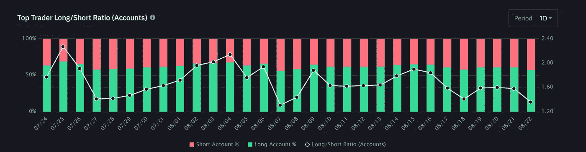
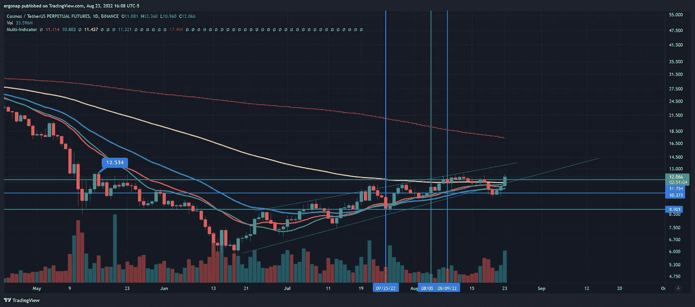
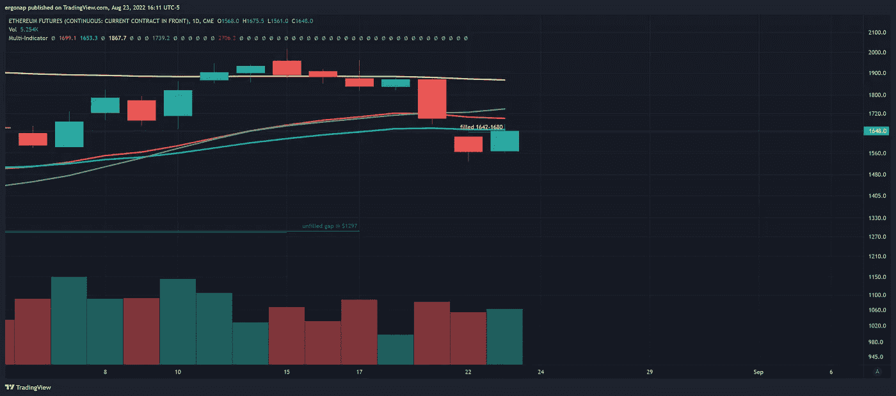

# 今天只是填补 eth 空白的一步棋

> 原文：<https://medium.com/coinmonks/today-was-just-a-move-to-fill-the-eth-gap-37a3e273ec65?source=collection_archive---------34----------------------->

加密货币市场/比特币市场分析 8/23

我们能上去吗？是的。很多硬币在 6 个月内第一次没有完全看跌。问题是多方面的。第一，整体经济相当糟糕。另一方面，在某些情况下，情况变得非常糟糕。老实说，我根本没打算穿坡跟鞋。

所以，没错，我们正在崛起，比特币的统治地位正在下降，这就是大部分情况。还没有完全脱离险境。原子(宇宙)就是一个很好的例子。

this is atom fucking *fading* the hell out of things on a macro level. Look at this!

7 月 25 日的高点是我所能回到的最高点，也是即将到来的反弹的短期底部。事实上，每次多头变得勇敢，他们就会受到挤压。8/4 是一样的，8/9 也是一样。我会添加一个视觉。因此，7/25 的多头被挤压，8/4 的多头运气不佳，第二天退出，8/9 的多头第二天被挤压。这是一场重要的战斗，当然，ATOM 现在已经准备好了。但现在的情况是多头正在逐渐消失。

so let’s put this together with OI. [https://www.tradingview.com/x/A98gRryI/](https://www.tradingview.com/x/A98gRryI/)

我们可以从 OI 中看到，人们开始做空。精明的钱，而不是零售。聪明的投资者将会做空这件事，或者他们已经做多了。两种情况都有可能，但我不会屏住呼吸。

为什么我们真的上升了呢？Eth 间隙填充。请注意，此后 eth 再也没有回到价格之上。所以……那是褪色。一个很大很大的褪色。

see that yellow filled? yeah. [https://www.tradingview.com/x/zUudPTeh/](https://www.tradingview.com/x/zUudPTeh/)

我预计明天会出现大幅下跌，但不管出于什么原因，个别硬币现在都在为所欲为。太傻了。瑞士联邦理工学院总体上非常悲观，整个市场也是如此。

> 交易新手？试试[加密交易机器人](/coinmonks/crypto-trading-bot-c2ffce8acb2a)或者[复制交易](/coinmonks/top-10-crypto-copy-trading-platforms-for-beginners-d0c37c7d698c)