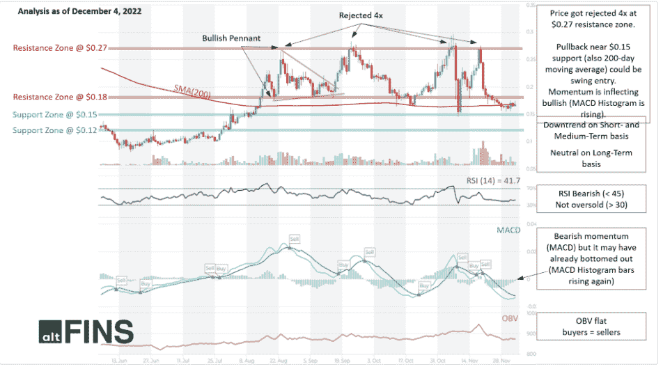
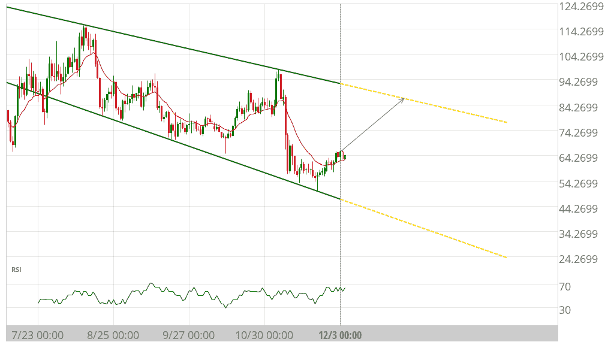
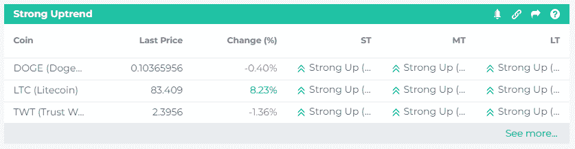
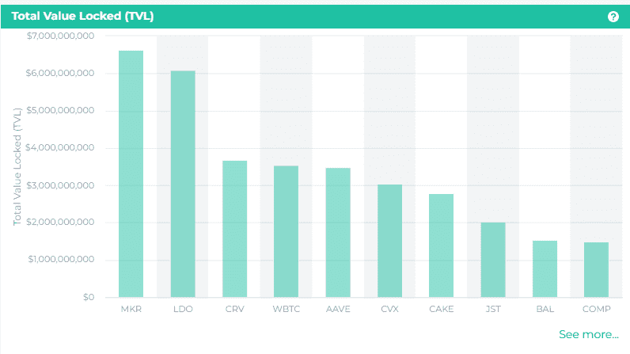

# 今天的密码市场亮点

> 原文：<https://medium.com/coinmonks/todays-crypto-market-highlights-3d8976cbb399?source=collection_archive---------34----------------------->

与 altFINS 的每日加密市场要闻保持联系，致力于为您提供可靠和及时的交易和投资提示、突发新闻和加密研究。我们涵盖的主题从交易策略，链上数据分析，新上市和更多！**订阅 altFINS 获取每日加密交易提示！**

今天的话题:

*   **1。CHZ:技术分析**
*   **2。AAVE:频道下调**
*   **3。涨势强劲的硬币**
*   **4。MKR、LDO、CRV-链上数据洞察**
*   **5。突发新闻&密码事件**

altFINS.com 致力于选择最可靠的数据和分析，因此您可以专注于重要的事情！

**1。CHZ(奇利兹):技术分析**

**交易设置:**回调到 0.15 美元支撑位附近(也是 200 天移动平均线)可以是摆动进场。势头正在转向看涨(MACD 柱状图正在上升)。Chiliz 是体育和娱乐的数字货币，为世界上第一个总部位于区块链的粉丝互动奖励平台 Socios.com 提供支持。最近，巴塞罗那俱乐部发布了一些重大新闻。([设置价格提醒](http://r.email.altfins.com/mk/cl/f/y4bcFqc1vozip8s_nGTFGKodU8QfaQMsvQXQZ7iWkguHjDWCIePYdwM1bsAEt1i-Gh7AFI3q9jTlH3ZYjTTgverjeVRCjbd5lq7WrwgUhgYfQm5qCFqrK24Q2zYjNj_26NkIdaQZvLJftFrWY4WGzI1H2tKcBZ6GxpqwDEPmdHTxPKmAM1cAQjc3_ud7j2saWPcezPPpdT_4T0R0O2QJimvnQUctjgrUWIdaaxLUu8j0djlyZjcRC-GjiP95ZUkSozP3_XGLKzBlgN-0nHH0u3eG3fCiDGXYp638m8mk4PWkGloFf9pghUIMBfZe5xpz4HBY9ojU3P9Wl4UjaeBsIN46ZIjYoU-v5KUcN1oemP70J-GSy5s))。

**趋势**:中短期下跌，长期中性。

**势头**看跌但有所收敛。 [MACD](http://r.email.altfins.com/mk/cl/f/2xZNC_G5yyoiXitdc1FilpSoAK2lX5yBthsxK33aQ_6527L0RfwpasPkRQwqRarSiGXMK-gB2OZKLZGHyvpe2c1vb0Q2aImQ9X4Emg5QY27Mt6B0EqrhqdfI8-26-oW1nRryH7axFth37lhH3KcZF2jb-mARq9Hmk6XOb3zlkIEC_CHF7qnfIl-iYEZewMBZXIf3p8MDXWxtxAfGOe8pwIv6fL82QSsrkDtxh2UNqrPc0lFG9AV-VEx79fMwPb1PPcmhHcDCPxdc2FDallPCA8yGBoKh7jgNqCGG9booWKMxYDrq_XSMG6hyOBNEO18m4tMkqWQl8VJl2SmDtfIoN8q92WaS3flRd-DLEYQr-Va8muo) 线位于 MACD 信号线下方，RSI 低于 45，但由于 MACD 柱状图柱正在上升，动能可能已经触底，这表明动能可能正在接近另一次上升。

**(平衡成交量):持平，表示上涨日成交量等于下跌日成交量。因此，买方的需求和卖方的供应处于平衡状态**

****支撑** **和阻力**:最近的支撑区是 0.15 美元，然后是 0.12 美元。最近的阻力区是 0.18 美元(前期支撑)，然后是 0.27 美元。**

**[见技术分析](http://r.email.altfins.com/mk/cl/f/kG5VrIWzMamJlns6q3vLp8dIx0qBRyazjYlXK3lnwR47uPfA_fo7Vebm3r6kmKBmPjX14zE1riniUCDDODkocVEBIwxIpsIN7X6cmIa8VEM3hnPQbAc-4ENROhsqtOwyeQB3zDNmO8jzlFlygisYgQH18eBAxtmqT-TbJF_R-OhYSPKLhpY_p4ztxTTvezgeWYTnqubxFFLylUq2sVY12k8DysORQvnM3zfphizSEMFTXTFpozXa6YOmZSib7PjcGjnE6_mYTvtQoZoLY58xKAnzI-aj4fE4v0B-_5Xn5SLJpBbTPiYv2b6qIcax2zyo_-Go)**

****

****2。成功率高的图表模式:****

****AAVE (AAVE)带通道下跌形态****

****

****图表模式****

****盈利潜力(买入)+31.54%****

**世界协调时 12 月 3 日 0:00 发现频道关闭。未来 34 天内，价格可能向阻力位 86.8173 移动。**

**[更多图表模式](http://r.email.altfins.com/mk/cl/f/FFfXJY8GiWk1lfnExRovm_jPcrA8vcBduzwrZAklxRujqt8qgOdmlPMHdnZ498VHcMpaSd-xiajHueXSvf15ovwR4ddkaakjOlRBl2hyxK4IAwKpehE1oB48kvz9peKo8Ls1GtSmcnvyrLyW8xDYsqGjZXuTL8SwOvRQU8ZD4_vaxck69f6ITFywV9s6pW9AsJMmXoZYJ0J8Tdjrwu1by90t9W0FHXpC9rAPlKPKBHVkmzUHi5_-Eo-GM-X1w5LYA50qpGcNhzAFDXuyP98A6i5qEOVY2yuDlEKb7PVfS7nuzhAzJlJFWkI-U4RaxUc)**

****3。具有短期强劲上升趋势的硬币****

****

**这个市场屏幕显示了价格在所有三个时间范围内都处于强劲上升趋势的硬币:短期、中期和长期。**

**这些是罕见的情况。你可以放松这些条件，只关注短期和中期，或者中期和长期。由你决定。**

****顺势交易。**新手交易者应该坚持趋势交易策略。俗话说，趋势是你的朋友。这意味着，找到一个上升趋势，并利用它获得潜在的巨大收益。趋势交易之所以有效，是因为价格趋势有持续的趋势。识别趋势是成功的一半。这大大增加了你的获胜概率。**

**altFINS 从强劲上涨、上涨、中性、下跌到强劲下跌来识别和评估趋势。**

****上升趋势的教科书定义是一系列更高的高点和更高的低点。****

**[多头币](http://r.email.altfins.com/mk/cl/f/z62C2pyc-IrMq9Viuxs3yvYt7ThU4UsgkXY1q9fYCYKlHzZGBHGOmCnIGueZqmJicgHoLv5CjC3lxwWep7mnjgw_a1mqx0et6hkD_Q9yThU9oVkUkZGPtSOZjukPbiZ8FEMii0REAQuXff52Egvs9dF9ssyXcT6xsoVC32IQZ7ClBDVteAgdVSALhGVUhFUHqEZMui3Em5fRN0JfLY3MP2x3CWiUDIUBxhv7Bl9KtCSlvtIyI-fIGZC7OYKA5NX8DKQWKFwmCf6fQxyroIJW4xsIMxZ0T2kK4epXbMFkRPU07A)**

****

****4。链上数据洞察-****

****总值锁定(TVL)****

****

**TVL 代表当前被押在特定协议中的所有资产。**它衡量项目的整体健康状况**，投资者可以看到人们愿意在特定项目的智能合同中锁定多少价值。**TVL 越高，人们对项目越有信心，大概是因为它对用户产生了一些价值。****

**[链上数据](http://r.email.altfins.com/mk/cl/f/wXWjcjkRyCrthE2j9sM7FulyTTT_Z-HZg708HdNSFhdt_q9uvibtXfAs23MNneN0sV_kJpjDPFy7MhRdLUVt59J62U-JdRNLpI0z10gGOM-tIYEw75a0vroVIjQbPvKIKo6Xc-wTaxsytPNQXZ4CpqXoej-LRFvWEKMnHVXSsZjnVjqJtmXrBVBKFdlSJPMCe4ERTSUbDziMGe5_rfZAT8wl4B_Q69I6A8YTUtgHAahureQTOnRP1N9zeOtA67R9ai4-DAkBj-IqH70lqj4AR81xpyC8XUEAkkvm-0CKuE9aiIBA5Kk4EcT51iNid7c)**

****

****5。突发新闻&密码事件****

*   **[埃隆·马斯克的推特解除了对十几个狗狗推特账户的禁令](http://r.email.altfins.com/mk/cl/f/M5MFTU3mZnGW3WvIG582RD1EwyA9a3-vw6cG-xCG707wud3Fk8FIWmdOdyjbAVdEnWRkyVL394p_4rcOfP1aWPVC2PPHXS8tiAsvOd5F5tDJyinOVvYHZyB2eCT_QwU4Dfn_VS9MLZ0BUgasR2kCx1u-s15NGv6FpJW04ITqL5wkO_ekGBcRMWfndOrUpRHz9sW4Y5PYRNmzxfADqlm5zKbzH9rj7f9nah_sBVNTHibqQYdO2A-Kny6O46NGZEivqNFjOvKrJQzzYNPpgct2YbSfwIK9Ts7kzwcGLaNpvskbDBPqkWDszRRkF0eX-F2F80EhdGYQSjGrtMtsB-YLJomn9jt5J0iXAPUPJksXsroOa5cV-s-RiUGzrG3NliQ_B71OIiL4aWqKzYBlpczD)**
*   **[看好比特币，美国参议员特德·克鲁兹希望德克萨斯成为加密绿洲](http://r.email.altfins.com/mk/cl/f/r3mhF2cdA9bBNiCi0V4qQpVWKpwHvW1f1w9LNT2hhReKVeS5pH1NRzQedlAii3LB69LcSVfBnwBH0vU1-9cougVcye8ivBceMoDE4SWPt-nqWjNO66HlG-163E-t6UmJtSoX5ruMheOkid7rWr9JV0qS3ZikjB31Y4f4oCKwrQOMLsr7Gxaerdsq6jJISJsHUA6DBwkfVvlbG3OsXN3HQ_sG9XGf9wAgf6-4QXSMe3BMpJYsQF93WbrBVWG0OyxkUchMDMD3hTIiyw5TkMY8QVhDQgbIaqwYAxftvloZ5RSdxKj4O5kbNo96JQMf2t8GZoSbFIXyCgmcdnTSKL8Puovc-oIhKWNWHzUc3j-OcuFvBy3QzW7Sd6eEUcPT7zogyemR71mDYyy2jv2q0zo5tBFe3jFsFw)**
*   **[俏皮新闻:Reddit NFT 薄荷糖创历史新高，欧盟 40 万美元的元宇宙派对失败等等](http://r.email.altfins.com/mk/cl/f/rj48IOrA218ie9dqH8T595B0cs4itVr5W5gAe8-pZQEFyJQUQY_mWI0gieZYr3vTaI_2_dpqHZVaB0LY7eSFN8Y1HSHgJpBQXXvCXPRQi5YuEO49kUvW48RgNnsy9YtDobKvqYXTeUdfhyoRIxmFl6Qdi37IYtBN45OmR1SXx4aNAwRD7t9Gnbz_9vgMeR0igPTb5NQCt2btq0EOJERm_4HvThx-S7SPVws15SofvSshXSvvwZCRkHxUI2apigqEZ7pnpBTglhskbTxcGUO9NuygxFytpTh1KEg157zOJlf6quaaVzXBbiT6bsEyx3fzLlBucgV7g79e1ONCONrsODrRz3S0a5PKUZNBq1rHD3pjU5Yew5fDGSt6LYW6m2rHH0roSFFzOrKHSZ72RH6Fz9MtQtOIsZkqXPc-BaXf84otiivCr58I)**

****新上市:****

*   **2022 年 6 月 12 日:ProBit Global 在 08:00 (UTC)列出了 PTX/USDT 对的 PandoProject (@pandoprojectorg)。**
*   **6/12/2022: MEXC Global 在 12:00 (UTC)列出了 MNR/USDT 对的 Mineral (@Mineral_Hub)。**

****空投:****

*   **2022 年 9 月 12 日:WMT(全球移动代币)“早期下注奖励计划第 2 阶段更新|奖励计划现可在第 11 个月申领。下一次快照…世界协调时上午 11:00”**

**[新闻&事件](http://r.email.altfins.com/mk/cl/f/28vjrmVXjixa6ZPzW9_Pb87lKBss7kBIMNqkv5h6Sp_VCNxow-ageszGPXtTy51lq_8ZoQiQxYAcIRBI4U9pzrkBC8OUPE93VLtlJK4-EO4v_OWpfzse257IgPUwsw2XF_ErFFjmNnAtWIH3qgIBll0kWFnIZpPMTNIkZx4u_YR1vFgYXdLIFKFLISLmlm_uYPhcuf-YRNhs0-kPxDdTpzF2MpVmfe0Mhf5NVK5VLflYzwE58NcXUQ4k5X9AtKHcFc1yL4no2zgF4JtwzNKHA10Cr5LMFZdGMo1kuVJ-z0rep5_kFGoZYY8XkEjvc6Xg8mkM1ytL2A)**

****

****电报****

**加入活跃的加密爱好者和投资者的社区。**

**[关注我们](http://r.email.altfins.com/mk/cl/f/49b0337ujcrEcyQ-7u61i8golP-fucX9nzhd89IZPLp9Z38l5kjq87Zo0GITpAfY7UGmMbcMjuiRsUJW2l2VogW4-pogPDwzkIJmeuoXTqUYZtfdgnRachy-SU_haNGjz5MkGUljTqRIVhwG0IbJngBOCjwfkNzzK9nqajVlXeF_jHGQzmJ_dHjh9AEQJf8mzx1a_etPTY027CoLRjvC18qgeDBEKxcgeAKh-936gtAqGBwJ06o700vd0QzyFLH5emKXLaazBXz8IsKib8IptVGypWzmF0AJ0fOpdHjYA3stksigBUbDqNFVf51Lkw)**

****推特****

**保持对加密市场的深入了解。**

**[关注我们](http://r.email.altfins.com/mk/cl/f/YCTib3LemHB82HsCttRuHU3rTia1Dy5CO5DfRXdXkNaCbCtLSNsQS9qVBKP7-d3R-OXBoiv9TDnJjzy2ap2xAiey6Mp4-4G7m1beI7cRQC-MzIt5Q4RL7TAEwexerUwIclzKdHoiiY7aYKKnXZrlv7Birk2u8sMt8_QR-fz7fYjMiCLD6KvQ4rCNCPpAg9MotbQkKZYXQABUHrqm0mrc9XOf9poQiNkAwgXp2PXK9UDJj09dYWqdWNloGXb8t_Nu_tph3AgEB-pCl9Y9QyNvSlSmdq6pXqvnk_3m7EVLjeSpuRE9y99txjoN)**

****不和****

**学习和讨论另类投资、加密交易和投资。**

**[关注我们](http://r.email.altfins.com/mk/cl/f/DB1oTf32SGrCNYjMAQFa2pJBSVpgbFiOt_AUgndySzCQWaw6GI6rOvuLliAy96KvxhM7xx7g2z9s_JXddnNuTVke1oAvu8_1SLiTNy44bfvOEsdEDRG4akNk0Tf4AFsNwbf7dxnhDQ4vLG-kmy_ZokLzR7lAaUQfTyg6Mue1BM-8OQTMzdg4MZFmLfV-DXZBk_5OwdI-qA748D0TjRef4iLRWuMx0hZ_Jc9iDyDObQqZ5vFXpI0yjrd0ygj6dTLtm919ML5RruCxzRKu6MP7EOqTgzYlUUeOxTwOk_3dQaHC8n3iUw)**

> **交易新手？尝试[加密交易机器人](/coinmonks/crypto-trading-bot-c2ffce8acb2a)或[复制交易](/coinmonks/top-10-crypto-copy-trading-platforms-for-beginners-d0c37c7d698c)**

****