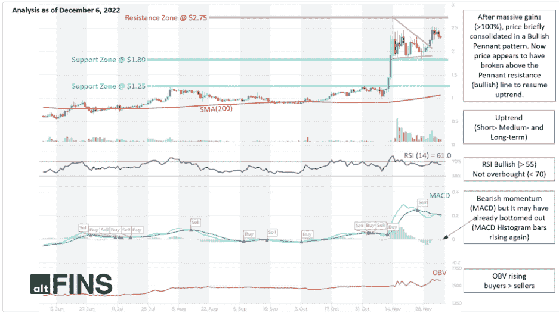
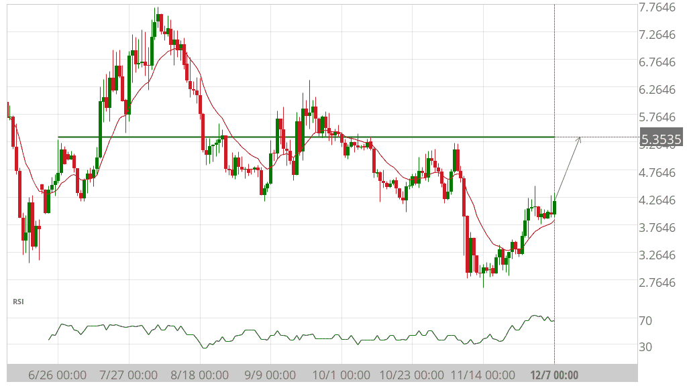
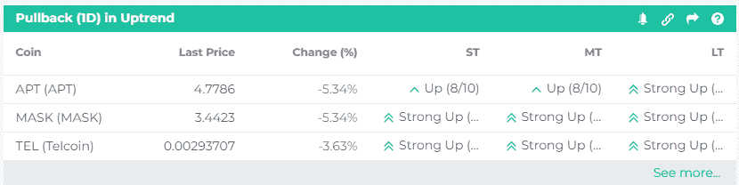
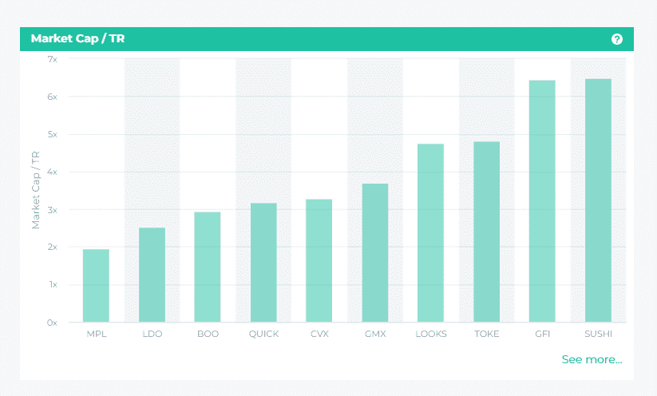

# 今天的加密市场亮点| TA、图表模式、链上分析、研究

> 原文：<https://medium.com/coinmonks/todays-crypto-market-insights-c0a66334a726?source=collection_archive---------21----------------------->

与 altFINS 的每日加密市场要闻保持联系，致力于为您提供可靠和及时的交易和投资提示、突发新闻和加密研究。我们涵盖的主题从交易策略，链上数据分析，新上市和更多！

今天的话题:

*   **TWT(信任钱包令牌):技术分析**
*   **猿(ApeCoin):接近阻力位**
*   **上升趋势中回调(1D)的硬币**
*   **链上数据洞察**
*   **突发新闻&密码事件**
*   **研究报告**

[altFINS.com](https://coincodecap.com/altfins-review)致力于选择最可靠的可用数据和分析，因此您可以专注于重要的事情！

## **1。TWT(信托钱包令牌):技术分析，看涨锦旗**

**交易设置:**在大幅上涨(> 100%)后，价格短暂巩固在一个看涨的三角旗形态中。现在价格似乎已经突破了三角旗阻力(看涨)线，恢复上升趋势，上升到 2.75 美元的阻力区。(设置价格[警报](http://r.email.altfins.com/mk/cl/f/eRgdHBSjGnisheG5vFAScFWPTk0Ohf626BHBx3CIm2HnoVP2UXgE1lWi7dlnPUcpwW907ASJAPt7q7QjWfGX9SzcNx-fMrU-89eI5f_7f1n2BkpPtOeMa_afIH7DSZyz4WAVhCYe55ejfOcri_mcR-_UfAYcOQL_XzbG_3hADWPWAH_W2E6kR1u9HJAKV8iR3c1S7pOHL19oRnv9HIxhfTW_nItgf9X6p0ZNqqqN2iZUhfdiqtbZ-gZvqfdOMfTVweoOxMvWvX0EgUMSy4h5krNi1k3Cuo3Wtj0iuF-NcBDjSvVuMOUcSEJeSGP4CXIM3H3F4Bb1X5_sPUcZ6YnSiiZUnTuKn_AroPEUuu9bQC-TYlYq9cE))。

**形态:**看涨三角旗——通常在大幅上涨后形成，随后是价格的短暂三角形盘整(方向的微小变化)，在之前的上涨趋势(看涨)通常恢复之前。盘整期应有较低的成交量，突破期应有较高的成交量。

**趋势:**所有时间范围内的上升趋势(短期、中期和长期)。

势头是混合的，因为 MACD 线低于 MACD 信号线(看跌)，但 RSI > 55(看涨)。MACD 柱状图的柱线正在上升，这表明动能正在接近另一次上升。

**(论成交量):上升，表示上涨日的成交量大于下跌日的成交量。因此，需求(买方)超过供应(卖方)。**

****支撑和阻力:**最近的支撑区是 1.80 美元，然后是 1.25 美元。最近的阻力区是 2.75 美元。**

**[见技术分析](http://r.email.altfins.com/mk/cl/f/q4BU-CxIbHiGYSoviu283GiMIEVZsDDEBOm4T6WqwC4gZ3ePtFInebPLkCwaDUYIteKcN9-GCA-faBbTHNikkIPZjow6vPsR1GvqIC801EsK5FrreG_h2PnnxZthm8LrJeKhdvWXOm0K7A3RYPe66i6y9AmXvGXaFx9bda0ovlYZ9144W2iUa6pItJ6keF6fBCNFhSLjlgVO2C3HZ8xp17cPHGhnXznvyWSRr9AQSaVOoupTD8iEcqAGwA6fbwyMTECNFQKiCebyG9b2RLKzCjk3NniI_SVVR0CzFjtdLhai0EVit149Ywtq_pwwn_7Y-EBY)**

## ****2。图表模式为 APE (ApeCoin) -****

****接近阻力位****

****

****盈利潜力(买入)+36.03%****

**世界协调时 12 月 7 日 0:00，接近阻力位 5.3535。未来 38 天内，价格可能向阻力位 5.3535 移动。**

**[更多图表模式](http://r.email.altfins.com/mk/cl/f/JnnvoUdYxg_NuqYEPJSsHyWLlZdMYItjDcPG1n8Ap1PfycDKdheK0lUNZmwOJMnJf7Q8Q6acm3zf0McTolYckxGRdSfFIo792J2s10Hy_kzU8Fw9G2-ycXbbHsIav9Vs2eaXFHG7VgbxmEALxzFEByOQJ5XAaxSLn7qI-QMECQHamJ2AHs5CSk8RJfPGPEXQd0zCT0I-K89uNSjv-wYBx9awQO6KE0Tz8LLcnlBbzlVRTpd26Dx-cp8eWcZSEo7-xEZzkbS7Pum3DyJafauIdLfdMRs7v1cZBwucMRTHmkfD34mNlo88I7vYHB718T4)**

## ****3。上升趋势中有回调(1D)的硬币****

****

**这个市场屏幕发现了在过去 24 小时内有回调的上升趋势的硬币(1D)。这是一种趋势跟踪策略。**

**回调通常能提供抓住既定趋势的机会。在早期很难抓住趋势，一旦趋势确立，保守的交易者更喜欢中途跳。即使在上涨趋势中，价格也不会日复一日地直线上升。有时候，价格会盘整、回调，然后恢复上升趋势。这些调整是加入趋势的机会。**

****交易规则:****

1.  **寻找在过去 24 小时内回调的上涨趋势中的硬币(1D)**
2.  **目视检查图表以确定最近的支撑位**
3.  **在支撑位附近买入**

**[更多看涨币](http://r.email.altfins.com/mk/cl/f/Sh1sIbeZMo1auy8rux2vjQ5SURNkWUWnNBVKXlibEYFbHVbmZ65Bi1flWNbJoRrNh7FKFaFBRTV7ivr-rmbzqnMOQyzDPAm09uWlVw8lNeWFnQxiUkuINENQaAOuX_RMqz39gojslxtdAoSXCViY5WXLlabvNgcEmV835UnZnCoDcXxxHs0FmLg0VGQM5Nuywif-4tODNSjiM_ATnuxj0iQbOz9rSge3AiN-4t0B-o8JncwYE1qes1rKA2P3R3A-IIlHH-KxCmR92ipF7SH8pt9pl-esQfOSCrFDBFZ_TZKG)**

## ****4。链上数据洞察-****

****市值/ TR****

****

**市值/总收入(TR)是一个投资指标，包括项目的市值及其在过去 12 个月的总收入。比率越低，投资就越有吸引力，因为这表明其市值可能被低估，因为其市值与其收入实力不匹配。投资者还可以将该估值指标与其他类似项目(同行)进行比较，以确定可能的低估或高估。它帮助投资者和交易者筛选数以千计的代币，只选择那些有增值潜力的代币。**

**[连锁数据](http://r.email.altfins.com/mk/cl/f/_2ZkJRjp0o_jPeFkn9ZcEgxU-e5P_My01udzDZINaM74HGFmvcJAGX7klDFJsWZayqnI3SHHHTVyH7-SYI_O1Zab0rjliFMh3kyKNS94X8WoMAIdZ6-nCTJC8h3iInDrkv1zPU4JTSJqPJ9RqCQXFUGENvLZtyxveqQjEmRjUBk8NbJ-aWD_DRX6sqQ5GqimPNmTLkx5AN2AqkDW5bXptDxSC1-bs49HXwhl_WttEAl7JHMVc1-Au0HF1fXEog6flYq_elEWcUs_6YcMQ1NPHeR5cfIq-ZZwcP79IJVAGAwico2BcGTh0CLcV4ogoQ)**

## ****5。突发新闻和事件****

****突发新闻:****

*   **[Chainlink 推出 staking 来提高 oracle 服务的安全性](http://r.email.altfins.com/mk/cl/f/mB-OBbxNpiedKu0xGc9lHIXzeFvOCffcVk30XNfYIaOnC7hRvN7G-1cUiYQog90WSmV8LSkoV7fIHbgrHTR522P6_z8xsOUMCR613gCGd187m46fn80rg1Pkr888WRBX5rHxkR2YrvUw--K3qfmE5U7ZzCDF9KO6USddTAM5KTqsW2lOG9E76pxJGBy4bCdM4BJvyqi9VBOSkWQG7Vx-uDivRgwT9JMNiEW10AeNnnmnLeAR9Vi6y-LYtvUBhLPnZNULXYJUh_loDojRoSDq-WASMyEhSZQcaWJQFm8fGJKJp7l1gMSL-bMya5S-cmXBr3MnbOi-DYRmG3djmvQvRuVgjS5ESZPROoYJ82q-hkCUuGVPESI-Gc00pq3fdyUVAycOBHIigj01rStvWgcgN_SF2tM)**
*   **[SushiSwap 负责人表示，DEX 只剩下 1.5 年的国债期限了](http://r.email.altfins.com/mk/cl/f/KCPuwIT-bzFkYAnZFB_CEtc8Y5aebyYSPXeRuCNWStjkxcFvt8CbgP2p8tZmJoYdWCREYkf421M_5On44YZjSMcnJoOcng5vyAiNJGgwpaHvj0qXna7nrtX9Umbr825VG3odmsWoUGvN6A9Kb_Bj6NpbdYUOjlyInbSl_17h7x5UwnyLbZo_5Glg9siQiy67b9SORrMXpqTIY2hdgPxo8Zi4aR35LtMiEBlObLV_8gJsN3S5Im7cydxAtsQrdL3b30NUye58qUfQYkSyLECGtgMs66bjQ-EYxyMGHx_pXCkLsZ4FNso05mSqJp9FhpprRQt_eRi2p0ab-m2S_v9h7TE3FBVRgukys9HJiiq7HnWVyp-UHySIQhCmQXvKsRL-kLbyZotnemnHowHzMYGeZQ)**
*   **[随着对 Terraform dump 权利主张的争议增加，3AC 发出传票](http://r.email.altfins.com/mk/cl/f/vmy9Ob0yd0OQKYaxLJ2sSfDeFsD19hinRvXLzmSfokffoOcS9Q6bMk-BYSCsdV9PEAjSUkJrBntQa67J5gTR78HS1Pp71vjLlqch0pqjidE16_BpM6J3bP2s_dA8sf8zP7hVdzARS80NuIivqt8SOwCCNWTpJW7D7OfLDE0M1p3vaYQ9QxaQUfkll4l4PjCeCQ86MFBqmKHC4oBytaUCZKeODVkDEsZeodQ2RZv2e7aCOjNgoNXER3YH8SPUXpUqDqyzdIxqwkS4DLD7WBZyAob347SqS4GCb2GIaQ64bNq9NG3zNWI4sr5utZfiLyF3yu7oT2s02Y26shtjQLTqSCpJb_uxjqz_mFBxMWBBLzX9CIDTUMI7smV5_-jWV5ZmUpE__Omx1iKquJbcnAvrUH8)**
*   **[AVAX 可能见证了一次中断的反弹，尽管雪崩打开了它的大门……](http://r.email.altfins.com/mk/cl/f/AgAMJIqPvLE2fk5RtYbRK9cO9j60b0P6MSB-4ankiZoqqSZnt5vR5ZlL3SFN4gaxD7EjdOTpShwoXwVosEMDLV7vgTqnpPcclODKEO0WOkScy6Ta2Hse08lyAjhh_GWkiRLIaiyv1zaeHw41DV8ThcutcAgGYNTl7sv6fEe6QyeG4uvXwAYhEiEtb3KcIZOHmIuVcG1XskTjwW901kBx0HUep51URIT4GjlPyOajide-NevvQ-MXRX0x9V_nLt4gagekePmLYXwjczQNLDOdOZRyt45BNkCba7UQ_pzhtR6t8iZI9oaINNxjvHb9pt0UdYeQtQFwE7WltxJeQ1R6nwgD6u7S8EYw-Q-43Vzk3H7y1BFWdvsiXjZNP9rZieondpGghniKmDDvlWDkDJFVdTQNjlIbkg)**

****发布会:****

*   **2022 年 9 月 12 日:12 月 9 日至 10 日在爱沙尼亚纳尔瓦举办的 W3N 区块链。**

****发布:****

*   **2022 年 13 月 12 日:“Shockwave Omega SCRT(秘密)”我们的第三次也是最后一次 Shockwave mainnet 升级用 Wasm3 替换了我们的 WebAssembly 引擎，提高了 dApp 性能，并为我们做好了准备……”**

**[新闻&事件](http://r.email.altfins.com/mk/cl/f/mHAfcJdeTsQ3-XWOrciBcQFL_ETjYDBHfT5o8huBO0alJAqPTAjrJRQYjhhtl_tYbexpcTxgBKc-YTpJq3krCKwtRnE72HQpGvS2xBVvcCvatZjZU_o765CaVgLF3k1FeRUsDXlJ29URF59AreL8qJCuR-V2dNlaCMktV0Uqi_vL0peF5B5G4iszeij3CfMtmMiAXUqLdvf1ObCeP5bqebu8prouHdizqn-Q-CI_jfFjvs6Cjr1A5qk4G_5QMGaj5bZvgQridYXlnzbzsGOqwZezLH7eCEwjYxpI8PQggkgIYHA3Plbi9hqyzXyzFqBD_Q1b5psNfQ)**

****

****6。研究报告****

**[**1。资产报告 2022 年 11 月**](http://r.email.altfins.com/mk/cl/f/oA_mULAo2nIq8c4H9BW60YQ2hXI5uffrMnSidKhVYak4pFUShnfGOD_hbhj2LZht67sbIAOvkEg1WIfilJEI8zP0u-RTef7yfTQh9hLqbcai4akfPFe3jQnDX3o-UsN-clkAP98IMcOvaELPOSgD4g6OPfcRrqi_h_INAtL0Sv6bQ4IsCTwP5E-KRGgC6Mia7Hq9RTkmkcK8_jjXK_HpcBvGfnwhfZb87zgTA0w9-S4IbLC1Z-ItEsst_cvSA12p3ftxU5XkLFNS-upUrp56Fz5nQYP_yb0n7boUFrhEqS384KhGuXR6b_1tOFgShmQF_w0hDNyq_25BMWggN9wMBYRH_qxVUyX_C2AR3vZ2AMI)**

****总结:**11 月，比特币录得有史以来最大规模的交易所资金流出，净流出 91557 BTC。自 FTX 事件以来，由于市场参与者希望保护自己的资金，集中交易市场出现了一系列资金外流。11 月，BTC 和瑞士联邦理工学院的股价大幅下跌，21 日和 23 日分别跌至 15480 美元和 1074 美元。这对 BTC 来说是一年来的低点，而 ETH 则保持在 2022 年 6 月的低点上方，显示出相对的弹性。**

**[**2。加密基金调查 2022**](http://r.email.altfins.com/mk/cl/f/ZprOEBO31Rdrc7UC9ZBxUTOf4nSzVHlDxykAf0y_5Ins7B3kBf2f5MzF5S8mKT3JdigFUxS8UBU0r2yeTB20cnsTM8hHMrxtTXYoAiiSmZeMn4ZR2PqzS09toc1Jhg7xIPUHJ6Ng312mLyhRqU_X5zVtmd5vXr7BZXaCdPLuBoBn4EDXjO0oQ55IvC1inphKF94xP3THUtEo9BNtdGAoopW12RZSlFUOWJjXb8K-9F2jLTu_8SMJWwRSIYtoBXnbUiUsXF6CE5fVT4iT1f9woiUGhZhGN3Ytfpt1KbKiMxEUsqJa1IPg1pPh1ITroSIaQec2SC3Q5B1qboOzg6NvkhAreGEeK_3o3JE1IKA)**

****总结:** 82%的基金预计今年管理的资产将增加。超过 1/4 的基金预计比特币将在明年夏天达到历史最高水平。2/3 的加密基金认为监管将有助于增强对该领域的信心。90%的基金认为，未来五年内，大多数基金会和捐赠基金的投资组合中都会有密码。**

**[研究中心](http://r.email.altfins.com/mk/cl/f/4zt_mshoRxBZlU5oXNDDDrbcqTg7CTifzpGR4kP3r9TYHmbZ8fEq6n3z6Rs_130TWik_Fk-XTwvnWJrEhEAgLCpQFkgCuBxhqsiX-hwYilMS82IDdjXGEgV4qrydM4aqzPkkJ_LsQ2tUshyKmxohqknIxFJLE1_cxw-4Fmm4K6DS44EjYF5u6C5uId7qLymEqQjQgcgDwlrySERrVX9Joq9nyyWEmEGm_uLVPa7nsszuTsERcpJ8ED1gXATv2ffYtdlgrgPCBhxWNlYVygszfUxgyEP2RxYLUbNXtIUKKHpazRLXeQyBfq1AGKUN2_BO)**

****

****电报****

**加入活跃的加密爱好者和投资者的社区。**

**[关注我们](http://r.email.altfins.com/mk/cl/f/qeXNzO1ZYdKy-lkvN39bB1wcIYipGChTcFdrxcwVaES5197feow8vmy658epeibk36m3-ELumgdc39BOVSeuSBZANQ04vnN_dzcGUQhrtxOkBjPSqpjpJJG19QAtHPwWeGKMJLGZwWYdLhU5Lwo2YbLlNz9k7LvaLFUNlFG63NysqB905Mmd7humjXebRHQ3PdwoSemj02zEzuuI9qN9SXtNNnrq3YZsxhb5BYmxUJ8htT36UZopUjqcRSWlJdXekQPfUgUPY-mSj1NvS9e3rY52RX8QPVfTcqx6o0_WKMz-oK2z6GJtvV3InbnkEg)**

****推特****

**掌握加密市场洞察和突发加密新闻。**

**[关注我们](http://r.email.altfins.com/mk/cl/f/OBFe6I8be79dzeF8JHQwQOVxVi1anh5vfvu-Q7ffQ-2D1ZC1-EP0aBDOJWmzqcw0jtMqng771zrTi1kJ8g-4RJTzd9PoLQq4DaXK4CCSPmtddxRvuKaXiT5AIZifVv_abiQw3_cvHb8qjf4BXVw_7orpLDIIYLC93idWwFrCBQPOe1GMvFCxUUemWh1iqyYjGeghRLaosIOuubceHB1buv44OsBdTQk3qE1nSRtWASwu-aZ3rlliTSU2EchJCnSV-I_SuajrMmMJ1A_u2bV8CAkUrWRX9SZKcURyct48-aRLTYzGc-LB2CX8)**

****不和谐****

**学习和讨论另类投资、加密交易和投资。**

**[关注我们](http://r.email.altfins.com/mk/cl/f/4_cx0lbtd2PQp4UzbRuh9vKQ2X6rn3z4_K56WwqmRw-P2ZDskBCWbklhXAAkgA5MGvcNzU68KxQS6sRym_PRcUeUKkzB5EGC3jZOCxY9vsyczmuyqimI4v9MvfXNVdkSHAB_gwqofgR1JUjvp4Bzdig6XbPrjlzqLwrwo5FtnwMVTEBBmAUmpr73L8z2Iwgout1WoYKCYlnzUHHNE0GXdsrfb1lQsGk_L8j5sJ1KfDzQ_3kDh54LeXPEA4UP4zsVXiAfjpuCIM4c0sGPxKxzlXNB8zkPYcJ5dWDlwHG-q85WgRI07Q)**

> **交易新手？试试[加密交易机器人](/coinmonks/crypto-trading-bot-c2ffce8acb2a)或者[复制交易](/coinmonks/top-10-crypto-copy-trading-platforms-for-beginners-d0c37c7d698c)**
> 
> **加入 Coinmonks [电报频道](https://t.me/coincodecap)和 [Youtube 频道](https://www.youtube.com/c/coinmonks/videos)获取每日[加密新闻](http://coincodecap.com/)**

## **另外，阅读**

*   **[复制交易](/coinmonks/top-10-crypto-copy-trading-platforms-for-beginners-d0c37c7d698c) | [加密税务软件](/coinmonks/crypto-tax-software-ed4b4810e338)**
*   **[网格交易](https://coincodecap.com/grid-trading) | [加密硬件钱包](/coinmonks/the-best-cryptocurrency-hardware-wallets-of-2020-e28b1c124069)**
*   **[密码电报信号](/coinmonks/top-3-telegram-channels-for-crypto-traders-in-2021-8385f4411ff4) | [密码交易机器人](/coinmonks/crypto-trading-bot-c2ffce8acb2a)**
*   **[最佳加密交易所](/coinmonks/crypto-exchange-dd2f9d6f3769) | [印度最佳加密交易所](/coinmonks/bitcoin-exchange-in-india-7f1fe79715c9)**