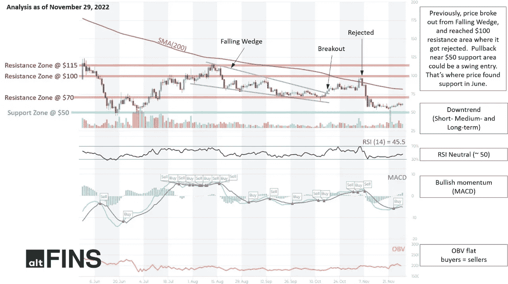
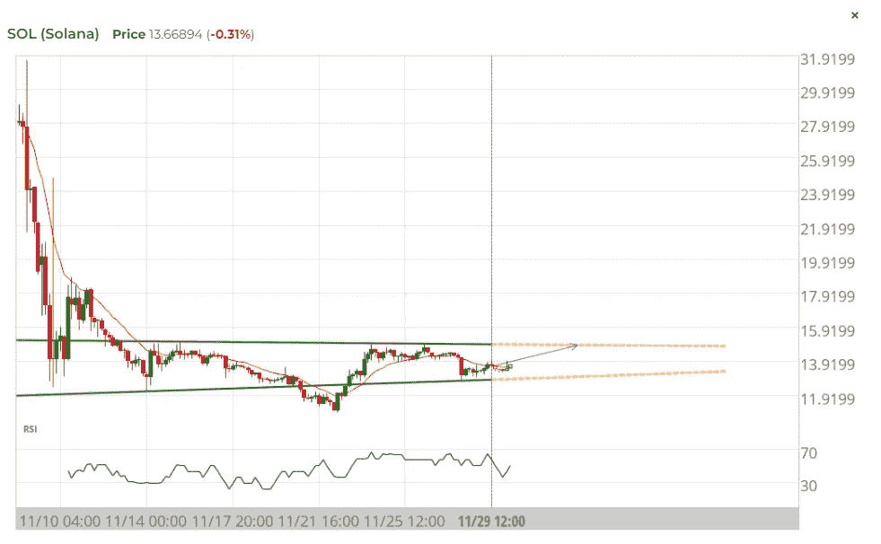
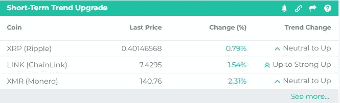
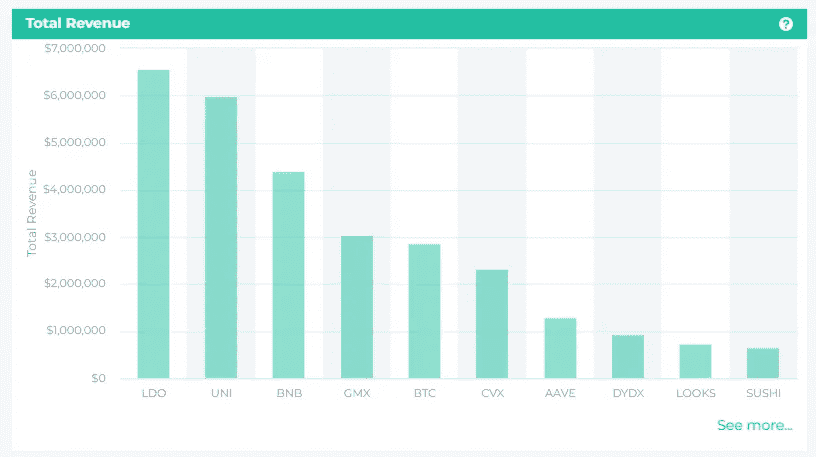
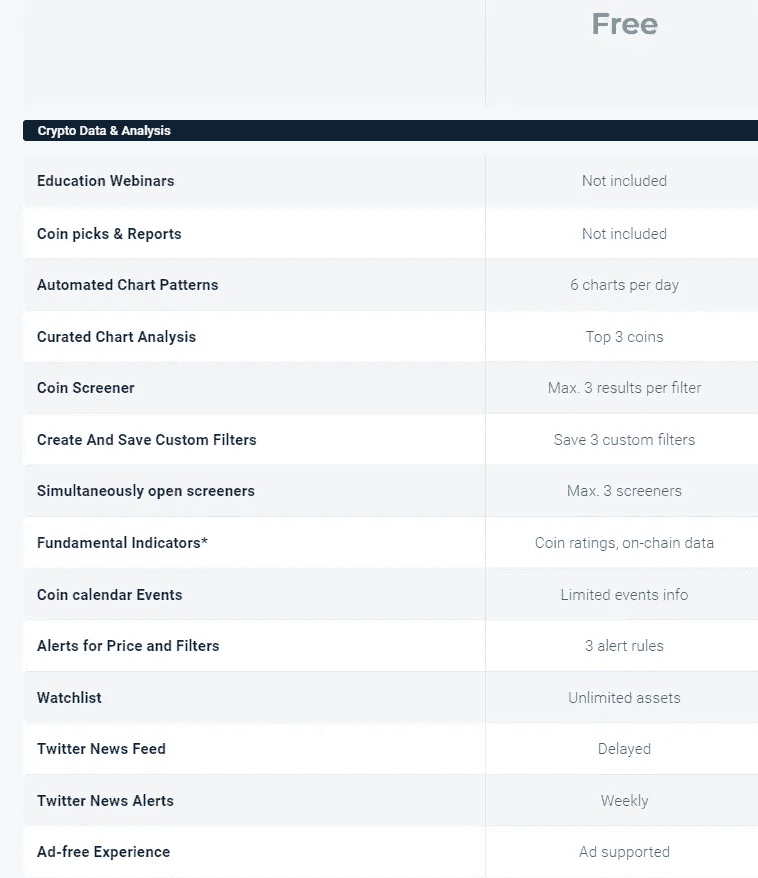
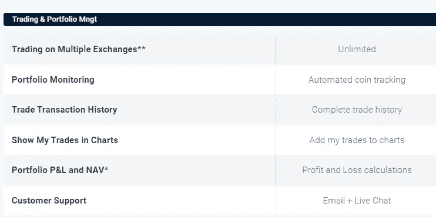

# 当今的密码市场洞察

> 原文：<https://medium.com/coinmonks/todays-crypto-market-insights-ede1ac8269f2?source=collection_archive---------43----------------------->

让自己了解 altFINS 的每日加密市场亮点——致力于为您提供关于加密货币领域的**可靠的最新信息。**我们涵盖交易技巧和策略、链上数据分析、新品上市等主题！**今天就注册，获取你在这个瞬息万变的领域取得未来成功所需的所有洞见。**

我们将讨论以下主题:

1.  看涨[技术分析](https://altfins.com/technical-analysis)
2.  [成功率高的图表模式](https://altfins.com/chart-patterns)
3.  [看涨币](https://altfins.com/)
4.  [链上数据](https://altfins.com/on-chain-data)洞察
5.  突发[新闻](https://altfins.com/crypto/news)密码[事件](https://altfins.com/crypto/events)

在 altFINS.com，我们致力于选择最可靠的数据和最精细的分析，因此**您可以专注于重要的事情**！

# 1.看涨技术分析:AAVE，看涨，逼近支撑

Source: [altfins](https://altfins.com/technical-analysis)

交易设置:之前，价格从下跌的楔形中爆发，并到达 100 美元的阻力区，在那里被拒绝。摇摆交易者:在 50 美元支撑区域附近回调可能是一个摇摆进场。这是价格在 6 月份获得支撑的地方。趋势交易者:价格需要突破 70 美元阻力和 200 天移动平均线(~ 80 美元)才能扭转下跌趋势。(设置价格[警报](https://altfins.com/knowledge-base/create-alert-for-cryptocurrencies/))。

趋势:所有时间范围内的下降趋势(短期、中期和长期)。

势头喜忧参半，因为 [MACD](https://altfins.com/knowledge-base/macd-line-and-macd-signal-line/) 线位于 MACD 信号线上方(看涨)，但 RSI ~ 50(中性)。

OBV(平衡成交量):持平，表示上涨日的成交量等于下跌日的成交量。因此，买方的需求和卖方的供应处于平衡状态

支撑和阻力:最近的支撑区域是 50 美元。最近的阻力区是 70 美元(前期支撑)，然后是 100 美元，115 美元。

# **2。成功率高的图表形态——头肩底形态反转的索拉纳**

Source: [altfins](https://altfins.com/chart-patterns)

**逆头肩底:21 小时前**

**盈利潜力** ( **买入** ) + **8.84%**

世界协调时 11 月 29 日 12:00 发现反向头肩。这个格局还在形成过程中。未来 5 天内，价格可能向阻力位 14.8769 移动。

# 3.短期趋势升级的看涨币

Source: [altfins](https://altfins.com/crypto-screener?tab=COINS&eViewType=OVERVIEW&column=MARKET_CAP&timeInterval=60&filters=C%3CR%3Cmdi%2CshortTermScoreString%2CshortTermScoreChangeString%2CUP%2CUPGRADE%3E%3BA%3Cmdi%2CMARKET_CAP%2C5000000.0%2C%3E%3BA%3Cmdi%2CsecurityIdentifierForCoinTypeFilter%2CREGULAR_COIN%2C%3E%3E&desc=true)

这个市场屏幕显示了最近在短期内上升的硬币。基本上，这意味着价格已经开始再次上涨，这里可能正在发生牛市趋势逆转。

# 4.连锁数据洞察-利多总收入超过 Uniswap

Source: [altfins](https://altfins.com/on-chain-data)

总收入(TR)包括流向供应方和议定书国库的总费用。是平台向用户收取的费用总额。供应方收入的例子是流动性提供者(LP)产生的费用。

# 5.突发新闻和秘密事件

*   [巴西将加密作为支付方式合法化](https://decrypt.co/116011/brazil-legalizes-crypto-method-payment)
*   [不到一周时间，比特币巨鲸在 BTC 装载超过 789，000，000 美元:分析公司 Santiment](https://dailyhodl.com/2022/11/30/bitcoin-whales-load-up-over-789000000-in-btc-in-less-than-one-week-analytics-firm-santiment/)
*   [Bitfinex 持有最高限额(USDT 60%)，外汇余额超过 ATH](https://cryptoslate.com/bitfinex-holds-the-highest-amount-of-tetherusdt-at-60/)

**新列表:**

2022 年 1 月 12 日:BitMart 在上午 10:00(UTC)列出了 FUNEX/USDT 对的 Funex (@Funexclub)。
2022 年 1 月 12 日:Phemex 在上午 09:00(UTC)列出了 BPTC/USDT 对的番茄硬币(@ BPTC _ 番茄)。

**空投:**

*   使用新的交叉保证金进行交易，分享 5000 美元空投和 FIFA 神秘 NFTs- [Gate.io](https://www.gate.io/zh/article/28725)
*   [OKLink](https://gleam.io/LvHFC/oklink-monitoring-function-user-survey) 用户调查 USDT 赠品

# 在 altFINS 上注册免费入门计划

## 通过 altFINS.com 的免费启动计划获取强大的见解和数据！今天就释放这一无价资源的潜力—一切都不需要您付出任何代价。现在报名:[**https://altfins.com/login**](https://altfins.com/login)

Source: [altfins](https://altfins.com/login)

> 交易新手？试试[加密交易机器人](/coinmonks/crypto-trading-bot-c2ffce8acb2a)或者[复制交易](/coinmonks/top-10-crypto-copy-trading-platforms-for-beginners-d0c37c7d698c)