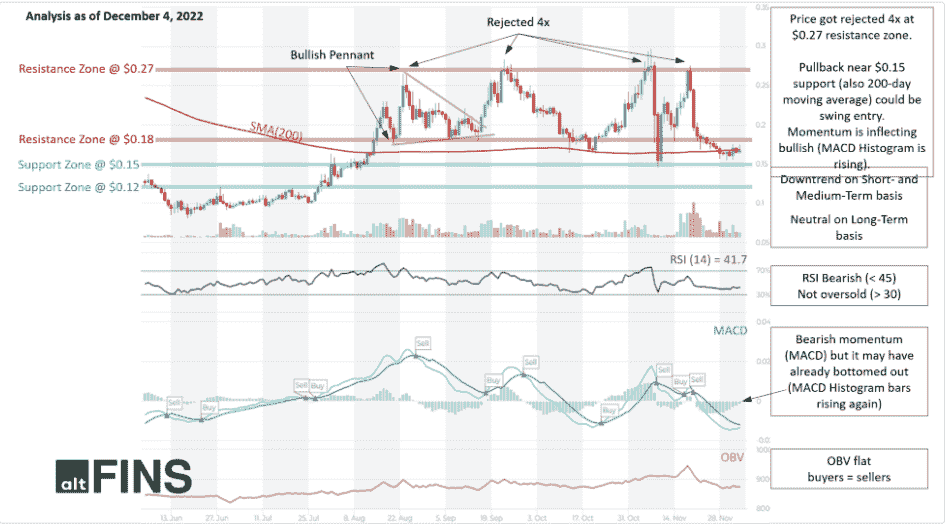
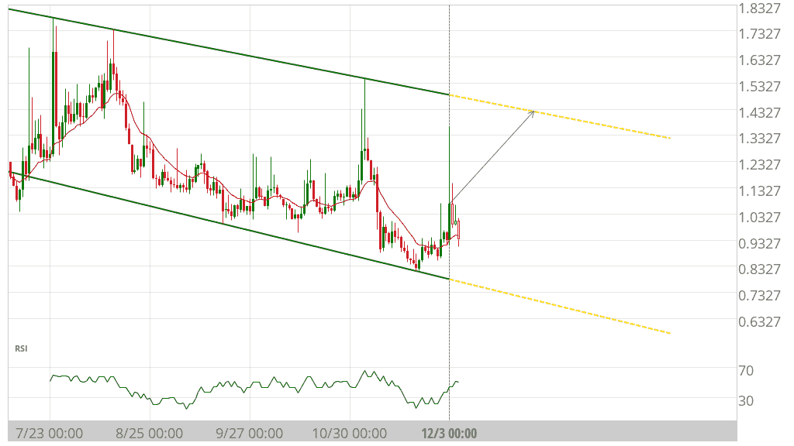
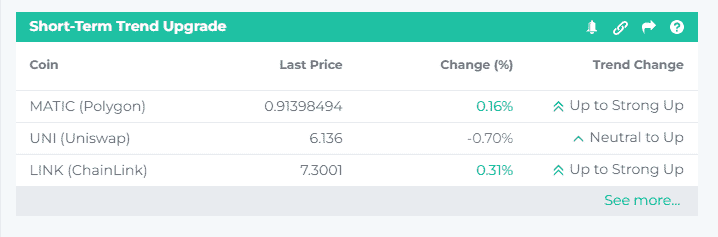
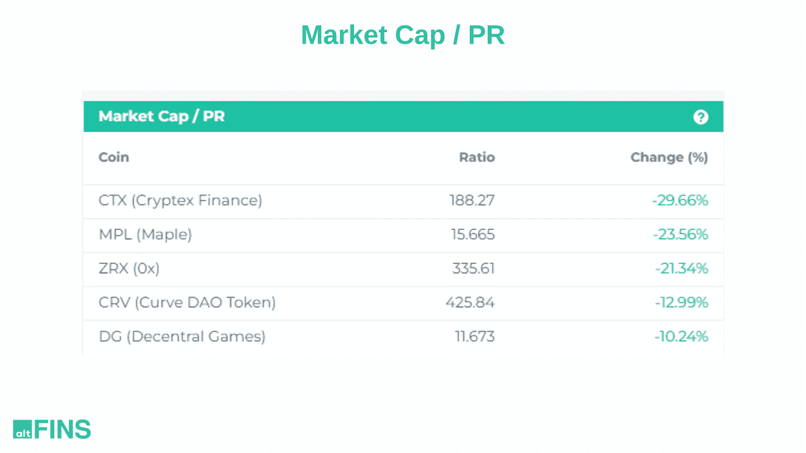

# 今日加密市场提示|图表模式、TA、链上数据、新列表

> 原文：<https://medium.com/coinmonks/todays-crypto-market-tips-chart-pattern-ta-onchain-data-new-listings-c76b5bc2774e?source=collection_archive---------27----------------------->

通过 [altFINS](https://altfins.com/) 了解每日加密市场要闻——致力于为您提供可靠和及时的交易和投资提示、突发新闻和加密研究。我们涵盖的主题从交易策略，链上数据分析，新上市和更多！

今天的话题:

1.  **LTC:技术分析**

**2。ORN(猎户座协议):频道下调**

**3。具有短期强劲上升趋势的硬币**

**4。CTX，ZRX，CRV-链上数据洞察**

**5。突发新闻&密码事件**

altFINS.com 致力于选择最可靠的数据和分析，因此您可以专注于重要的事情！

**1。LTC(莱特币):技术分析**

**交易设置:**价格恢复涨势，突破 75 美元阻力，成交量强劲。下一个主要阻力是 100 美元。势头看涨(MACD 交叉和相对强弱指标> 50)，但没有超买(相对强弱指标< 75)。(设置价格[预警)](http://r.email.altfins.com/mk/cl/f/2MlcRWn4o2QMdmgv-Apx95r92uB9IJQyEttvOym17D2OBNP8Rx6Hp1vvmSVqDF3vtmQPt9QuPXkwUzewlF7g00VfrrhDbwgpXOtM4vjcO8cEB9zGwd9Cj3P4qYx67VNTZLL8MF0fvgBUy5BkKoYRHp4zGFX_ifebwxhTlFh6sN7Wcl4zIP47Sfm3HXByvX7IWQCAUuDMB4SeBRjiI-5uErEzM2pDL9Eomt9g7znI7dor4SwKW4m2VXE_YZ6oWiHqwIBSgHv8yg4mSTYueEAI56eTtjGpXmZtqybUBrd9e7gMhj9LouveCUB4FL4JaRI4i83xtBF_xAgvHtHFI6h_53Z57l2dq6wcw3q-_TY9p0eWR5y9u54)。

**趋势:**所有时间范围内的上升趋势(短期、中期和长期)。

**动能**看涨( [MACD](http://r.email.altfins.com/mk/cl/f/VIMofs2QORnoOD589PKr9xgDz5HZEx-cF0T417miomJzoDs5GPZncQPDH6FBdhWBm-dJQa7QeXWORWMhX-x_uQUSgLT8rp_KPZHKFTJlXpNbJmP4EtN_RQg_KRJYxNqmBuz69zVoU94jdQnA7SguxSSbI58-dKpK-8ox7oDVbcbS2J0dlAZdn30O-HG1l6Cari-4JkYTChMDSXYfLmayDFZ21AeBusUQgqxmaetaDUvUHQsm66Z1-FIZspbQV6uB5swNlfuPJBNOqCa6uckUm7P1SCCPdDUOCj17VFH-xYlYLEumIKbWIWS_ALXXsoLNw6oPme5fE0oOEN3YJM_brd29O5SLrxzwW5OC6PJ2PozdD3g) 线在 MACD 信号线上方，RSI 在 55 上方)。

**OBV** (论平衡成交量):持平，表示上涨日成交量等于下跌日成交量。因此，买方的需求和卖方的供应处于平衡状态。

**支撑和阻力:**最近的支撑区是 60 美元(之前的阻力)，然后是 50 美元。最近的阻力区是 75 美元，它打破了，然后是 100 美元。

[见技术分析](http://r.email.altfins.com/mk/cl/f/sTIGhPmbQP5h4d2f1_tuawje9z7I-rV5Mt0UYCKFKB3JmFV-k_I0VUK1kkkRAOESQXKjcEKPUAtFtLbd38PrVOSfw968NP0M4VpsblwHV4SaTGVJ9O9b4V6ineWTxeZ7E8UXD7uNUEB67cQzK7a43l89NvzvdHz-0Nejew5c_rr3a71CjY77O_G82Puxu9wjfAYCeYYmbcRgKhT0CthB2pvFgu80QjD8-gnry8YduW2GRNx7yQ_lnPWyJE5kfphj2RwJ7mKkSlU7Jh7bgQH4f4cVTpFZ4braXDhOfEFl6nXoJd0-p14KK-rH34Z4kPuy7-y0)

**2。图表模式:**

**ORN(猎户座协议)与频道关闭**

**盈利潜力(买入))+49.92%**

世界协调时 12 月 3 日 0:00 发现频道关闭。未来 33 天内，价格可能向阻力位 1.4257 移动。

[更多图表模式](http://r.email.altfins.com/mk/cl/f/SC0LOrA6ioA0v0ciGtCVMKYAaO25EkfnOOiLy2bjCnE7yVWuLWcJib_TVVul6ELn7pZmumPdJj4WFWg0UxaQ-mW9Si_EqKBvjE23P3EZNZhogcS1F1q-3AzECYXpn9g7SF3gHGkUGpbPreFb5QQ4ofL4Bbyg7W9ysc-a7cnObmtmWnbrZAdT_vQsk1Po_nCggUkmImq_yQE64mt6Jgb_prz5rCVXdXTYIA3azzQgHHrJ356ZvjWL8rGBdQqum7z4UAWJLhPLFhOJayqn-06jPNA_Pz5Wt6vjJeutSuejdn_rCNqNhZL98nPvAXq0kyI)

**3。具有短期强劲上升趋势的硬币**

**短期趋势升级**

这个市场屏幕显示了最近在短期内上升的硬币。基本上，这意味着**价格已经开始再次上涨，这里可能正在发生牛市趋势逆转。**

顺势交易**。新手交易者应该坚持趋势交易策略。俗话说，趋势是你的朋友。这意味着，找到一个上升趋势，并利用它获得潜在的巨大收益。趋势交易之所以有效，是因为价格趋势有持续的趋势。识别趋势是成功的一半。这大大增加了你的获胜概率。**

altFINS 从强劲上涨、上涨、中性、下跌到强劲下跌来识别和评估趋势。

[更多看涨币](http://r.email.altfins.com/mk/cl/f/A3Ks-Mc0P201c0MCwJ-93xkRMDWXo1EFTGNL-3WjmNpRPJVeTOzJlNPGdK4-FRIYFlCcFJplORQFxnqNXidYEzLmTTBHD8RlJWh-mk8u4Ky4Cp5oJIg0DlH-TsZTln4MtfUBD5CunJKGGw8QhjvjAk4id7D4QqmwhxUdrzQxZ0vB4TskaikvQP5Tnvy68ipIFXqq5BOfbdVo3AwKwpSAaIt2TrbWaYusVXRoz3JWrpwLKcJiUODSp-w1YpVNU41cF5uZK2lAsHUq2RaUSo_NGRSP5MVDK-RjzMbYKnae9DdN)

**4。链上数据洞察**

**市值/协议收入(PR)** :价格收入比的 7 天变化，这是一个投资指标，包括项目的市值和过去 12 个月的协议收入。比率越低，投资就越有吸引力，因为这表明相对于同类项目(即 DeFi、DEX、NFT、PFP……)而言，投资可能被低估

[链上数据](http://r.email.altfins.com/mk/cl/f/m0dze4D-8zqje4_cwf7rOxWl6Bl72CR_PfO8jCwh4shENmqAdrF38iKkm1DClyoF1v9xL01auGPj0XNSCO9Rba5bmev_kRyna6xbCy_ylM5xQfzP_xQ9l8E13fZcHGZ74iK8ShxlCfOoO1NRJkPObF0hGxpvv1g7Y_b5GmAk970NGNRtLSAop3TniCzp28gXpWkoPRVNHADLxqupKA3454T6hAKQ-AgZpSlr5dHnCEXFaKRBd4m8OsGI5gbk68rFMZvgsLSM1BvjtCGCNT1K5ve_1vF9L0Z6A1u7fIYz4teapOyhJ1UFKjF_x6RnCg)

**5。突发新闻&密码事件**

*   [排山倒海变得看涨。下面是原因和下一个目标](http://r.email.altfins.com/mk/cl/f/ZI1JtMq_N0Vu-uJpv-s8u2nzXatsZjj1Wurl28WQf8Md3kue2_1C7t4-6nHsAbLxUddwZyiCxjtOdbp0cNe3oHL2w7PGQvmpple2BFBkR5GPTbAvToJ8Y7BrIkSsdLVdx2MFuzGyHO_ituqDV_toFjEZ9o-pzLsU9jUYPuZeh4XJUJ13E7XvL5bYfvC5K2CuFv7Hp3q073UY4Vx79wPxo3Zmt6eChoycGPTJmXkSTcGGsN4A1BGyRQtZddU-8HYXgxt5y5nutuPNTmz9CVEmZmaQm507_NwQxgyHhxyHzfK8yCjM0khWz31lyEpwX8FsX7fLDIjNQjX-OdY1nh6niMPWYSXrzi1Ljf3WFidp8n3MmvTxCYpjSR_7JzwbPhS7P8zYg8rRTtOB0so)
*   加密推特使用新的人工智能聊天机器人来制作交易机器人、博客甚至歌曲
*   [12 月解锁了价值超过 1 亿美元的 1 英寸代币](http://r.email.altfins.com/mk/cl/f/d6rM_1hz0naqgDQZyVF9c9Rb7M1pEQiJ94aXl-vREkF7HqZH89CpLSoLnWe0W8obZFq_LytmgQbgagS6jkKM4Kc_NMuZ9v2Dvx0oz4k9XSfM9H2nBoymdY3_i5e3ca-0opc-nF4ArrQRDjXwhDTeD3obX4FLBEQ5-HVRXzQwDzggii_kHe05B0BDmixWp3jH7qq3ZmG4_NxwIjrOqqOGs9RUhYG1YBNoz0bhlFMNaEW8OGjLXeTcXuN3kQE2unv-PVoWs1DtzhAWYZLn8Kv8GkNQuGvPB0ej5fVep4aaCiMeZrPoqcYQ9hicVjJrX2k-9foQW87YEOMcLvxsCq_PKpVr36ZoHU9KXviW1omo5GGr)

**新列表:**

*   2022 年 10 月 12 日:[XT.COM](http://xt.com/)列出 10 点(UTC)FWC/USDT 对的足球世界社区(@FWCOMMUNITY_Q2T)。
*   2022 年 8 月 12 日:Huobi Global 将 Euro Tether (@Tether_to)与 EURT/USDT 和 EURT/USDD 配对列出。

**空投:**

*   2022 年 12 月 12 日:BIP。我们将#空投花园代币给 BIP 持有者。你的地址里有越多的 bip，你的花园份额就越大。"

> 交易新手？尝试[加密交易机器人](/coinmonks/crypto-trading-bot-c2ffce8acb2a)或[复制交易](/coinmonks/top-10-crypto-copy-trading-platforms-for-beginners-d0c37c7d698c)
> 
> 加入 Coinmonks [电报频道](https://t.me/coincodecap)和 [Youtube 频道](https://www.youtube.com/c/coinmonks/videos)获取每日[加密新闻](http://coincodecap.com/)

## 另外，阅读

*   [复制交易](/coinmonks/top-10-crypto-copy-trading-platforms-for-beginners-d0c37c7d698c) | [加密税务软件](/coinmonks/crypto-tax-software-ed4b4810e338)
*   [网格交易](https://coincodecap.com/grid-trading) | [加密硬件钱包](/coinmonks/the-best-cryptocurrency-hardware-wallets-of-2020-e28b1c124069)
*   [密码电报信号](/coinmonks/top-3-telegram-channels-for-crypto-traders-in-2021-8385f4411ff4) | [密码交易机器人](/coinmonks/crypto-trading-bot-c2ffce8acb2a)
*   [最佳加密交易所](/coinmonks/crypto-exchange-dd2f9d6f3769) | [印度最佳加密交易所](/coinmonks/bitcoin-exchange-in-india-7f1fe79715c9)
*   开发人员的最佳加密 API
*   最佳[密码借贷平台](/coinmonks/top-5-crypto-lending-platforms-in-2020-that-you-need-to-know-a1b675cec3fa)
*   [免费加密信号](/coinmonks/free-crypto-signals-48b25e61a8da) | [加密交易机器人](/coinmonks/crypto-trading-bot-c2ffce8acb2a)
*   [杠杆代币](/coinmonks/leveraged-token-3f5257808b22)终极指南