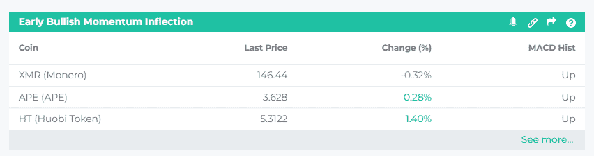
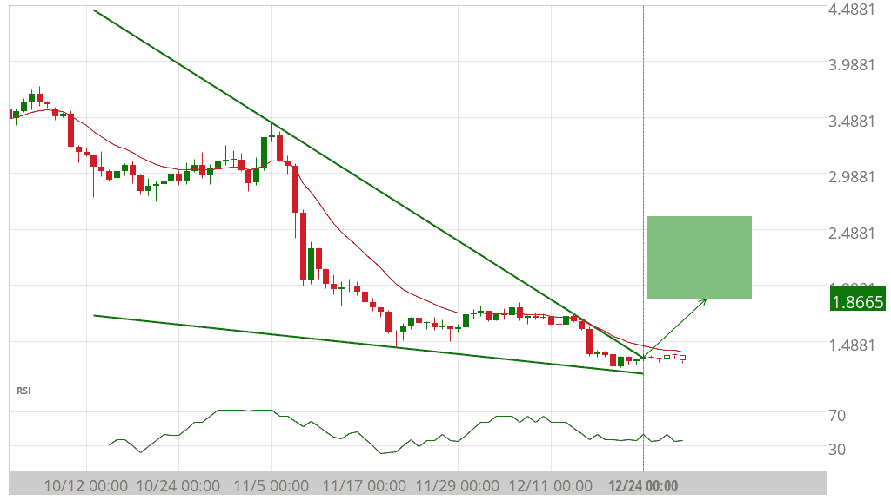
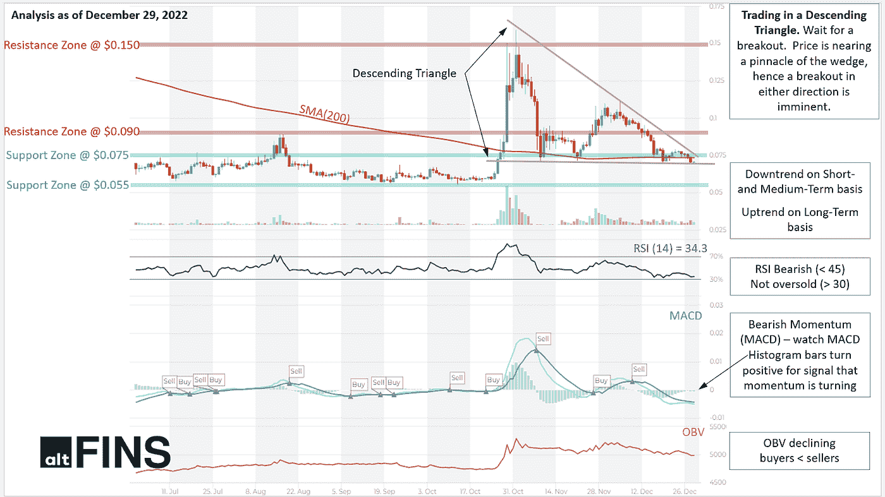

# 今天的加密交易机会

> 原文：<https://medium.com/coinmonks/todays-crypto-trading-opportunities-a20301ed939c?source=collection_archive---------47----------------------->

**Holiday Special — Save 50%**

**具有早期看涨势头拐点的硬币**

[查看更多硬币](http://r.email.altfins.com/mk/cl/f/O-RhBbP17U315cvyxAASyFIH6MWeKLq13pj3tQWbkuI9XOEcdXuZIJ4MxJ48ADweKRxdILDp_vji28ilD2bDsGhLRhPfDo-rCsmPRaRJnyRBVDrN4TT_IC8N3-CtMfSUScLkoEgfEeYih_cgu3uvcN6p5EyHVblWj_9_3s_A4DUs_fX-dYoQ5P-pv0XXk0CbQPi_Zr5L6rBOox-cK3bLLferjw8JaPyPcNZQzMuk5Yfeo3TZgrd3dFMe2-6FaMxCL7M0vge4_u7MANSnbuvBIpetIYcudYKltc0hhBGdTeB5ea8cxt5pmg-dMRrtblwtCEui8WEmfmodmS5PZ7Eh_ojmwKdI_c8wJncG90J7sb6ESCauSL4u-j2xVD-KBObq89TmGrlluzz2FY1FiIXxCnf-SbaAswwMBYjwFvMtiTLtqdkoHhMxjPI0G62phypiCMZen6yQOgzpznEXLL6gxQTFYu4EuJrhqcSXxh03Es9_3gzYYxw48Xp3F6pgBjtM8u4zhXa89fgo6c4E6dPAwFH65-FeXge85Qjhw9jiUyzUMJBFGl7oMmWxRvGw8aO5YSHj6dLotee2Ztm8-HKfzgj9FZEKO9f7i4HAh6wLB23H82NZWM2PJHNOmmMTjFMyl6N7zTw0JHnwz9ly4TCD6fknOwV5j5J95Crywihiwxk1dtH-mfdot28CGD8OMhIecZkce47NQE1cpmvksysF6qvoRtBKsk4OWBI_qiXNz6DkpTjoTF1gANyB8Hc2nW8e-fwfZyqy7p8EOz3nqfVzKt7AflkOVNvDkV1lrIP4k9LL3PWb0wy-kME)

不管趋势方向如何(上升趋势或下降趋势)，价格都会上下波动。这些波动可以被 MACD 捕捉到，这是一个强有力的趋势和动力指标。

为了检测动量的早期变化， [altFINS](http://r.email.altfins.com/mk/cl/f/w6X1k8nrOiW10nyhMb4tBFkzJdeoboneSs9alO12ZQAKEJCVdSRD5M7AdAVlBYOTXVx16a8fzR5sd37XoIWmsfxMJjKmmFfZ99tZ0VYmYYCuekYkZ9lTVqatirBjqEiSvbFVX9XfGhPG3_KjQYu_dnz8JO6_VdVUyQft22tOIAlFxD09mlmp3NfZiBh5hsd9FQnB-uKMzFnIwpOy8hEL46602WthyIiIfwnQ42Hoi6OhkjSEoygg6WJNjEgUj9XTu4QLFDi15KXtABquZLyrS8q4hKq1lhLYlw) 利用了 MACD 直方图的变化。

> 交易新手？在[最佳加密交易](/coinmonks/crypto-exchange-dd2f9d6f3769)上尝试[加密交易机器人](/coinmonks/crypto-trading-bot-c2ffce8acb2a)或[复制交易](/coinmonks/top-10-crypto-copy-trading-platforms-for-beginners-d0c37c7d698c)

这个市场屏幕显示了价格从下跌转向上涨的硬币(看涨势头拐点)。

交易规则:

*   **购买 MACD 柱状图中上涨的硬币。**
*   **当 MACD 直方图开始下降(向下摆动)时卖出。**

你有兴趣了解这个交易策略吗？

*   在[文章](http://r.email.altfins.com/mk/cl/f/ZpB1Aob9m_LLlLvL577gQ43fW8hSbwwgd4T847I2cUGuuT2qNxOevppaZUMFJ7HthwirkX3hSJslUPj36McdYMgzNNW6eZ8Zjcr94HOhYM5BEHQyT5oXFet80NVOCGQcxxPjpYHS8d2EzoLjHxH__tZtPQN08n0kqgevZJH4I2s9Q1bYjtnePWnh1eYEtFujnqcH--bwL3q0UjV5jRTumQHAqLiF1KEX-XjjWwW0ed1cjRlcYbt4JUYcf-XG8iVhfZ4-rPr-KTeRLK1C6cyZ10qO-EtGx5dmubxZPlh4eJrqR3I016aCXImzt_YR24-sRx1ZcoHDfuvAlA1lGQa04bc-PXUhonW2Ua8GUTOpBtKghSU)中学习如何检测早期动量变化。
*   观看加密交易课程第四课的[摘录](http://r.email.altfins.com/mk/cl/f/Eud9MK44YjhAKZAbqj2z3F8zf_7YpjnbbiBn-8J3_Wzv07xFO0pluToCDczQhQMozQkc36uQxNKtLv9mcgeAqIBwkadxTNOjZ3YyVrVIpSuZzaaNYEZb5NnhhDXKFWSpq3NyurAmh5SfH2ZiPB4sN6xKy8-HPDNIDf8QeuhGVAY_b6yJB1lXfIfVxg2HXjFUXenAdUnRuiLBlien2nLa6A3vIVBzVjPKEwzbgA5N2v_58GJaTaUUp8VQR0v8Ozx4VAUGjIQ36dRQ0guotB5-A6ff7f-t0cQmKpOlY1c035XCrCKV8dgFbWFessSzn2m0L1iI_i0UYC6MwJx1cRKFzAnyqp_-IKYBayXmCb4)。
*   观看[教程](http://r.email.altfins.com/mk/cl/f/g1MjNoXIxSpFXgEeOQakRoYpKdIJ1L1MuZQl106rQjwFTHbLzj54N1kiqbIpw8LQBVKCuT6qR4YVS9nmjbSoJyhZr9QQ_PFg4T8QMOM25C0LXXOwxsnH0FjlA1vQGtt6YQ8K7exOYH7SU9stIPeeJYsLk5YS21_k1YNd_wolbc2SfrDr0K8ouwIjLfmSYhW3V0w43MaXhKiYU-gCg00sXsOAUDHT3aHnzRzUcHHT4G7UVL1wI3688AVy86HPCmxZHcoPbPBkZz428bw6vSIP6k_ErdKYjyk_gmTu0LYDs9ox)视频:检测早期动能(MACD 柱状图)看涨或看跌拐点

## **你准备好迎接 2023 年的加密交易机会了吗？**

**借助 altFINS，让 2023 年成为更智能、数据驱动的投资年。现在所有年度计划均享受 50%的折扣。**

**访问:**

*   [**图表模式**](http://r.email.altfins.com/mk/cl/f/37d3CXxGx1Lz2tw5dkBdmjHwcORPHoy-WDPrZFdtVAWtMzeDaBTqO3YnnEe9hE112cYemCePr5JaaBRL9jABDSJeNMpyPd7fQQTDPK4OvtZaxb1-RhFi1rQwk1L37KPMzau7spBl-PUg1BxM-74Wq3B_XWMUAnhDMZyoSUDzkD83wHZFLo8vehSa_ohE8Qn29OD9COEnolY1wEgws_XviIv5cA17sV4w6JR0hZYXxFyaWGERi26cfuVWzmKqnYeaeG5BfEOExPElDNj984bXs8z8avIZB_jV_0Q4WUZ_96ydEoAEnFT9)
*   [**交易信号汇总**](http://r.email.altfins.com/mk/cl/f/--Bvs2L_JDOIvmgfWgcWGiVKF0hANcpeRXsVxb1rrby4SHHInW2KkcSnBorKGblsrY--SKlmLxxZ7UaLld44x6b5SfHvw-0yl3vAHB_PgF9P60Pi5AHD9FsCRKKfo86fBfR9nkoHIyy_lwiGUVsBhCXWdPg_UQ-jfl1Suv4tALbwdtqnjVIpNPTDG8HIngB20Q-mj589ngIhNfR_4JB_9iHH7a09O--TU0XqlljifdwjjLGO0W5P3jKg2ngU1VAQHl_Ay_ftOPh24ozgekDeqNa4z9kPtmQI1eOwpQtaaPqx-jLPT8aenw)
*   [**技术分析**](http://r.email.altfins.com/mk/cl/f/-ucwQEK80OovumvJaL758qMSOswPNgXafVA-GUXCXN8Ryte9zSUKENyKY8GJc1a_rAsFsMKKQt815H_1EiaVqFN_2Liyu2OyYeg55Iu6bKtbNiJGdWt4Wc5SLhZLPmUP5fQiQfJq672JC58CRVFVye_NaFuaU268D9hQOQWoq9l4pAc1qqNv-2DOgT8xtEgCD_vOVuU77FAEMdVvtUau8HDWyA5QAaz-z6aa81v3pUgBEbD1Hyk2Ou-xiPlz1BJrBSlpGKmjpx0LRookFwZqzFSEcwZa00vWby0l1eNyTtC85DRI8RGLhjY-hQ)
*   [**硬币镐**](http://r.email.altfins.com/mk/cl/f/paz76GrS2_I3EzZzzx6njB1Av2maYwi3d3dSLq2rDCI097u74jTTVpFx-_R1gUbUs8CcBTerMI8Uqn8o9e-vUBDZt2p8LCONvUHqwVko2Ej9m1auRdZj_wVtr5887V1u85X_tZiyNEfbEj7LzO3iZSn2TCjYhGQgIjNs3SIBWOAiI3ubhTghKdRMMhwJIyuJyCofmSIozOEl-dg_FuQMiLcTj5dFX9x8m3OL91FaKeCd2rKzVmRIR53UOF_uh3IP4cAUESWNXECUHU_fxVT9C1XoLSesvIo_-dzdzS3qN21ibP2wGYyeGsUhaPESqQ)
*   [**密码交易教育**](http://r.email.altfins.com/mk/cl/f/d8DytQXWnu7Y4v4oR93kFkqAfcKhFoppKJ6uJLYkbHBlLEyN4MXjLgjmk7FTYF7UEcQqnoqXawG_Uh1gfHXhyqcwnb1eAyaQqLplMqsHBcCYNuPTokDG6GWDJFIYXeH9smf_rv83_UGu03akHvoynqK8dIyaaFvEFpQZj8O3q66Kd_RpQBp-ahU1RogXft6eAZe1PzaLBKK1IFNM8DNgp-PeceOWb4AGy8d87g_c--ye6pfObquzYc8xKOfyKPtRCc-quWUzTOTUIPhFLZMYwv8DxjQrdFBlj0_2J8paj7GyudFP_1AHGUahw7P3_J5euv26Tw) 等等…

[认领特价](http://r.email.altfins.com/mk/cl/f/U8U_VrzonThRR3kCIbYYqy9Fr2xF6rNg921kqY8MrC2VO74j3mMRgJ5PCQS7SNa374apc4il1JclPjpcODih_EFP-RviIhM_L9N2DYfhGepMramQ-QaFT5JcOLAVzkYDBHZZCDilbxcuMTsEAMYCdQHcLk6Uv0PO0Ls3o80dmNiQEHWkWls1EAve3RN5wUJJQm5jFBBND4M2qtBEDH1_YPKp4epCy0u8v8B6JCC0YNooHkT0MRr4_SYDRaixCcID6sbRR8UgUeitC6UparqFDimfLrA82qrEdTUsROV56ajzdZ0sy8_ADDW6JcBA9TFbC6F1)

**Near 协议的图表模式(NEAR)**

[查看更多图表模式](http://r.email.altfins.com/mk/cl/f/gj62ZePidne4rYdi0qnpssvqYK5QZNdBe0WSvOYJXrM45lvTTAIMSI-ttHh5td3zQ3dAbIY3Ax-mbJIOqis9cE-sVgp-o9Mz035PiTpriyvL3DP5Xmb6hawT1_VobdBuXdI5O52WyNg2bO45jIpiNOK_Bluq-rBhWl1lii4lW6Cx37kWrYLjwdGPJDbLDFZ3rBGxxqekrsTVaHHXXwwBaSZMByjhc93E1C5bqXi3c1hp00sCKsipk9uoIaJ4DxGnuvVP3rmDwfCJSIb9Je7g7O1hor_xaxoYQ-u4DNwUM89bhMLkH4yNxg)

**潜在利润(买入)+42.48%**

世界协调时 12 月 24 日 0:00，下跌楔形已经突破阻力线。未来 10 天可能的看涨价格走势预测将向 1.8665 靠拢。

**DOGE coin(DOGE)技术分析**

[查看所有技术分析](http://r.email.altfins.com/mk/cl/f/Eb1vi-haGpiI9VGJCU_X3iaEOCvCFbvb2mlJN9sjrLlyClp_Yg1VmmEOM860HunX0IK_HOGaH3nZD__PxJh1RhQCTJEfJLdric8UY3lxHgLbEcnpsDdll-sB-DB37lFkrb3KjoP5hTXA2YRMcQLuSpEZAIszWBzwKKBvxZrcpePNwIVZMJZb9HMUuUuh6Zk_xhRK-pz9mPL4poI0Px-DYt3coZWl_ZOZLHrZY-bDxi3NijaLjRutBVs_wWfdSqNxDrZ-Y20PtekJYZHR-vigfI0Smce6GEbe19L0QppAvfjKVbbqu_w8QbBJKSo)

交易设置:在下降三角形中交易。等待突破。价格正接近楔形的顶点，因此任何方向的突破都是迫在眉睫的。

形态:价格在下降的三角形形态中交易。通常情况下，突破将发生在现有趋势的方向。一旦价格突破三角形的底线，交易量增加，大多数交易者都会建仓，这时价格应该下跌相当于三角形最宽部分的量。

**突发新闻**

*   [3 commas](http://r.email.altfins.com/mk/cl/f/Nv4h4p83Tperitsbfu5gDNY0dhoVL-cLRAvEPnZKPEVzxPSYjTiSRj1xbp2VkASsksquqjyPfkK0UxkOOzmes6-X2n7A5UevX2nFyyUO8XSsLqAddOo2rqz1xaOfxCJT2oD0BLd850rCBD8Oif1rnP0hS7fqu8z5vYQ1pWCmRbJt61QfIaL9Z2QKIOEWIZI0qs_4suqQx234ygr_QxLOCzt9pQDdCbkj4fYhqeQR-YU0fmHexNIPoEz0toaVC-tOKltzny5dBlmcePEDq4QSIE7uJKVSbl2u3Vcos20DlUBuJDBvi7xejnSo24s4lfZ6vNcxj2n4fKXuaytgTIvEXJzLKOlJM-ZC54RcoPvhUiDPAA)CEO 证实，超过 100，000 个 API 被泄露。
*   索拉纳遭受两位数的损失，还看得见尽头吗？
*   [NFT 市场](http://r.email.altfins.com/mk/cl/f/BCwAi2zpB-D5xknO9vWsbG6VUd6XRKgsx4U7BiyQpVkZ7TBeHr3FhrIlv-djRHQnTVIk8z8rMaT92ykuk1ZCNg5krUaORRc43b8dtMCQOoZ3OKPKcbopbHxedPWlg3olU4bjyrLdi_hVT7xWDvuvDYfZ2rvZhVobNcSdmEv61vCh2gH9dcCvYgie10osim2PXmyrNxMSt3FQZrwO8MmpM1nDWJjAezlvuvasqxXSNxZMbywDkJ2bCuJdLdP7arIiSceicuglPZhRO8tVxksLkciQ1duEGm1eCK7RmxWVYVNjwF6VfSaIJFp9l_bPkIXFBZM7ADIANCplunKk5Z6Muq7xuDM-_7p2VV0duOEL0T7mL9-7SFCrRxIWe0vdi9jSVlXD4kajI-kq)2023 年前的状态检查——NFT 赛季会卷土重来吗
*   阿拉米达的加密钱包正在悄悄地用比特币(BTC)交换资金:链上数据
*   [MicroStrategy](http://r.email.altfins.com/mk/cl/f/xucIzGKg0mtDp4pi0nig6z5Rj55iFXVcip9BYedf4cC3QXifcDyNwPNqdFteGDTTB0ZO23n4p-wYSNK-6YJhIPH_RuZkNoir-B-OqMI7uRT5TeMN70p8TAqZjPZzELsxxbAmku8D70QoQQYME7GWgklUHvJVxPlm4PB5OTUk7jrE-ju9bwFxUA-ck0oA0YN71Z01hY6iu83seNJaE3fKMFoQEaU5dSe3L3FZnuRLFRrBjjT6ruWkimPZu83Nhh0KwD11S2TeJYntmcwmcovTyOt7XkvTMq_QrA1cMtF_TdZD6A98iJ8pyWrzB5JvNG8w5U6njOrGsYeTXyu_-OBK5pK7J3cBQEG2z_gYiDuVjdegxCmSmDqlTAdYZu6r-7cNfwXyd7POeUX9EFMRwSMg0k_I3g) 将于 2023 年推出由 BTC 闪电网络支持的软件应用

[阅读更多加密新闻](http://r.email.altfins.com/mk/cl/f/uC0mLiwp-3osyNcw0VnmQvR1wPfJaMRF_odXmE5OSBCaJTSdWnCHv6_ZfjhPOjMQCJrrTpjInDnx3NNRLaR4-QPVdDMXqnKtJEvH7c7zJ06YX2r_7D25MqstVrqBTq42V1M7zUxfhmiJtKg_trsr7olzRPIdJgub4qwn5bVUb6BwZV4Wd1-b8A-P63UDYZgDWEPy6gORTS1EBsGvV5j_1IT1z3mibnED61GisT4xW-piYcTCx0p5yzXQl2mLjcep8riD4CVbRQaB0zmK_BGHlaYeVJsAnAQZG66zgZgRydrLCsTOC23Q)

> 加入 Coinmonks [电报频道](https://t.me/coincodecap)和 [Youtube 频道](https://www.youtube.com/c/coinmonks/videos)了解加密交易和投资

# 另外，阅读

*   [加密货币储蓄账户](/coinmonks/cryptocurrency-savings-accounts-be3bc0feffbf) | [加密交易机器人](/coinmonks/crypto-trading-bot-c2ffce8acb2a)
*   [BigONE 交易所评论](/coinmonks/bigone-exchange-review-64705d85a1d4) | [CEX。IO 审查](https://coincodecap.com/cex-io-review) | [交换区审查](/coinmonks/swapzone-review-crypto-exchange-data-aggregator-e0ad78e55ed7)
*   [最佳比特币保证金交易](/coinmonks/bitcoin-margin-trading-exchange-bcbfcbf7b8e3) | [比特币保证金交易](https://coincodecap.com/bityard-margin-trading)
*   [加密保证金交易交易所](/coinmonks/crypto-margin-trading-exchanges-428b1f7ad108) | [赚取比特币](/coinmonks/earn-bitcoin-6e8bd3c592d9)
*   [WazirX vs coin dcx vs bit bns](/coinmonks/wazirx-vs-coindcx-vs-bitbns-149f4f19a2f1)|[block fi vs coin loan vs Nexo](/coinmonks/blockfi-vs-coinloan-vs-nexo-cb624635230d)