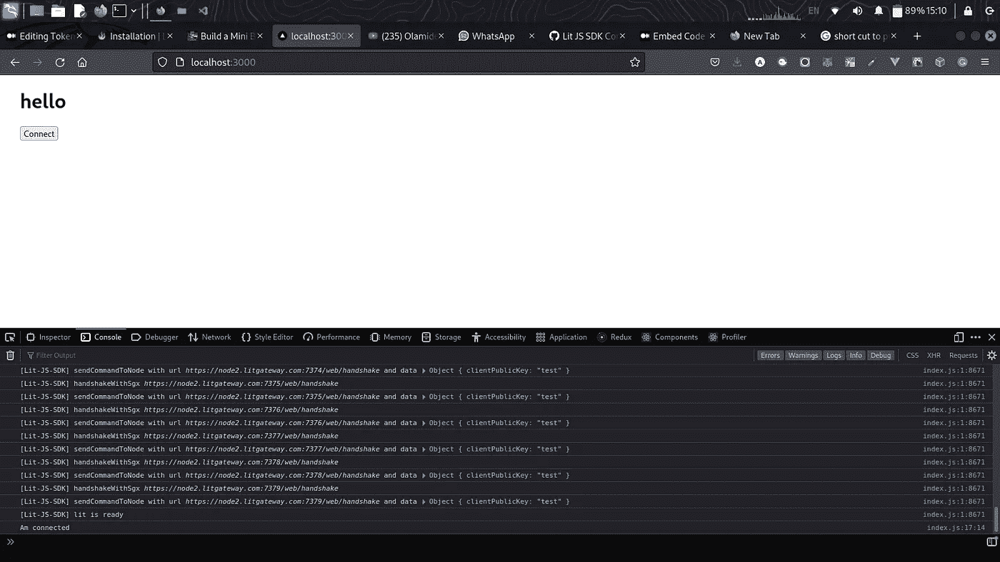

# 基于 Lit 协议的令牌门控

> 原文：<https://medium.com/coinmonks/token-gating-with-lit-protocol-b27ef6141696?source=collection_archive---------7----------------------->

这是文章 B[Lit 协议的入门指南](/@kingzamzon/beginner-guide-to-lit-protocol-b939d7e06672)的延续，以防你错过。在本文中，我将带您了解使用 Lit 协议的令牌选通 URL。


Lit Protocol Homepage at [https://litprotocol.com/](https://litprotocol.com/)

**什么是令牌门控？**
令牌门控是一种**方法，通过要求客户获得特定的 NFT 或令牌数量来控制和限制对独家内容的访问**。简而言之，代币或 NFT 被用作打开特定大门钥匙。

**什么是访问控制条件？**
在 Lit JS SDK 中，访问控制条件是您想要检查的规则，例如，用户拥有多个令牌，用户是 DOA 的成员。[参见此处的示例](https://developer.litprotocol.com/AccessControlConditions/intro)。

**先决条件:**
使用 [OpenZeppelin 向导](/@kingzamzon/token-gating-with-lit-protocol-b27ef6141696)创建一个 EIP 721 智能合约并部署。

**入门**
要开始，我们必须创建一个新的 Next 应用程序，下一个是 react 框架

```
npx create-next-app@latest
```

**安装 Lit 协议 JS SDK**
修改目录进入新创建的下一个项目，下一个默认的 app 名称是 my-app，`cd my-app`

```
yarn add lit-js-sdk
```

现在您应该在 package.json 依赖项中看到`lit-js-sdk`

**将下一个应用程序连接到 Lit 协议**
更新您的`pages/index.js`

让我们使用下面的命令在本地运行 web 应用程序，并在您的浏览器中导航到`[http://localhost:3000](http://localhost:3000)`。

```
npm run dev
```

打开你的浏览器控制台，点击连接按钮，你的浏览器控制台将显示你的应用程序和 Lit 协议之间的交互。如果成功连接。你最后的两个游戏机将是`lit is ready`和`Am Connected`。



如果需要，可能会提示您切换网络，如果成功，它会在您的浏览器控制台中返回签名。

现在我们已经连接了 JS SDK，让我们进入联系我们页面。我们只希望已经获得我们的 NFT 的用户在我们的网站上与我们联系，对于这个演示 NFT 部署在多边形孟买网络:[0x d 65 FD 8e 1 ee 88 b 23 cc 2937 DCE 6323 b 21615737613](https://mumbai.polygonscan.com/address/0xd65fd8e1ee88b23cc2937dce6323b21615737613)

**安装 cookie，js-cookie 和 uuid:**
Lit JS SDK 在握手验证的时候会返回 jwt token，我们会使用 cookie 和 js-cookie 包来存储这个 token。uuid 将用于为访问联系我们路线的用户生成唯一 id。

```
yarn add cookies js-cookie uuid
```

**在您的项目根目录下创建 context.js 文件:**
我们将共享由 uuid 包生成的唯一 ID，用于联系我们页面的唯一标识。

**编辑** `**pages/_app.js**` **:**

**更新** `**pages/index.js**` **:**

C **在 pages 目录下创建** `**contactus.js**` **文件:**

访问 [http://localhost:3000](http://localhost:3000) 点击连接按钮，使用您之前创建的 NFT 的所有者帐户。完成后，在 metamask 上创建另一个帐户并与之连接。祝贺你🎈您只需使用 Lit 协议令牌网关一个 URL。

**资源:**

 [## 安装| Lit 协议开发人员文档

### 您可以使用 Lit 来加密和存储任何静态内容。这可能是一个文件，一个字符串，或者任何不会改变的东西…

developer.litprotocol.com](https://developer.litprotocol.com/docs/ToolsAndExamples/SDKExamples/EncryptAndDecrypt/installation) [](https://github.com/dabit3/nextjs-lit-token-gating) [## GitHub-dabi T3/nextjs-lit-token-gating:使用 Next.js 和 Lit 进行令牌门控的最小示例…

### 这是一个简单的例子，展示了如何通过 getServerSideProps 使用 Lit 协议对 Next.js 页面进行令牌控制。这个令牌…

github.com](https://github.com/dabit3/nextjs-lit-token-gating) 

> 交易新手？尝试[加密交易机器人](/coinmonks/crypto-trading-bot-c2ffce8acb2a)或[复制交易](/coinmonks/top-10-crypto-copy-trading-platforms-for-beginners-d0c37c7d698c)