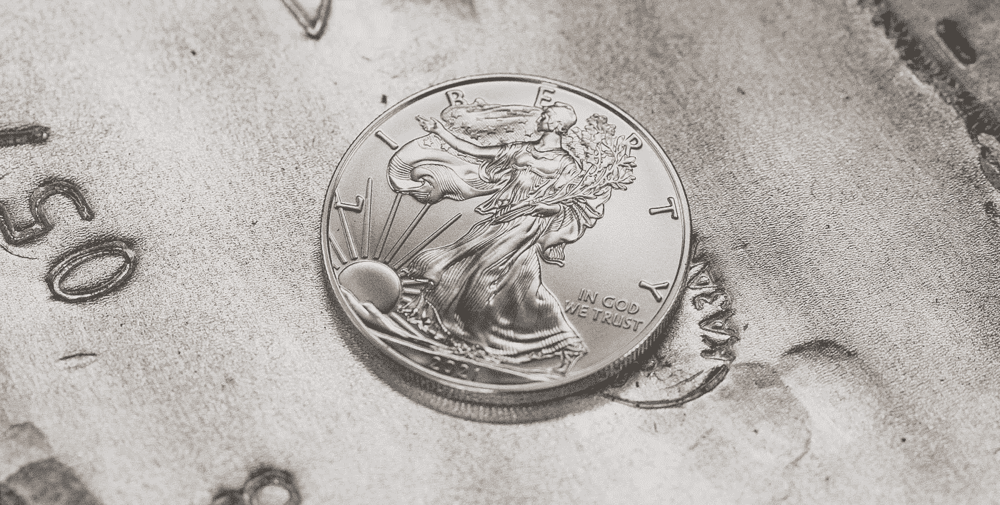
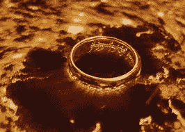

# 令牌生命周期—快速探索

> 原文：<https://medium.com/coinmonks/token-lifecycle-a-quick-exploration-c0b5ea7e82ee?source=collection_archive---------31----------------------->

代币不是数字对象，它们更像是故事的一部分。

Jason Blackeye — [https://unsplash.com/@jeisblack](https://unsplash.com/@jeisblack)

它们被创造、移动、储存和销毁。说到“他们”,我们想到的更多的是看起来像 excel 表格而不是硬币的东西；一行有身份证号码，地址，可能还有州名。

正如我们在 [wallet addresses 文章](/block-magnates/understanding-wallet-addresses-and-keys-6331bf40c6a8)中看到的，当你移动代币时，你实际上并没有移动任何东西，因为钱包不包含数字硬币，而是将代币的权利转移到数据库中的不同地址。

所有这些与令牌的交互都有特定的名称和目的。今天，我们将了解令牌的生命周期，并了解如何使用它们。

## 铸造

代币的铸造就是它的创造。

Scottsdale Mint — [https://unsplash.com/@scottsdalemint](https://unsplash.com/@scottsdalemint)

铸币厂这个词指的是历代传统货币硬币的创造。从这个词而来的习语“在薄荷条件”，这意味着“像新的一样好”。

令牌可以同时创建，也可以在一段时间内逐渐创建，或者完全依赖于外部事件。

例如，在比特币的例子中，代币是通过挖掘过程逐渐铸造出来的。因此，新的比特币只能通过矿工进入市场。

或者，如果我们以 wETH 为例，这些包装的令牌被铸造成在另一个区块链上体现 ETH 的等价物。该代表令牌将在一些 ETH 被标桩后铸造，并且需要被销毁以从合同中释放 ETH。

另一种选择是从一开始就铸造所有的代币，然后逐渐释放它们，例如通过下注奖励。

在所有这些选项中，除了创建令牌之外，还同时进行地址分配。从这个意义上说，铸造是一个两步的过程。

铸造有两种方法:

*   基于推式:铸造影响帐户余额和总供应量。接收机不需要采取任何行动。
*   基于拉的:铸造过程给出铸造权利，而不是直接给令牌。这种方法的一个优点是通过允许在以后铸造管束来减少链条上的应力。

## 发送/接收

如果令牌不可转移，它的整个概念就失去了意义。

如前所述，所述令牌的转移通常只是更新有权移动令牌的地址。

除了能够移动之外，一些令牌还可以嵌入额外的功能，以允许在传输时执行不同的操作。

例如，他们可以累计一笔金额以创建帐户余额，或者他们可以有一个计数器，使他们只能转移一定次数。它们还可以具有触发版税支付或任何其他动作等的功能。

为了更加灵活，这些条件通常写在智能合约中，而不是写在令牌本身中。

## 烧伤

顾名思义，这是破坏阶段。

Mount doom — Lord of the rings

有不同的烧成过程和烧成原因。有些是设计出来的，有些不是——比如燃烧一个稀有的令牌来增加它的稀有性。

我们可以将软烧视为通过将令牌发送到无主地址来伪破坏令牌，使得任何人都不可能重新获得对它的权利。实际上摧毁了它，因为它的有用性是不可及的。

例如，硬烧可以是在可兑现代币被用于解锁基础资产之后完全擦除代币。

烧录操作的另一个用途，直接链接到发送操作，是烧录交易费。这种燃烧被用作货币政策，例如可以缓解通货膨胀。

## 状态的改变

令牌的状态可以是防止令牌被破坏的额外步骤。

对于可兑现令牌的情况，一些协议将令牌的状态更新为“已使用”,而不是从钱包中移除整个令牌，而不是一旦使用就销毁令牌。

许多具有真实世界特权的 NFT 使用这种方法，因为不可替换的令牌本身就有价值。

## 最后的想法

通过这几个选项，可以创建许多不同的场景和特性。

但是令牌的简单生命周期再次向我们展示了区块链的范围和能力是多么具体。

感谢阅读。

> 交易新手？试试[加密交易机器人](/coinmonks/crypto-trading-bot-c2ffce8acb2a)或者[复制交易](/coinmonks/top-10-crypto-copy-trading-platforms-for-beginners-d0c37c7d698c)