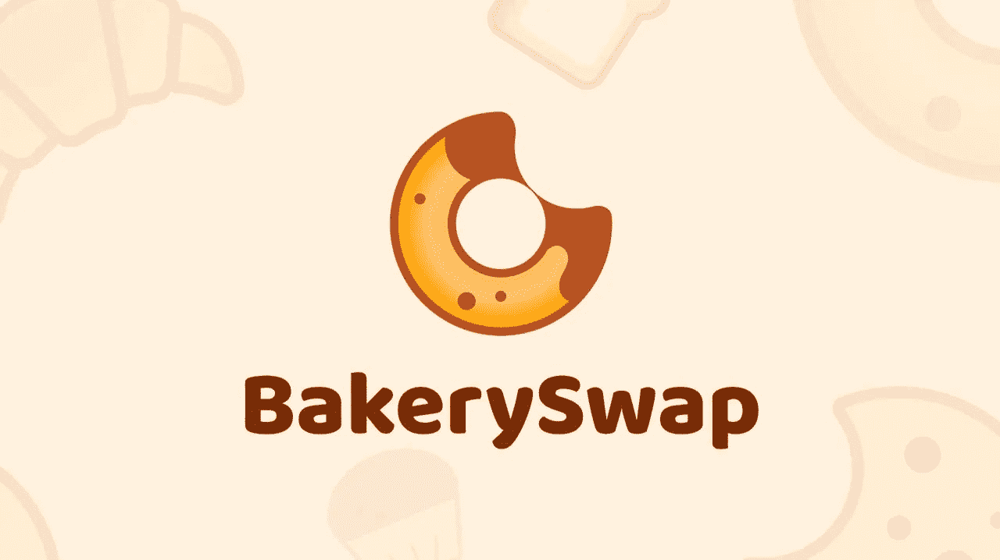

# 代币评论:BakerySwap(烘焙)

> 原文：<https://medium.com/coinmonks/token-review-bakeryswap-bake-ca537417f5e0?source=collection_archive---------9----------------------->

今天我们就来聊聊: **BakerySwap(烘焙)**！

**概述**

什么是 BakerySwap？

BakerySwap **是一个 DeFi 协议，允许不需要订单簿的交易。它是一个分散的加密货币交易所(DEX)，使用自动做市商(AMM)** 。它运行在币安智能链上，为币安提供强大的功能。交换有助于…