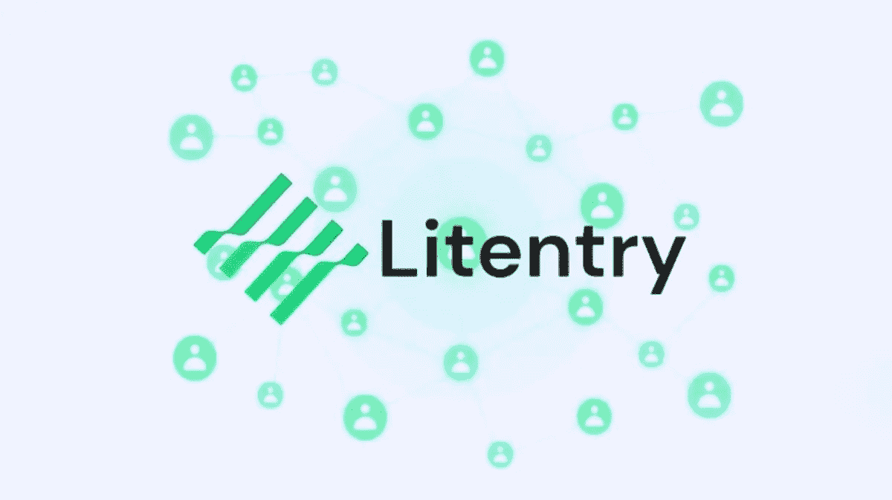

# 令牌审查:Litentry (LIT)

> 原文：<https://medium.com/coinmonks/token-review-litentry-lit-e17729d590ae?source=collection_archive---------17----------------------->

今天我们要介绍一种新的加密货币:Litentry (LIT)！

# 概述—简短介绍！

要理解文学，你必须理解要解决的问题。简而言之，这一切都归结为分散的身份管理。

在一个分散的区块链上，如何给某些用户分配唯一的身份呢？