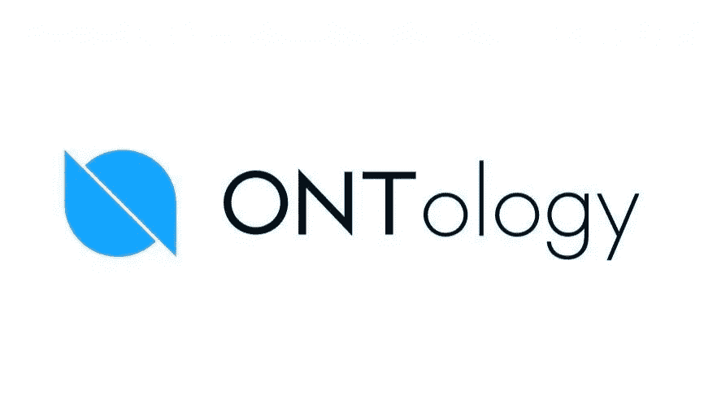

# 令牌审查:本体论(ONT)

> 原文：<https://medium.com/coinmonks/token-review-ontology-ont-67b49018a312?source=collection_archive---------13----------------------->

今天我们就来聊聊**本体(ONT)** ！

**概述**

在上一篇评论中，我谈到了元宇宙世界的另一个秘密。我说的是 THETA 网络(Theta)。如果你错过了我上次的评论，你可以在这里找到它

Ontology **是一个公共的区块链，旨在为公司提供一个具体的选项，在他们的生产中实施区块链技术** …