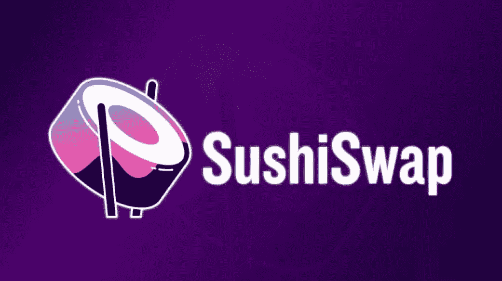

# 象征性评论:寿司

> 原文：<https://medium.com/coinmonks/token-review-sushiswap-sushi-e2a57571d02a?source=collection_archive---------6----------------------->

今天我们将谈论:SushiSwap(寿司)！

# **概述**

## **什么是 SushiSwap？**

SushiSwap 是一个建立在以太坊区块链上的分散式加密货币交易所。它旨在成为加密货币市场中最受欢迎的基于以太坊的 DEX unis WAP 的发展。在外观和功能上与 Uniswap 几乎相同。SushiSwap…