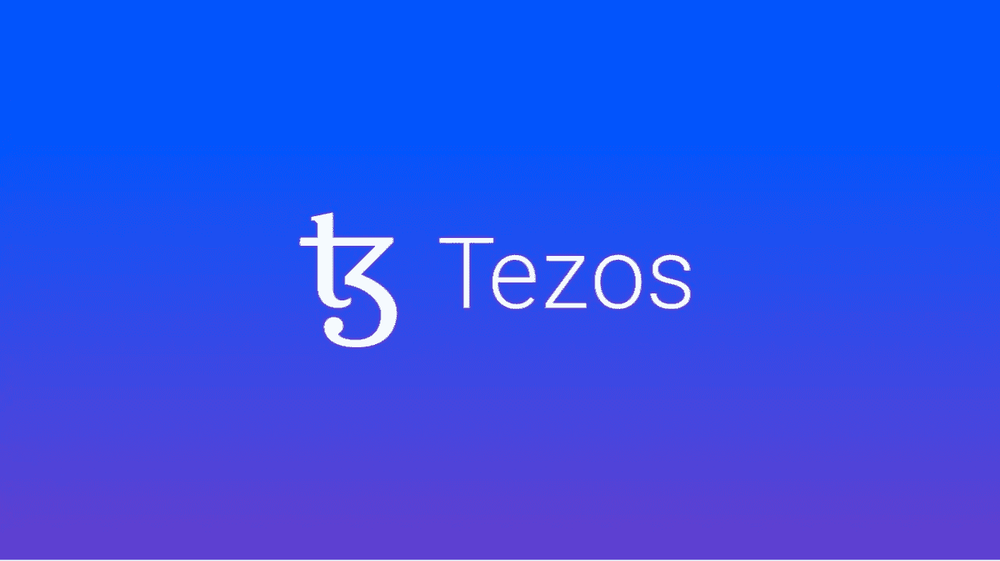

# 象征性评论:特佐斯(XTZ)

> 原文：<https://medium.com/coinmonks/token-review-tezos-xtz-41ed707b56c0?source=collection_archive---------24----------------------->

## **概述**

今天我们将谈论:特佐斯(XTZ)！

在最后一个 token 回顾中，我谈到了雪崩。如果你错过了我上次的加密分析，你可以在下面找到它。

[雪崩(AVAX)回顾](/coinmonks/token-review-avalanche-avax-616f9de161c3?source=your_stories_page-------------------------------------)

今天，我们将关注一种正在引起热议的新兴加密货币:Tezos (XTZ)。这是一种加密货币，其技术基础是…