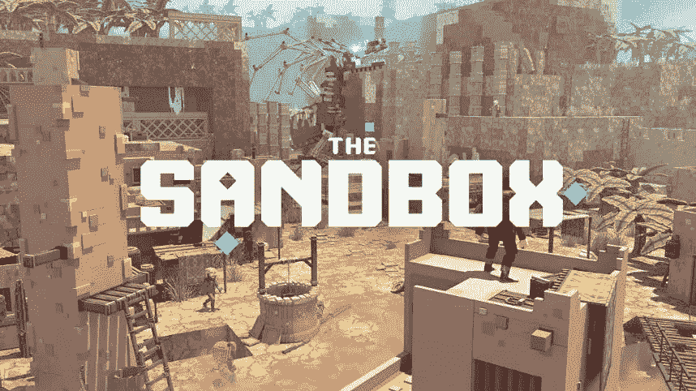

# 令牌回顾:沙盒(沙)

> 原文：<https://medium.com/coinmonks/token-review-the-sandbox-sand-c49ce5e0d5e1?source=collection_archive---------8----------------------->

今天我们就来聊聊**沙盒(沙子)**！

**概述**

在上一篇评论中，我谈到了元宇宙世界的另一个秘密。我说的是分散地(MANA)。如果你错过了我上次的评论，你[可以在这里](/coinmonks/token-review-decentraland-mana-84528828a11f?source=your_stories_page-------------------------------------)找回！

最近，元宇宙的概念开始以一种相当坚持的方式出现，这个术语是尼尔·斯蒂芬森在《冰雪奇缘》中创造的…