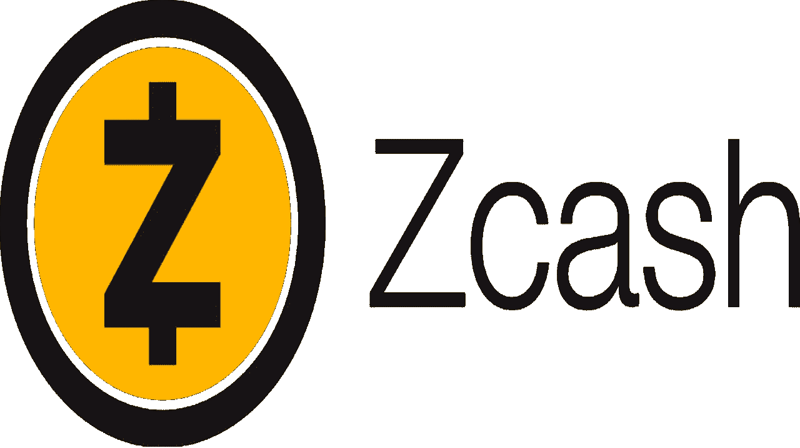

# 象征性评论:Zcash (ZEC)

> 原文：<https://medium.com/coinmonks/token-review-zcash-zec-4e1409ac1db4?source=collection_archive---------10----------------------->

今天我们就来聊聊: **Zcash (ZEC)** ！

**概述**

**什么是 Zcash？**

Zcash (ZEC)是一种另类硬币，它在市场上的无数加密货币中脱颖而出，这要归功于两个主要特征:安全性和匿名性，这些特征也是 Monero 迄今为止所共有的。我已经在这篇文章中谈到了 Monero: