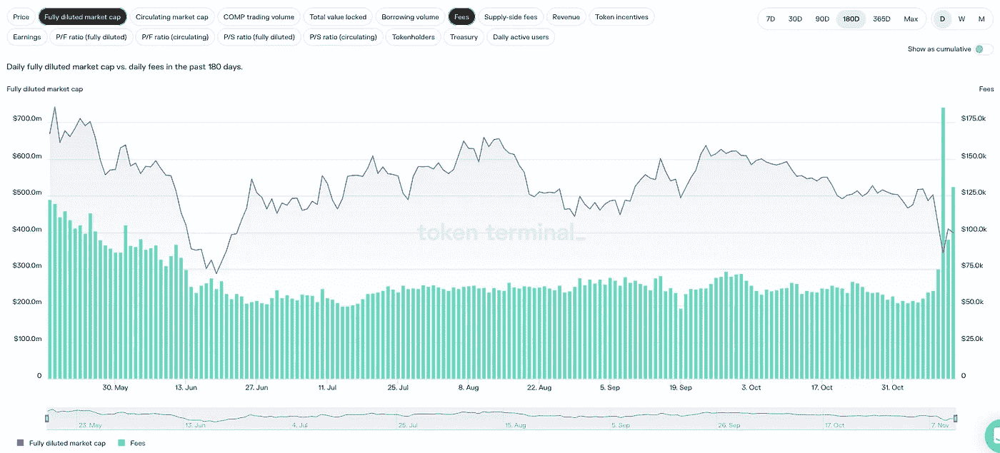

# 令牌终端:用于 DeFi 分析的金铲

> 原文：<https://medium.com/coinmonks/token-terminal-a-defi-analysis-gold-shovel-258faf910de1?source=collection_archive---------32----------------------->

# DeFi 101

*迪法研究公司分析师吉姆·佛朗哥*

## **什么是令牌终端？**

在本文中，将深入探讨区块链和分散化应用程序的最佳财务分析平台之一。

Token Terminal 旨在改善 Token 投资者的财务指标。这些指标旨在与每股收益和市盈率等传统财务指标相媲美。

在 Token Terminal 出现之前，投资者没有必要的工具来评估他们的 Token 投资。此外，代币投资者通常不理解代币获取价值的机制。

更好的财务指标有助于帮助投资者理解哪些项目具有可行的令牌模型，以及各种协议是如何成熟的。

## **站台**

首先，理解令牌终端的功能和指标可能会很困难。如果你花时间去探索每一部分，那将是最好的。让我们从仪表板开始。

Token Terminal 是一个在区块链和分散应用程序上聚合财务数据的平台。

主页左侧的主仪表板菜单允许您有效地浏览平台，并过滤您想要查找的类别。

指标是来自各种协议的数据集合，类似于我们评估传统公司财务指标的方式。

例如，价格销售比等于完全稀释的市值除以年化收入。

在 crypto 中，我们有令牌激励机制来激励用户。

与股息类似，收入是与利益相关者或代币持有者分享的费用数。

**协议仪表板**

令牌终端包括协议仪表板作为标准功能。仪表板将项目中最关键的数据标准化地呈现在一个页面上。它们分为几个部分，如关键指标、收入份额、构成、竞争格局等。

让我们以竞争格局指标为例，将复合贷款协议与其他贷款协议进行比较。

**顶部面板**

协议仪表板的顶部面板包含项目摘要。它的令牌符号显示在协议名称下面的括号中。

你可以在右边看到更多的信息，它是如何工作的，谁拥有它。具体项目的重要渠道，比如治理论坛、Discord 和 Twitter 账户，也可以在这个部分找到。

**关键指标**

协议指标显示在顶部面板的下方。通过单击图表左上角的按钮，您可以选择要显示的指标。

您也可以通过单击 7d、30d 等上的按钮来更改数据间隔。

**收入份额**

“收入份额”选项卡描述了项目中供应方参与者和令牌持有者之间的收入分配。

您可以通过单击图表左上角的按钮或图表图例中的条目来显示供应方费用和/或收入。

**合同构成**

按合同组合提供了基于合同级别粒度的具体业务度量的详细分解。交易量、费用、代币奖励、国库和 dau 都可以在这里获得。

通过单击图表左上角的按钮，您可以选择要分解的指标。

**竞争格局**

竞争格局允许您比较同一类别中的不同协议。使用左上角的下拉菜单，您可以选择要可视化的度量和要比较的协议。

在这个例子中，我们使用借用量作为度量来比较复合协议与其竞争对手。

## 有价值的特征

令牌终端为探索 DeFi 空间提供了许多有价值的功能。让我们来看看我们的一些最佳选择。

**收益**

盈利是令牌终端的最大特点之一。

收益是协议收入减去在指定期间分配的象征性激励。正收益是随着时间的推移产生收入的合理商业协议的特征。

转到 tokenterminal.com，从左侧菜单中选择指标，然后选择收入。

**费用**

并非所有的 DeFi 协议都已经发布了它们的令牌。令牌终端提供综合数据，以比较每个协议从其平台收取的收入和费用。

先说费用；平台收取费用是为用户提供服务的回报。并不是所有的协议都有内置的费用共享机制，这为它们的治理令牌增加了重要的价值。

以太坊这样的区块链和 GMX 这样的 dex 就是与代币持有者分享费用的平台的例子。

**收入**

收入是分配给代币持有者的平台收入。它可以是治理令牌、eth 或 stablecoins 的形式。请注意，并非所有协议都有内置的收入共享机制。

在这种情况下，Opensea 在过去六个月的收入位居第二。然而，它没有令牌，也不与用户分享这些收入。

另一方面，LooksRare 是另一个类似于 Opensea 的 NFT 市场，将平台收入 100%分配给 LOOKS token 持有者。

# 结论

是时候纠正代币是投机性的、通常被误解为非生产性资产的说法了。

理解令牌如何获取价值的最简单方法是将这些协议与传统公司进行比较——两者都提供客户服务来换取费用。

加密协议服务产生现金流的方式与公司一样。与传统的公司股票一样，代币通过精心设计的协议赋予持有者经济和治理权利。

> 交易新手？试试[加密交易机器人](/coinmonks/crypto-trading-bot-c2ffce8acb2a)或者[复制交易](/coinmonks/top-10-crypto-copy-trading-platforms-for-beginners-d0c37c7d698c)