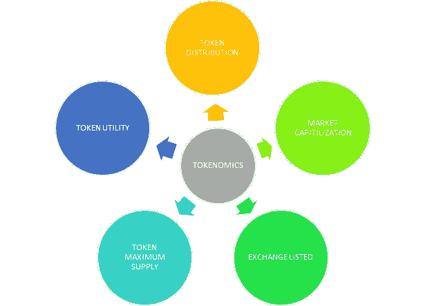

# 很容易解释:令牌经济学和投资者

> 原文：<https://medium.com/coinmonks/tokenomics-and-investors-b6db31da06a9?source=collection_archive---------27----------------------->

## 区块链是如此的容易

NB:区块链，严格来说是给懒惰的新手用的

Photo by [Andre Taissin](https://unsplash.com/@andretaissin?utm_source=medium&utm_medium=referral) on [Unsplash](https://unsplash.com?utm_source=medium&utm_medium=referral)

## 目录

*   世卫组织是一名投资者
*   令牌组学的关键要素

## 世卫组织是投资者？

投资者是一个把钱投入到一个企业中希望赚取利润(更多钱)的个人。一般来说，这个人与他投资的一方有一个协议，约定他的钱可以保存多久，他可以获得多少利润，以及他的利润多久支付一次。

**投资**是投资者购买的任何资产，希望该资产在未来货币价值增加。这种资产可以是实物资产(房屋、金条)或数字资产(股票、加密货币)。

## 有三(3)种投资类型:

*   短期投资
*   中期投资
*   长期投资。

## **谁是加密领域的投资者**？

任何持有任何形式的加密货币或 NFTs 的个人都被称为加密货币或 NFTs 投资者。

Diagram of Some Key Tokenomics Element, Illustrated by [Illinto&Dicinto](/@Illinto.Dicinto)

这些都是加密投资者在将血汗钱投入加密项目之前应该注意的迹象。以下是投资者应该了解的一些特征。

> 交易新手？在[最佳加密交易](/coinmonks/crypto-exchange-dd2f9d6f3769)上尝试[加密交易机器人](/coinmonks/crypto-trading-bot-c2ffce8acb2a)或[复制交易](/coinmonks/top-10-crypto-copy-trading-platforms-for-beginners-d0c37c7d698c)

## 令牌组学的关键要素

## **市值**

代币的市值是已经开采的所有加密货币的总价值。这一价值是以美元计价的。

> 例如，比特币市值是所有开采的比特币的美元价值。

**市值是一个指标，表明一个代币的稳定性和盈利性。**

*   更大的市值意味着稳定的象征，更少的收益和更少的损失。
*   市值越小，稳定性越差，回报越高，亏损也越大。

## **令牌实用程序**

令牌工具意味着用例。您想购买作为投资的代币，在区块链领域有使用案例吗？

**在区块链领域，令牌有多种帮助方式。其中一些方法是:**

*   交易费用:一些代币被用来作为在区块链进行交易的费用。例如，BNB 被用作促进币安智能链上的交易的费用。
*   奖励:一些代币作为奖励点数给予验证者和参与者。例如，蛋糕代币分发给为 Pancakeswap(一个去中心化的交易所)提供流动性的投资者。
*   **放弃:**持有特定代币将导致交易费用的扣除，交易费用是在区块链应用内互动时支付的。在某些情况下，如 TWT，完全取消交易费用。
*   **访问:**在任何人能够与一些分散式应用程序(dapp)完全交互之前，他必须持有构建 dapp 的区块链本地令牌。例如，在 Polkadot 网络上创建新的区块链之前，需要 Polkadot(点)。

## **令牌燃烧**

代币焚烧是一种从流通中去除若干代币/硬币的行为。这将导致流通代币/硬币数量的减少。

这个过程需要将令牌发送到任何人都无法访问的钱包中。这使得发送到这个钱包的加密货币毫无用处，因此得名“burn”

> 令牌的提供是其成功的关键之一。例如，如果一种商品的供应量低而需求量高，这就会导致价格上涨。这是令牌刻录遵循的相同原则。

对代币执行代币烧录以增加这些所述代币的价值。

> 让我们休息一下来处理一下我们所学的东西。冷静点。准备好了。我们走吧。

## **令牌供应**

令牌供应是指在加密项目开始期间创建的令牌总数。**下面解释了代币供应的不同分支。**

*   **最大供应量:**创建的令牌总数。这包括锁定的和流通的。
*   **流通供应量:**流通中的代币总数
*   **锁定供给:**由燃烧的令牌和开采的令牌组成。

> 供应量高的代币被标记为屎币。(Safemoon 的代币供应量为 10000 亿，而比特币的最大供应量为 2100 万)。

低供给高需求的代币可能导致价格上升。但是具有高供给的代币几乎不会有驱动的高需求。这种说法可能会有例外，尤其是在牛市期间。

## **激励机制**

这是奖励积极参与加密项目的参与者的一种方式。象征性激励机制是潜在投资者应该留意的一个迹象。

代币吸引投资者的方式多种多样。例子有:

*   投票和管理:令牌持有者对区块链或加密项目的决策和意见有发言权。
*   **下注奖励:**在 Pancakeswap 中，下注代币的代币持有者赚取蛋糕作为提供流动性的奖励。
*   采矿费:批准区块链交易的验证者会得到硬币奖励。

> 亲爱的你，你玩得开心吗？评论告诉我们你最喜欢这篇文章的哪一部分。
> 
> **如果你学到了新东西，鼓掌。**
> 
> **订阅我们的时事通讯，阅读更多关于区块链技术的有趣而简单的文章。**

如果你喜欢通过视频或音频学习，我们为你准备了一些东西:看看我们在 Spotify 上的 [YouTube 频道](https://www.youtube.com/@Small_Bites_of_Crypto_Currents/featured)和[播客节目。](https://open.spotify.com/show/0W1AvwLns36HA633VConbS)