# 代币经济学——超越代币和交易

> 原文：<https://medium.com/coinmonks/tokenomics-beyond-token-trading-27577d049c4c?source=collection_archive---------32----------------------->

令牌如何工作&改变加密生态系统

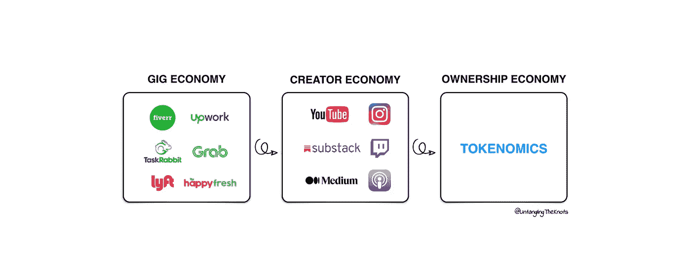

创造者经济的出现刺激了一个新的赚钱行业。

从个人在演出经济中通过演出时间赚钱到在创造者经济中利用他们的追随者，个人赚得更多，同时能够创造他们真正喜欢做的事情。

创造者经济赋予了**追随者-创造者关系**，在这种关系中，创造者创造产品，追随者为产品或服务付费。这种关系不理想，其实是有缺陷的。

缺陷在于，当前的创造者经济格局不是让市场决定他们愿意支付的价格，而是将固定价格强加给追随者。

T2 所有制经济，也被称为象征经济学，改变了这一点。

令牌经济学不是让支持者被动地参与一个项目或他们信任的人，而是让他们主动参与对创造者产生影响。

他们不再购买，而是投资。

# 在此之前，什么是 Tokenomics？

**Tokenomics 源自 Token + Economics。**简单来说，在 Web3 空间中，任何由硬币或代币赋予权力的东西都是代币组学。然而，这里的令牌不仅仅是指比特币或 Dogecoin，事实上它还包括 NFT。

因此，任何由加密硬币、代币或 NFT 授权的东西都是代币组学的一部分。

# 令牌经济学与菲亚特经济有何不同？

这一切都要追溯到代币或法币如何获得其价值。

任何事物的主要关系都可以用 ***供求价格关系*** 来描绘。

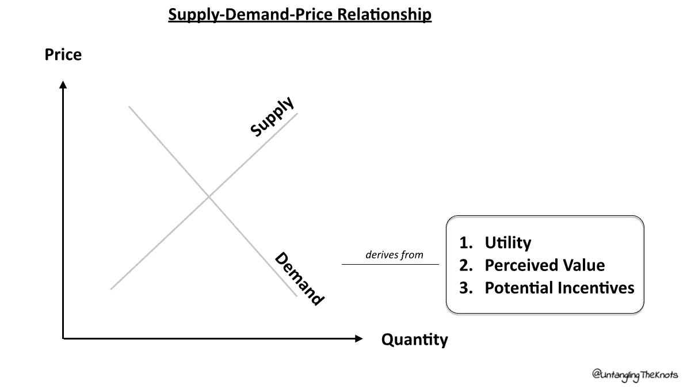

利用上图，六个因素*(价格、供应、需求、效用、价值和激励)*的关系可以总结为一个更简单的格式，如下所示。

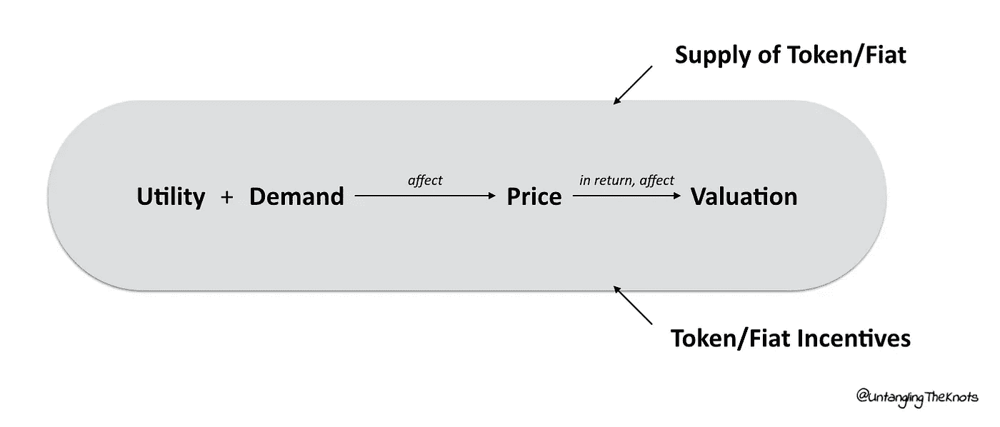

就法定货币而言，比如说美元，它被认为是最强大的货币。美元一度由黄金支撑，但此后它开始利用人们对该国经济的信心。

在这种情况下，美元取决于人们对美国实力的看法，因此它反映在货币估值中。货币估值基于这种看法的荒谬之处，与股市估值*(类似特斯拉)*甚至加密代币的估值没有什么不同。

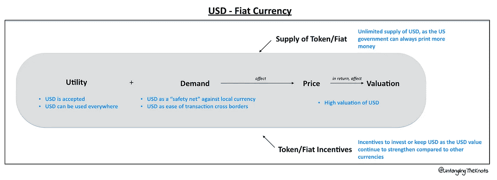

虽然可以肯定地说，大多数(如果不是所有的话)货币都遵循与美元货币相同的指标，但是，对于加密硬币或代币来说，情况就不一样了。

加密硬币或代币的主要优势在于:

1.  **供应加密硬币或代币**
2.  **加密硬币或代币的效用**
3.  **加密硬币或代币的奖励** - *高度依赖于供应&公用事业*

## 供应加密硬币或代币

与法定货币不同，加密硬币或代币有两种供应方式:有限供应和无限供应。

## 有限供应

比特币和 NFT 之类的硬币或代币属于限量供应的类别。

固定供应量可能有助于维持硬币或代币的估价(其中增加供应量将降低估价)，然而，随着代币变得更有价值，使用硬币/代币的动机可能更小。

## 无限供应

无限供应的硬币或代币的功能与法定货币相同，当政府决定经济将从中受益时，可以选择印刷更多的货币。

不限量供应的硬币或代币有以太币和 Dogecoin 币等。

# 加密硬币或加密令牌的效用

硬币和代币的功能不同，用途也不同。虽然两者都可以在用于投资或交易目的的加密交易所找到，但它们在效用形式上是不同的。

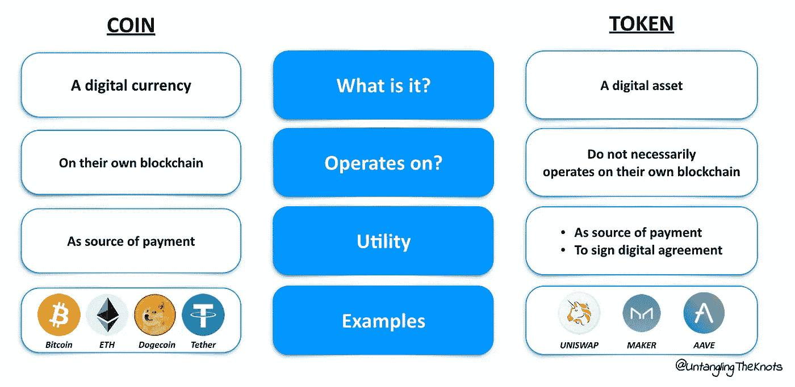

加密硬币或代币的独特之处在于其创建方式各不相同，因此每个硬币或代币的效用也各不相同。

如下所示，一些硬币被创建为独立的硬币，而其他代币被创建为与另一代币协同工作。

Stablecoin 有助于在不断波动的加密货币世界中创造稳定性。它与法定货币挂钩，通常是美元，但以不同的资产作为抵押。

## 所有权经济取代创造者经济

回到**创造者经济 vs 所有制经济**的话题。

创造者经济看到了广告和订阅的力量。**广告模式**迫使追随者用广告来换取他们的关注，而**订阅模式**利用了一个有缺陷的供求价格体系，在这个体系中，供应是无限的，价格是固定的

> 在一个理想的模型中，在没有巨大激励的情况下，低价或固定价格的无限供应将创造低需求。

令牌经济学允许理想的供需价格模型发挥作用，将所有权交还给买方，因此出现了术语**“所有权经济】**。

## 但是说真的，它是如何工作的呢？

虽然不是所有的项目都越来越接近实现完美&理想的供求价格模型，但大多数项目都在朝着正确的方向前进。

## Web 3.0 社交媒体或互动平台

消费者负责奖励空间中的好内容，同时控制所有内容，而不是向消费者提供广告。这就把权力放回了消费者手中。

## NFT 在所有制经济中的作用

## 1.作为积极投资者的粉丝

NFT 机制允许粉丝成为积极的投资者，支持他们的角色。

其中一个例子是区块链在 Mirror.xyz 上为作者进行的众筹，无论是小说、散文，甚至是诗歌，只要是创造性的写作材料。除了收藏品市场之外，Mirror.xyz 为 NFT 景观开辟了另一种可能性。

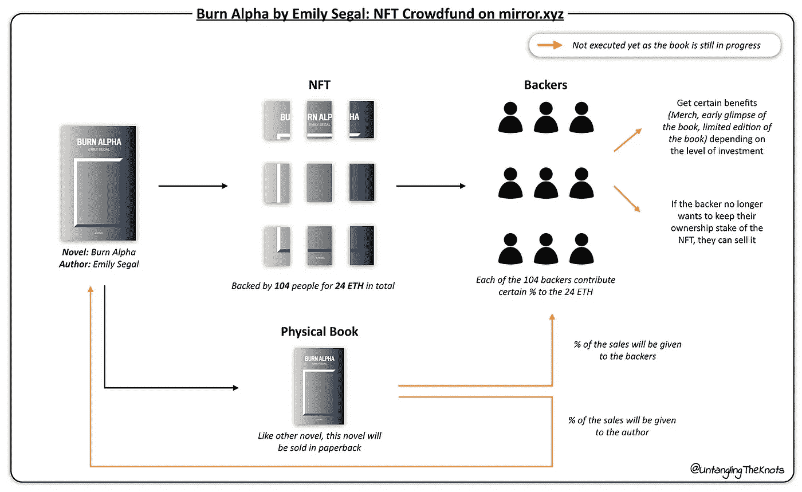

与 Kickstarter 不同，Mirror.xyz 上的所有 NFT 交易都根植于区块链，从而创建了一个安全透明的交易。

## 2.粉丝作为消费者+社区成员

服务业是 NFT 能够涉足的另一个领域。

通过将服务链接到 NFT，创作者可以将他们的服务货币化，这允许他们的费率跟随市场需求，因此如果需求巨大，价格也会跟着上涨。

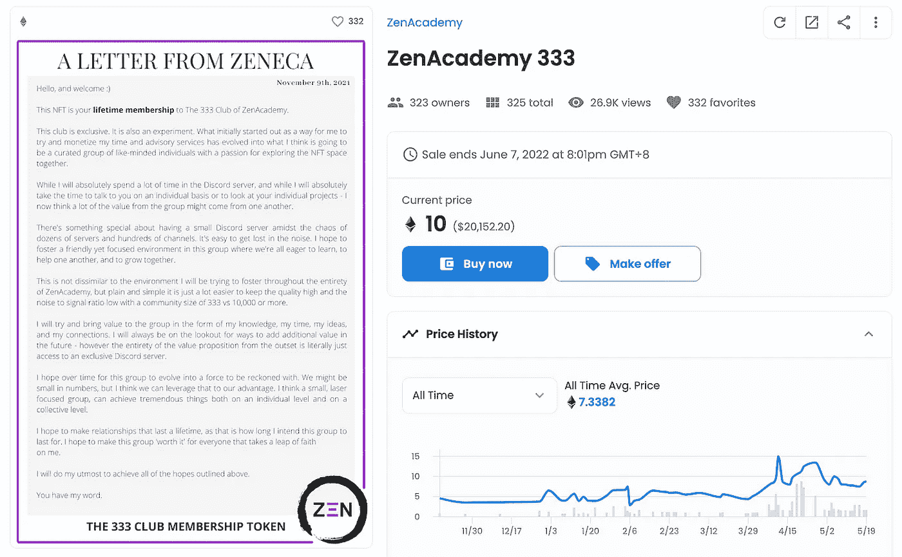

[NFT 领域的著名投资者 Zeneca_33](https://zeneca33.substack.com/p/letter-22-the-rise-and-fall-and-rise?s=r) 注意到越来越多的人向他咨询他们的 Web3 项目。由于要求太多，他不得不拒绝其中的大部分。在思考如何利用自己的知识帮助更多人的同时，他想到为他的导师服务创建一个 NFT&，这导致他创建了 ZenAcademy 333 NFT。

## 3.作为支持者的粉丝+社区成员

NFT 收藏品使粉丝更容易支持一个项目，无论是他们崇拜的榜样还是成为社区的一部分。

得到这些收藏品是很好的，但是理解每个收藏品的不同知识产权是很重要的。

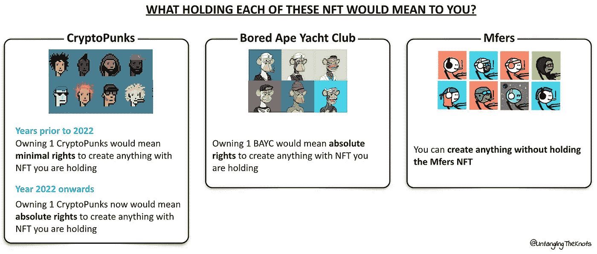

## 4.作为创作者的粉丝

有趣的是，粉丝可以发挥更大的作用，而不仅仅是在场外支持他们的创作者。

NFT 的景观已经改变&努力向 NFT 持有者提供发展品牌的权利。假设你持有 **BAYC #6184** ，你可以用它开发一系列的商品、电影，甚至书籍。

BAYC #6184 的持有者、食品企业家安迪·阮(Andy Nguyen)所做的是一项他擅长的实验——以他心爱的猿猴为主题创建一家餐厅。原来是 90 天的弹出式实验，现在已经成为一个永久的餐厅。

与普通餐馆相比，无聊饥饿餐馆的经营方式有所不同，这给其他 BAYC 持有者带来了不同的额外津贴，提倡在餐馆内使用加密代币。

**其他板块呢？**

类似地，金融、游戏甚至公司运作方式等行业也被重新定义。

金融不再仅仅是与银行的交易，更确切地说，权力已经回到了**消费者手中，他们可以控制自己的账户**——这被称为 DEFI *(去中心化金融)。*

**游戏**不是玩家付费玩游戏，而是让他们**玩游戏来赚取** -这被称为游戏赚取或 GameFi(游戏+金融)。

**公司内部的决策**不再由管理层决定，而是由社区决定****——这叫道*(分权自治组织)。*****

**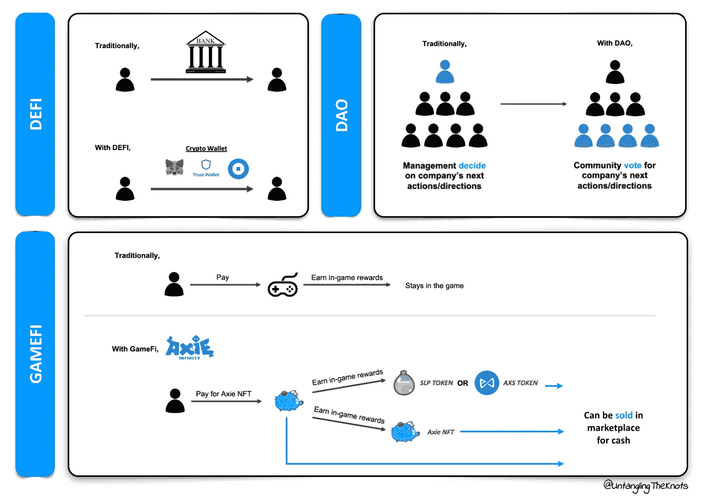**

****从消费者到不仅仅是消费者****

**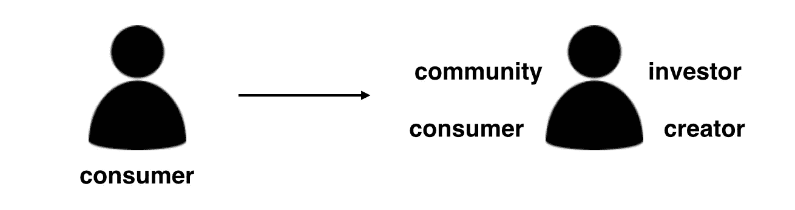**

**粉丝角色的转变从仅仅是一个消费者转变为不仅仅是一个消费者，这无疑重新定义了理想的创造者经济应该如何运作。也许有人会质疑，拥有所有权经济的**粉丝不会达到我们今天在 Web 2.0 平台上看到的规模——数百万对数万。****

**那是真的吗？这真的重要吗？**

> **“要成为一名成功的创造者，你不需要几百万。你不需要几百万美元或者几百万客户，几百万客户或者几百万粉丝。作为一名手工艺者、摄影师、音乐家、设计师、作家、动画师、应用程序开发者、企业家或发明家，你只需要成千上万的真正粉丝。”——摘自凯文·凯利散文 [**一千个真正的粉丝**](https://kk.org/thetechnium/1000-true-fans/)**

**看到那些真正创造出高质量内容的创作者却受制于追随者，以及他们的客户评价的点赞数量(与他们投入的作品相比，有些人得到的报酬少得可怜)来决定他们内容的“价格标签”，这很令人难过。更令人难过的是，看到有抱负的创作者仅仅因为障碍变得更高而停止尝试。**

**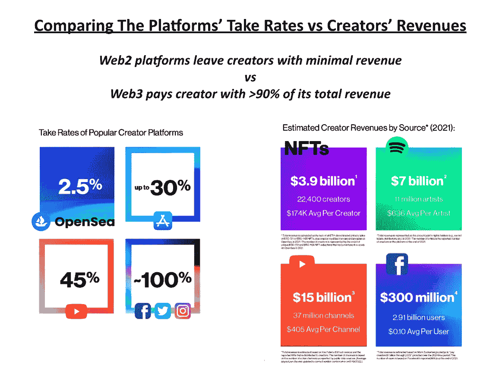**

**总有一天，人们会不可避免地利用这些非功能性食物的高价，并诉诸于交易它们。**

**但在这一点上，更令人担忧的是潜在支持者面临的障碍，尤其是对 crypto 或 NFT 如何工作缺乏了解，这阻止了他们加入这股潮流。**

**不可否认，加密领域的许多项目仍处于起步阶段，因为未知+风险仍然巨大，但随之而来的是成为第一个为接下来的事情设定优先顺序的兴奋。**

# ****TLDR****

**令牌经济学为我们提供了巨大的机会来重新想象和定义以前为我们工作的一切，即“规范”，以创建一个有利于所有各方的更好的机制，同时取消从 Web2 的工作方式中受益的中间人(又称科技公司)的优先权。**

**这些技术平台不再是“主要关注点”，而是转向社区授权和以社区为中心的项目，这将使支持者承担起超越被动消费者角色的角色。**

**现在说所有制经济整体会是什么样子还为时过早，但是前面提到的项目，如下图所示，给了我们一个很好的机会去了解它会是什么样子。**

**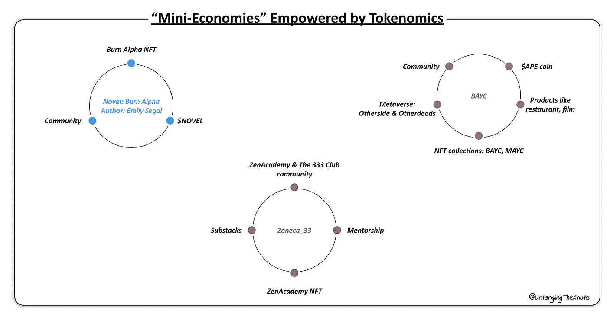**

***免责声明:这不是财务或投资建议，请自行研究&投资前评估自己的风险偏好。***

**如果你喜欢我的文章，请鼓掌并关注我，了解更多类似的内容:**

**[Linkedin](https://www.linkedin.com/in/siawhui)|[Twitter](https://twitter.com/siawhui_)|[Medium](/@siawhui)|[Substack](https://untanglingtheknots.substack.com/)**

> **交易新手？尝试[加密交易机器人](/coinmonks/crypto-trading-bot-c2ffce8acb2a)或[复制交易](/coinmonks/top-10-crypto-copy-trading-platforms-for-beginners-d0c37c7d698c)**