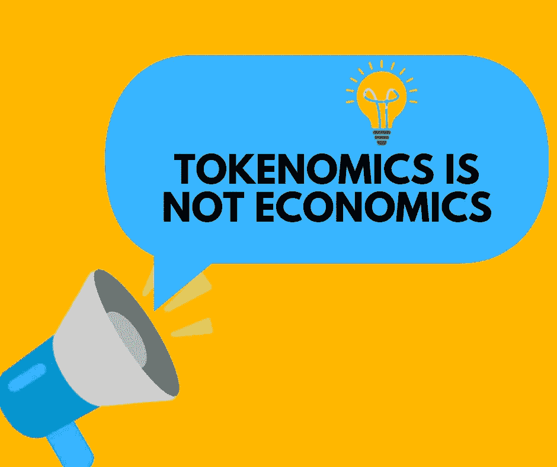

# 象征经济学不是经济学

> 原文：<https://medium.com/coinmonks/tokenomics-is-not-economics-da80bd311425?source=collection_archive---------39----------------------->

区块链技术的采用越来越广泛，它的应用解决了很多问题。

Image designed by the author

这项技术在 2008 年金融危机时提供了一种替代方案。自从旗手比特币诞生以来，这种数字资产一直被视为日常交易的一种替代性去中心化媒介。

在比特币之外的未来金融领域，更有趣、更相关的是分布式账本技术(DLT)。这项技术使得分散的数字数据库能够安全运行。它还消除了对可能导致操纵或欺诈的中央机构的需要。

> 交易新手？在[最佳密码交易所](/coinmonks/crypto-exchange-dd2f9d6f3769)上尝试[密码交易机器人](/coinmonks/crypto-trading-bot-c2ffce8acb2a)或[复制交易](/coinmonks/top-10-crypto-copy-trading-platforms-for-beginners-d0c37c7d698c)

据 ICORBP(注册区块链专业人士国际理事会)Block 计划的嘉宾 Michael Noel 说，他说“DLT 是一种破坏性的技术。当局没有意识到他们不需要监管超出监管范围的东西。”

罗伯特·索洛是一位获奖的经济学家。他在 1984-1985 年间获得了诺贝尔经济学奖。那个时代的经济学遗产是由人、用户、雇员和使用的设备定义的。这就是今天仍在学校实行的经济学。按照迈克尔·诺尔的说法，经济学是老派版本。

80%的经济增长发生在 1917-1984 年间。它在今天启动技术的当前经济树下未被考虑。无知的程度是显而易见的，因为在这个年龄在学校里教授的当前经济已经不再准确。这使得到区块链的过渡有点困难。

如果 ETH 可以在没有汽油费的情况下交易 2 美元，那么追踪它就不会有困难。此外，智能合同执行是交易总成本的一部分。因此，当区块链平台上的交易费用较低时，我们可以说令牌经济学就是经济学。

现在 ETH 的交易价格很高。一份明智的合同并不太实惠，这也解释了为什么象征经济学永远不会成为区块链的经济学。

如果代币的价值上升。交易费用将会提高。区块链平台的感知价值越高，内在价值越低。区块链应该快一千倍，便宜一百倍。

现在，许多开发商想要同情，他们写了投机的作品，这比真实的新闻和现实更容易受到人们的欢迎。人们追求能提高他们期望值的黄油。这导致了许多缺点。投机是不健康的，消除投机将是解决区块链癌症的一剂良药。

创新导致了革命。我们需要一场更好的区块链产业革命来体验更多的好东西。

## 令牌组学，是什么？

令牌经济学是一个术语，指的是控制加密货币或令牌的发行、分发和管理的经济原则和政策。它包括各种因素，如令牌的总供应量、令牌向不同利益相关方的分配以及管理令牌交易和转移的规则。

代币经济学是经济学的一个子集，因为它专门涉及应用于加密货币和代币系统的经济原则和政策。然而，它与整个经济学不同，后者是一个广泛的领域，涵盖了与商品和服务的生产、分配和消费相关的广泛主题。

一般来说，令牌组学在加密货币或令牌的成功和采用中起着至关重要的作用。它有助于确保令牌具有价值和效用，并且公平有效地进行分发。代币组学还可以帮助形成代币持有者的动机和动机，并且可以影响代币系统的整体行为和性能。

## 结论

因此，理解令牌组学的原理对于任何参与加密货币或令牌的开发、发行或使用的人来说都很重要。它有助于为决策提供信息，并确保代币系统的可持续性和有效性。

# 关于作者

Ojeniyi Rashidat Ayobami 是一名 web3 和区块链内容作家、图形设计师、视频营销人员和 web3 社区开发者。她是一名经验丰富的加密货币交易员，拥有五年的交易经验。你可以通过电报联系到她:t.me/ayobami001

> 加入 Coinmonks [电报频道](https://t.me/coincodecap)和 [Youtube 频道](https://www.youtube.com/c/coinmonks/videos)了解加密交易和投资

# 另外，阅读

*   [AscendEx 保证金交易](https://coincodecap.com/ascendex-margin-trading) | [Bitfinex 赌注](https://coincodecap.com/bitfinex-staking) | [bitFlyer 评论](https://coincodecap.com/bitflyer-review)
*   [Bitget 回顾](https://coincodecap.com/bitget-review)|[Gemini vs block fi](https://coincodecap.com/gemini-vs-blockfi)cmd |[OKEx 期货交易](https://coincodecap.com/okex-futures-trading)
*   [AscendEx Staking](https://coincodecap.com/ascendex-staking)|[Bot Ocean Review](https://coincodecap.com/bot-ocean-review)|[最佳比特币钱包](https://coincodecap.com/bitcoin-wallets-india)
*   [霍比审核](https://coincodecap.com/huobi-review) | [OKEx 保证金交易](https://coincodecap.com/okex-margin-trading) | [期货交易](https://coincodecap.com/futures-trading)
*   [网格交易机器人](https://coincodecap.com/grid-trading) | [Cryptohopper 审查](/coinmonks/cryptohopper-review-a388ff5bae88) | [Bexplus 审查](https://coincodecap.com/bexplus-review)