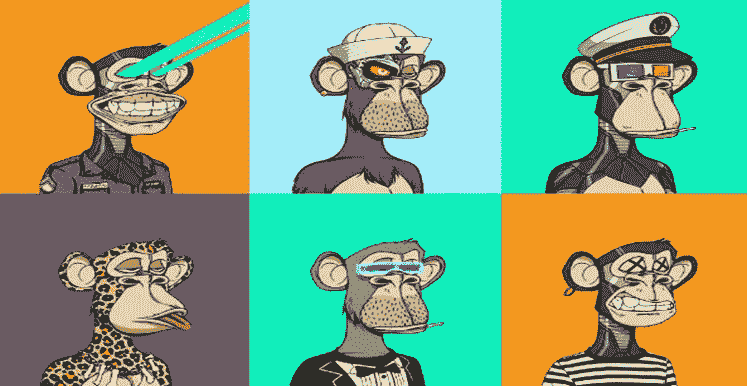
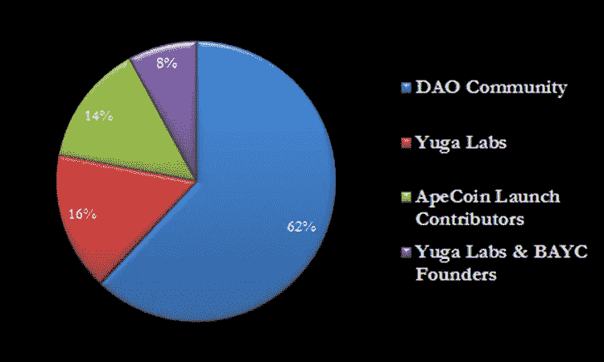
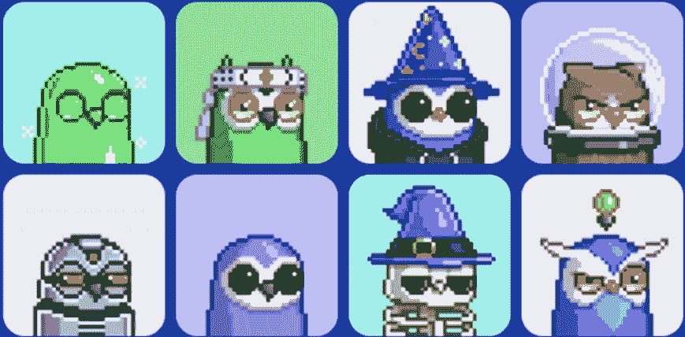
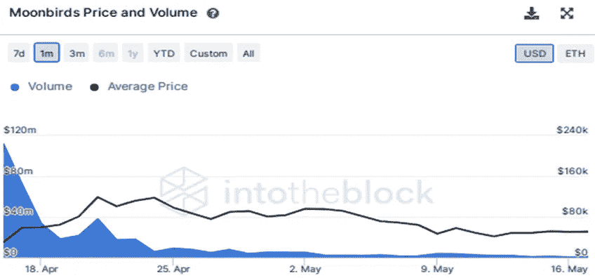
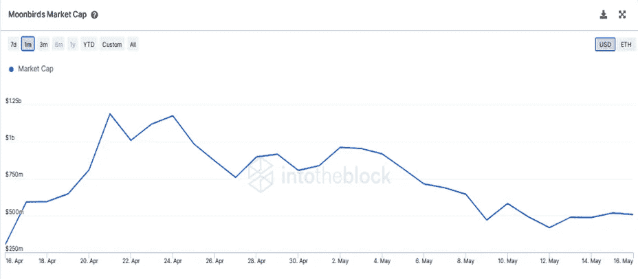
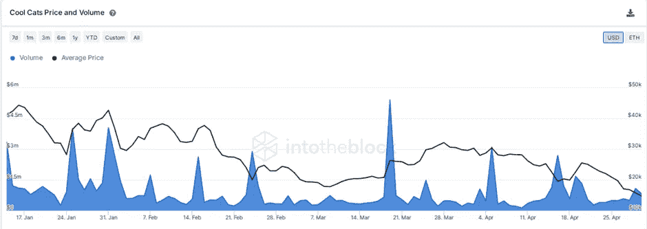
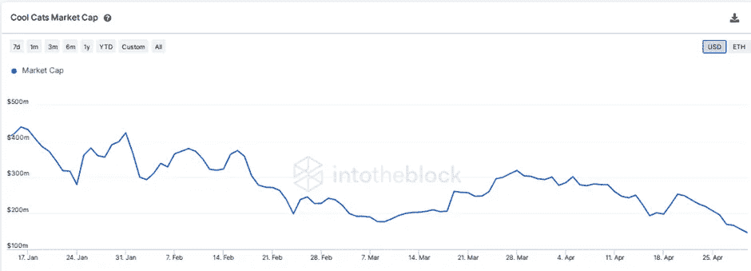
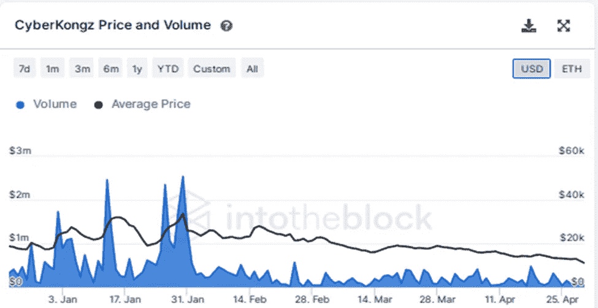
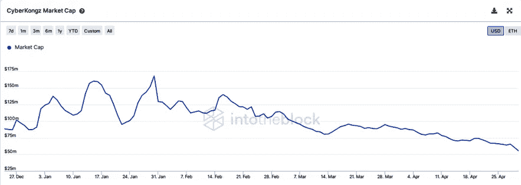

# 令牌组学研究| NFT 研究报告│2022 年 4 月

> 原文：<https://medium.com/coinmonks/tokenomics-research-nft-research-report-april-2022-d87612a22e2a?source=collection_archive---------14----------------------->

**猿、CATS、月鸟和金刚**

介绍

*NFTs 获得了关注，人气飙升，以至于被柯林斯字典评为 2021 年的年度词汇。2021 年，NFT 的销售额约为 249 亿美元，比 2020 年的 9490 万美元呈指数级增长。从 2020 年交易 NFT 的 54.5 万个钱包，到 2021 年约有 2860 万个 NFT 交易了 NFT。然而，一些最著名的项目正在通过提供象征性的激励和以社区为中心的津贴来扩大他们的生态系统。让我们来看看 2022 年 4 月表现最佳的 NFT 项目。*

# 推测

在区块链技术出现的几年前，许多人不会想到它的出现是如此的紧迫。即使区块链成为主流，许多艺术家也不会相信他们的专业知识会让他们在这项新技术上赚到一大笔钱。像许多其他行业一样，区块链已经将艺术行业转变为一个独特的时代，通过算法生成的艺术作品具有其美学特征和稀有性得分。

超出反对者的想象，NFTs 首次出现在主流中，并成长为区块链行业中一个更大的市场。当各种艺术实验室和投资者开始潜入 NFT 市场并推广它时，它的增长变得巨大。风险资本家没有被排除在外，媒体机构和大品牌也未能幸免。全球经济的每一个活跃分子都想从蓬勃发展的 NFT 经济中分一杯羹。

就像 DeFi 在区块链有自我维持的经济一样，采用 NFTs 的狂热也为 NFTs 的独立经济铺平了道路。这是通过几个 NFT 项目实现的，这些项目推动 NFTs 超越了单纯的数字艺术交易。他们赋予 NFTs 效用，并将其功能扩展到沉浸式生态系统——元宇宙——以拓宽 NFT 经济体的视野。

将非功能性服务业纳入元宇宙，可以维持一个根深蒂固的经济，并让投资者相信，NFT 及其经济不会昙花一现，会持续下去。元宇宙中的每个人物角色、物品、收藏品、环境和其他有价值的工具和特征都是 NFTs。为了让 NFT 的火焰继续燃烧，几个 NFT 项目定期激励他们的持有者，以确保他们保留他们的 NFT 资产；以减轻恐慌性抛售，这可能是对其经济的沉重打击。

***让我们一起深入了解业内四个值得关注的 NFT 项目。这些奇妙的项目包括无聊猿游艇俱乐部(BAYC)和它的 ApeCoin，月鸟和它们的筑巢特征，酷猫和它们的牛奶，以及香蕉旁边的赛博孔。***

# 无聊猿游艇俱乐部。

BAYC 由著名的宇迦实验室于 2021 年 4 月 23 日在以太坊网络上创建。该项目已发展成为 NFT 市场上最负盛名的收藏之一。BAYC 是一个由 10，000 只无聊的猿组成的集合，它允许持有者进入俱乐部——BAYC——以获得未来的激励模型。这些激励来自宇迦实验室的其他 NFT 收藏，如无聊猿养狗俱乐部和变异猿游艇俱乐部——MAYC。这些藏品中所有非功能性藏品的总估价总计 30 亿美元。

宇迦实验室成功地使他们的 NFT 项目成为一流的，通过吸引人的活动来吸引他们的社区作为激励。这些没完没了的约定驱使来自许多行业的数百万用户和投资者，包括名人，来到他们的 NFTs。宇迦实验室见证了 2022 年 3 月的重大事件，以进一步确立其在 NFT 行业的触角。其中包括收购 Meebits 和 CryptoPunks(另一家 NFT 项目公司)，在 2022 年 3 月 22 日筹集了 4.5 亿美元的资金，还宣布了 ApeCoin。

ERC 20 代币 ApeCoin 的出现标志着宇迦实验室生态系统中整个 BAYC 和联盟俱乐部的又一个伟大时代。它始于向执行 ApeCoin DAO 决定的 Ape 基金会分发 1/1 NFT。与其他 DAO 一样，ApeCoin DAO 由所有令牌持有者管理，他们可以对合作伙伴关系、治理协议、新项目和资金分配等决策进行投票。

# 硬币代币实用程序

# 1.管理

ApeCoin 赋予其持有人通过投票参与决策过程的权利。因为令牌是去中心化的，所以它由 ApeCoin DAO 管理，而 ape coin DAO 决定生态系统中的下一步。这个决策在于让 ApeCoin 成为治理的一部分。值得注意的是，宇迦实验室没有管理权限。

# 2.猿类生态系统的固有密码

除了作为一个治理令牌，ApeCoin 还将成为 Ape 生态系统的原生令牌，可用于抵消生态系统的费用，并在没有集中中介的情况下购买未来的产品和服务。

# 3.激励

ApeCoin DAO 鼓励第三方开发者将 ApeCoin 集成到他们的游戏、项目和其他服务中。随着 P2E 游戏公司用 ApeCoin 激励他们的玩家，这将进一步推动 Ape 生态系统以外的令牌。

# 4.接近

随着猿令牌的出现，在成为生态系统的一部分之前拥有猿的时代已经结束。通过 ApeCoin，持有者现在可以访问 Ape 生态系统，其中将包含许多有趣的活动。

ApeCoin 的总体目标不仅仅是一个基于社区的令牌；随着它的不断发展，它很快就可以用于打桩和其他 DeFi 协议，以振兴令牌和促进猿生态系统。

# 硬币代币分配

ApeCoin 有 10 亿枚固定供应量的代币，这些代币已经铸造出来，不能烧毁。代币于 2022 年 3 月 17 日发行，30.25%的代币解锁流通。剩余供应量将以平均每月最大供应量的 1.5%投放到流通领域，持续 48 个月。

总供应量中，16%分配给了宇迦实验室团队，1%分配给了珍·古道尔的慈善基金会。另外 14%的代币分配给了 ApeCoin 的创始人，8%分配给了宇迦实验室和 BAYC 的创始人。剩余的 62%分配给道社区，其中 15%空投给持有人拜克、巴克和 MAYC NFT 持有人，而剩余的 47%留给道国库和资源。

# 令牌组学

从 2022 年 1 月到 4 月，BAYC 交易量达到略高于 4300 万美元的峰值，平均价格收于 40 万美元。其市值在 2022 年 4 月底达到 43 亿美元的峰值。

# 月鸟

“月鸟”是 2022 年 4 月 16 日发射的另一个引人注目的 NFT 项目。这是 10，000 个 PFP(个人资料图片)NFT 的集合，授予私人俱乐部的会员资格，并向其持有者提供额外的好处，如筑巢。该项目由 PROOF COLLECTIVE 开发，这是一个由 1000 名 NFT 艺术家和收藏家组成的私人俱乐部。

Moonbirds 在 web 3 和更广的范围内具有潜在的效用；它为用户提供了一个仅限于持有者的社交俱乐部。它的持有者也有权获得赌注奖励和随后的空投，如月鸟刺绣帽衫和未来空投。不仅如此，该系列中任何 NFT 的持有者还可以访问 PROOF 的元宇宙社区。这些公用事业将是尚未披露的潜在公用事业的基石。

Moonbirds 工具的顶端是“嵌套”，这是一种软锁定模型，允许所有者将他们的 NFT 锁定在他们的钱包中，而不转移或列出它们。就像无聊的猿类持有者会得到硬币一样，月鸟也会奖励筑巢的鸟的主人，奖励他们在钱包里放了多久。

# 月鸟的生长和记号组学

Moonbirds 在推出后立即开始发展其经济；该项目是在以太坊区块链铸造的，并记录了显著的二次销售。单日二次销售成交 49，000 ETH，打破了 MAYC 单日成交 41，000 ETH 的纪录。该项目在推出的头两天内就创下了超过 70，000 ETH 的销售量，目前的底价为 33。月鸟的平均价格在 2022 年 4 月 21 日至 22 日期间达到 12 万美元的峰值，销售额接近 4000 万美元。

来源:InToTheBlock

# 酷猫

《酷猫》是 NFT 的一个项目，由汤姆·威廉姆森、罗布·梅休、埃文·卢扎和科林·伊根于 2021 年 7 月共同创作。它是 9999 个随机生成的 NFT 的集合，每只猫都有独特的特征，如身体、面部、帽子、服装等。这些随机生成的 NFT 具有稀有性，如异国情调，经典，野生和凉爽，以标志他们的独特性。

# 效用

除了它们吸引人的美学之外，拥有或持有这种 NFT 可以获得额外的额外好处，如空投、被动象征奖励、铸造额外的非功能性物品，以及更多尚未公开的额外好处。Cool topia——酷猫生态系统——在 2021 年 9 月宣布了酷猫和价值 10 美元的牛奶代币。酷宠是另外 19999 个收藏的 NFT，其中 50%是留给酷猫持有者的。

$MILK 令牌是生态系统原生令牌，由所有 genesis 酷猫每日自动生成。它也可以通过派遣酷宠物进行任务来获得。你可以用$牛奶代币购买房屋或战斗箱，或者进化你的酷宠物。

此外，酷宠物通过赌注获得象征性奖励，这个项目背后的团队正在开发一个出借协议，允许持有者出借 NFT 来完成任务并获得回报。

# 增长和令牌组学

酷宠和$MILK 的宣布使酷猫 NFTs 的市值翻了一番，该公司在 2022 年 3 月的 NFT 项目中排名第 11 位。2022 年 4 月，它的交易额超过了 3 亿美元。到今年 1 月，酷猫的平均价格超过 4 万美元，市值略高于 4 亿美元，到 2022 年 4 月底，平均价格暴跌至 1.4 万美元，市值为 6500 万美元。

来源:InToTheBlock

# 网络空间

CyberKongz 于 2021 年 3 月初带着 2D 随机生成的 NFT 集合进入 NFT。这是一个由艺术家 Myoo 创建的 1000 个独特的 PFP NFTs 的集合，他生成了 989 个 Genesis CyberKongz 和 10 个传奇 CyberKongz。该项目后来在 2021 年 4 月升级了更多功能，将生态系统转变为一个独立而繁荣的生态系统。它为进一步向社区展示潜力铺平了道路。

这一里程碑式的升级构成了内置令牌发射，使 CyberKongz 生态系统通过算法分发$ BANANA——它的原生令牌。此外，它还为铸造更多的 NFT 铺平了道路——如 CyberKongz VX 和 kong nium Ore——而不会损害 Genesis NFTs 的价值和功能。升级还将生态系统推向游戏化，NFT 持有者可以通过参与任务获得奖励。

# 关于排放

排放通过 Genesis NFTs 产生收入；每个创世纪 NFT 将在十年内每天排放 10 美元的香蕉。$香蕉作为生态系统的效用和治理标志，具有多种效用。有了令牌，CyberKongz 的持有人可以参与赌注游戏协议，定制和升级 CyberKongz NFTs，使用它们来铸造额外的 NFT，以及更多尚未推出的功能。

像其他治理令牌一样，$BANANA 允许其持有者对不同的提案拥有发言权，并通过投票升级生态系统。美元香蕉的当前价格是每令牌 9.53 美元，这意味着每个数码港将每天排放 95.30 美元，每年 34，784.5 美元，以保持 NFT。

# $香蕉令牌在生态系统中的唯一性

除了作为治理和实用令牌之外，$BANANA 令牌在生态系统中还有另一层底层功能。用 600 美元的香蕉作为汽油费，持有者可以通过控制论育种过程自由地铸造两个婴儿 Kongz。Baby Kongz 是 genesis CyberKongz 的 4000 个有限品种，可以通过花费更多的香蕉代币来进一步修改名称和生物。

# 增长和令牌组学

创建了 15，000 个 CyberKongz VX 集合，以促进生态系统进一步部署在沙盒等元宇宙平台上。这将标志着生态系统的一个新时代，使 Kongz 公用事业 NFTs。

今年 1 月至 4 月，数码港的底价在 3.8 万美元至 1.51 万美元之间徘徊，1 月份的市值为 1.68 亿美元，到 2022 年 4 月将达到 6000 万美元。

来源:InToTheBlock

**免责声明**

本报告仅供参考，不作为财务或投资建议。在做出投资决定之前，进行研究，咨询独立的财务、税务或法律顾问。任何资产的过去表现并不代表未来的结果。可替代出版社不保证本报告中提供的任何信息的顺序、准确性、完整性或及时性。

发现这项研究有用或有任何疑问，请发送邮件至 research@fungiblepress.com 的[或 talktomaruf@gmail.com 的](mailto:research@fungiblepress.com)[或](mailto:talktomaruf@gmail.com)

> 交易新手？尝试[加密交易机器人](/coinmonks/crypto-trading-bot-c2ffce8acb2a)或[复制交易](/coinmonks/top-10-crypto-copy-trading-platforms-for-beginners-d0c37c7d698c)