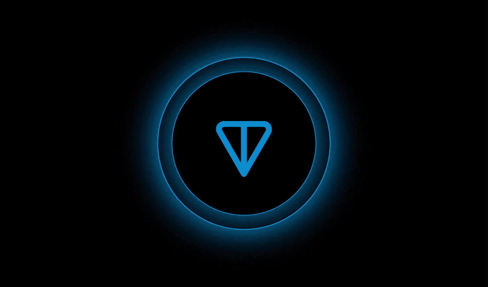

# TON——被高估的项目还是密码市场的未来？

> 原文：<https://medium.com/coinmonks/ton-overrated-project-or-the-future-of-crypto-market-97300af0a86a?source=collection_archive---------21----------------------->

在本文中，我们将剖析过去 2-3 个月中最具争议的项目之一——TON。

本文的主要目标是从不同的角度向您展示该项目，提供关于该项目的所有信息以及我们对这些信息的估计，并总结该项目的用途以及如何从中获利。在某种程度上，这篇文章对有经验的交易者和新手都有好处。请在阅读后留下您的评论，并订阅我们的其他资源；我们想知道你的想法！

# 项目及其令牌

电报开放网的开放网继承者——本地令牌网克的继承者。

# 是什么项目？

TON 是第一层区块链。

开放网络(以下简称 TON)的前身电报开放网络(以下简称 gram)的工作始于 2018 年。Gram 在 2018 年 4 月向投资者进行了 17 亿美元的私人销售，但筹款并未就此停止。Gram 崩溃的原因是决定在美国管辖下持有 ICO，之后证券交易委员会(SEC)承认 Gram 是一种证券，并宣布之前向投资者出售 Gram 的所有行为都是非法证券分销。美国证券交易委员会和 Telegram 之间发生了诉讼，美国证券交易委员会赢了。因此，Telegram 停止了 gram 的开发，并开始向决定退出该项目的投资者返还资金。TON 项目已经在进行中，有一个开发团队和活跃的用户。许多对 Gram 感到兴奋的人加入了 TON 团队。

# 产品部分

# 关键力学

1.  利益一致性算法的证明—网络安全依赖于验证器检查块，并委托验证器信任其令牌以提高网络安全性
2.  分片—区块链速度、可扩展性和更高的吞吐量
3.  TON 代理—通过分散的 VPN 和类似 TOR 的网络访问 TON 区块链。增加权力下放和可及性。
4.  TON DNS——与以太坊上的 ENS 类似的域名，但由于电报支持，TON 已经集成了它们的应用程序。

# 强项

**TON 的产品优势**不是基于技术堆栈；2022 年，区块链实施并正在实施分片。声称区块链 TPS 正在打破所有记录，可伸缩性是所有团队都在努力解决的关键问题之一。

TON 的优势主要在用户领域，他们致力于改善用户体验和对 TON 的接受度。这绝对是一件好事，或者说如果 Telegram 在 2020 年没有败诉就是一件好事，或者说如果没有审判，ICO 发生在其他任何司法管辖区就更好了。吨，或克，在这种情况下，将已经在资本化的十大项目之一，决定了行业的趋势。

# 弱点

**吨不是自给自足项目**；它的整个成功依赖于一个单一的叙事，电报集成。如果没有 Telegram 的支持，TON 作为一个项目在资本化方面将落后于前一百个项目，它将被人们记住，是的，这是一个坚实的想法，但这些家伙缺乏原创性。

打个比方，想象 Aptos 不是带着创意、可伸缩性、对 L1·区块链的角色的新方法及其独特的概念，而是作为一个有朝一日可能集成到脸书或 Instagram 的项目出现。扎克伯格在推特上发布了他将 Aptos DEX 整合到应用程序中的计划。当然，每个人都会喊出“LFG”和“到月球上去”这个贴切的口号，但是这个项目将不再是独一无二的了；我们将不再能够将 Aptos 视为一个项目，而是作为社交网络的第三方附件。

这正是吨是什么；项目本身没有引入任何新的想法；它只是一个很可能在某个时候与 Telegram 完全集成的项目。TON 是一个不错的独立项目，但远不是最好的。TON tokens 的独特性和附加值完全取决于帕维尔·杜罗夫的意愿和整合解决方案。

如果任何读者不同意这些主张，考虑一下 TON 作为一个我们以前没有见过的独特项目带来了什么。

**我们来看一些例子:**

以太坊创造了市场上第一个也是最稳定的 DeFi 生态系统，先进的概念和理念(道、DeFi、NFT、SBT、Sharding、ENS、L2 解决方案)都是在以太坊内构思和实施的。

Solana 是一个独一无二的项目，具有独一无二的概念，如无内存池，并结合验证和共识算法来提高 TPS。在产品方面，Solana 使用户在 DeFi 和 NFT 上获得了几十倍的收入，生态系统催生了一些最知名的 Dao 和项目。

Near 仍然被认为是技术最先进的区块链之一，拥有像 EVM 一样的资产转移网络。是的，有营销失言，网络没有得到应有的重视。然而，有一个尝试，以及生态系统内的叙事。

作为一个单独的项目，TON 到底提供了什么？

# 商务部分

# 产品是怎么赚钱的？

任何 L1 解决方案都有 4 种基本的赚钱方式:

1.  销售代表团队在代币总数中所占份额的本地代币。
2.  出售他们的基础设施用于其他项目的商业用途。
3.  投资其他项目。
4.  吸引投资——虽然我们不认为这是一种成熟的赚钱方式，但它确实为运营和战略行动提供了资金。

**让我们剖析每一个，并试图找出吨将如何获利:**

1.  出售代币是一种由来已久的做法；每个人都销售一定比例的代币，这个比例主要由团队对产品的意图决定。如果团队认为其项目是长期的，并且项目中的事情进展顺利，那么通常会出售一小部分令牌，或者根本不出售令牌。如果你有发展的资金，积累原生代币比在市场上出售要有利可图得多，尤其是在市场不景气的时候。
2.  出售他们的基础设施——很少有项目能在这方面获得丰厚的利润；通常情况下，买家是已经从运营中产生利润的大型项目。以太坊等大型活跃区块链项目很好地满足了这些参数。吨缺乏临界质量；该生态系统目前缺乏所需数量的用户和成熟的企业。
3.  投资通常是对生态系统内最有前途的项目或生态系统外有利于生态系统的项目的风险资本投资。平均投资期限为 3-5 年；这种活动不会立即提供资金，因为好的投资者不会耗尽他们所投资项目的资金。代币的价格是最有效的营销工具。从长远来看，这可能是一个很好的收入来源，但不是现在。此外，吨内没有这样有前途的项目；生态系统仍处于早期阶段，最佳投资项目将在稍后出现，即在生态系统初步建立和巩固之后。
4.  吸引投资——这里的一切都很模糊；我们不知道这些投资 TON 的人和公司是谁，所以这一节是基于假设和设想。只有一件事是肯定的:TON 有钱，否则他们将不得不为原生 TON 代币提供所有的营销和项目开发。根据一个版本，在项目结束后，Gram 的一些私人投资者决定将他们的钱投资到 TON。还有人猜测 Telegram 向其子公司项目投资了资金。在 TON 存在的整个过程中，没有关于融资金额和投资轮次的公开信息，我们对早期投资者的股权分割和授权期一无所知，事实上，我们几乎一无所知。

好了，我们已经整理了所有四个吨收入的机会；在项目开发的这个阶段，最重要的是出售代币和吸引投资。考虑到所有的不透明性，在通知新一轮基金募集的政策改变为个人和天使投资之前，基金，特别是在美国管辖范围内的基金，几乎不会决定投资他们的基金，他们中的许多人在 Gram 繁荣时期没有这样做，所以在 Telegram 和 SEC crypto institutes 之间的所有诉讼之后，很可能会决定再保险。这严重限制了 TON 吸引投资的能力。

我们不能说投资者能对价格产生多大的影响，因为我们不知道网络直播和拆分、投资者股份以及令牌经济学的其他关键细微差别。如果我们假设 TON 投资者只对盈利感兴趣，我们已经有了两大群卖家:项目团队和它的投资者。请记住，项目中有一些顾问和验证人员也接收本地令牌，并且必须锁定利润。

# 组

我们对目前的 TON 团队一无所知；此前，格拉姆公司的关键人物是帕维尔·杜罗夫和尼古拉·杜罗夫。Telegram 正式关闭 gram 项目后，Pavel 很可能不再是该团队的一员。由于 Pavel 对 TON 的奉献，人们可以认为他的兄弟 Nikolai 是 TON 项目中的关键人物。没有更多关于该团队的公开信息，也没有任何假设的基础。

# 基金和投资者

所有的投资都是私人的，没有关于个人的信息或对 TON 项目的投资总额是公开的。

# 令牌组学

*   目前代币数量:50 亿吨
*   流通的代币数量:12 亿吨
*   市值:约 30 亿美元。
*   总市值:122 亿美元
*   这种代币采用一种基于潜在通胀率的发行模式，价格越高——利率越高，利率越高——发行量就越高
*   目前的年通货膨胀率为 0.6%
*   吨白皮书中指出的目标年通胀率是 2%

如果发行与通货膨胀率成正比，那么按照目前的 0.6%的利率，我们每年至少将有 2500 万新吨代币，而当达到 2%的目标利率时，我们每年将有 1 亿代币。还应注意，发行通常基于发行的代币数量，我们在市场上拥有的代币越多，发行的绝对数量就越高。

还应该注意，验证器将获得 20%的令牌分发。一个常见的误解是验证器没有运行费用。当然，成本比工作证明矿工低，但不要认为有了 PoS 算法，验证器就不能出售令牌，因为没有交易成本。这些成本是存在的，验证者从利润中拿走一部分也是合理的，这导致了结构性供给。

另一个坏消息是没有提到令牌燃烧机制。没有燃烧机制，代币数量逐渐增加，数量越多，总供给越大；请记住，对于一个令牌的价格上涨，需求必须大于供应。不烧原生代币，供大于求，这种供大于求只会越来越大。TON token 需求目前被视为来自 Telegram 用户的需求，它受到 Telegram 进入新市场和吸引新用户的能力的限制。TON 代币的供应量只受发行量的限制，对 TON 的需求量越大，发行量就越高，从而越快出现供大于求的情况。

所有这一切都是由于投资者、授权和解锁令牌、团队信息缺乏透明度，以及 TON 本质上不是一个独立的项目，而是 Telegram 的附加项目。

还有一些结构性的供求问题。比如创造初始需求还不够；你还必须保持这种需求。如果每个人都想购买吨代币，需求下降，吨和电报应该想办法鼓励用户购买第二轮，否则价格将开始下跌，所有对月亮和 LFG 说的人都将出售，导致期货买家的清算和被迫出售，导致价格暴跌。

# 结论

# 未来有什么期待？

应该从两个角度来看待吨:产品和投机性投资。

从产品的角度来看，由于 Telegram 的支持，TON 可能会获得成功并被大量采用。这种成功的可能性取决于各国政府是否不会因 t on 整合而干涉 Telegram，如果干涉，Telegram 和 TON 是否准备在法庭上反击。如果某些国家的当局强制禁止使用电报，TON 的地位可能会受到威胁。如果 Telegram 和 TON 再次在法庭上被监管机构击败，情况可能会发生变化。如果 Telegram 和 TON 能够顺利完成所有任务，那么 TON 作为一个项目和资产将会被广泛接受，至少在 Telegram 生态系统中是如此。

从投机和投资的角度来看，不确定性更大；该项目有许多必须解决的缺陷，我们不知道主要利益相关者的动机。如果整合成功，TON 将很有可能在价格上达到新的 ATH，使 x2–3 达到当前价值，并进入资本化方面的前 10 名项目。如果市场进入增长周期，TON 将成为下一个周期市场上最昂贵的令牌之一。

如果吨整合失败，那将是彻底的失败，吨的价格将下跌-60–70%。

如果我们考虑一个中性的场景，其中集成是成功的，但在 Telegram 内的 TON 使用在一些国家不可用，TON 的价格在短期内仍将打破 ATH，一切将取决于团队。

# 我们的产出:长还是短

这完全取决于投资视野和等待能力；从短期来看，这似乎很容易赚钱，但从长期来看，风险会更高，出现黑天鹅产品或市场的可能性也会更大。

短期内的做多或做空本质上是押注帕维尔·杜罗夫是否能实施他的所有计划，他是否为监管要求做好了准备，以及他是否已经得出 2020 年后的结论。

不管是长是短，项目团队能否维护产品，能否引入独特的机制和叙事来维护生态系统，团队是否有消除弱点的计划，这是你长期的赌注。这也是对投资者希望锁定尽可能多的收入以及项目估值的押注。

我们看到一个画面，新 ATH 突破前短期很长，然后你看市场，ATH 击穿后长期很短，但是你必须考虑产品怎么发展，什么市场。人们看不到牛市中的弱点和漏洞是因为过度兴奋，但在牛市结束后，你可以从这些弱点中获利。

# 我们最后的话

永远记住，除了你的基本策略，一切都取决于你的风险承受能力，你的等待能力，以及你的基本原则和信念。我们发布我们对各种项目的意见和评估，前景如何，以及这些前景如何为每个人提供机会。

我们的目标是提供别人没有的价值。

> 订阅我们的资源，与我们交易！
> 在[媒体](/@SunflowerCorpAdmin)或[推特](https://mobile.twitter.com/sunflower_corp)上关注[向日葵公司](https://sunflowercorp.com/)定期更新热门的秘密新闻。

[*向日葵公司*](https://sunflowercorp.com/) *—专注于最佳交易体验和卓越技术的新型加密货币衍生交易所。*

*我们提供杠杆高达 x100 的 BTC/USDT 永久期货，以及最具趋势性的工具。当您与我们交易时，您将获得一个可定制的交易终端、各种图表、技术分析工具、各种订单类型以及“止损”和“获利”订单选项。*

> 交易新手？在[最佳密码交易所](/coinmonks/crypto-exchange-dd2f9d6f3769)上尝试[密码交易机器人](/coinmonks/crypto-trading-bot-c2ffce8acb2a)或[复制交易](/coinmonks/top-10-crypto-copy-trading-platforms-for-beginners-d0c37c7d698c)