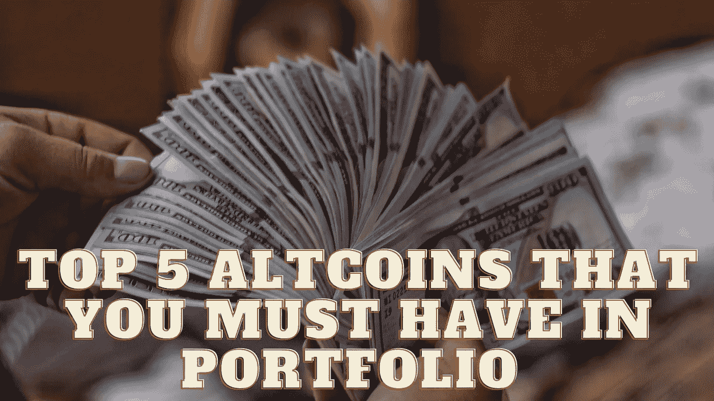

# 投资组合中必须拥有的前 5 种备用硬币

> 原文：<https://medium.com/coinmonks/top-10-altcoins-that-you-must-have-in-portfolio-29eabf137e47?source=collection_archive---------13----------------------->

Source photo Unsplash.com

# 卡尔达诺

Cardano 是一项公开、开源的区块链技术，由前以太坊联合创始人 Charles Hoskinson 于 2015 年创建。它允许分散的点对点交易。

Cardano 率先实施了利益证明(PoS)共识，这使得矿工变得多余，同时降低了交易成本…