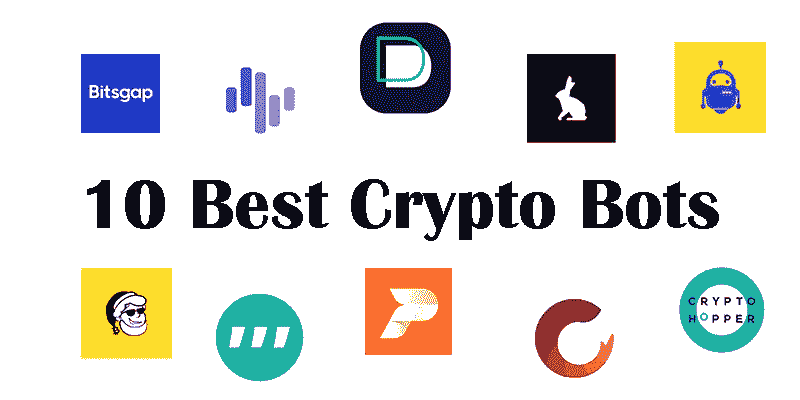

# 十大最佳加密机器人

> 原文：<https://medium.com/coinmonks/top-10-best-crypto-bots-960c968a2cac?source=collection_archive---------7----------------------->

Crypto bot 是一款自动化软件，旨在监控、分析和执行数字货币交易所的交易。通常，这些类型的机器人使用算法交易程序，根据特定的策略自动买卖加密货币。

加密货币交易机器人的目的是增加利润，保护交易者免受投资领域可能出现的风险。这些智能机器人帮助交易者在一个地方管理他们所有的交易，而不需要经常搬家。

10 best crypo bots

**如何选择最好的加密货币交易 bot？**

要选择最佳的加密货币交易机器人，您应该选择具有以下因素的机器人:

**高安全性**

**性能可靠**

**显著的盈利能力**

**拥有自动交易**

**简单的用户界面和易用性**

使用加密货币交易机器人时，要注意不要把所有的管理都交给机器人。你也应该小心不要长时间平仓。

**加密货币交易机器人的优势**

从机器的反应速度到处理能力，加密交易机器人有很多优势。

**1)** **消除情绪**

一个加密交易机器人的决定是合乎逻辑的和即时的，并根据特定的策略运作。消除 FOMO、对利润的贪婪和人类对不确定性的恐惧会创造出一个更简化的交易过程。

**2)高效率**

交易机器人会立即做出反应，并在你偏好的设置范围内进行交易。将即时决策与市场信息、交易模式和风险评估的快速处理时间相结合，您将体验到无与伦比的效率。加密货币交易机器人消除了人为错误，同时也最大限度地减少了手动管理和分析大型数据集的潜在延迟。

常规贸易

尽管在像数字货币这样动荡的市场中没有单一的成功公式，但通过机器人自动化交易过程可以确保交易的稳定性和有序性。机器人在预定的交易条件下运行，通过不断的市场分析确保长期业绩。

**4)一天 24 小时活跃**

加密市场永远不会关闭，交易机器人是任何想 24/7 获取最大收益的人的唯一解决方案。

**5)社交交易**

除了发展你自己的交易策略，你可以选择跟随其他交易者和产品中使用的其他策略。一个好的策略市场内置在你选择的交易工具中，可以让你轻松地从有利可图的交易策略中获益。

在下文中，您将看到最佳加密货币交易机器人的列表，并了解它们的功能和应用。

**1。Pionex 交易机器人**

[**Pionex**](https://www.pionex.com/) 交易机器人是最好的加密货币交易机器人之一。使用 Pionex bot，您可以 24 小时自动检查您的所有交易，而无需重复检查加密货币市场。

Pionex 是一个内置交易机器人的加密货币交易所。你可以使用 18 个独特的交易机器人，他们是免费注册的。这些机器人允许你自动化你的投资策略，这样你就不需要不断地监控市场。

*   **Pionex 特性:**

-与交易量相比，交易费非常低。

-为散户投资者免费创建 12 个交易机器人

-为散户投资者提供 12 个免费交易机器人

-这个机器人完全免费

-交易所:币安、火币环球和 Pionex

**2-取消验证交易机器人**

[**Dealerify**](https://dealerify.io/) 是最智能的加密货币自动交易机器人之一，允许管理可能的市场风险。

它适合所有技能水平的交易者。这个机器人有一个非常简单友好的用户界面，非常适合数字资产保护和盈利。

如果你想第一次尝试交易机器人，免费试用 Dealerify 是一个很好的开始。这个平台允许你直接从 Dealify 界面进行交易，而不是去交易所。

由于提供了根据用户需求选择利润和风险的能力、访问以前数据的能力、免费的技术工具以及在不同交易所使用的能力等服务，Dealerify bot 被列入顶级加密货币 bot 的名单中。

*   **取消验证功能**

-简单且合适的用户界面

-它能够根据用户需求在利润和风险之间做出选择。

-用户可以自己决定交易的最大风险。

-定制 bot 服务是可能的。

-为交易商提供非常好的支持

-它自动支持进行的交易。

-交易者可以进行技术分析。

-提供高安全性和 API 保护。

-提供清晰准确的报告

**3- Cryptohopper 交易机器人**

加密货币市场中另一个受欢迎的交易机器人是 Cryptohopper，它因其向用户提供的功能而受欢迎。这个机器人的特点之一是在一个地方同时管理不同交易所的用户账户。

这个机器人有一个程序，具有方便和友好的用户界面，可以安装在 IOS 和 Android 操作系统上。这种交易机器人受欢迎的另一个原因是提供定期和准确的业绩报告。

*   **隐漏斗特征:**

-您可以实现不同的策略和模式

-这个机器人可以访问许多交易所，包括币安，Binance.us，Bitfinex，Bittrex，比特币基地 Pro，HitBTC，Huobi，北海巨妖，KuCoin，OKEx，Poloniex。

-用户的个人和技术分析

-高度安全

-可以免费使用

-提供及时的报告。

-确定各种战略和模式

**4-3 个商业交易机器人**

购买加密货币及其交易的最佳机器人之一是 3Commas，它以完全智能的方式活跃在短期、中期和长期交易中。这个机器人有一个非常简单和流畅的用户界面，非常适合数字资产保护和盈利。

[**3Commas**](https://3commas.io/) 机器人是最透明的系统之一，它使用您设置的参数工作，并通过金融保护算法保护您的资金。

这个机器人交易员有一个 Android 和 IOS 移动应用程序，方便用户访问机器人的服务。此外，这款机器人还支持回测以及平均成本等多项指标。

交易机器人 3commas 中的服务以两种方式提供，免费和专业，为了访问这个交易机器人中的专业服务，用户需要每年支付 594 美元。

*   **3 常用功能**

-能够从其他机器人复制设置数据

-适用于 Android 和 IOS 用户

-支持回溯测试。

-交易所:币安、币安、德克斯、约比特和…

**5-has 在线交易机器人**

另一个非常强大的加密货币交易机器人是 HassOnline 机器人。这个机器人适合新手甚至完全专业的交易者。即使你很好地掌握了密码市场的交易脉搏，并且是一名专业分析师，HassOnline robot 也可以帮助你盈利。

这个机器人可以访问的用于交易数字货币的交易所有很多，包括:

币安、Balance Futures、Binance.us、Bitfinex、BitMEX、Bitpanda Pro、Bitstamp、Bittrex、Cex.io、比特币基地 Pro、Deribit、Gemini、HitBTC、Huobi Global、Ionomy、北海巨妖、北海巨妖期货、KuCoin、OkCoin、OKEx、OKEx Futures、Poloniex

*   **has online 特性:**

-支持回溯测试。

-这个机器人活跃在比特币基地、币安、Bittrex 等地。交流。

**6- Zignaly 交易机器人**

第六个交易机器人叫做 Zignaly，实际上是一个进行交易的终端。像加密货币市场一样，这个机器人可以全天候使用。这个机器人有一项服务，你可以用它来监控市场和加密货币信号。

该机器人具有加密货币市场的实时监测和控制服务，可以在不同的系统中启动，并在任何情况下检查交易结果。

*   **Zignaly 特性**

-可在各种智能设备上使用

-在不同情况下分析和检查结果的可能性

-该服务免费使用

-分割交易者目标利润的能力

**7-虾肉交易机器人**

在最好的加密货币交易机器人中，Shrimpy bot 有话说，它其实是一个加密货币的社交交易平台。对于用户来说，有现成的策略可以帮助他们在市场中表现出色。它还降低了交易风险，帮助用户制定股票策略。

这个机器人可以进入许多交易所进行数字货币交易，包括:

Bibox、币安、Binance.us、Bitfinex、BitMart、Bitstamp、Bittrex、Bittrex Global、比特币基地 Pro、HitBTC、Huobi Global、北海巨妖、KuCoin、OKEx、Poloniex

*   **虾米特色:**

-实时查看价格

-比特币基地、北海巨妖、KuCoin、Bitfinex 等交易所。

8- TradeSanta 交易机器人

被列入顶级加密货币交易机器人名单的 Trade Santa trading robot 提供了有助于交易员管理风险的服务。此外，这个 bot 提供了访问权限，包括与每个用户的交易兼容的交易风格和策略的选择，它可以用于启动不同的买入和卖出头寸。

他们有很棒的教程和全天候支持。您可以使用他们的长模板或短模板构建自己的策略，或者从头开始定制自己的策略。他们目前支持 6 个交换。

*   **TradeSanta 特性**

-用于购买和销售交易

-使用现成模板的能力

-全天候支持

-它在币安、Huobi、Upbit、HitBTC、Bittrex 和 Bitfinex 等交易所运营。

-设置这个交易机器人买卖头寸的可能性

-买卖大量加密货币的可能性

-访问大量预设模式

**9- Bitsgap 交易机器人**

Bitsgap 是最好的交易机器人之一，交易者可以使用它来轻松管理他们的资本。在这个机器人中创建一个策略不需要太多时间，而且很容易实现。

此外，该工具与许多交易所连接，并可访问它们进行交易，包括:

币安，Bitfinex，OKEX，Huobi，HitBTC，Bittrex，Kucoin，Exmo，北海巨妖，CEX。IO，Livecoin，Poloniex，Bitstamp，Coinbene，Coinex，Gemini，Gate.io，Liquid，Yobit，Bibox，Bit-Z，DDEX，BigOne，Bithump。

*   **Bitsgap 特性**

- 24 小时全自动操作

-交换 30 多对加密货币的可能性

-无需下载和安装应用程序即可使用。

-活跃于币安、HitBTC、BigOne 等交易所。

**10- Coinrule 交易机器人**

这个机器人是一个自动工作的平台。Coinrule bot 允许用户以超过 120 种策略模式在不同的交易所完成交易。

Coinrule 总部位于英国，是市场上新的交易机器人之一，其重点是使交易策略设计尽可能无障碍。该平台拥有漂亮的用户界面和用简单术语编写的大量教程部分，是为初学者设计的。

该机器人可以访问一些交易所来执行加密货币交易，包括:

Bitpanda Pro，Bitstamp，Bittrex，比特币基地 Pro，HitBTC，北海巨妖，Liquid，Poloniex，OKEx

*   **Coinrule 特性**

-在正确的时间提供服务

-可以每周 7 天、每天 24 小时进行交流。

- Coinrule 提供了用户可以用来轻松投资的指标

*   交易所:Bitfinex，HitBTC，币安美国，币安，波兰和…

> 交易新手？尝试[加密交易机器人](/coinmonks/crypto-trading-bot-c2ffce8acb2a)或[复制交易](/coinmonks/top-10-crypto-copy-trading-platforms-for-beginners-d0c37c7d698c)