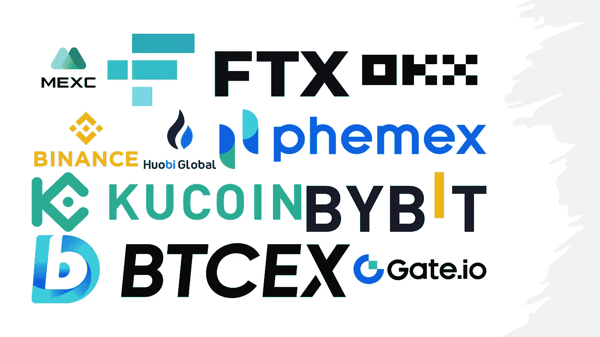

# 十大加密货币衍生品交易所

> 原文：<https://medium.com/coinmonks/top-10-cryptocurrencies-derivatives-exchanges-ee176dfc7cb7?source=collection_archive---------13----------------------->

## 币安，FTX，奥克萨斯州，库科恩，等等！

Top 10 Cryptocurrencies Derivatives Exchanges

衍生品是任何产品或合同，其价值由一些基础资产决定。一些专家也将自动化期货交易视为衍生品。

最常见的加密货币衍生品有:

*   期货合约
*   选择