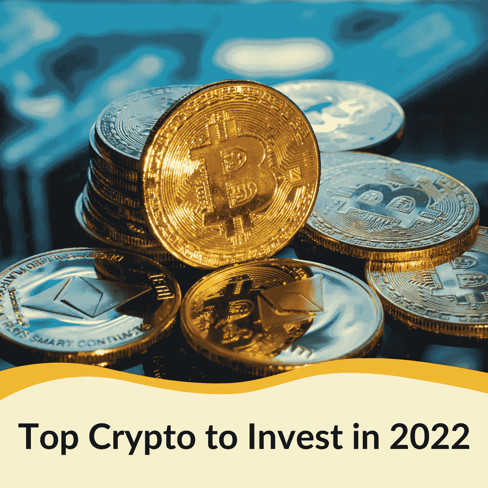

# 2022 年投资的十大加密货币—第一部分

> 原文：<https://medium.com/coinmonks/top-10-cryptocurrencies-for-your-investment-in-2022-part-i-f5aaa33b3bcf?source=collection_archive---------13----------------------->

选择一种有利可图的加密货币进行投资反映了你对市场趋势的把握程度以及你的市场预测的准确性。更新关于金融市场和加密市场的新闻，特别是，应该伴随着对你的工具的基本面的掌握。此外，你可以在可靠的来源中查看一些顶级加密货币的参考资料。这篇博客将带你浏览**十大增长惊人的加密货币**，并期望帮助你迅速度过加密的冬天。

# 1.tamadoge——最好的未来迷因硬币

*Source: tamadoge.io*

除了支持之外，meme 令牌还专注于提供实用性，以便用户拥有更流畅、更令人兴奋的体验。Tamadoge 是我们为您的投资选择的最佳加密货币之一。

一款即将推出的“玩到赚”(P2E)元宇宙游戏——tam hore 使用 Tamadoge (TAMA)作为货币。TAMA 预售于 2022 年 9 月 18 日完成，募集资金 1900 万美元。当在 OKX 交易所上市时，它现在是 2022 年最具上行潜力的顶级加密货币之一。

 [## NFT 为假人解释道

### 作为一个交易者，利用更传统的交易工具——如股票、商品、期权或期货——进行…

medium.com](/@libraryoftrader/nft-explained-for-dummies-f8a53cdc1e28) 

**为什么玉米粉蒸肉很热？**这个迷因硬币允许每个人铸造狗，繁殖和战斗他们自己的塔马多格 NFT。你可以从 TAMA 商店购买带有特定属性、优点和缺点的宠物。许多密码爱好者认为它是市场上最好的战俘硬币之一。

# 2.战斗无限(IBAT)——最好的新货币

*Source: BTCC*

战斗无限出现在市场上，作为一个辉煌的元宇宙生态系统，具有引人注目的 P2E 元素 KYC-由 CoinSniper 验证。这种加密使用户能够创建自己的头像，并参与战斗无限的游戏，获得可伸缩的奖励。

IBAT 的预售是 2022 年售罄最快的预售之一。你可以使用这枚硬币不仅活跃在战斗无限生态系统中，还可以活跃在六个不同的平台中。总部设在区块链的梦幻体育联盟的首次推出也解释了它的受欢迎程度。

 [## 铸造 NFT 意味着什么？你需要知道的一切

### 介绍

medium.com](/@libraryoftrader/what-does-minting-nft-mean-everything-you-need-to-know-c14e94e707dd) 

此外，战斗无限作为一个内置的 NFT 市场，以便用户可以铸造，货币化他们的作品，并购买物品来定制他们的头像。他们可以购买虚拟土地，通过游戏中的广告牌做广告。除了所有这些事情，你可以在战斗无限生态系统内交换 DeFi 来简化代币交换。

IBAT 总共有 100 亿枚代币，其中 28%现在可供通过预售购买的投资者使用。

**为什么《战斗无限》是最好的元宇宙硬币之一？**最大的一个原因是，币以平台刺激的奇幻联盟元素奖励熟练的玩法。使用 IBAT 的电报社区是开放讨论和共同成长的。

# 3.幸运块(LBLOCK)——NFT 游戏的最佳密码

*Source: InsideBitcoins*

幸运块是一种相对较新的加密货币，它获得了引人入胜的一等奖和 NFT 奖。它还涉及一个新的加密游戏平台，其目标是通过各种形式，如抽奖、赠品和玩赚游戏，彻底改变 3300 亿美元的游戏。

**为什么幸运街区会继续增长？**最大的优势之一是 Lucky Block 可以提供对现有 jackpot 产品的透明度和信任。Web 3.0 的分散网络也有助于这个平台获得流行热潮。

 [## 区块链技术:你想知道的一切

### 如何简单解释区块链？

medium.com](/@libraryoftrader/blockchain-technology-everything-you-want-to-know-8539f1771d61) 

玩家还可以通过币安智能链(BSC)区块链上所有交易的透明度，对慈善捐款的目的地进行投票。他们可以节省使用区块链的成本。平台向每个代币持有者支付每个累积奖金的 10%的分配。所以，他们可以有固定的被动收入来源。

# 4.秘制小吃——美食的最佳象征

*Source: BSC News*

安全高调的合作关系使加密零食获得了公众的关注和欢迎。加密小吃代币在网上赌场和游戏等游戏领域增长最快。

它与 300 多个不同的 iGaming 网站和 800 多家在线企业建立了广泛的综合合作关系。CoinsPaid 是 Crypto 零食的合作伙伴之一，因为该公司是支付网关的领导者。

 [## 无聊的猿 NFT:为什么它很贵？

### 无聊猿 NFT 是最著名的 NFT 符号之一，吸引了许多有影响力的艺术家交易或显示所有权…

medium.com](/@libraryoftrader/bored-ape-nft-why-is-it-expensive-61598dc65185) 

不仅在网上赌场，加密小吃在风险投资公司领域也很热门。因为它在 GEM Digital Limited 的帮助下保护了 5000 万美元的投资承诺，GEM Digital Limited 是一家专业的公用事业令牌数字资产投资公司。

# 5.DeFi Swap 和 DeFi Coin (DEFC) —最好的分散交易和本地令牌

*Source: Every Bit Helps*

DeFi Coin 在 14 天内推动了 462%的天文数字价格涨幅。随着 DeFi Swap 提供更多功能，如自动化流动性池和 DEFC 代币持有者 10%交易的一半，这一数字将继续上升。

DeFi 硬币的不断创新使其成为该领域最好和最受欢迎的硬币之一。未来的增长显然是可能的；因此，我们将其列入了 2022 年值得投资的加密货币名单。

 [## 如何度过难熬的密码寒冬？

### 加密市场就像过山车。它用许多巨大的胜利吸引和愉悦人们，尽管他们可能会遭受…

medium.com](/@libraryoftrader/how-to-get-through-the-tough-cryptos-winter-4b047aba4196) 

# 敬请关注

这篇博客带你了解五种在混乱中持续增长的加密货币。因此，它们有助于你考虑是否应该投资它们。我们将在第二部分带来另外五种潜在加密货币的更多更新。

> 交易新手？试试[加密交易机器人](/coinmonks/crypto-trading-bot-c2ffce8acb2a)或者[复制交易](/coinmonks/top-10-crypto-copy-trading-platforms-for-beginners-d0c37c7d698c)