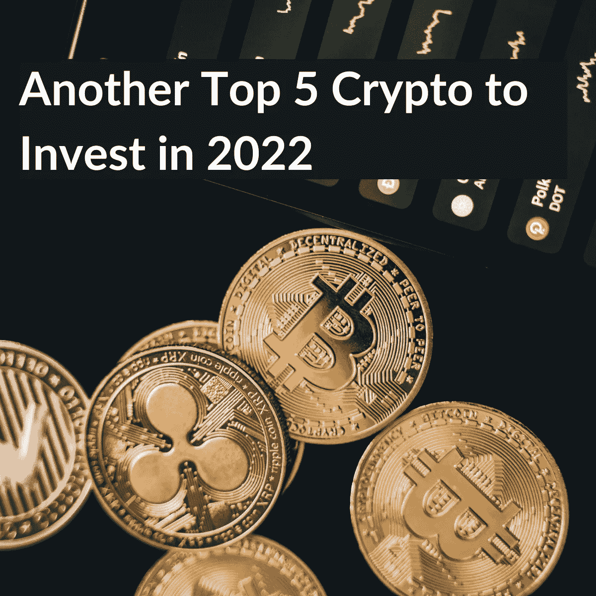
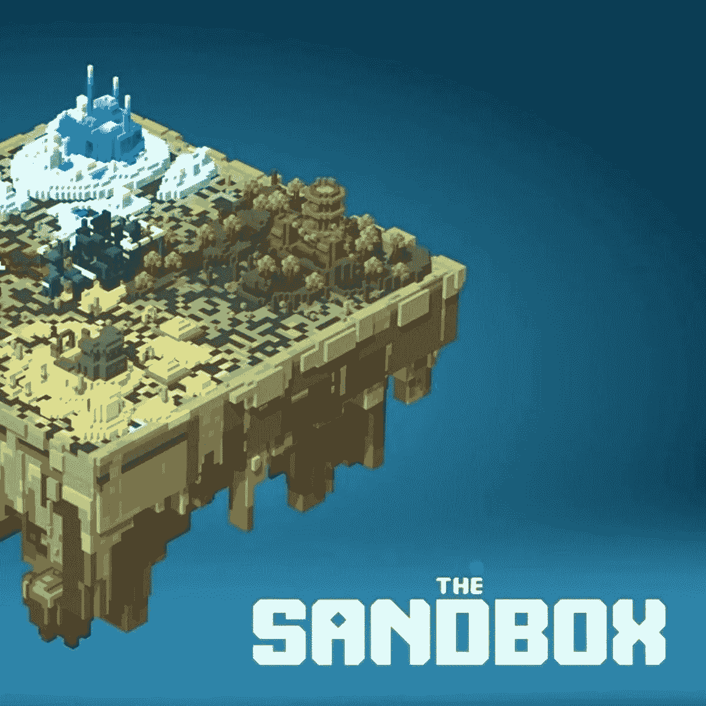
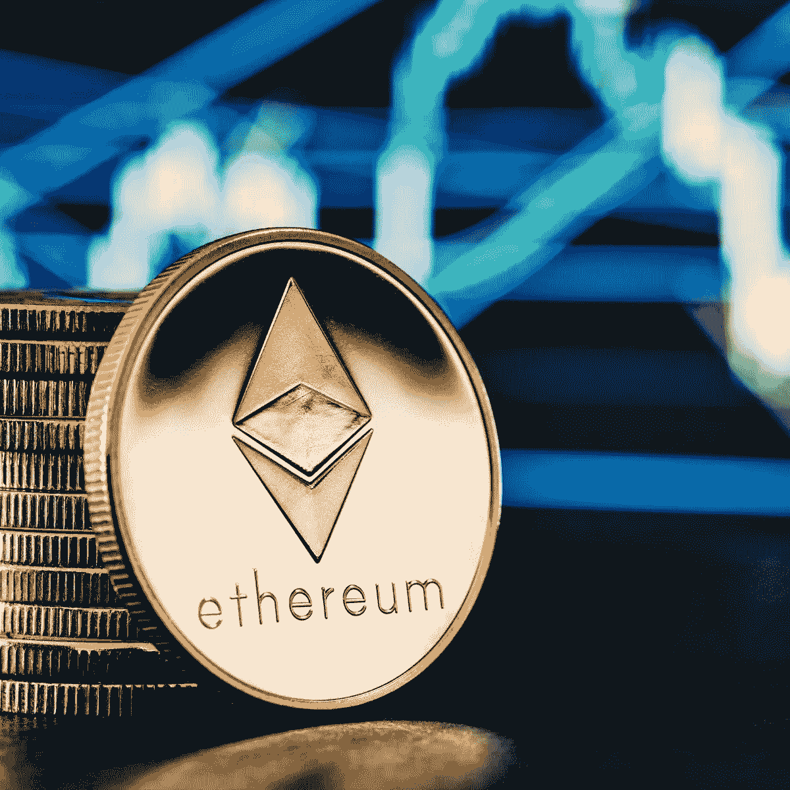
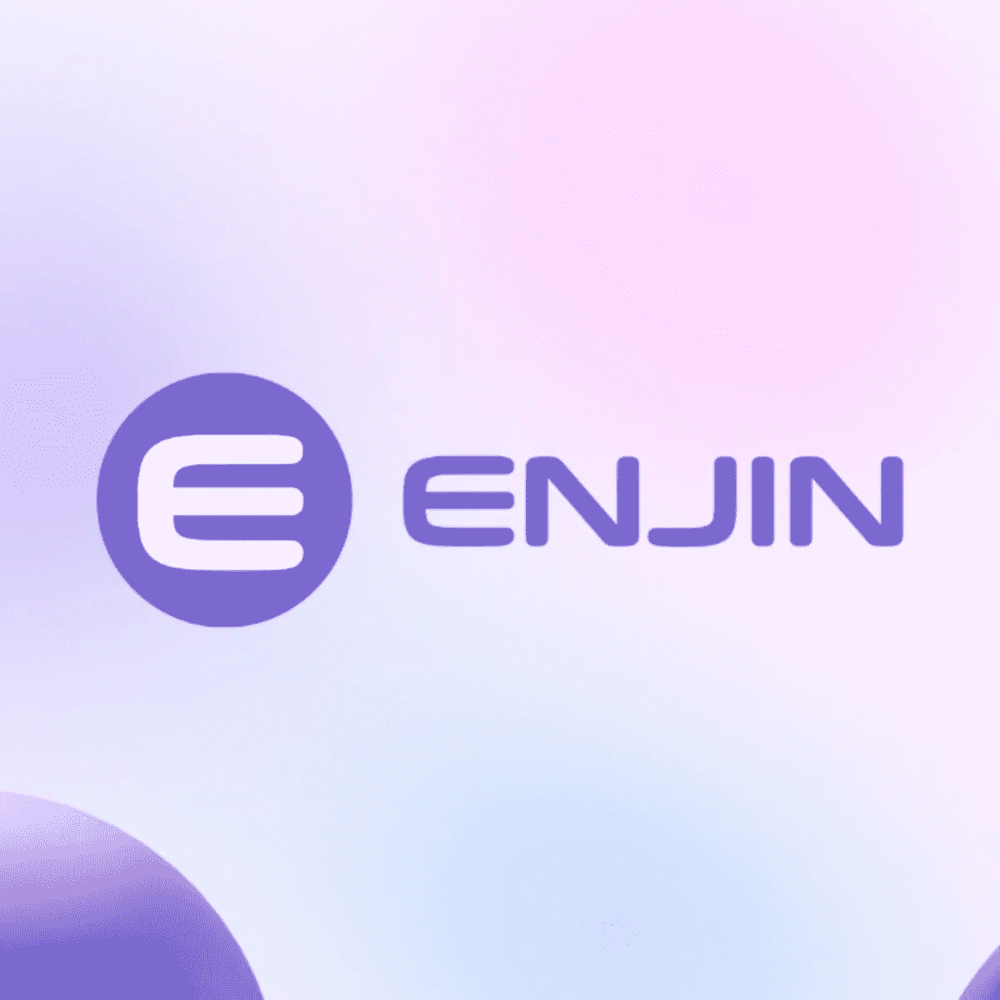

# 2022 年投资的十大加密货币—第二部分

> 原文：<https://medium.com/coinmonks/top-10-cryptocurrencies-for-your-investment-in-2022-part-ii-da391c6e5d52?source=collection_archive---------46----------------------->

在之前的博客中，我们根据对其内在价值和最近几个月的状况的研究，向您介绍了五大加密货币或 NFT。我们在这个博客系列中提到的领域是 P2E(游戏赚钱)游戏产业。因为这是一种趋势，你应该注意到它越来越受欢迎。我们将继续这个系列，在 2022 年，您可以将另外五种加密货币添加到您的观察列表中。

 [## 2022 年投资的十大加密货币—第一部分

### 选择一种有利可图的加密货币进行投资反映了你对市场趋势的把握程度以及你的…

medium.com](/@libraryoftrader/top-10-cryptocurrencies-for-your-investment-in-2022-part-i-f5aaa33b3bcf) 

# 1.雪崩(AVAX)——以太坊的重要替代品

*Source:* [*https://avaxnfts.com/*](https://avaxnfts.com/)

Avalanche 是一个可扩展的区块链网络，因此它可以超越当前加密领域中的“老大”。Avalanche 使用的不是一个区块链，而是三个独立的链，每个链都有特定的任务。因此，它甚至可以每秒处理 50，000 个事务(TPS)。

 [## 区块链技术:你想知道的一切

### 如何简单解释区块链？

medium.com](/@libraryoftrader/blockchain-technology-everything-you-want-to-know-8539f1771d61) 

这个平台吸引了 dApp 开发者的注意，因为他们可以使用比其他网络更低费用的平台。由于 Avalanche Consensus 协议，它在保持可扩展性水平的同时，具有更可承受的交易费用。

Avalanche 的本机令牌是创建 AVAX 来支付网络费用。此外，这是理想的赌注。任何 AVAX 网络验证者可以赚取高达 10%的 APY，这比传统银行部门的利率要高。

# 2.沙盒(SAND)——一个将元宇宙和游戏数字资产货币化的平台

*Source: Crypto Ticker*

沙盒打开了一个生态系统，在这个生态系统中，游戏者通过不可替代令牌(NFT)和实用令牌$SAND 来创建、拥有和货币化他们的活动。玩家可以使用 NFTs 为他们的数字资产分配可验证的所有权。此外，将工具整合到游戏和交易中有助于玩家将资产或他们玩游戏的时间货币化。

沙盒虚拟世界，也称为元宇宙，拥有带有土地令牌的数字房地产地段。因此，你可以成为一个数字财产开发商，并相互交流。人们看到了沙盒的未来，因为它使他们能够更容易地在元宇宙投资。

# 3.以太坊(ETH)——区块链网络提供智能合约

以太坊并不是一个新名字，而是钱币领域的一个大牌。它是最著名和最受欢迎的 altcoin，具有分散式应用程序(dApp)和智能合约功能。它可以消除某些交易中与中间人相关的费用和问题。

 [## 以太坊与比特币:哪个是更好的投资？

### 投资以太坊还是比特币可能是许多有抱负的加密交易者关心的问题。这两种硬币都被誉为…

medium.com](/@libraryoftrader/ethereum-vs-bitcoin-which-is-a-better-investment-668b59d411a7) 

虽然以太坊没有逃脱加密冬天的入侵影响，但由于其内在价值高，它仍然上升到加密投资的榜首。这枚硬币的可扩展性和成本节约标志着它值得您的投资。

# 4.金恩(ENJ)——游戏社区和虚拟商品的数字市场

*Source:* [*https://enjin.io/*](https://enjin.io/)

金恩硬币是一款专注于元宇宙游戏的产品，为玩家提供代币来拥有 go-to 资产。它被认为是最大的游戏社区平台，拥有超过 25 万个游戏社区。它吸引了全球超过 1870 万游戏玩家。

金恩团队因其在 NFT 领域的创新理念和发展而闻名。它的令牌遵循以太坊令牌标准来专门化 NFTs-ERC-1155。金恩的开发工具包促进了整合到游戏中的顺利部署。

# 5.ApeCoin(猿)——迷因币领域的后起之秀

*Source: Forkast*

ApeCoin 的俱乐部“无聊猿游艇”吸引了许多名人和艺术家创建 NFT，并通过复杂的系统将他们的作品货币化，因此 Ape coin 具有巨大的增长潜力。

 [## 无聊的猿 NFT:为什么它很贵？

### 无聊猿 NFT 是最著名的 NFT 符号之一，吸引了许多有影响力的艺术家交易或显示所有权…

medium.com](/@libraryoftrader/bored-ape-nft-why-is-it-expensive-61598dc65185) 

ApeCoin 基于以太坊区块链，因此其代币继承了这种区块链技术的优越特性。ApeCoin 主持了许多即将到来的元宇宙项目。因此，增长保持上升，而不是被隐秘的冬天暂停。BAYC 仍然是市场上最贵的 NFT 之一。

# 在你走之前

希望这个列表能帮助你完善你的观察列表，或者对你的投资组合有更多的建议。在跌宕起伏的市场中，好的参考资料对你来说是一个很好的指南。当然，你应该通过深入的分析和强大的工具来检查它们，以增加你的加密投资的盈利能力。

你可能也会对 Library of Trader 的其他文章感兴趣。

 [## 如何度过难熬的密码寒冬？

### 加密市场就像过山车。它用许多巨大的胜利吸引和愉悦人们，尽管他们可能会遭受…

medium.com](/@libraryoftrader/how-to-get-through-the-tough-cryptos-winter-4b047aba4196)  [## 什么是加密交易？以及你可能会问的其他问题

### 当你第一次接触加密货币时，你需要一本加密货币入门指南。在这篇博客中，你将…

medium.com](/@libraryoftrader/what-is-crypto-trading-and-other-questions-you-might-ask-64f169e881e0) 

> 交易新手？试试[加密交易机器人](/coinmonks/crypto-trading-bot-c2ffce8acb2a)或者[复制交易](/coinmonks/top-10-crypto-copy-trading-platforms-for-beginners-d0c37c7d698c)