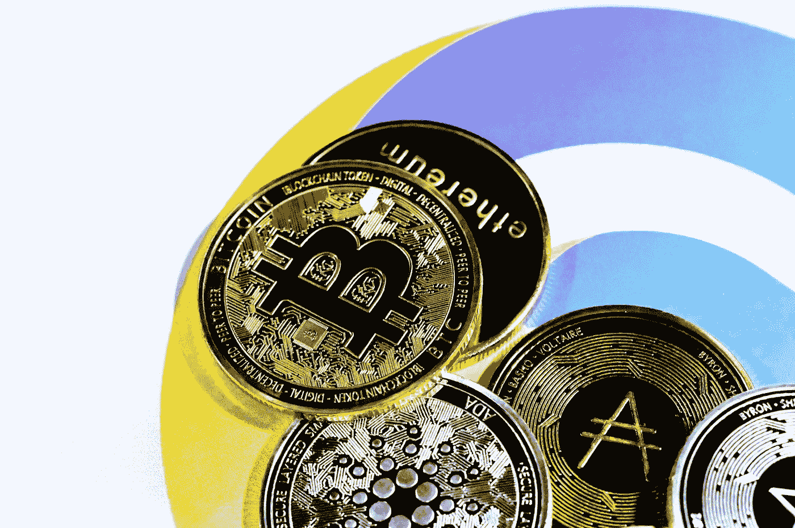

# 2023 年前购买的 7 大加密货币

> 原文：<https://medium.com/coinmonks/top-10-cryptocurrencies-to-buy-before-2023-929bfe2789ea?source=collection_archive---------4----------------------->

Source photo [HD photo by Traxer (unsplash.com)](https://unsplash.com/photos/5kApSEYgMqw)

# 比特币(BTC)

到目前为止，比特币(BTC)是最安全的投资加密货币。比特币(BTC)是投资者在考虑安全性时想到的加密货币。出于这个原因，当投资者从交易平台上移除他们的持股时，比特币将获得价值。此外，比特币的广泛接受和预期的长寿命使其成为一种有吸引力的…