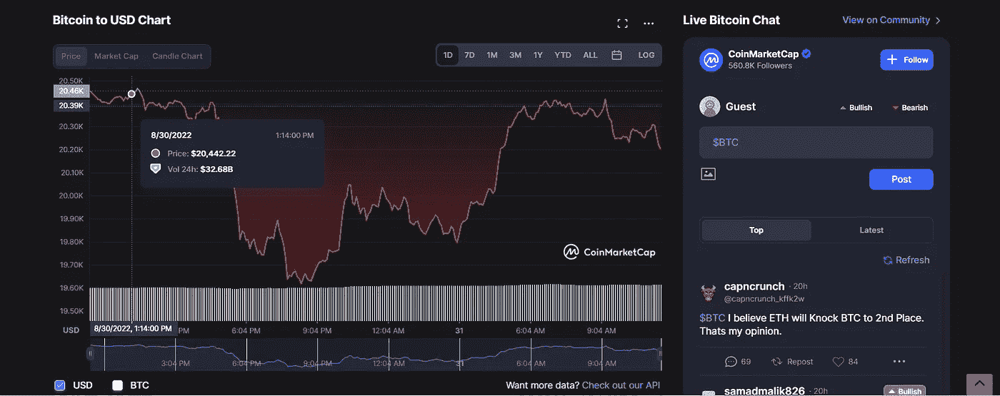

# 2022 年 9 月投资的十大加密货币

> 原文：<https://medium.com/coinmonks/top-10-cryptocurrencies-to-invest-in-september-2022-24775a37ae33?source=collection_archive---------14----------------------->

在之前的帖子中，我们讨论了 8 月份应该购买的前 [10 种加密货币，随着这个月即将结束，我们期待着 9 月份，我已经仔细地写下了未来投资的最佳货币。](https://36crypto.com/top-10-cryptocurrencies-in-august-2022/)

在市场崩盘之际，加密货币继续受到欢迎。越来越多的人对这一趋势感兴趣，并寻求投资。有了大量可用的加密货币，可能很难做出正确的选择来投资。

在投资任何密码之前，进行研究和核实事实总是明智的。我根据他们的市值组织了这个列表。首先，让我们定义什么是加密市值。

# 什么是加密市值？

简单来说，市值可以解释为所有已开采硬币的总价值。计算 crypto 市值的公式保持不变。只要将流通中的硬币总数乘以每枚硬币的价格，得出的数字就是市值。

现在我们已经了解了什么是市值，让我们继续讨论主要问题。9 月份投资的十大加密货币包括比特币、以太坊、Cardano、Tether、Dogecoin、Polkadot 等

# 2022 年 9 月投资的十大加密货币

*   比特币(BTC)。市值 3885.9 亿美元
*   以太坊(ETH)。市值 1927.62 亿美元
*   系绳(USDT)。市值 675.87 亿美元
*   美元硬币(USDC)。市值 522 亿美元
*   XRP (XRP)。市值 164.29 亿美元
*   卡尔达诺(阿达)。市值 149.97 亿美元
*   索拉纳(SOL)。市值 114.25 亿美元
*   Dogecoin (DOGE)。市值 85.17 亿美元
*   波尔卡多(点)。市值 77.90 亿美元
*   币安硬币(BNB)。市值 70.4 亿美元

# 比特币(BTC)。市值 3885.9 亿美元

自从神秘人“中本聪”在 2009 年创造比特币以来，比特币已经慢慢占领了加密货币的世界，并巩固了其作为顶级加密货币的地位。根据 CoinMarketCap 的数据，这一价格多年来一直在上涨，截至撰写本文时，目前的交易价格为 19，652 美元。

回到 2021 年 11 月，比特币经历了历史新高，达到了惊人的 68，000 美元。自那以后，它的价格一直在下降，这使它成为一种非常不稳定的资产。**比特币市值 3885.9 亿美元**。

[*在本帖中了解更多关于比特币的信息。*](https://36crypto.com/what-is-bitcoin-and-why-is-it-valuable/)

# 以太坊(ETH)。市值 1927.62 亿美元

以太坊被称为继比特币之后第二受欢迎的加密技术，被许多人视为未来的[货币。](https://36crypto.com/michael-saylor-says-ethereum-will-be-the-currency-of-the-future/)它成立于 2015 年，自那以来也取得了一定的发展。以太坊与智能合约配合得很好，包括 NFT 在内的许多其他密码都建立在以太坊区块链之上。

在合并的消息开始流行后，以太坊在 8 月份有了向上的增长。8 月中旬，它的交易价格为 1982 美元，此后一直下跌。在撰写本文时，ETH 目前的交易价格为 1484 美元。**以太坊市值 1920 亿美元。**

[*在本帖中了解更多关于以太坊的信息。*](https://36crypto.com/what-is-ethereum-and-how-is-it-different-from-bitcoin/)

# 系绳(USDT)。市值 675.87 亿美元

系绳被认为是市场上最受欢迎的稳定币。与其他密码不同，它不受波动性的影响。USDT 的价格与美元、英镑和欧元等顶级法定货币挂钩。

如果你对加密市场的波动感到不舒服，那么 USDT 应该是你投资的最佳选择。它于 2014 年首次被创造出来，并于 2015 年首次作为真正的硬币在比特币网络上流通。在我写这篇文章的时候，USDT 的市值为 670 亿美元。

[*在这里了解更多关于 USDT 的信息。*](https://36crypto.com/what-is-tether-usdt/)

# 美元硬币(USDC)。市值 522 亿美元

与 USDT 类似，美元硬币也是一种稳定的硬币，不受市场波动的影响。这是一个法定抵押的 ERC 20 代币，这意味着它是在以太坊区块链分发。

USDC 的价格也与美元、英镑和欧元等流行的法定货币挂钩。它于 2018 年 9 月首次推出，并逐渐在加密市场受到欢迎。今天，USDC 的市值为 520 亿美元。

[*在这里了解更多关于 USDC 的信息。*](https://36crypto.com/investing-in-cryptocurrency-what-is-usd-coin-usdc/)

# XRP (XRP)。市值 164.29 亿美元

2011 年，Ripple (XRP)由大卫·施瓦茨、杰德·麦卡勒和亚瑟·布里托创建。XRP 是一种在 XRP 账本上运行的加密货币，它被用作 Ripple 支付系统的公用事业令牌。

每当用户在 Ripple 网络上发起交易时，网络就扣除一定数量的 XRP 作为服务费。如今，XRP 股价为 0.322 美元，市值为 164.29 亿美元。

# [在这里继续阅读](https://36crypto.com/top-10-cryptocurrencies-to-invest-in-september-2022/)

# 最初发布于 [36crypto](https://36crypto.com/top-10-cryptocurrencies-to-invest-in-september-2022/)

> 交易新手？试试[密码交易机器人](/coinmonks/crypto-trading-bot-c2ffce8acb2a)或[复制交易](/coinmonks/top-10-crypto-copy-trading-platforms-for-beginners-d0c37c7d698c)