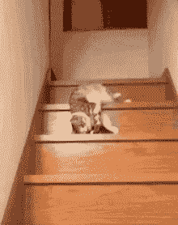
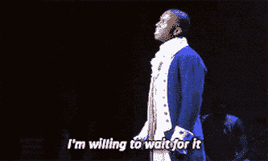
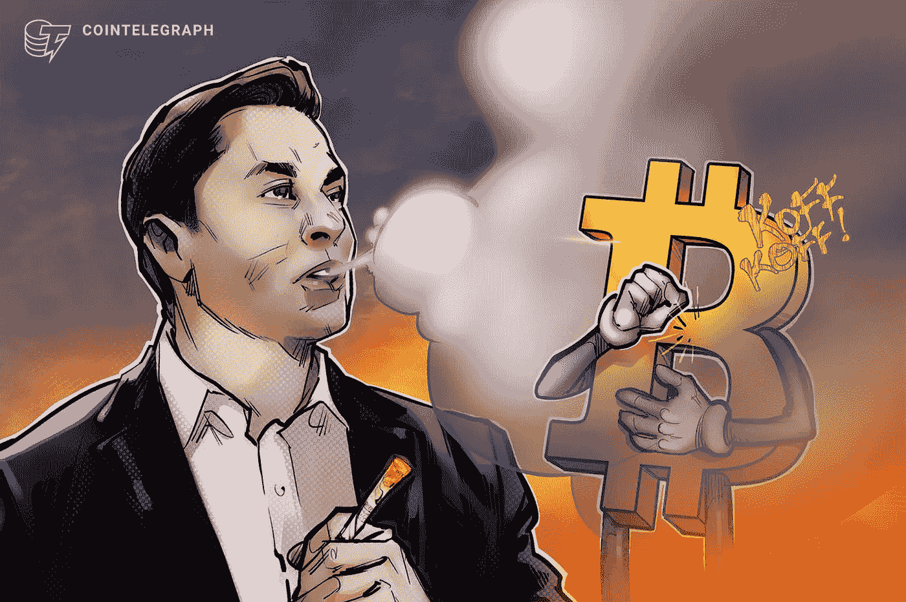
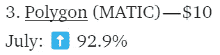
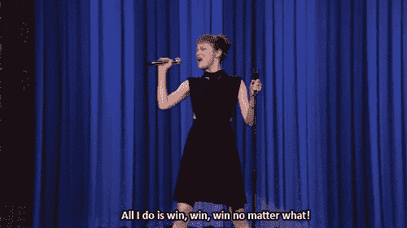
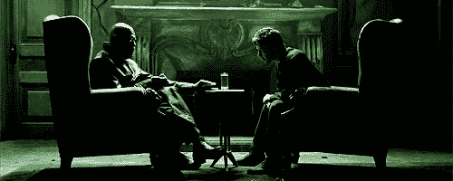
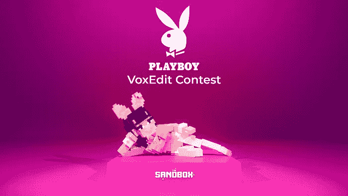
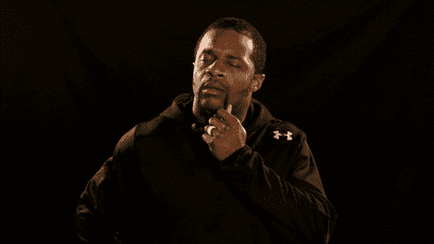
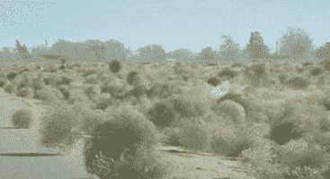

# 2022 年 8 月在比特币基地购买的十大密码

> 原文：<https://medium.com/coinmonks/top-10-cryptos-to-buy-on-coinbase-in-august-2022-8856d7ff4bc9?source=collection_archive---------1----------------------->

外面很安静。。。太安静了。。。

外面有人吗？

pictured: Crypto Twitter

最近有一次独特的经历。我的投资组合大幅上升。。。而我更没有 FOMO。我只是喜欢那种冒泡回到水面的感觉。我感到禅，非常平静。

希望你也有同样的感觉。从大多数人对 7 月份总加密市场上涨 30%的反应来看，我并不觉得我是一个人。或者也许这比人们等着在猫停止跳动后戳它看看它是否死了更没有禅意。

pictured: the market from April to July

或者，也许就像那个头发花白的牛仔躲起来做最后的抵抗，用他的六发猎枪的枪口向安全屋外窥视，并对着一口烟草宣称，“外面很安静。。。*太安静了*

I distinctly remember this scene involving a revolver and chewing tobacco.

我在飘的时候想了很多这个问题，以后再写。但是现在似乎没人在这里，我有一个小小的坦白，我希望我可以不被注意地溜走。

在每一期文章中，我都披露了我在所讨论的投资中持有个人股份，而且在很多情况下，我会继续这样做。但我忘记了一项重要资产:比特币基地本身。

我在 5 月中旬低点附近买了硬币，认为这是一个长期 HODL。但我基本上在两个月内赚了一倍，而且，[考虑到他们已经引起了公众的注意](https://www.investing.com/news/cryptocurrency-news/coinbase-hit-with-2-fresh-lawsuits-amid-sec-probe-2865721)，我继续前进并兑现了。

具有讽刺意味的是，我觉得我没有披露比比特币基地做得更错，尽管我净赚的钱比你粘在汽车杯托上的钱还少。

🪙🪙🪙🪙🪙

我真的想对这个月的选择保持中立。显然，等上几天去观察风向并不能提供任何帮助。

The “shoot first, ask questions later” plan did not work out well for him, historically.

因此，仍然有一个强大的基础，但在名单中有几个更高的选手，以防我们真的爆发成一个全面的 [altseason](https://www.blockchaincenter.net/altcoin-season-index/) 。每枚硬币旁边是我在 100 美元头寸中分配的金额。但是，我不是理财顾问，不知道您的具体投资需求。

一如既往:我可能在某个时候拥有过所有这些硬币，现在拥有其中的大部分，而且当你读到这篇文章时，我可能还会拥有其中的一些。不足以说明问题。

## 1.以太坊 7 月份:⬆️ 56.9%

好吧，以太人，你想要一个#翻转，你有一个。

以太在 7 月份被正面撕裂，部分原因是在经历了 6 月份的所有恶作剧后，它无处可去。

但是，[的合并](/coinmonks/eth-urge-or-scourge-951d139e363a)仍在快速进行，最终的测试网， [Goerli](https://goerli.net/) 将于本月晚些时候上线。真正的合并将在 9 月份发生，但炒作列车显然正在出站。这可能是最后一次登机的机会。

## 2.比特币 7 月份价格为 25 美元，⬆️为 16.6%

在其他任何一个月，宣布[比特币基地正与全球最大的资金管理公司合作，为客户提供比特币敞口](https://www.bloomberg.com/news/articles/2022-08-04/blackrock-teams-up-with-coinbase-in-crypto-market-expansion)可能会成为更大的新闻。但是国王加密公司仍在与它最大的支持者之一的投降作斗争。埃隆·马斯克卖掉了特斯拉几乎所有的比特币存货，损失高达 1.89 亿美元。

与其写 1000 多字，不如欣赏一下来自 CoinTelegraph 的漫画:

Yes, that’s just the form we want Elon to take, a comic book villain.

与 BTC 相比，技术分析也将瑞士联邦理工学院置于主导地位，与数字黄金相比，排名第二的硬币仍比近期高点低 23%。

## 3.七月:⬆️ 92.9%

多边形的主要牛市的情况是它如何。。。等等，那是说*涨* *92.9%* 吗？

#picsoritdidnthappen

嗯，我会被诅咒的。

无论如何，Polygon 的主要牛市案例是它如何作为以太坊网络的快速通道，使交易更快，更便宜，更具可扩展性。

这意味着以太坊的合并将使 Polygon 和它的*第二层*兄弟公司被淘汰。但是即使 ETH 反弹了，MATIC 也来凑热闹了——因为即使合并是宣传的那样，Polygon 的技术仍然可以改善体验。

此外，他们并没有完全呆在自己的车道上:

“无论如何都要赢”是一个投资的好地方。

True story: my 2-year old loves this song.

## 4.7 月份:⬆️ 66.4%

Uniswap 继续保持其作为头号分散加密交易所的长期论点。随着 n0b 继续进入像比特币基地这样的集中交易所，它们中的许多继续跌入兔子洞，最终落在像 Uniswap 这样的自动做市商那里。

“ . . . but if you take the PINK pill . . . “

事实上，据一位研究人员称，Uniswap 已经[接近与比特币基地](https://www.benzinga.com/markets/cryptocurrency/22/07/28110025/uniswap-matches-coinbases-crypto-trading-volumes-ceo-says-story-is-more-complex)平起平坐。

但是 00b 们也可以加入进来。你不仅可以在比特币基地买下 UNI，上个月另一个玩家也加入了进来:

Robinhood was into freezing assets way before Celsius made it cool.

## 5.7 月份:⬆️ 81.1%

现代世界产生了数量惊人的数据，随着一切变得元化和符号化，这种趋势只会继续下去。

你有没有想过我们要去哪里，你知道，把它们都放在哪里？

存储越来越便宜，但就像通过下载拷贝比通过 DVD 访问电影更快更方便一样，将它们存储在区块链上会更容易(也可能更安全)。

Filecoin 作为数据的存储和检索系统存在，令牌 FIL 作为平台上的货币。把它想象成那些存储设备，只是 web3 版本。

I have never voluntarily watched one second of this show, yet I know this man’s name and catchphrase.

## 6.沙盒(沙子)——5 美元
七月:⬆️ 16.5%

当美联储提高利率时，最先感受到的是那些购房者，因为银行现在必须向他们收取更高的抵押贷款利率才能继续盈利。最终，市场触底，随之而来的是，许多用于房屋建设的其他原材料(看看最近有多少木材跌价)，导致了人们所追求的通胀见顶。

现在，我不是说虚拟房地产市场将与真实的房地产市场捆绑在一起，但是。。。实际上，很明显，我说的是*。哼。我不是真的想把这联系起来，我保证。*

然而，它们的共同点是稀缺性和长期利益。没人想要的地方有很多土地，但在最渴望的地方只有这么多。类似地，元宇宙可能是无限的，但人们想去的地方只有这么多像素。其次，长期兴趣并没有动摇太多——事实上，尽管代币价格灾难性下跌，但一些有价值的虚拟包裹在过去一年中以美元计价的价格已经上涨。

没有人知道一个从未触底的资产类别何时会触底，所以赶紧触底吧。

为什么是沙子？好吧，问问你年长的亲戚为什么蓝光打败了 HD-DVD 然后问问你的父母为什么 VHS 打败了 Betamax，然后去沙盒的主页找[这个](https://www.sandbox.game/en/blog/playboy-voxedit-contest/3230/):

I swear, I only go to The Sandbox for the articles, honey.

是的，我知道，它本身没什么(谁知道*《花花公子》*还是个东西？不是我。没有。没有，先生)，但品牌纽带能让新人进入这个领域。

## 7.[函数 x](https://www.coinbase.com/price/function-x)(FX)——4 美元
七月:⬆️ 48.5%

我仍然相信跨链功能，Function X 正在推出一个大功能:他们的 [f(x)EVM 链上个月上线](/functionx/announcing-the-function-x-evm-mainnet-launch-8fc1959c4017)，提供与以太坊虚拟机的兼容性。这使得分散的应用程序开发人员可以在更轻、更快的网络上构建他们的 d app，但仍然保持第一智能合约平台的功能。

f(x)从其生态系统起源基金中拿出 2000 万美元作为支持，以吸引开发者并建立其平台。

两千万美元。*两千万美元。*为什么我要用英语写单词，我确实花了几千美元在大学里学习做得更好，并且已经还给我大约**JACK frac kin ' squad**？我需要学习编码。& %#$。

I don’t think my diploma would be even that useful as kindling.

## 8.⬆️7 月份的收益率为 91.4%

在过去的 25 年中，一些最大的企业赢家是那些让其他企业扩大规模进入互联网的企业。想想思科、甲骨文、亚马逊网络服务。

Quant 希望为 web3 做同样的事情，通过其 Overledger 系统为公司提供区块链理工大学的移动性和成本节约。因为它是“区块链不可知论者”，Overledger 还承诺未来的跨链兼容性——嘿，看，又是那个主题。如果扩大公司规模听起来很难，Quant 已经在努力扩大整个拉丁美洲的规模了。

QNT 在 7 月份已经跑了一个绝对吨，8 月份的早期回报也是令人陶醉的，所以你可能想等这冷静下来一秒钟。如果真的发生了。

## 9.7 月份:⬆️ 64.7%

这是一个非常简单的问题。我喜欢德克斯。我喜欢多边形。QuickSwap 是一个运行在多边形上的索引。

Everybody knows markets work on just this kind of rock-simple logic.

## 10.7 月份:⬇️ 13.8%

如果我告诉你有一个让三月疯狂看起来像儿戏的锦标赛——而且它每周都在发生，会怎么样？

一家名为[numeric](https://numer.ai/)的公司主办了一场每周一次的比赛，超级大脑们在比赛中破解股票市场。奖金——当然，除了市场奖金，还有游戏中的代币“计价单位”。

如果你有 100 万美元，你可以投资 Numerai Supreme，即高风险高回报的算法中的算法超级策略。但如果你没有那么多闲钱，你可以买核磁共振。不过，要非常小心——显然，即使在一个美妙的月份，这个标记也会下降。

Pictured: me and the crew aping in

在 Twitter 上关注我。进入游戏。一如既往，

I’ll try to get September’s in before, like, the 10th.

> 加入 Coinmonks [电报频道](https://t.me/coincodecap)和 [Youtube 频道](https://www.youtube.com/c/coinmonks/videos)了解加密交易和投资

# 另外，阅读

*   [如何在 Uniswap 上交换加密？](https://coincodecap.com/swap-crypto-on-uniswap) | [A-Ads 审查](https://coincodecap.com/a-ads-review)
*   [WazirX vs coin dcx vs bit bns](/coinmonks/wazirx-vs-coindcx-vs-bitbns-149f4f19a2f1)|[block fi vs coin loan vs Nexo](/coinmonks/blockfi-vs-coinloan-vs-nexo-cb624635230d)
*   [本地比特币审核](/coinmonks/localbitcoins-review-6cc001c6ed56) | [加密货币储蓄账户](https://coincodecap.com/cryptocurrency-savings-accounts)
*   [什么是保证金交易](https://coincodecap.com/margin-trading) | [美元成本平均法](https://coincodecap.com/dca)
*   [支持卡审核](https://coincodecap.com/uphold-card-review) | [信任钱包 vs 元掩码](https://coincodecap.com/trust-wallet-vs-metamask)