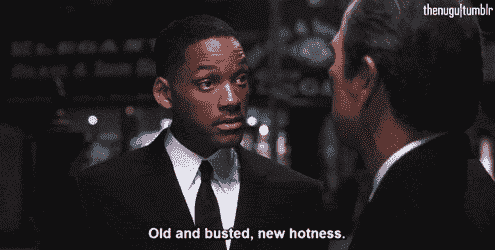
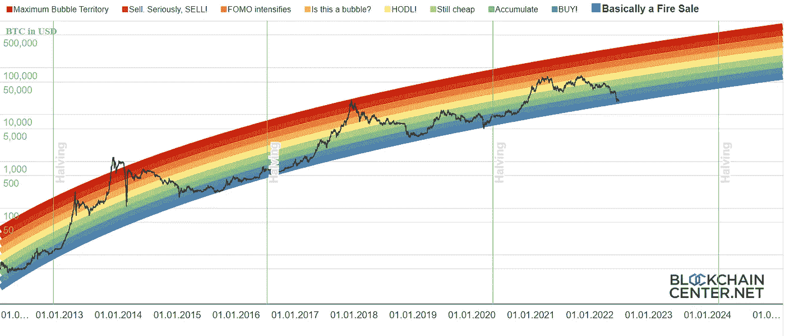
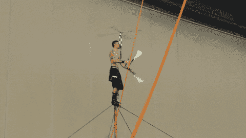
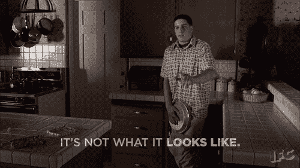
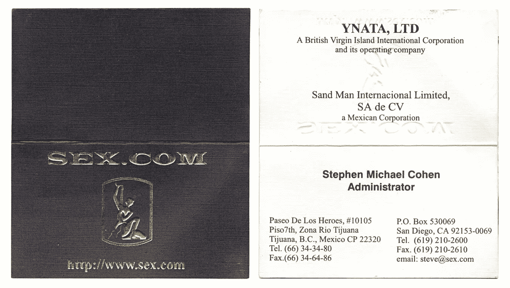
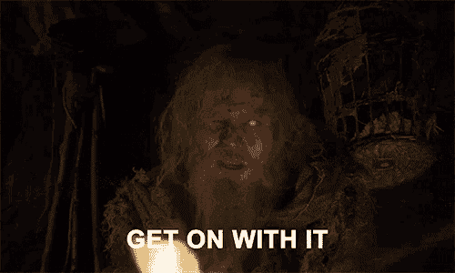

# 2022 年 7 月在比特币基地购买的十大密码

> 原文：<https://medium.com/coinmonks/top-10-cryptos-to-buy-on-coinbase-in-july-2022-be5136a13135?source=collection_archive---------2----------------------->

**买低 T1，s̶e̶l̶l̶ ̶h̶i̶g̶h̶买低**

你知道我基本上整个月都没做什么吗？检查我的比特币基地账户。这个月初我有存款，现在我的存款更少了。事实上，我很确定这将会发生。所以，正如我刻意避免知道自己的胆固醇含量，工作日结束前还有多少分钟，或者在梦幻足球选秀派对上喝了多少酒一样，我一直在逃避钱包的可怕真相。

我正在种下一颗种子，有一天它会成为一棵参天大树，为我的后代结出果实。

我知道它得在土里待一会儿。我不需要把它挖出来看看是否缩水了。

This is nowhere near my seed.

但是我这周登录了为这个做一些准备。。。哟。

最近，CoinMarketCap 列出了它的第 20，000 种不同的密码货币，在你读完这个句子之前，可能还会添加几十种。比特币基地显然是通过[发起对象征舰队](https://blog.coinbase.com/increasing-transparency-for-new-asset-listings-on-coinbase-e06f2edb095e)的支持而进入精神状态的。

> 交易新手？试试[密码交易机器人](/coinmonks/crypto-trading-bot-c2ffce8acb2a)或者[拷贝交易](/coinmonks/top-10-crypto-copy-trading-platforms-for-beginners-d0c37c7d698c)

氦气？范顿。NEAR 方案？VeChain？LOL no .怎么样[包装好的样品](https://www.coinbase.com/price/wrapped-ampleforth)和 [Drep [new]](https://www.coinbase.com/price/drep-new) ？你可能会问，打开的安普尔福思和旧的 Drep 有什么问题？我怎么会知道？

They’re all down like -117%, so who cares.

听着，对比特币基地来说，这很有道理。稀释新的代币池会降低如果一枚硬币上市并售出，有人会抢先产生“比特币基地效应”的机会。此外，发布新上市公司的新闻稿肯定会打破关于[新员工的负面报道，他们被骗辞职，结果发现他们的新职位被兑现了](https://www.efinancialcareers.com/news/2022/06/coinbase-offers-rescinded)。

但是来吧。这些硬币大多不需要存在。我们已经够难支撑好的了。

然而。。。我有点喜欢。哪个？伙计们，这叫戏弄。首先，通常的怀疑，但在此之前，通常的警告:每枚硬币旁边是我在 100 美元的头寸中会分配多少。但是，我不是理财顾问，不知道您的具体投资需求。

另外声明一下:我在某个时候拥有过所有这些硬币(除了戏弄者)，现在拥有其中的大部分，并且当你读到这篇文章的时候可能会拥有其中的一些。不足以说明问题。

1.比特币(BTC)——40 美元
六月:⬇️ 36%

是的，我知道，这家伙仍然认为会有核武器:

I shouldn’t jag on him too hard. It takes balls of titanium to be the only bear in a bull run, and he was.

但对于每一串预测下跌的线，我都能找到一个令人尖叫的买入。看，这个有颜色:

#PRIDE

所以买。尤其是如果你能抓住它。我不在乎接住掉下来的刀，因为即使我在乎，如果我的长期论文是正确的，有一天我会成为一个非常富有的人——而且**我会有很多 f$ & %ing 刀**。

Pictured: my long-term wealth

2.以太坊(eth)——25 美元
六月:⬇️ 41.9%

嘿，还记得我说过激进的投资者应该把 6 月份买入的一半投入乙醚吗？

没有吗？

酷，别点那个。

以太坊的[潜在上涨空间确实没有改变](/coinmonks/eth-urge-or-scourge-951d139e363a)，但卖出压力已经改变。[破碎的独角兽 Celsius 和 Three Arrows Capital 本月大部分时间都在对 ETH 及其各种 degen DeFi 后代进行去杠杆化。其他徘徊在破产边缘的 web3 VC 基金可能不在 boomer coin——他们在风险 altcoins 或在 ETH 农业计划中被劫持，他们认为这将增加他们的收益，但只会加剧他们的问题。](/coinmonks/wtf-ccbbb482078b)

As it turns out, not every search result of “jacked to the tits GIF” is from “The Big Short.”

3.索拉纳 6 月份:⬇️ 17.25%

我最近对索拉纳有点不屑一顾，但在我看来，他们让事情变得相当简单:

Elon Musk is refusing to buy Twitter for much less than this.

我也是对索拉纳计划明年推出智能手机而窃笑的人之一，但在你加入我的狂笑之前，先了解这两个要点:

1.  如果他们能够成功，风险/回报可能值得一赌，并且
2.  我当时也认为 iPhone 是一个非常愚蠢的想法。

Pictured: me in 2009\. LOL, just kidding. I never owned a flip phone.

此外，比特币基地现在向索拉纳提供 3.85%的 APY 价格——无需锁定代币。

4.[波尔卡多](https://www.coinbase.com/price/polkadot)(dot)-$ 7
6 月:⬇️ 28.8%

许多购买密码的投资论文都被熊彻底消耗掉并存放在树林里(COUGHCOUGHsupercycleCOUGH)。但其中一些仍在发挥作用——其中之一是，未来将会有许多不同的区块链(其中一些还没有被发明出来)，这意味着互操作性很重要。

输入 DOT，它的存在是为了实现跨链兼容性。他们还继续拍卖和推出仿链，这使得竞标者能够在波尔卡多的生态系统中创建自己的网络和令牌。

它也被打得半死。徘徊在 6.66 美元左右，DOT 从 55 美元的历史高点下跌了近 90%。去年冬天[身边的许多密码保护者很快警告说，大多数经历过一次的 alt 币通常不会再回到它们的最高峰。这可能是真的，但是如果波尔卡多特只回到 ATH 的一半，那就是 4 倍。](https://twitter.com/tomloverro/status/1541821482975711239)

5.[link](https://www.coinbase.com/price/chainlink)(link)—$ 5
6 月:⬇️ 11%

另一个老式的 alt 我出于某种原因觉得老了，甚至讨论，好像我试图让你投资八轨道球员或一个弗比。

Chainlink 是一个 *oracle 网络*，这意味着它获取链外的数据——比如股票价格——并将它们整合到智能合同中。作为一个*分权的*神谕，它自动赢得了原本持怀疑态度的团体的信任，在像摄氏这样的“塞德菲”实体消亡后，他们重新有理由蔑视集权。

像最近牛市中的大多数恒星一样，LINK 的平流层尖峰阶段可能已经结束。从 2020 年到 2021 年，这一数字在大约一年内翻了 20 倍，但随着科技的成熟和投机者追逐下一个大事件，这一数字可能不会再出现了。但你知道吗？愚蠢的老微软在过去的十年里增长了 10 倍(这甚至是在今年年初和纳斯达克的大部分其他公司一起削减了 25%之后)。

6.[多边形](https://www.coinbase.com/price/polygon)(自动)-$ 4
6 月:⬇️ 24.1%

我以前在这个空间[里吹捧过多边形](/coinmonks/top-10-cryptos-to-buy-on-coinbase-in-april-2022-8ab5e96b1e56)，它也保留了它作为第二层的主要原因，可以在以太网之上购买，以降低燃气费用和提高交易速度。

但他们决定通过推出 Avail 来传播这种爱，这使得任何区块链都可以通过外包自己的交易数据来扩大规模。这和[多边形 ID](https://twitter.com/0xPolygon/status/1508841855210852353) 一起，对整个 web3 都有好处。

哦，看，另一枚硬币，当你说你买了它时，它不会在 Twitter 上给任何人留下印象。谁在乎呢。大部分都是#rekt。

7.6 月份:⬇️ 3.7%

随着集中式交易所继续冻结资产或驱散下一个破产的谣言(包括，嗯，[比特币基地](https://coinspectator.com/dailycoin/2022/06/22/coinbase-under-a-dark-cloud-as-rumors-of-bankruptcy-surface-on-social-media/))，许多投资者将转向分散式交易所，以确保保管自己的硬币。

你应该吗？我不能替你做这个决定，但如果你还没准备好接受这样的挑战，你至少应该分一杯羹。

I said DEX, not . . . never mind.

另外，6 月份只下降了一个零头。任何一枚硬币，只要在那个月有一个刮痕，就可能是超人。

8.以太坊名称服务公司 6 月份:⬇️ 23.2%

这是应该的:我不知道这是一个可投资的象征，直到 [BitMEX 创始人(最近的缓刑者)](https://www.bloomberg.com/news/articles/2022-05-20/bitmex-co-founder-arthur-hayes-sentenced-to-two-years-probation) Arthur Hayes [最近讨论了它](/entrepreneur-s-handbook/floaters-1085be6d6ffd)(其中有一些关于 Uniswap 和其他 DEX 游戏的好东西)。

我完全忘记了它曾在比特币基地出现过。我想当我第一次存入资金并将其等同于比特币现金时，我可能会看到它——就像，当我可以获得正版文章时，我为什么要这个？

但是 ENS 为。你可能在 Twitter 上看到的 eth 地址，如 [vitalik.eth](https://twitter.com/VitalikButerin) ，可以接收以太交易。这不仅使生活变得更容易，而且它将比太空中的几乎任何其他技术在 normies 和 n00bs 上做得更多。每个只知道 web2 的人都会信任“[knownETHaddress]。eth " more " 0x 2 ' rgi wh 32 fuvi 9 bweflmt 34g-。"

那些。eth 地址也是可交易的资产，这对于任何记得标题为“sex.com”域名售价八位数的人来说都是正常的。

This, unsurprisingly, was also hard to Google. Jesus, this month is filthy.

ENS 名称在 OpenSea 和 LooksRare 上交易，这也将有助于让 web2 peeps 进入 web3 游戏。当那发生的时候你想在那里。

但是提醒一句:吉米·法伦在推特上自称为[法伦。你可能还记得，他在《T4》中与帕丽斯·希尔顿就无聊的猿类展开的极其无聊的讨论或多或少暗示了 NFT 的高层。](https://twitter.com/jimmyfallon)

9.[绿洲网络](https://www.coinbase.com/price/oasis-network)(上涨)——2 美元
6 月份:⬇️ 28.6%

web3 的前沿功能非常有趣的第一原则的对话，关于透明度和隐私之间的必要平衡。记住，所有这一切都是由一个匿名的[创造者开始的，他创建了一个开源的区块链。这种传统一直延续到今天，一种叫做“](https://en.wikipedia.org/wiki/Satoshi_Nakamoto)[开放元宇宙](https://6529.io/about/open-metaverse/)的运动得到了发起者的支持，而人们只称其为“ [punk6529](https://twitter.com/punk6529) (还有没错，[我还是咸我没有得到一个第一代 6529 NFT](https://twitter.com/HODL4GoodTWEETS/status/1539789656841228290)。)

因此，随着 web3 重塑世界，开放和所有权的推拉效应将会持续下去。绿洲网络宣称自己是“第一个支持隐私的区块链开放金融平台”它还允许创建者标记他们的数据，然后使用 ROSE 进行标记，创建一个“负责任的数据经济”。

我不知道你怎么想，但我开始对亿万富翁从我的数据中赚更多的钱感到有点不安。

🌹🌹🌹🌹🌹🌹

嗯，好吧，这个月大概就这么多了。。。什么？

哦对了，戏弄。事情是这样的。我一直在研究这些代币，试图找到最好的一个，然后我花了太长时间来写这个，现在你可能会认为我拉了最高的传单。

wait, why is he telling himself to get on with it? and why is he talking in the third person now? so confused

好吧。

10.六月:⬇️ 9.5%

《时代》杂志——不，不是那个——在 7 月 1 日以 63%的涨幅彻底引爆之前，经历了一个普通的动荡月，这让它重新回到了我名单的第 10 位。

但是，我不是来告诉你去追一个泵的。我是即将彻底改变整个行业的硬币/代币的忠实粉丝，比如 [Powerledger](https://www.powerledger.io/) (POWR)和 [Gala Games](https://app.gala.games/) (GALA)。Chrono.tech 正试图利用区块链颠覆人力资源、薪资和劳动力行业。

完全说得通。公司，尤其是较小的公司，可能需要大量的短期工人，但不一定有自己的架构。当然，他们可以给当地的临时工中介打电话，但是对于像编码这样的特殊行业，你需要的不仅仅是人力。此外，最优秀的员工可能在世界的另一边，希望得到的报酬不是你的货币。随着越来越多的劳动者渴望在家工作的自由，以及零工经济在全球变得正常化，Chrono 可能是正确时间的正确技术。

批评者可能会指出 7 月 1 日的大爆炸，并称之为比特币基地效应的一个例子。但是[时间是 6 月 29 日](https://chrono.tech/blog/coinbase-lists-TIME)上市。比特币基地效应一般不会等两整天。不，我认为这是有机的，但如果你想等到这个澳元代币回落，我不会怪你。

⏳⏳⏳

在 Twitter 上关注我。进入游戏。一如既往，

This isn’t stand-up, it’s something else.