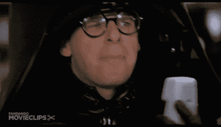

# 2022 年 11 月在比特币基地购买的十大密码(外加奖金！)

> 原文：<https://medium.com/coinmonks/top-10-cryptos-to-buy-on-coinbase-in-november-2022-fa752a5d8a28?source=collection_archive---------1----------------------->

***他们不是万圣***

不给糖就捣蛋！

嗯，10 月份总加密市场增长超过 7%感觉相当不错，但黑暗中潜伏着一些诡计。以以太坊联合创始人维塔利克·布特林的这条推文为例:

The most powerful (doxxed) person in crypto forgetting he can unintentionally speak things into existence.

当然，这个空间就是这个样子，一个 memecoin 立即诞生了，并在月球上运行:

This is THE only time I’ll ever talk about THE so I don’t turn THE article into THE web3 “Who’s On First?”

随着[埃隆·马斯克最终获得 Twitter](https://youtu.be/fybxvYKUp1E) 的所有权，一些 memecoins 欢呼雀跃。其中一个是 DOGE，实际上，我——不温不火地，为了一点零钱— [祝福](/coinmonks/top-10-cryptos-to-buy-on-coinbase-in-may-2022-e99e3b033e2f)。它 [*翻盘*](https://cryptotips.eu/en/knowledge-base/what-is-a-coin-flippening/) Cardano 成为[市值](https://www.benzinga.com/markets/cryptocurrency/22/10/29471681/dogecoin-pulls-ahead-of-cardano-as-8th-largest-cryptocurrency-charles-hoskinson-makes-this)第五大非稳定币加密机[翻了 150%](https://coinmarketcap.com/alexandria/article/musk-s-twitter-shenanigans-send-dogecoin-soaring) 。

但是其他的，更臭的猪也有热闹的一天，因为它们当然是。柴犬指数在过去七天上涨了 25%，因为 DOGE 做什么，它最终都会跟着做。一种名为 Dogelon Mars 的东西在短短 24 小时内飙升了 100%，可能只是因为它的符号名称是 elon。而且——完全是由于[猜测](https://twitter.com/Trump_welcome1/status/1586919972265082880)(后来证明是假的)——一个以唐纳德·特朗普为主题的 sh*tcoin 变得如此抛物线，以至于它在 Twitter 上成为潮流。

Elon also posted a DButt pic (IYKYK), so better sweep the floor on those, too.

所以原谅我，如果我认为外面还有危险。一名秘密影响者实施了一个虚假的骗局，引诱价值 10 万美元的易受骗资金进入他的圈套(他随后退还了这笔钱，并提出了警告)。

我们不会在永久的基础上更高，直到所有这些有毒的愚蠢被冲走。当然，我还是认为宏观环境是[枪伤](/coinmonks/top-10-cryptos-to-buy-on-coinbase-in-october-2022-8b0400d755e1)上的三个创可贴。

Good thing our priorities are in order.

和往常一样:每枚硬币旁边是我在 100 美元头寸中会分配多少。但是，我不是理财顾问，不知道您的具体投资需求。假设我在某个时候拥有所有这些硬币，现在拥有其中的大部分，并且当你读到这篇文章的时候可能会拥有其中的一些。不足以说明问题。#DYOR

1.**比特币** ( [比特币](https://www.coinbase.com/price/bitcoin))——35 美元
10 月:⬆️️ 5.5%

等等，我上个月不是花 35 美元买了 BTC 吗？为什么是的，是的，我做到了。我也不会修理没坏的东西。就像我上个月说的:

*比特币是一种原子钟。它哪儿也去不了。*

连锁分析公司 Glassnode 利用可量化的数据表明，BTC 已经处于或接近底部。从宏观经济的角度来看，很明显美联储已经没有弹药来继续提高利率，随之而来的是美元相对于其他货币的强势。

TradFi 继续买入，谷歌和 BNY 梅隆紧随贝莱德进入加密领域。从长远来看，这显然有利于所有玩家，但比特币是同类产品中的佼佼者。

如果我们错了，我们正走向更广泛的经济和加密的冬天呢？好吧，我们都知道冬天霍德勒夫妇聚集的地方:

Does anybody do technical analysis on this chart? Just curious.

2.以太坊**([eth](https://www.coinbase.com/price/ethereum))——15 美元
10 月:⬆️ 18.4%**

该死的。

I mean, I can’t be that mad. It did go up.

当我把 ETH 放在我上一份名单的第四位时，我预计它会在这个月被踢来踢去，然后我会更看好它。它做到了！。。。直到 10 月的最后一周，仅相对于 BTC 就上涨了 12%。

技术分析显示，ETH 在 11 月的表现仍将优于 king，移动平均线提供了近乎一致的一致意见:

The long arm of the law of averages. (TradingView)

但我只懂一点技术分析，懂很多政治分析。共和党人准备在 11 月 8 日废黜民主党人对美国国会的控制权。拜登政府让法案通过其支持的任何监管的最佳时间将是从那时到 2023 年 1 月 3 日立法部门正式易手之时(因为共和党人一般不太喜欢金融监管)。购买“它喜欢的法规”我是说“它的捐助者喜欢的法规”

I’m Sam Bankman-Fried, owner of FTX and like 30 other things, I resent that the dork who wrote this called Vitalik the most powerful man in crypto, and I may not be spending $1 billion to stop Trump in 2024 like I said I would, but I’ve already poured $40 million into these midterms. ([source](https://www.cnbc.com/2022/10/14/sam-bankman-fried-backtracks-from-1-billion-political-donation.html))

此外，如果证券交易委员会打算将 ETH 或其他代币作为证券，他们最有可能的时间将是 11 月 8 日中期选举后的**，因为它可能会在事后选举讨论的喧嚣中溜走。**

Does anybody do technical analysis on **this** chart? Just curious . . . . . . . . . Also, true story: I was a contributor for RealClearPolitics about . . . good Lord, 20 years ago, before anyone knew who they were. Seriously. That is not a joke. They predicted in 2004 that a little-known state senator from Illinois with a funny name would one day be president.

3.链节 ( [链节](https://www.coinbase.com/price/chainlink))——13 美元
10 月:⬆️ 3.6%

上个月，我在 Chainlink 的第一次会议 SmartCon 上提到了一项重大宣布:与 SWIFT 的[合作，使用](https://chainlinktoday.com/chainlink-and-swift-announce-ccip-proof-of-concept-at-smartcon-2022/)[跨链互操作性协议](https://chainlinktoday.com/how-chainlink-ccip-creates-a-critical-abstraction-layer-for-enterprises/)进行初步概念验证。

但 SmartCon 2022 不断产生潜在的改变游戏规则的消息，包括期待已久的 12 月份发布的 LINK staking。在一个标题中，Decrypt 宣称 Chainlink 正试图成为 Web3 的“[亚马逊网络服务”](https://decrypt.co/110725/chainlink-aims-to-be-aws-of-web3-as-staking-plans-announced)

根据我刚刚在维基百科上查到的信息，AWS 在 2021 年创造了 185 亿美元的收入。

You’re not going to watch this. I’m going to act like I did by posting it, but I didn’t, either. #DYOR

此外，鲸鱼正在购买:

No need for technical analysis on this one; I got it.

4.10 月份:⬆️ 17%

我打了一个电话，我并不羞于说我完全搞定了是 QNT。我在八月结束了我的推荐:

QNT 在 7 月已经跑了一个绝对吨，8 月的早期回报也是令人陶醉的，所以你可能想等这冷静一秒钟。如果真的发生了。

但事实并非如此，仅在 9 月份就有 47%的回报，10 月份达到+59%的峰值，最终从峰值水平回调了 26%。但这仍足以让它进入 CoinMarketCap 前 30 名。

当然，我只是小小的胜利了一圈，因为，如果你仔细听我说，你现在就可以了。。。我想想，拿着那个。。。*疯狂地敲打老式加法机*。。。你 3 美元的投资大约 4.88 美元。

图表专家可以喋喋不休地谈论艾略特波浪或诸如此类的东西，但我相信 QNT 的长期观点，即通过互操作性将企业扩展到 web3。

现在它被拉回来了，让我在你的 4.88 美元上加 10 点。

I wish I looked this cool.

5.**以太坊名称服务**([ens](https://www.coinbase.com/price/ethereum-name-service))——9 美元
10 月:⬆️ 5.7%

6.制造商([mkr](https://www.coinbase.com/price/maker))——8 美元
10 月:⬆️ 21.8%

由于我读了一篇标题为“ [Crypto Twitter 寻找下一个 1000 倍替代硬币在](https://www.fxstreet.com/cryptocurrencies/news/crypto-twitters-hunt-for-the-next-1000x-altcoin-is-on-202210160726)的文章，这些被与 QNT 混为一谈你可能认为我是个混蛋和伪君子，因为毕竟我点击了它——但是请记住，我在这篇文章的开始是在寻找抽油和甩油的方法。是啊。现在看看谁在假设什么。

Actually, it’s ‘makes an ass out of ‘ . . . eh, never mind.

事实上，它们彼此之间没有任何关系，除了这个:它们都意外地在 9 月和 10 月之间的一个月左右破裂(QNT +160.5%，ENS +67.3%，MKR +97.9%)。

Buckle THIS!

然后，[去格子](https://youtu.be/NAWL8ejf2nM)后，都大幅修正至闭月(QNT -27.7%，ENS -16.66%，MKR -22.2%)。

Smoke ’em if ya got ‘em.

如果 QNT 的技术巫术是合法的，那么 ENS 和 MKR 也不会落后太多，因为他们或多或少走在同一条路上。

BTC is in dark blue by comparison. Quick question for chartists: Which of which are the others, and which one of the other coins is a “sell” by TradingView technical analysis while the other two are “buys”? Answer in the alt.

但是，即使在这个横盘的市场中，他们没有创造新的本地高点，我也可以放心地持有他们，直到下一次牛市。我已经说过了。Maker 是 O.G. DeFi，以太坊名称服务卖的是”。eth”地址在 Twitter 上无处不在。

All of this is real.

也就是说，让我们抛开疯狂:他们不会达到 1000 倍。ENS 是三家公司中市值最小的，为 3 亿美元。如果它增长 1000 倍，那么它将超过 3 万亿美元，大约相当于苹果、沃尔玛和万事达卡的当前价值。

但我仍然宁愿拥有这些，而不是尝试玩所有非 ETH 级区块链，以选择一个最终将成为汉堡王到以太坊麦当劳的游戏。

7.阿尔格兰德([阿尔戈](https://www.coinbase.com/price/algorand))——4 美元
十月:⬆️ 1.5%

。。。如我所说。

我可能对世界杯的大肆宣传操之过急了，因为它要到这个月才开始。同样在这个月: [ALGO 在迪拜举行的解密/22 会议](https://decipherevent.com/)。

不知何故，我忘了说，APY·比特币基地提供的 5.75%的利率是这项服务中最高的。

是的，这看起来很乐观:

Again, this is a very linear chart, one that I can innately understand.

8.SushiSwap ( [寿司](https://www.coinbase.com/price/sushiswap))——3 美元
十月:⬆️ 45%

SushiSwap 最初是 Uniswap 中的一个 [*分支*](https://www.coinbase.com/learn/crypto-basics/what-is-a-fork) ，然后最初的创建者执行了一个 [*小地毯*](https://coinmarketcap.com/alexandria/glossary/rug-pull) ，导致协议的控制权被置于。。。你可能已经知道是谁了。

Me again! I assumed control of this protocol before everyone else made me bailing them out trendy.

然而，[最近寿司开始进一步区分自己和它的母币](https://www.coinbureau.com/review/sushiswap-sushi/)。首先，它可以在更多的区块链上使用，你知道我对互操作性的看法(尽管你还不能交叉交换)。

我想说他们正在创造更多的创新，但是。。。你知道的。。。寿司。根据新“厨师长”(说真的，[那是他的头衔](https://twitter.com/jaredgrey))贾里德·格雷的说法:

Not sure there’s a more boring name in this space than “Jared Grey,” but sometimes boring is good.

无论如何，像 SushiSwap 这样的分散式交易所是许多 CEX 用户的最终目的地。如果他们去掉中间环节，对寿司来说会很棒。

9.注射协议([inj](https://www.coinbase.com/price/injective-protocol))——2 美元
10 月:⬆️ 43.1%

Injective 是具有以太坊兼容性的 Cosmos-native 第二层，它有像币安、马克·库班(“鲨鱼池”)和潘迪拉这样的大支持者。不，不是那个。

Though “Cowboys From Hell” would be a great name for a motley association of crypto dorks.

如果你想在他们的网络上锁定代币，INJ 目前拥有 12%的 APY 赌注收益率。但即使在比特币基地，这也是一个可行的策略，因为更多锁定的代币限制了剩余的供应。上个月，当“莫比·迪克”同名的 defi 团队放弃 Terra 生态系统后，决定采用注射法时，他们的白鲸上岸了。

10.10 月份，⬆️股市上涨 4.1%

我们如何让正常人进入这个空间？基本上每个加密协议都会问这个问题，除了当他们问这个问题的时候，它充满了商业术语，比如“入职”和“保留”

一款名为普路托斯的应用想出了一个简单的方法:与 Visa 合作，然后以 PLU 的形式提供所有交易的 3%的回报，这是一种奖励令牌。在该应用中，用户可以用他们的 PLU 兑换超酷的额外津贴，用它们来获得更多的收入，或者直接把它们兑现成菲亚特。。。嗯，大部分是欧元，因为普路托斯掉期市场只在欧盟可用。你知道原因。

Hey! Why are you looking at me again? I have nothing to do with this!

Me this time! I’m Securities and Exchange Commission czar Gary Gensler, and mine are this big.

不，这是因为许多很酷的项目不能在美国进行，因为它们的开发者不想与拜占庭式的监管体系发生冲突，这种监管体系似乎或多或少纯粹是出于一时兴起。没有人想成为下一个 XRP——尽管 Ripple 很可能会赢得对 SEC 的诉讼，但这将是一个得不偿失的胜利，因为他们可能仍然会支付一些象征性的罚款，这样 SEC 就可以像他们不只是拿了 l

因此，额外选择:如果你在非 Coinbase 交易所有一些干粉，考虑购买 xrp(10 月:⬇️ 3%)，如果它可用的话。不要等到它回到比特币基地，因为你想在“[【比特币基地效应】](https://www.coindesk.com/markets/2021/04/07/coinbase-effect-means-average-91-token-price-gain-in-5-days-messari-says/)发生之前就拥有它**。**

从更宏观的角度来看，每天花在对抗这种愚蠢垃圾上的时间和金钱都是他们没有创新的地方——这对我们其他人来说比对他们来说更是一种损失，因为每一个其他的加密项目都必须投入时间和金钱来弄清楚如何保持在一条非常模糊的线上，或者只是说“去他妈的”并把他们最好的功能挡在美国之外..(这就是为什么，如果你不在比特币基地，你可能会在 binance.us 或 ftx.us 上。)这对世界其他地方来说是一个损失，因为他们的项目失去了数百万热切的美国消费者和/或开发商。

You know, I’m sponsoring legislation that aims to fix that.

闭嘴萨姆。我(真不敢相信我会这么说)在[队的比特男孩](https://www.youtube.com/watch?v=enerNGQ2q6k)上。

I haven’t watched Bitboy in a while. Ben is surprisingly jacked. I’d take him in a streetfight vs. SBF.

在 Twitter 上关注我。进入游戏。一如既往，

Enjoy every sandwich.

> 交易新手？尝试[加密交易机器人](/coinmonks/crypto-trading-bot-c2ffce8acb2a)或[复制交易](/coinmonks/top-10-crypto-copy-trading-platforms-for-beginners-d0c37c7d698c)