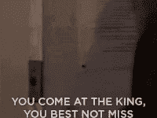
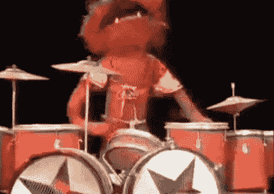
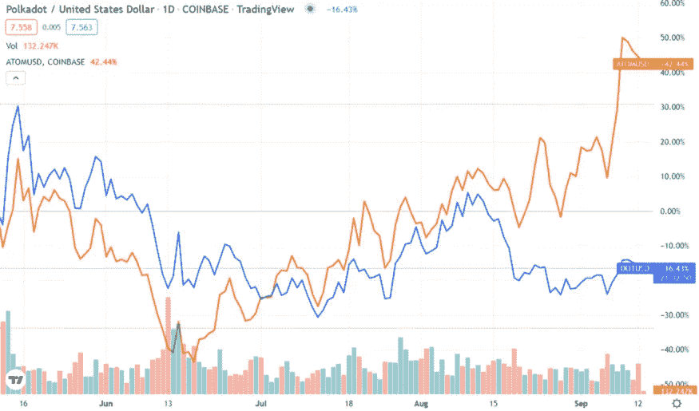
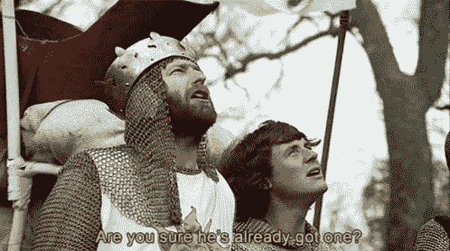
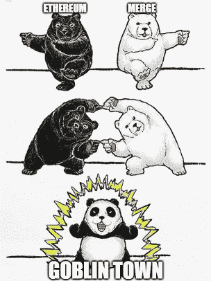
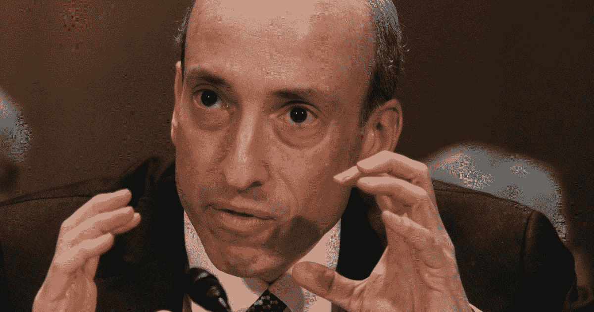
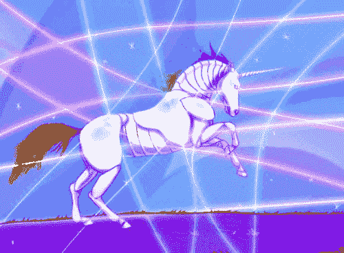
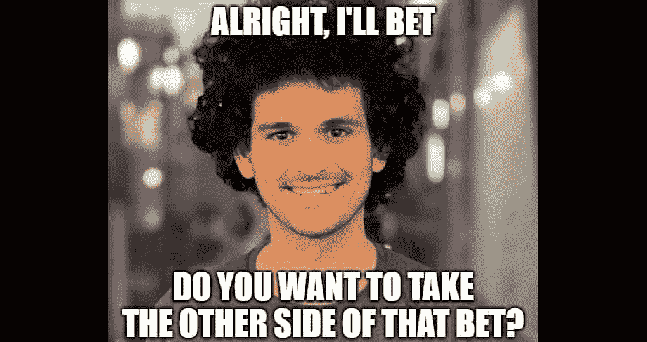
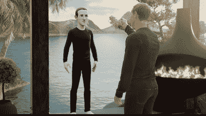

# 2022 年 10 月在比特币基地购买的十大密码

> 原文：<https://medium.com/coinmonks/top-10-cryptos-to-buy-on-coinbase-in-october-2022-8b0400d755e1?source=collection_archive---------1----------------------->

***冬天来了(问欧洲)。***

我们正处于人类历史上的一个奇怪的点上，每个人都知道事情变坏了，除了那些我们相信会阻止事情变坏的人，这有点黑暗的讽刺意味。

Or, in the case of the Federal Reserve, the people the people we trusted trusted.

简而言之，每个人都有自己的原因来解释为什么事情会如此糟糕，但是“轶事”的复数形式并不是“数据”

凯。这里有一些数据:

Actually, I’m wrong in this tweet: as anyone who bought LUNA under $1 can tell you, this doesn’t mean it can’t go lower.

标准普尔 500 在残酷的一段时间里结束了 9 月，两周内下跌了 12%以上。纳斯达克指数下跌了近 10%。

“好吧，”你可能会说，“但这是一个非常以美国为中心的金融数据观点。”好吧。日经 225 指数和富时指数本月也下跌了约 6%,在欧洲，他们最有可能做的事情就是烧掉股票。他们接下来最有可能做的事情是[吃掉它](https://www.reuters.com/business/environment/heat-or-eat-winter-protests-loom-energy-poverty-sweeps-europe-2022-08-25/)。

我们已经拿走了几乎不可想象的未来的钱，并且现在就花掉了。迟早会有清算的一天(正如任何对显而易见的经济现实有所了解的人很久以前就明白的那样)。明智的做法是缓慢而艰难地解除债务。不幸的是，这将是痛苦的，而且最终是对每个西方民主国家的选民的致命控诉。

选项 B 是[恶性通货膨胀和没收](/@cryptohayes/energy-cancelled-e9f9e53a50cd)。

不管怎样，持有菲亚特都是荒谬的。你的美元、欧元、英镑和日元几乎可以用来购买任何其他东西。其中包括 crypto，尽管它在 9 月份仍然下跌，但跌幅仅为 5%。

突破点来了。持续的时间越长，我们积累的时间就越多。

别搞砸了。

⏳🗺️💣🚫🌬️

和往常一样:每枚硬币旁边是我在 100 美元头寸中会分配多少。但是，我不是理财顾问，不知道您的具体投资需求。此外，我可能在某个时候拥有所有这些硬币，现在拥有它们中的大部分，并且当你读这篇文章时，可能会拥有其中的一些。不足以说明问题。

1.比特币 9 月份价格为 35 美元，⬇️ 3.1%

等等，**回旋镖** *？以太坊不是应该在#ETHMerge 之后废弃吗？*

嗯，以太倾斜了，但风车还在。ETH **在比特币合并后损失了** 15%的价值。

Never seen this show, but I know the memes.

在加密中，在加密外，微观层面，宏观层面:比特币是一个原子钟。它哪儿也去不了。从合并前大肆宣传的顶峰到月底，它的主导地位 ，或总加密市场的份额，增长了约 6%。在更广的范围内，与美元相比:自从今年夏天发生的[疯狂](/coinmonks/moonfall-721d5406b57)以来，BTC 继续反弹 18000 美元并盘整。

继续堆吧。

2.9 月份:⬆️ 14.4%

自晚春以来，Chainlink 也一直处于 5 美元至 10 美元之间的正弦波凹槽中:6 月份是红色蜡烛，7 月份是绿色蜡烛，然后在 8 月份下降，9 月份上升。这意味着 10 月份会出现下滑，但就在几天前，甲骨文网络发布了大量消息，老实说，这些消息让#TheMerge 相形见绌。但是有点无聊，不被欣赏。

环球银行金融电信协会(SWIFT)是一个让现代世界运转起来的实体，几乎无人知晓(直到他们[取消俄罗斯银行](https://www.rferl.org/a/eu-swift-russian-banks/31732511.html))。SWIFT 支持主要金融机构的跨境交易。

尽管我们所认为的纸币和硬币“货币”实际上和比特币一样数字化，而且基本上已经数字化了半个多世纪，但促进国际交易仍然既耗时又昂贵。这是有原因的，我可以解释，但幸运的是，这个视频三周前出现在 YouTube 上:

I would say I want to be Wendover’s Sam Denby when I grow up, but when he was born I was in high school.

但如果你没有 20 分钟，这里是结局(剧透预警):

> 如果一家银行搞砸了，给了收款人 1000 美元，而汇款人没有被记入借方，那么这 1000 美元就凭空出现了。所以这不可能发生——就是不可能。如果是这样，钱就断了。我们的信任破裂了。系统崩溃了。如果金钱错误地出现在我们允许它出现的环境之外，那么它就不会像它的实物一样发挥作用。金钱真的只是一种会计手段。

比特币解决了这个问题，它让交易开源，并得到工作证明的验证。但是也需要 [**整整十分钟**](https://www.youtube.com/watch?v=bFEoMO0pc7k) 并且需要矿工费。自那以后，其他旨在改善体验的加密技术如雨后春笋般涌现，最著名的是比特币现金(BCH)、Ripple (XRP)和 Stellar (XLM)。

但是现在，随着所有的法定货币和加密货币在世界各地流通，传统金融机构如何转移和兑换它们呢？我几乎每隔 [单曲](/coinmonks/top-10-cryptos-to-buy-on-coinbase-in-july-2022-be5136a13135) [月](/coinmonks/top-10-cryptos-to-buy-on-coinbase-in-april-2022-8ab5e96b1e56)都在鼓吹互操作性，这是一个长期投资的主题，而 Chainlink 可能刚刚永久破解了代码。

在 SmartCon 2022 大会上，SWIFT 宣布与 LINK 建立[合作伙伴关系，使用](https://chainlinktoday.com/chainlink-and-swift-announce-ccip-proof-of-concept-at-smartcon-2022/) [Chainlink 的跨链互操作性协议](https://chainlinktoday.com/how-chainlink-ccip-creates-a-critical-abstraction-layer-for-enterprises/)进行初步概念验证，以促进成员银行和参与的区块链之间的沟通和移动。

如果他们成功了，这将是一个巨大的成功。这不一定意味着 LINK 的价格会涨 100 倍(至少不会马上涨，也不会直线上涨)，但这意味着 LINK 会被做成。

And people tried to tell me as a kid that cursing and cigarettes weren’t cool.

我的意思是，即使在 crypto 甚至 TradFi 中出现灭绝级别的事件，LINK 也几乎可以保证存活。截至目前，这个俱乐部最多只有两名成员。

3.宇宙(原子)——15 美元
九月:⬆️ 10.2%

好吧，见鬼，让我们再多敲点鼓。

I get the sense Animal prefers aping into sh*tcoins and NFTs.

会有多个链，会有能有效说多种语言的互操作链。但是到目前为止，系统中最大的缺陷之一是安全性:密码史上几起最大最引人注目的黑客攻击都发生在网络之间的“桥梁”上。

Polkadot (DOT)也因互操作性而蓬勃发展，它将安全性扩展到它的副链上，就像轮子的辐条一样。但是 Cosmos 想要整个该死的东西:不围绕其中心的跨链连接，以及[正如最近宣布的](https://twitter.com/cosmoshub/status/1569642959900917760)，一个适用于其生态系统中每个人的通用安全协议。

再加上 [USDC 加入链](https://twitter.com/circlepay/status/1575206651530907649)和大 web3 swinger Delphi Digital 在放弃 Terra 后选择它作为实验室的家，难怪 ATOM 从 6 月的低迷中爆发:

Himalayas vs. Themalayingdownas.

在 9 月 9 日触及上述高点 17 美元多一点后，该股已回落约 25%。我想它会把所有的都拿回来，然后更多。

4.以太坊(eth)——7 美元
九月:⬇️ 14.5%

我的意思是，拜托，你不会认为我会完全放弃吧，是吗？

对以太坊来说，就像在网络中一样，#Merge 是一项辉煌的技术成就。对于 ETH 这个硬币来说，一切如常。在炒作平息之后，2.0 版本并没有成为圣杯。

run away!

所以每个人都有点。。。向左。在 9 月 15 日的实际合并日，ETH 下跌了 10%，在接下来的一周内，从峰值到谷值总共下跌了 26%。

Congratulations, Ethereum: you’ve created a species on the verge of extinction.

最糟糕的情况可能还没有结束，因为前 [ETH 矿工仍然可以抛售他们的收入](https://finance.yahoo.com/news/ethereum-miners-319m-crypto-hoard-221508214.html)，其他人[想知道这整个事情是否真的是这样一个好主意](https://decrypt.co/110426/was-ethereum-merge-mistake)，哦是的，[这个家伙正在四处打探](/@tinmoney/is-ethereum-a-security-probably-d11e48922594):

Even if you think ETH is a security, I think we can all agree that it would not be pleasant to be sniffed by this man.

但话虽如此，投资瑞士联邦理工学院就像打板球一样——飞镖游戏，而不是耗时七天的平板游戏。用我最熟悉的术语来说，ETH 是一个完全的妓女，拥有大量的用户和交易。与此同时，所谓的“以太坊杀手”项目，如 Solana 和 Cardano，竞相结束了股权证明和分片等创新。

在这一点上，在他们在数量上赶上 ETH 之前，ETH 在技术上赶上他们的可能性似乎要大得多。在板球比赛中，比赛结束了。

5.9 月份:⬆️ 22.6%

在接下来的几个月里，有些人将会更多地看到阿尔格兰德。2022 年世界杯正在升温，首次在日历年的下半年举行，以避免卡塔尔夏天的疯狂炎热。

在球场上和电视上，国际足联与 crypto.com 签署了赞助协议，这是 CRO 继续向体育世界投放广告的一部分。但是在网上，国际足联选择了阿尔格兰德作为世界杯的[“区块链官方支持的钱包解决方案”](https://www.fifa.com/about-fifa/president/media-releases/fifa-announces-partnership-with-blockchain-innovator-algorand)对于那些习惯于将足球等同于“达拉斯牛仔队”而非“曼城队”的人来说，就 web3 集成而言，国际足球远远领先于美国体育。(我不会以一种居高临下的方式谈论“足球”。直到最近几个月，我才知道“多特蒙德”实际上来自德国。)

FIFA x ALGO collabo 已经发布了世界杯最伟大时刻的 NFTs:

This is a NFT of a four-year old moment from the most recent World Cup highlighting an incredible physical feat from perhaps the most famous athlete on the planet. It is the first time I have seen it.

“但是等等，”你可能会说，“我是一个年龄在 40 到 50 岁之间的美国人，并不真正关心足球！”我想问，你是否也是早些时候向我提出以美国为中心的金融市场愿景的同一个人，但我只想告诉你，阿尔格兰德的一个新合作伙伴是。。。 [Napster](https://www.napster.com/) 。

是啊。那个 Napster 。(如果你是千禧一代互联网文化的一部分，请点击观看经典老歌。如果没有，你仍然可以点击，但是你会有很多问题。)

Me: “President Donald Trump’s former communications director thinks Napster will do great things in the metaverse.” Me, in 1999: “ . . . wait, what?”

6.9 月份:⬆️ 7.9%

好吧，见鬼，让我们再踢会儿球。

大多数拥有球迷代币的顶级足球队，包括曼城、巴萨和巴黎圣日耳曼(我最近才知道巴黎圣日耳曼不在德国)，都与 Socios.com 合作，后者独家使用奇利兹区块链。

但是，与本赛季关系更密切的是，来自常年强队义大利的国家队也与 CHZ 组队。

世界杯看起来像是一个买宣传/卖驼峰式的事件，但运动队的象征化可能是一个长期的胜利，而这才刚刚开始。绿湾包装工队是美国国家橄榄球联盟的贵族球队之一，他们以公有而闻名。不久的某一天，我们可能会看到通过 [*分散自治组织*](https://www.investopedia.com/tech/what-dao/) 运作的球队甚至整个联赛，而 CHZ 就在第一层。

嘿，购买职业体育特许经营权比试图购买宪法更有意义(也可能更赚钱)。

Though for a white paper, it’s worked out pretty well.

7.九月:⬆️ 20.1%

我们所有的德根斯人和投机者都在等待机构投资，公司巨鲸会进来买下代币。但是另一个关键的转折点是当企业开始采用 web3 技术的时候。金融只是一个开始。

对于进行数百万次物流交易的公司来说，即使是区块链也可能不够快。下一个数学创新可能是 [*定向丙烯图*](https://learn.bybit.com/crypto/what-is-a-directed-acyclic-graph-dag/) ，它在事务级别上创建链，而不是在验证之前将它们聚集成块。在没有变得太高端的情况下(主要是因为我只是勉强理解它)，dag 的工作方式是让每个事务验证之前的两个事务，创建一个相互验证的分类帐树。在这项技术的推动下，COTI 加入了每秒 10 万次交易的俱乐部。

COTI 在八月份升级到了 MultiDAG 2.0，允许代币在其系统上铸造和发行。他们希望成为企业的第一层，尤其是未来的中小型独角兽。

Image credit: Tumblr. Because OF COURSE it’s Tumblr.

8.旅行者令牌 9 月份:⬆️ 15.9%

“等等，”你坚持打断道，“这些家伙不是破产了吗？”嗯，是的，但是首先，真的，不要打断我；那是粗鲁的。其次，FTX 刚刚以 14 亿美元的低价收购了他们剩下的部分。

Of course, I took Do Kwon’s side of his bet, and look how well that turned out for me.

9.博学者网(poly)——2 美元
9 月:⬆️ 26%

随着美国证券交易委员会(u . s . Securities and Exchange Commission)慢慢试图在“证券”和“非证券”之间划出界限，Polymath 正致力于创建一个投资者可以将认证证券令牌化为数字资产的网络。

像房地产这样以前没有被标记和/或流动的资产，可以进入一个全新的市场。但是，即使对于频繁交易的资产，如债券，Polymath 预计其技术将[降低 90%的发行成本和 30–50%的合规成本](https://polymath.network/faq)。

10.9 月份:⬇️ 18.2%

MXC——他们已经将自己重新命名为 [Meta x Connect](https://twitter.com/MXCfoundation/status/1537017923117666304) ，我只能猜测，因为他们希望被马克·扎克伯格起诉的宣传——正在将 web3 技术引入物联网。你可能会认为物联网是由加密 50 强硬币氦运行的相同利基。但是(让我几乎永远沮丧的是)，HNT 不在比特币基地。

而且，他们在街道的两边工作。氦是一个物联网网络，它不是在世界各地建立热点，而是众包其阵列，并以 HNT 代币奖励贡献者。

另一方面，MXC 创造了一个功能性的 web3/IoT 交叉生态系统。他们的世界融合了多少？你可以从热点获得 [MXC 代币，然后在他们的游戏化元宇宙](https://www.mxc.org/mxprotocol)中铸造 NFT 和[挖掘更多 MXC 代币。](https://www.mxc.org/metaverse)

MXC 上个月整体下跌，但这并不能说明全部情况。令牌于 8 月 31 日在比特币基地首次亮相，并立即飙升 63%，因为显然“比特币基地效应”并没有消失。随后，该指数从高点下跌逾 60%，跌至谷底，随后上涨 37%，以当月收盘。我喜欢这枚硬币，但在它变得平滑之前，我还不足以在它上面放一枚苏珊·b·安东尼的硬币。

Mark Zuckerberg imploring his avatar to kick MXC’s ass.

[在推特上关注我](https://twitter.com/HODL4GoodTWEETS)。进入游戏。一如既往，

from the home office in Wahoo, Nebraska

> 交易新手？试试[密码交易机器人](/coinmonks/crypto-trading-bot-c2ffce8acb2a)或[复制交易](/coinmonks/top-10-crypto-copy-trading-platforms-for-beginners-d0c37c7d698c)