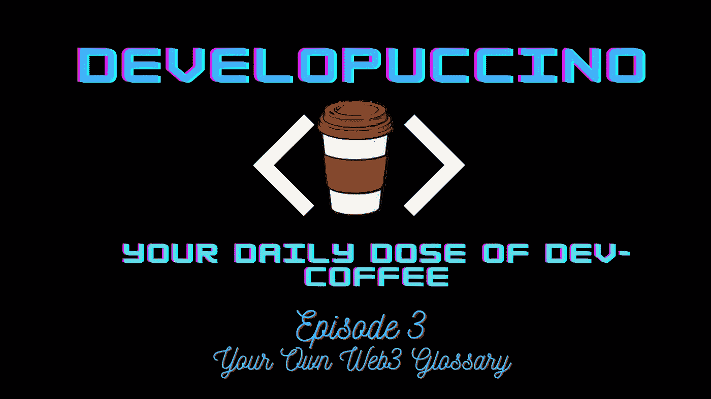

# 你需要知道和理解的 10 个重要的 Web 3.0 术语！

> 原文：<https://medium.com/coinmonks/top-10-important-web-3-0-terms-you-need-to-know-and-understand-7119059d8661?source=collection_archive---------8----------------------->

欢迎再次来到第三期**“develouccino”，**在这篇文章中，我们将阐明在 Web3 世界中广泛使用的术语。了解某个领域的词汇总会给你一种被包容的感觉，同时也灌输对这个领域的理解。以下是我认为在整个“网络 3 会谈”中被多次提及的 10 大术语。

## ABI

扩展为**应用二进制接口，**理论上解释为两个二进制程序模块之间的接口。这些模块中的一个是库或智能合同，另一个是用户的程序。

> 交易新手？试试[密码交易机器人](/coinmonks/crypto-trading-bot-c2ffce8acb2a)或[复制交易](/coinmonks/top-10-crypto-copy-trading-platforms-for-beginners-d0c37c7d698c)

## 区块链

区块链是一个自我更新的分类账，是公开的，不可更改的。其概念是拥有一个在计算机网络节点间共享的分布式数据库。

## Dapps

**去中心化应用**是建立在去中心化网络/区块链上的应用。这是一个基于实用程序的应用程序，用于激励用户，由智能合同和 web 3 JavaScript 库组成。

## 道斯

**去中心化自治组织的缩写，** a DAO 是建立在区块链上的组织架构。Dao 是开源的，由用户管理。DAO 通常专注于一个项目，遵循基于区块链的公司的遗产和规则。

## 挑战

DeFi 是 **Decentralized Finance** 的缩写，它是一个基于区块链的金融系统，独立于银行等任何一种中央集权机构，进行交易、借贷和投资等金融活动。

## 以太坊虚拟机

写在 EVM 以太坊上的每个智能合同的家是一个软件应用程序，区块链开发人员使用它在以太坊区块链上部署 Dapp，并与以太坊的帐户、智能合同和分布式总账进行交互。

## 气体

这是用户在区块链上进行交易或执行智能合同所支付的费用。用户完成一笔交易的花费是由天然气总量乘以天然气价格决定的。

## Mainnet

Mainnet(Main Network 的缩写)是区块链项目的最终产品，可供公众使用。然而，就像一个测试网(下面解释)，一个主网可以为更新和修订而改变。

## NFTs

不可替代令牌，无疑是该领域最流行的术语，NFT 是基于 ERC-721 令牌标准的数字真实性证书，用于分配和验证唯一数字或物理资产的所有权。

## 测试网

testnet(测试网络)是开发人员在 mainnet 上部署协议升级和智能合同之前可以测试它们的地方。一些流行的测试网是 Kovan、Goerli、Ropsten 和 Polygon Mumbai。

我认为这些术语可以帮助你熟悉这个领域的知识和实践。虽然这些是我可以推荐的一些流行词汇:
[block native](https://www.blocknative.com/glossary)[Consensys](https://consensys.net/knowledge-base/a-blockchain-glossary-for-beginners/)和[unstopped domain](https://unstoppabledomains.com/blog/the-web3-glossary)