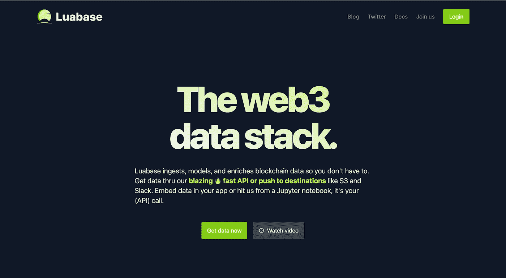

# 十大索引区块链数据 API 提供商

> 原文：<https://medium.com/coinmonks/top-10-indexed-blockchain-data-apis-providers-3a43da97e54c?source=collection_archive---------1----------------------->

在本文中，我们将探讨十大索引区块链数据提供商，它们为访问来自不同区块链的数据提供了一系列解决方案。这些提供商提供一系列产品，包括 API、仪表板、浏览器和小部件，允许开发人员从分散的网络中收集可操作的见解，并构建在 Web3 平台上。无论您是希望构建分散式应用程序(dApp)的开发人员，还是希望访问区块链数据的企业，这些提供商都有您成功所需的 API、工具和服务。

## 1. [**Bitquery**](https://bitquery.io/)

*Bitquery 是一家区块链数据公司，提供一系列用于访问和分析区块链数据的产品。这些产品包括 API、仪表板分析、浏览器和小部件，可用于从 30 多种不同的区块链中收集可操作的见解。*

Bitquery 的一个主要特点是其市场分析，用户可以通过不同的区块链网络跟踪特定的项目和行业趋势。这对各种行业都很有用，包括金融、DEX 交易和分散金融(DeFi)。

> [注册获取区块链 graph QL API](https://graphql.bitquery.io/ide/explore/All%20queries)

*除了市场分析之外，Bitquery 还提供用于分散式交易所(DEX)交易的 DEX 交易数据 API 和分析，以及用于分散式金融协议的数据 API 和分析。这对于希望了解 DEX 和 DeFi 市场最新发展的投资者和交易者非常有用。*

*Bitquery 的垂直数据是另一个重要特性，因为它们允许用户访问特定于他们需求的数据。这些数据垂直行业包括金融、DEX 交易、区块链取证、科学数据处理和分析、DeFi、收藏品 NFT 和数字化证券。这意味着无论你是单飞开发者还是政府机构，都可以通过 Bitquery 找到你需要的数据。*

*总的来说，Bitquery 是访问和分析区块链数据的强大工具，可用于广泛的行业和应用。无论您是对跟踪市场趋势、分析 DEX 交易感兴趣，还是对分散式金融协议有所了解，Bitquery 都可以帮助您了解最新情况并做出明智的决策。对于任何对区块链数据感兴趣的人来说，这都是一个很好的资源。*

*   *市场分析允许用户通过不同的区块链网络跟踪特定项目和行业趋势*
*   *DEX 交易数据 API 和分析可用于分散交易所(DEX)交易*
*   *还为分散式财务协议提供数据 API 和分析*
*   *数据垂直行业包括金融、DEX 交易、区块链取证、科学数据处理和分析、DeFi、收藏品 NFT 和数字化证券*

 [## 面向开发者的 14 个最佳加密 API 和区块链 API

### 感到开发自己的加密应用程序的渴望吗？让我们探索一下市场上最好的加密 API。

medium.com](/coinmonks/best-crypto-apis-for-developers-5efe3a597a9f) 

## 2.[图中**图中**图中](https://thegraph.com/)

*Graph 是一个去中心化的协议，旨在使开发者更容易从以太坊和 IPFS 等去中心化的网络中访问数据。它通过使用一种名为 GraphQL 的技术来实现这一点，该技术允许开发人员使用简单灵活的语法来查询数据。*

*图的一个主要好处是它允许开发人员构建和发布开放的 API，称为子图，任何人都可以访问。这意味着来自分散网络的数据可以更容易地被更广泛的受众访问，从而鼓励分散应用(dApps)的增长，并有助于发展充满活力的分散生态系统。*

*图形网络是一个开放式网络，旨在为加密经济提供最快、最便宜、最可靠的数据访问方式。它建立在共享的中立基础上，这意味着任何人都可以参与网络并为其增长和发展做出贡献。*

*Graph 和以太坊等 web3 协议的结合允许开发人员构建具有强大新功能的 dApps，帮助解决一些世界上最大的挑战。例如，建立在图上的 dApps 可以用于跟踪和验证供应链信息，促进点对点交易，甚至帮助管理和保护自然资源。*

*总之，图表是帮助推动分散式生态系统发展的强大工具。通过让来自分散网络的数据更容易获取，它正在推动创新型 dApps 的开发，这些创新型 dApps 有可能解决广泛的现实世界问题。*

*   使用 GraphQL 技术，该技术允许开发人员使用简单灵活的语法查询数据
*   允许开发人员构建和发布开放的 API，称为子图，任何人都可以访问
*   图形网络是一个开放的网络，旨在为加密经济提供最快、最便宜、最可靠的数据访问方式
*   建立在共享的中立基础上，允许任何人参与并为网络的成长和发展做出贡献
*   支持开发能够解决现实问题的分散式应用程序(dApps ),例如跟踪和验证供应链信息以及促进点对点交易
*   Graph 和 web3 协议(如以太坊)的结合允许创建具有强大新功能的 dApps

## 3.****

********

*****共价是一个革命性的平台，为访问和利用来自多个区块链网络的数据提供了统一的 API。该 API 旨在提供对数十亿 Web3 数据点的可见性，使其成为绝对最丰富和最全面的区块链数据 API。*****

*****共价的一个关键特征是其对数据可验证性的关注。通过利用一个开放的，基于证据的协议，共价确保它提供的所有数据是完全可验证的和透明的。这意味着开发者和用户可以信任他们从共价收到的数据，知道它已经过彻底审查，是可靠的。*****

*****对于希望在区块链网络上构建应用和服务的开发人员来说，共价的统一 API 是一个游戏规则改变者。它使他们能够轻松地访问和集成来自多个来源的数据，而不必担心使用多个 API 的复杂性或数据不一致的风险。*****

****但是共价的好处不仅仅局限于开发者。通过提供一个单一的，统一的 API 来访问区块链数据，共价也使企业，组织和个人更容易利用 Web3 的力量。无论您是希望分析区块链空间趋势的数据科学家，还是试图了解区块链对您所在行业的影响的营销人员，共价的 API 都拥有您做出明智决策所需的深度和广度的数据。****

*****简而言之，共价是一个为 Web3 生态系统开启无限可能的平台。通过提供单一、统一的 API 来访问和利用来自多个区块链网络的数据，它使开发人员和用户能够构建、创新和驱动分散技术的未来。*****

********

*   ****API 提供了对数十亿个 Web3 数据点的可见性，使其成为可用的最全面的区块链数据 API****
*   ****数据可验证性是一个关键焦点，一个开放的、基于证据的协议确保数据是完全可验证和透明的****
*   ****统一 API 简化了开发人员在区块链网络上构建应用和服务时从多个来源访问和集成数据的流程****
*   ****也使企业、组织和个人更容易利用 Web3 的力量****
*   ****可由数据科学家用来分析区块链空间的趋势，或由营销人员用来了解区块链对其行业的影响****
*   ****使开发人员和用户能够构建、创新和推动分散技术的未来****

## ******4。** [**以太扫描**](https://etherscan.io/)****

********

****以太扫描是探索和分析以太坊区块链的流行平台。它作为一个块浏览器，允许用户搜索和查看以太网上的块、交易和地址信息。****

*****ether scan 的主要功能之一是能够跟踪和显示以太坊地址的余额和活动。这对于任何有兴趣了解某个特定地址如何被使用的人，或者对于跟踪以太网上的资金流动的人来说，都是很有用的。*****

*****除了 block explorer 功能，Etherscan 还提供了一系列分析和可视化工具。这些工具可以帮助用户更好地理解以太坊网络的结构和行为，以及构建在其上的各种应用程序。*****

*****ethers can 的一个特别有用的特性是它能够跟踪智能合同的进度和状态。智能合同是自动执行的合同，买卖双方之间的协议条款直接写入代码行。以太扫描允许用户查看和分析这些合同的代码，以及跟踪它们的执行情况以及与以太坊网络上的其他合同或地址的任何交互。*****

*****总的来说，对于任何有兴趣探索和理解以太坊区块链以及基于它的各种应用的人来说，Etherscan 都是一个必不可少的工具。无论您是一名开发人员、投资者，还是一名普通的观察者，Etherscan 都提供了丰富的信息和对以太坊和去中心化智能合约世界的见解。*****

*   *****用作块浏览器，允许用户搜索和查看以太坊网络上的块、交易和地址信息*****
*   *****跟踪并显示以太坊地址的余额和活动情况*****
*   *****提供分析和可视化工具，帮助用户理解以太坊网络的结构和行为，以及构建在其上的应用*****
*   *****允许用户跟踪智能合同的进度和状态，包括查看和分析代码，跟踪执行情况以及与其他合同或地址的交互*****
*   *****对以太坊区块链和分散智能合约感兴趣的人的必备工具*****
*   *****为开发者、投资者和临时观察者等提供丰富的信息和见解*****

## ******5。******

************

*******Moralis 是分散应用(dapp)开发领域的游戏规则改变者。凭借其强大的平台，开发人员可以在各种流行的区块链网络上轻松创建、启动和扩展他们的 dapps，包括以太坊、BNB、Polygon、Avalanche 和 Fantom。*******

*******Moralis 的一个关键特点是它为 web3 开发提供了一个独特的框架。该框架简化了构建 dapps 的过程，减少了时间、成本和复杂性。这对于刚接触这个领域的开发人员尤其有用，因为它为他们提供了构建和部署 dapps 的清晰路线图。*******

*******Moralis 还提供了一系列统一不同区块链网络的下一代工具，使开发者可以轻松地与多个链合作，而不必在不同平台之间切换。这对于 dapp 开发人员来说特别有用，他们希望获得广泛的受众，并且需要在多个链上部署他们的 dapp 来实现这一点。*******

*******除了强大的开发工具，Moralis 还为 dapp 开发者提供一系列支持和资源。这包括一个全面的文档库、一个活跃的社区论坛和来自 Moralis 团队的专门支持。*******

*******总的来说，对于任何希望在流行的区块链网络上创建和部署 dapps 的 web3 开发者来说，Moralis 都是必备的。其强大的开发工具、单一的框架和广泛的支持资源使其成为开始 dapp 开发的最快捷、最简单的方式。*******

************

*   *******该平台为 web3 开发提供了一个单一框架，简化了构建 dapps 的流程，减少了时间、成本和复杂性*******
*   *******Moralis 提供了一系列统一不同区块链网络的下一代工具，使开发者无需切换平台即可轻松使用多个链*******
*   *******该平台为 dapp 开发者提供了一系列支持和资源，包括全面的文档库、活跃的社区论坛以及来自 Moralis 团队的专门支持*******
*   *******Moralis 为开发者提供 API，用于在流行的区块链网络上构建和部署他们的 dapp*******

## ********6。**[**block vision**](https://blockvision.org/)******

********

*****BlockVision 是一个前沿平台，为开发人员提供一系列定制的 Web3 APIs 和数据索引解决方案。这些工具允许开发人员在 Web3 平台上轻松构建和创建，具有闪电般的快速响应时间和高效的性能。*****

*****block vision 的一个关键特性是 AceNode，这是一种面向未来的创新型 Web3 节点 API。AceNode 旨在为开发人员提供低延迟和高可用性，使其更容易在 Web3 平台上构建和创建。AceNode 还支持多个链，包括 Node、Mempool、FT、NFT 和 DeFi，使开发人员能够使用各种区块链技术。*****

*****除了 AceNode，BlockVision 还提供一系列其他定制的 Web3 APIs 和数据索引解决方案。这些工具允许开发人员无缝地获得他们需要的任何链上数据，成本极低，并且易于在一个地方管理所有链。这使得开发人员更容易使用多种区块链技术，并以更高的效率和速度在 Web3 平台上进行构建和创建。*****

*****总的来说，BlockVision 是一个革命性的平台，它为开发者提供了在 Web3 平台上进行构建和创作所需的工具。凭借其创新的 AceNode 和一系列定制的 Web3 APIs 和数据索引解决方案，BlockVision 使开发人员比以往任何时候都更容易使用多种区块链技术，并构建下一代 Web3 应用程序。*****

********

*   *****该平台包括 AceNode，这是一种创新的 Web3 节点 API，具有低延迟和高可用性，支持多个链，包括 Node、Mempool、FT、NFT 和 DeFi*****
*   *****BlockVision 提供了一系列其他定制的 Web3 APIs 和数据索引解决方案，以低成本无缝获取任何链上数据，并在一个位置轻松管理多个链*****
*   *****这些工具允许开发人员使用多种区块链技术，以更高的效率和速度构建下一代 Web3 应用*****

## *****7。s*[**pace and time**](https://spaceandtime.io/)****

********

*****空间和时间是一项革命性的技术，有可能彻底改变我们对智能合同用例的思考方式。通过在分散的数据仓库中连接链上和链下数据，空间和时间允许开发人员在单个高性能平台上运行任何查询工作负载。这减少了开发工作，加快了上市时间，并降低了成本，使其成为希望利用智能合同力量的企业的一个有吸引力的选择。*****

*****Space and Time 的一个关键特性是支持使用混合低延迟事务引擎的 SQL 执行。这使得开发人员可以构建复杂的应用程序和 dappss，这些应用程序和 dapp 可以实时访问和操作数据，非常适合需要快速可靠的数据处理的用例。*****

*****除了其事务处理能力，Space and Time 还包括一个复杂的分析引擎，专为企业级工作负载而设计。这使企业能够对其数据进行高级分析，帮助他们做出更明智的决策并获得竞争优势。*****

*****Space and Time 的主要优势之一是能够使用其获得专利的 Proof SQL 技术提供加密保证的查询结果。这种基于 SNARK 的加密技术确保查询结果和底层数据是可验证的防篡改的，使开发人员和企业对其数据的完整性充满信心。*****

*****总的来说，空间和时间是一项强大的技术，有可能改变我们对智能合同用例的思考方式。它的混合数据架构、对 SQL 执行的支持以及加密保证，使其成为希望利用分散数据和智能合同的企业的不二之选。*****

********

*   *****该技术包括一个混合低延迟事务引擎，允许开发人员构建能够实时访问和操作数据的复杂应用和 dapps】*****
*   *****Space and Time 还包括一个专为企业级工作负载设计的复杂分析引擎，允许企业对其数据执行高级分析*****
*   *****该技术使用 SQL 技术的专利证明，这是一种基于 SNARK 的加密技术，可确保查询结果和底层数据可验证防篡改*****
*   *****Space and Time 提供 API，允许开发人员实时访问和操作数据，并对其数据进行高级分析，以做出更明智的决策并获得竞争优势。*****

## ******8。** [**Luabase**](https://luabase.com/)****

********

****Luabase 是一个 web3 数据堆栈，可以帮助你理解区块链网络产生的大量数据。它从各种来源获取数据，以结构化的方式对其建模，并通过额外的上下文和见解对其进行丰富。这使得我们可以更容易地在自己的应用或分析中使用数据，无论我们是在构建 dApp，还是只是寻找一些快速的见解。****

*****Lua base 的关键特性之一是其 API，它允许我们轻松地从区块链中访问各种格式的数据。无论我们想要原始数据、聚合数据还是实时更新，Luabase 都能满足我们。凭借其高性能设计，无论我们在做什么，我们都可以快速、可靠地访问您的数据。*****

****Luabase 的另一个有用特性是它能够将数据推送至 S3 和 Slack 等目的地。这意味着我们可以自动跟踪我们数据的更新，并与您的团队或客户实时分享。这对于希望构建依赖于区块链数据的应用程序的开发人员来说尤其有用，因为这使他们能够获得最新的信息。****

*****除了 API 和数据推送功能，Luabase 还允许我们轻松地将数据嵌入到自己的应用程序中。这对于希望构建依赖区块链数据的 dApps 或其他应用程序的公司来说尤其有用，因为这为他们提供了一种简单的方法来访问数据并将数据集成到他们自己的产品中。*****

*****总的来说，Luabase 对于任何处理区块链数据的人来说都是一个强大的工具*****

********

*   *****该平台提供了一个 API，允许用户轻松访问来自区块链的各种格式的数据，包括原始数据、汇总数据和实时更新，具有高性能和快速、可靠的访问*****
*   *****Luabase 允许用户将数据推送到 S3 和 Slack 等目的地，实现实时更新并与团队或客户共享*****
*   *****该平台还允许用户轻松地将数据嵌入到自己的应用中，这对于构建依赖区块链数据的 dApps 或其他产品非常有用*****
*   *****Luabase 提供 API，允许用户访问区块链数据并将其集成到自己的产品和应用中。*****

## *****9。* [**高斯基**](https://goldsky.com/)****

********

*****GoldSky 是一个用于 Web3 的实时数据基础设施平台，旨在以灵活高效的方式索引和转换链上数据。它允许用户使用 GraphQL、SQL 和其他流行的数据查询语言来查询数据，从而可以轻松提取您需要的信息。*****

****GoldSky 的一个关键特性是它能够以涡轮增压的方式处理子图索引。这意味着用户可以将子图直接上传到平台，或从图中镜像它们，并看到索引速度比传统方法快三倍。这要归功于 GoldSky 的子图优化预缓存基础设施，它允许用户快速有效地索引数据，而不需要任何代码更改。****

****除了快速的索引速度之外，GoldSky 还提供流和桥，这允许用户实时地保持最新的数据。无论您需要特定格式的数据，还是需要快速的前端响应时间，GoldSky 都能满足您的需求。****

****GoldSky 的另一个优势是它允许用户自信地迭代。这意味着您可以签入您对 API 所做的每个更改，并通过历史交换版本，以确保一切顺利运行。这让您可以放心地构建和部署健壮的 Web3 应用程序。****

*****总的来说，GoldSky 是一个为 Web3 应用提供实时数据基础设施的强大平台。凭借快速的索引速度，灵活的数据查询选项，以及保持最新数据的能力，它是任何在 Web3 生态系统中处理链上数据的人的基本工具。*****

********

*   *****该平台允许用户使用 GraphQL、SQL 和其他流行的数据查询语言查询数据，从而轻松提取他们需要的信息*****
*   *****GoldSky 通过其子图优化的预缓存基础设施提供快速的索引速度，使用户索引数据的速度比传统方法快三倍*****
*   *****该平台提供流和桥，允许用户实时了解最新数据，并提供灵活性以确保前端应用的快速响应时间*****
*   *****GoldSky 允许用户充满信心地进行迭代，使他们能够签入他们对 API 所做的每一项更改，并通过历史记录交换版本，以确保顺利运行*****
*   *****GoldSky 为用户提供 API，以灵活高效的方式访问和查询链上数据，并实时更新最新数据。*****

## *****10。* **丙** [**戊**](https://coherent.sh/)****

********

****Coherent 是一家区块链数据公司，致力于成为 web3 应用的核心基础设施。它们提供易于使用的 API，允许开发人员毫不费力地构建用户体验，提供有用的数据点，如关于钱包和用户的可读信息。****

****Coherent 的主要优势之一是它能够为使用用户数据的 web3 开发者提供一个单一的框架。得益于统一不同区块链链的下一代工具，这可以显著减少开发的时间、成本和复杂性。****

****Coherent 与流行的 web3 工具和服务完全兼容，是构建高性能 web3 应用程序的绝佳选择。它目前支持一些区块链，包括以太坊，多边形，乐观，和 Goerli，并计划在未来增加更多。****

****总的来说，Coherent 对于希望简化工作流程和构建优秀应用程序的 web3 开发人员来说是一个宝贵的资源。它易于使用的 API 和对多区块链的支持使它成为任何希望在 web3 平台上构建的人的强大选择。****

********

*   *****该公司为 web3 开发提供了一个单一框架，通过统一不同区块链链的下一代工具来减少时间、成本和复杂性*****
*   *****Coherent 与流行的 web3 工具和服务完全兼容，目前支持包括以太坊、多边形、乐观主义和 Goerli 在内的多个区块链，并计划在未来增加更多功能*****
*   *****该公司提供 API，允许开发人员使用来自多个区块链的用户数据简化他们的工作流程并构建高性能的 web3 应用*****
*   ****对于希望在 web3 平台上构建优秀应用的 web3 开发人员来说，Coherent 是一个宝贵的资源。****

## *******结论*******

*****总之，有许多公司提供访问和分析区块链数据的产品和服务。这些包括位查询、图形、共价、以太扫描、道德、区块视觉、空间和时间、Luabase、GoldSky 和 Coherent。这些公司提供 API、仪表板、浏览器和其他工具，允许开发人员从分散的网络中收集可操作的见解，以及 GraphQL 和实时数据基础设施平台等技术。这些公司通过提供访问和分析区块链数据的工具和服务，帮助实现分散技术的发展和增长。总体而言，这些公司通过提供访问和分析区块链数据的工具和服务，正在帮助推动分散技术的发展和增长。它们有助于让开发人员更容易在去中心化的网络上构建和创造，并帮助企业利用智能合约和其他去中心化技术的力量。*****

**** [## 顶级令牌持有者 API

### 好奇币安智能链上代币的最高持有者，或者哪个钱包拥有最多代币？这是答案

medium.com](/coinmonks/top-token-holders-api-e881bbb63c93)  [## 面向开发者的 14 个最佳加密 API 和区块链 API

### 感到开发自己的加密应用程序的渴望吗？让我们探索一下市场上最好的加密 API。

medium.com](/coinmonks/best-crypto-apis-for-developers-5efe3a597a9f) ****