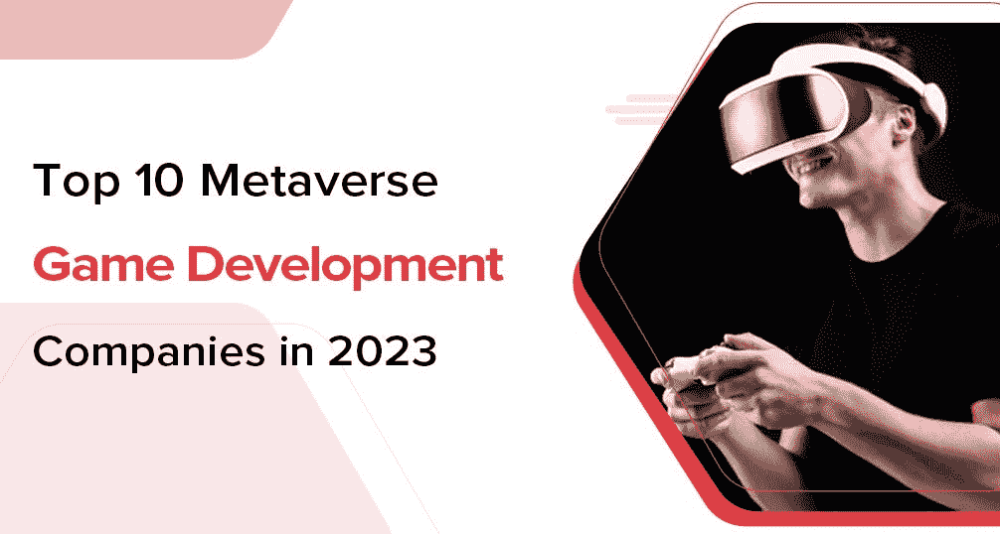

# 2023 年元宇宙十大游戏开发公司

> 原文：<https://medium.com/coinmonks/top-10-metaverse-game-development-companies-in-2023-954c30dba796?source=collection_archive---------6----------------------->

Metaverse Game Development Companies

很少有行业像元宇宙游戏开发那样处于爆炸边缘，行业领先的开发公司有远见看到它的发展方向，并有动力在它到来时到达那里。

元宇宙为使用虚拟现实(VR)、增强现实(AR)眼镜的无限互联虚拟社区提供了一个场所。随着活跃用户数量的增加，难怪企业正在开发基于元宇宙的游戏。

如果你正在寻找哪些公司专门从事元宇宙游戏开发，下面是列表。

# 2023 年元宇宙游戏开发公司名单

这些元宇宙游戏开发公司一直在制作最好的元宇宙游戏，生产更高性能的游戏，在产品质量和客户体验方面比竞争对手更具优势。

让我们看看！

# 1.Quytech

[**曲艺科技**](https://www.quytech.com/) ，成立于 2010 年，是一家全球化的元宇宙游戏开发公司。这家科技公司通过其广泛的产品提供可靠和可扩展的解决方案来提高业务绩效，这些产品包括元宇宙开发服务、NFT 游戏开发、区块链开发、Web3 开发、定制软件开发等。，迎合全球各种规模的企业。

该公司透明的工作政策和快速的客户支持是使其成为全球最佳元宇宙开发公司的其他特征，这是通过在期限内的稳健项目交付而不损害质量标准来判断的。

# 2.中间偏左

Middeft 是一家著名的元宇宙游戏开发公司，专门开发应用程序、区块链技术(包括元宇宙)、云计算等等。它在世界范围内有着惊人的影响力，为当今一些最受欢迎的公司提供咨询服务。

作为全球领先的元宇宙开发软件提供商之一，您可以依靠其创新来最好地满足您的需求。

# 3.比特交易

多年来，Bitdeal 一直为全球许多知名组织提供创新的 IT 解决方案。此外，他们已经将他们的专业知识从一个行业类型扩展到了许多——包括元宇宙开发、区块链集成、Web3(分散)软件开发等等。他们的团队由一群熟练的开发人员组成，他们有资格开发定制的商业应用程序，包括无缝的加密货币集成。

# 4.印孚瑟斯

Infosys 是一家领先的元宇宙软件开发公司，拥有一支才华横溢的移动应用程序开发团队，在全球范围内提供定制解决方案。他们的团队包括 10000 多名专家——包括开发人员、设计人员、测试人员和质量保证人员——他们齐心协力提供有利可图的结果。印孚瑟斯的程序员专注于建立分散的市场(NFT)、游戏、电子商务平台和 DeFi/DAOs。而且他们总是在不牺牲质量的情况下按时完成项目！

# 5.Accubits

Accubits 是一家软件开发公司，为不同行业提供尖端产品。他们通过利用 AR、VR 和 MR 等最新技术来实现这一目标。他们拥有一支由 120 多名敬业员工组成的团队，孜孜不倦地开发专为客户需求量身定制的定制项目。在构建最先进的产品和沉浸式解决方案时，Accubits 的专业人员能够最大限度地发挥技术的潜力，为客户提供令人惊叹的体验。

> **阅读还:** [**区块链在博彩业**](https://www.quytech.com/blog/blockchain-technology-in-game-development/)

# 6.因陀罗资本

因陀罗资本是处理元宇宙发展的主要组织之一。凭借一支由 50 多名才华横溢的专业人员组成的精英团队和成功完成的 100 多个项目，该公司已成为世界领先的软件开发商，专门为各行各业的企业定制应用程序。

Indra Capital 的熟练开发人员可以帮助您创建技术先进的应用程序，同时保持您的时间表——因此，如果您正在寻求为您的企业开发元宇宙应用程序，这可能正是您所需要的！

# 7.L&T 信息技术公司

L&T 信息技术公司提供多种服务，包括 NFT 市场、区块链和移动应用开发。凭借其无与伦比的高质量工作记录和客户满意度，L&T 信息技术公司已成为印度和美国最受欢迎的移动应用程序开发服务提供商之一。这家公司的创新思维确保他们在为全球客户开发软件解决方案时，能够跟上所有现代趋势。

# 8.凯尔顿科技

凯尔顿科技是元宇宙区块链顶尖的人工智能/人工智能开发公司。他们帮助客户建立分散的元宇宙娱乐、社交媒体互动和游戏空间。这家顶级的区块链开发公司拥有 500 多名专家，随时准备使用最新技术构建解决方案，以实现最大盈利。从最新的区块链技术堆栈到独一无二的功能，这些专注的开发人员努力开发一款元宇宙游戏。

# 9.认知技术

元宇宙对 Cigniti 技术的开发已经进行了广泛的研究。该公司可以提供一系列广泛的服务，如网站设计、移动应用程序开发和图形设计，这使它们成为几乎任何项目的理想解决方案。

Cigniti Technologies 团队拥有 500 多名员工，由专门的移动应用程序开发人员、设计师、QA 工程师和测试人员组成，他们齐心协力，以极具竞争力的价格提供高质量的解决方案。

# 10.Hashcash 顾问公司

Hashcash consultants 是领先的元宇宙开发公司之一，专注于交付技术先进的元宇宙软件开发解决方案。这家公司已经经营多年，提供无可挑剔的服务。毫无疑问，寻找顶级元宇宙发展公司的企业可以选择 Hashcash 顾问。

# 总结一下！

元宇宙游戏非常受欢迎，因为公司在盈利，玩家也在玩游戏。如果你也在考虑开发一款元宇宙游戏，你也可以根据你的选择和项目需求选择任何一家公司。

联系任何一家顶尖的 [*元宇宙游戏开发公司*](https://www.quytech.com/metaverse-development-company.php)/公司都会帮你开发出高性能且用户友好的元宇宙游戏。

> **相关博客:** [**元宇宙顶级开发公司**](https://www.datasciencecentral.com/top-10-metaverse-development-companies-in-2023/)

> 交易新手？尝试[加密交易机器人](/coinmonks/crypto-trading-bot-c2ffce8acb2a)或[复制交易](/coinmonks/top-10-crypto-copy-trading-platforms-for-beginners-d0c37c7d698c)
> 
> 多样化的密码持有，了解币安的选择
> 
> 加入 Coinmonks [电报频道](https://t.me/coincodecap)和 [Youtube 频道](https://www.youtube.com/c/coinmonks/videos)获取每日[加密新闻](http://coincodecap.com/)

# 另外，阅读

*   [复制交易](/coinmonks/top-10-crypto-copy-trading-platforms-for-beginners-d0c37c7d698c) | [加密税务软件](/coinmonks/crypto-tax-software-ed4b4810e338)
*   [电网交易](https://coincodecap.com/grid-trading) | [加密硬件钱包](/coinmonks/the-best-cryptocurrency-hardware-wallets-of-2020-e28b1c124069)
*   [密码电报信号](/coinmonks/top-3-telegram-channels-for-crypto-traders-in-2021-8385f4411ff4) | [密码交易机器人](/coinmonks/crypto-trading-bot-c2ffce8acb2a)
*   [最佳加密交易所](/coinmonks/crypto-exchange-dd2f9d6f3769) | [印度最佳加密交易所](/coinmonks/bitcoin-exchange-in-india-7f1fe79715c9)
*   [面向开发人员的最佳加密 API](/coinmonks/best-crypto-apis-for-developers-5efe3a597a9f)
*   最佳[密码借贷平台](/coinmonks/top-5-crypto-lending-platforms-in-2020-that-you-need-to-know-a1b675cec3fa)
*   [免费加密信号](/coinmonks/free-crypto-signals-48b25e61a8da) | [加密交易机器人](/coinmonks/crypto-trading-bot-c2ffce8acb2a)
*   杠杆代币的终极指南